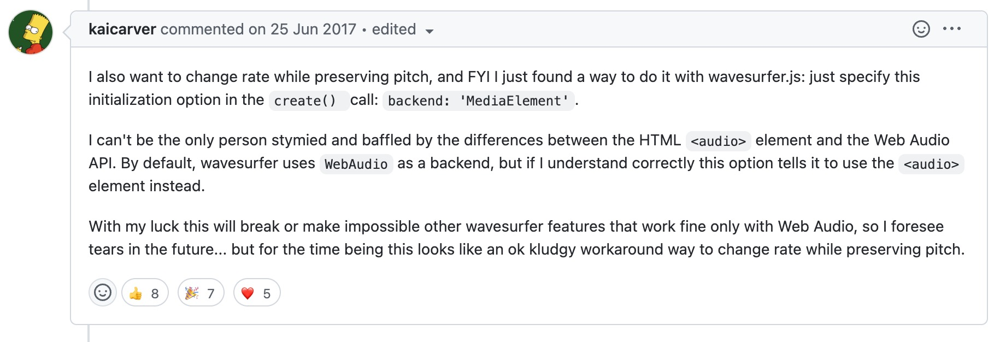
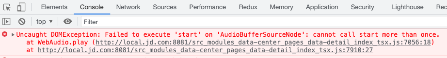
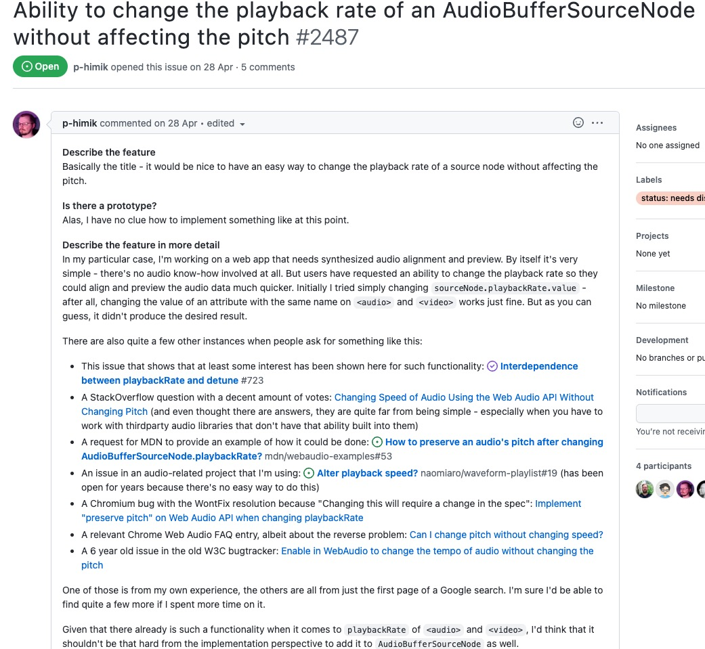
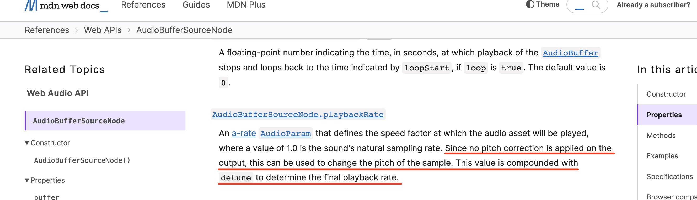
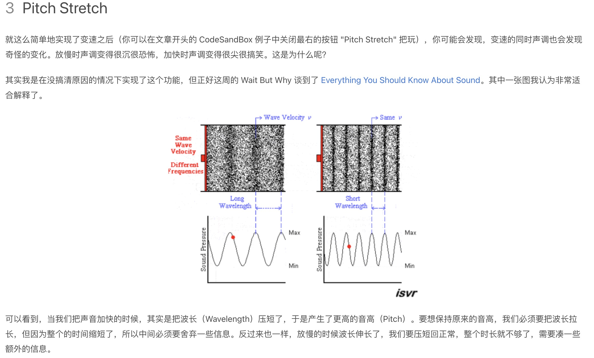
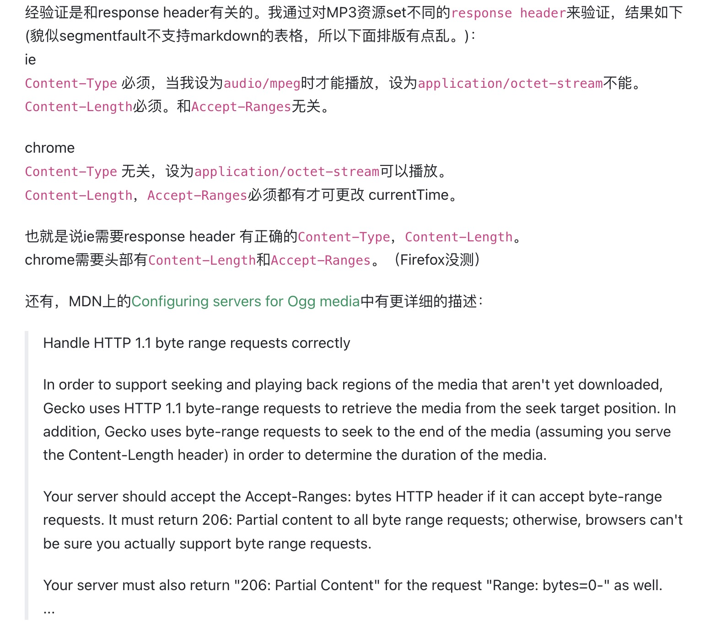

# 音频可视化小记

# 前言

在项目中因为有涉及到对客服对话音频的质检，为了质检所打标记能在音频时间点有一个更直观的展示以及丰富界面UI而做了对会话音频波形的一个可视化处理，项目之前是直接使用的 [wavesurfer-js](https://wavesurfer-js.org/)，开始也是OK的，但在项目迭代过程中发现涉及到这一块儿音频的出现了问题不好跟踪处理，考虑到后期功能迭代以及稳定性干脆直接重写了一个音频波形的可视化组件（当然还是有参考 [wavesurfer-js](https://wavesurfer-js.org/ )，这个库还是是很优秀的），Github 完整代码地址：[react-audio-wave](https://github.com/llaurora/react-audio-wave)。

# wavesurfer.js部分踩坑

1. 音频倍速播放，音调异常；
   
    [wavesurfer-js](https://wavesurfer-js.org/) 有提供  `setPlaybackRate(rate)`方法来改变音频播放速度，但是发现音频倍速变化后，音调也异常，夸张的时候原本没加速时是一个男声，但加速后感觉变成了一个女声，这个通过查找 [Issues](https://github.com/katspaugh/wavesurfer.js/issues/149) 解决了，将音频初始化的配置`backend`参数改成 `MediaElement`，但这也为后期遇到另一个问题其实埋了个雷。
    
    
    
2. 音频初始化的时候同一段音频 xhr 请求了两次；
   
    在找了一圈 Issue 后没找到解决办法，只能去看下源码是怎么写的，最后通过打断点发现了问题，音频初始化的时候调了一次 fetch 请求，调了一次 `audio`标签的 load 方法，通过配置参数减少了一次请求。
    
3. 想跳转到中间某个时间点播放的时候，音频老是重头开始播放；
   
    这个问题确实没找到解决方法，而且以前没出现过这个问题，有的音频正常有的才有这个问题，不好排查（当然后期在重写的时候也遇到了才发现需要后端去解决这个问题），这也是让我打算重新写一个的主要原因。
    

# 音频可视化

关于音频可视化入门可以参考网易云音乐团队的 [Web Audio在音频可视化中的应用](https://juejin.cn/post/6844903953130323976)，只是注意里面对音频波形的展示用的是 [Web Audio ApI](https://developer.mozilla.org/en-US/docs/Web/API/Web_Audio_API) 的 [AnalyserNode](https://developer.mozilla.org/en-US/docs/Web/API/AnalyserNode)，但是 [AnalyserNode](https://developer.mozilla.org/en-US/docs/Web/API/AnalyserNode) 的问题是它只能用来做实时波形展示与我的需求不符合，我想要的是 [wavesurfer-js](https://wavesurfer-js.org/) 那样的。

这儿梳理下大概步骤：

1. 通过 fetch 拿到音频的 `ArrayBuffer`数据，然后通过 [Web Audio ApI](https://developer.mozilla.org/en-US/docs/Web/API/Web_Audio_API) 提供的 `decodeAudioData` 方法解码拿到 `AudioBuffer`数据；
2. 对 `AudioBuffer` 提取音频数据采样，获取峰值，便于展示及分析；
3. 使用 canvas 或者 svg 渲染采样数据，绘制波形；

 至于详细的怎么一步一步写的就不做详细介绍了，完整的代码放在 github 上了，可移步参考 [react-audio-wave](https://github.com/llaurora/react-audio-wave) ，在这儿记录一些在重写过程中遇到的一些问题。

## AudioContext 播放

在使用 `AudioContext`  控制播放暂停时，在暂停后再次播放，会播放不了，会报`cannot call start more than once`的错误。



```jsx
this.source = this.audioContext.createBufferSource();
this.source.buffer = this.buffer;
...
this.source.start();
```

之所以会出现这个问题，是因为一旦播放了 source node 就不能再使用了，要想再次播放得重新创建 [AudioBufferSourceNode](https://developer.mozilla.org/en-US/docs/Web/API/AudioBufferSourceNode)，问题可参考 [Play an AudioBufferSourceNode twice](https://stackoverflow.com/questions/9439585/play-an-audiobuffersourcenode-twice)。所以解决办法就是每次播放的时候得重新创建 [AudioBufferSourceNode](https://developer.mozilla.org/en-US/docs/Web/API/AudioBufferSourceNode)，然后使用新创建的 [AudioBufferSourceNode](https://developer.mozilla.org/en-US/docs/Web/API/AudioBufferSourceNode) 来播放。

## **AudioBufferSourceNode.start()参数**

AudioBufferSourceNode.start(when, offset, duration) 播放的参数可直接移步 [MDN](https://developer.mozilla.org/en-US/docs/Web/API/AudioBufferSourceNode/start)，主要是第1个参数`when`，我起初以为这个参数是说从音频的什么时间点开始播放，但其实是点击播放后指定多少秒后开始播放，第2个参数才是说从音频的哪个时间点开始播放，更多参考可前往 [Web Audio初步介绍和实践](https://www.cnblogs.com/ericHTML5/p/4039530.html)。

## AudioContext.currentTime含义

这个 currentTime 我起初以为和 `audio` 标签返回的 currentTime 是一样的，即返回当前音频播放到什么时间点了，通过这个 currentTime 可以知道音频播放进度，但实际上不一样，audioContext.currentTime 是一个绝对的时间，首次播放时（音频加载下来还未播放过）可当做x坐标原点即为0，不管你后面做了多少操作比如暂停多少次、暂停多久，这个时间都是一直在走着的（”并不以他人意志为转移”），所以使用 audioContext 来控制播放的话，要算出 AudioBufferSourceNode.start(when, offset, duration) 的第2个参数的值到底是多少，就不能用 audioContext.current 来获取，得在播放开始时记录一个时间点，然后播放暂停时记录一个时间点，以此来记录这次播放了多长，再累加上前面的时间段才能知道这次播放到音频的哪个时间点了。

```jsx
public pause(): void {
      this.playing = false;
      ......
      //  this.audioContext.currentTime - this.startTime 可以计算出此次播放了多长时间，再+=开始播放前停止的位置的话就可以知道停止时播放到整段音频的什么位置了，即下次播放时知道从哪儿开始播了
      this.pausedAtOffsetTime += this.audioContext.currentTime - this.startTime;
      this.source?.stop();
      this.source.disconnect();
  }

public play(): void {
	    this.playing = true;
	    ......
	    this.startTime = this.audioContext.currentTime;
	    // 什么时候开始播（点击之后立即开始播）、从哪儿开始播、播多少时间
	    this.source?.start(this.startTime, this.pausedAtOffsetTime, this.duration); 
}
```

## AudioContext播放结束

AudioBufferSourceNode 有提供一个 `ended` 的事件监听，这个也是区别于`audio` 标签的 `ended` 事件监听， `audio` 标签的 `ended` 事件监听是真的在音频播放结束（完成）才会触发。但是 AudioBufferSourceNode 的`ended` 的事件监听在播放暂停的时候也会触发，所以在使用 audioContext 控制播放的话要监听音频是否播放结束得结合当前音频的播放状态来。

```jsx
if (ended && webAudioRef.current.playing) {
		// 使用audioContext控制播放的话，得结合播放状态判断是否播放结束
}
```

## AudioContext跳转播放

audioContext再调整播放时遇到的问题主要是当前音频在播放状态，然后现在跳转到某个时间点播放，得先暂停再播放，而暂停后还不能立即播放，而得结合前面说的 `ended` 的事件监听确认暂停Ok了，才能开始播放。

```jsx
// 使用audiobuffer播放控制的话，并且正在播放得先暂停
  pauseAudio();
  webAudioRef.current.updateCurrentOffsetPositon(offsetTime);
  audioSourcePromiseRef.current.then(() => {
      playAudio();
  });
```

## AudioContext倍速播放

这个是最坑的一个地方了，AudioBufferSourceNode 确实有提供一个改变播放速度的方法 [AudioBufferSourceNode.playbackRate](https://developer.mozilla.org/en-US/docs/Web/API/AudioBufferSourceNode/playbackRate)，但这个倍速和我们平常理解的倍速有点儿不一样，确实音频倍速播放了，但同时音调也会跟着变，关于这个问题可以看下  ****[Web Audio API Issues](https://github.com/WebAudio/web-audio-api/issues/2487) 对该问题的讨论，而这其实也是之前在使用 [wavesurfer-js](https://wavesurfer-js.org/) 时遇到的那个倍速播放问题产生的原因，因为 [wavesurfer-js](https://wavesurfer-js.org/) 默认就是使用 AudioContext 来控制播放。



对于此，不是说这个 [AudioBufferSourceNode.playbackRate](https://developer.mozilla.org/en-US/docs/Web/API/AudioBufferSourceNode/playbackRate) 方法有 BUG，是因为其本身定义的含义就和我们平常理解的倍速含义不一样，直接看下[官方文档的解释](https://developer.mozilla.org/en-US/docs/Web/API/AudioBufferSourceNode)吧。



通俗点儿理解的话，可以认为当我们把声音加快的时候，其实是把波长（Wavelength）压短了，于是产生了更高的音高（Pitch），可移步 [JavaScript 音频变速保持音调](https://blog.crimx.com/2019/06/06/javascript-%E9%9F%B3%E9%A2%91%E5%8F%98%E9%80%9F%E4%BF%9D%E6%8C%81%E9%9F%B3%E8%B0%83/)。



虽然现在也有建议说给 AudioBufferSourceNode 倍速调整的时候，添加一个[preserve pitch](https://bugs.chromium.org/p/chromium/issues/detail?id=627111) 的参数来控制倍速播放时音调不发生变化，但目前为止还未被采纳，要想使用 audioContext 来倍速播放的话目前为止确实没得办法，要想倍速播放的话只能去调用 `audio` 封装好了的 playbackRate。而这也正是在使用 [wavesurfer-js](https://wavesurfer-js.org/) 时 `backend`默认为 `WebAudio` 倍速而产生音调异常的解决办法，就是将 `backend`从默认的 `WebAudio` 调整为 `MediaElement` 得以解决原因，就是因为这时的倍速以及播放控制啥的都是通过控制 `audio` 标签来实现的。

## audio标签

那既然要想音频可以倍速的话，得使用 `audio` 标签来控制播放暂停操作啥的，那能不能直接使用 `audio` 标签来实现音频的可视化，但实现音频可视化的前提是得拿到音频的 `audioBuffer` 数据，起初我以为能通过 `audio`标签来拿到 `audioBuffer`，但是抱歉不好意思，通过 `audio` 标签还真拿不到，还必须得通过 fetch 请求拿到音频的 `ArrayBuffer`数据然后通过解码得到 `AudioBuffer`数据，这应该是使用`audio`标签最大的一个遗憾了，`audio` 标签的播放、暂停以及播放结束事件监听都很棒，但唯独这个很尴尬（还有个跳转播放的问题，下面会说）。

所以最后要实现音频可视化，又得要倍速，只能通过 fetch 然后转码得到 `AudioBuffer`数据然后做可视化，通过原生`audio`标签来控制播放等操作，[wavesurfer-js](https://wavesurfer-js.org/) 源码也是这么做的。

然后 `audio` 可以通过`preload` 指定预加载策略，只要浏览器支持资源预加载（在 [窥探浏览器基本原理](https://www.notion.so/9c124bcc3b2840e5931cbc0cc4b8621b) 里面也有写过，preload scanner 是浏览器优化资源加载的一种手段，但并不是所有浏览器都有 preload scanner，更多信息可前往 [资源预加载](https://mp.weixin.qq.com/s/8_4XGgrXqwuUKNwgp8KhTA) 查看），这个一般建议开启（开启之后的效果就是在页面进入的时候，即会加载资源，而如果不开启得点击播放时才会触发资源加载）。

## audio标签跳转播放

这个问题就是上面使用 [wavesurfer-js](https://wavesurfer-js.org/) 时列举的第3个问题，在想跳转到某个指定的时间点时老是从头开始播放的问题，而且这个问题在项目开发过程中只在谷歌浏览器有遇到这个问题，而其根本原因就是因为在使用`audio`标签控制播放时（[wavesurfer-js](https://wavesurfer-js.org/) 在 backend 设置为 MediaElement 后，源码中也是使用 audio 标签控制播放），设置不上`currentTime`。而之所以设置不上`currentTime` 和服务器响应的 `response header` 有关，不同的浏览器对音频的 `response header` 的容错不一样，而谷歌浏览器就至少得需要`Content-Length` 和`Accept-Ranges`字段才可以更改音频的 `currentTime`，可参考前往 [HTML5 audio ,在chrome中设置currentTime无效](https://segmentfault.com/q/1010000002908474)。



# 结语

一番折腾下来，收获还是不少，虽然最终采用了一个折中的方案，即使用 fetch 拿 `AudioBuffer`做可视化，使用 `audio`标签做倍速播放，但这毕竟是两种途径拿同一个资源，在拿到后又对两个资源做同步（一个播放，一个又精准的显示音频进度）可能会出现参差，但目前为止也没想到其它更好的方案了，只能尽可能的降低出现参差的概率。

放在 github上的音频可视化的组件 [react-audio-wave](https://github.com/llaurora/react-audio-wave) 代码是做了降级方案，当要倍速的话，使用的是上面的折中方案，但如果不要倍速的话，就全部使用`audioContext`来实现。