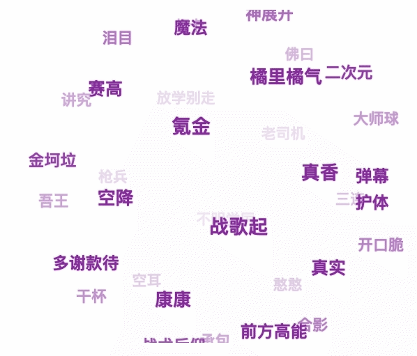

# 3D 词云



```typescript
interface TagInfo {
    offsetWidth: number;
    offsetHeight: number;
    cx?: number;
    cy?: number;
    cz?: number;
    x?: number;
    y?: number;
    scale?: number;
    alpha?: number;
}
interface WordCloudConfig {
    baseFontSize?: number;
}

export class WordCould {
    private radius: number;
    private dtr: number;
    private d: number;
    private container: HTMLElement;
    private containerChildTags: HTMLElement[];
    private tagsInfo: TagInfo[];
    private active: boolean;
    private tspeed: number;
    private howElliptical: number;
    private baseFontSize: number;
    private sina: number;
    private cosa: number;
    private cosb: number;
    private sinb: number;
    private sinc: number;
    private cosc: number;
    constructor(container: HTMLElement, config?: WordCloudConfig) {
        const { baseFontSize } = config || {};
        this.container = container;
        this.containerChildTags = null;
        this.tagsInfo = [];
        this.radius = 250;
        this.dtr = Math.PI / 180;
        this.d = 500;
        this.active = true;
        this.tspeed = 0.5;
        this.howElliptical = 1;
        this.baseFontSize = baseFontSize || 6;
        this.sina = 0;
        this.cosa = 0;
        this.sinb = 0;
        this.cosb = 0;
        this.sinc = 0;
        this.cosc = 0;
    }

    public onStart() {
        this.containerChildTags = Array.from(this.container.getElementsByTagName("i"));
        this.tagsInfo = this.containerChildTags.reduce((prev: TagInfo[], cur: HTMLElement) => {
            prev.push({
                offsetWidth: cur.offsetWidth,
                offsetHeight: cur.offsetHeight,
            });
            return prev;
        }, []);
        this.calcSineCosine(0, 0, 0);
        this.positionAll();
        setInterval(() => {
            this.refresh();
        }, 30);
        this.container.addEventListener(
            "mouseover",
            () => {
                this.active = false;
            },
            false,
        );
        this.container.addEventListener(
            "mouseout",
            () => {
                this.active = true;
            },
            false,
        );
    }

    private refresh() {
        this.calcSineCosine(this.active ? -this.tspeed : 0, this.active ? this.tspeed : 0, 0);
        for (const item of this.tagsInfo) {
            const rx1 = item.cx;
            const ry1 = item.cy * this.cosa + item.cz * -this.sina;
            const rz1 = item.cy * this.sina + item.cz * this.cosa;
            const rx2 = rx1 * this.cosb + rz1 * this.sinb;
            const ry2 = ry1;
            const rz2 = rx1 * -this.sinb + rz1 * this.cosb;
            const rx3 = rx2 * this.cosc + ry2 * -this.sinc;
            const ry3 = rx2 * this.sinc + ry2 * this.cosc;
            const rz3 = rz2;
            item.cx = rx3;
            item.cy = ry3;
            item.cz = rz3;
            const per = this.d / (this.d + rz3);
            item.x = this.howElliptical * rx3 * per - this.howElliptical * 2;
            item.y = ry3 * per;
            item.scale = per;
            item.alpha = (per - 0.6) * (10 / 6);
        }
        this.assginPosition();
        this.depthSort();
    }

    private depthSort() {
        const cloneContainerChildTags = [];
        for (const item of this.containerChildTags) {
            cloneContainerChildTags.push(item);
        }
        cloneContainerChildTags.sort((item1, item2) => {
            if (item1.cz > item2.cz) {
                return -1;
            }
            if (item1.cz < item2.cz) {
                return 1;
            }
            return 0;
        });
        const len = cloneContainerChildTags.length;
        for (let i = 0; i < len; i += 1) {
            cloneContainerChildTags[i].style.zIndex = i;
        }
    }

    private assginPosition() {
        const halfWidth = this.container.offsetWidth / 2;
        const halfHeight = this.container.offsetHeight / 2;
        const len = this.tagsInfo.length;
        for (let i = 0; i < len; i += 1) {
            this.containerChildTags[i].style.cssText = `left:${
                this.tagsInfo[i].cx + halfWidth - this.tagsInfo[i].offsetWidth / 2
            }px;top:${this.tagsInfo[i].cy + halfHeight - this.tagsInfo[i].offsetHeight / 2}px;font-size: ${
                Math.ceil((12 * this.tagsInfo[i].scale) / 2) + this.baseFontSize
            }px;filter: alpha(opacity=${100 * this.tagsInfo[i].alpha});opacity: ${this.tagsInfo[i].alpha}`;
        }
    }

    private positionAll() {
        const max = this.tagsInfo.length;
        const fragment = document.createDocumentFragment();
        const cloneContainerChildTags = [];
        for (const item of this.containerChildTags) {
            cloneContainerChildTags.push(item);
        }
        cloneContainerChildTags.sort(() => (Math.random() < 0.5 ? 1 : -1));
        for (const item of cloneContainerChildTags) {
            fragment.append(item);
        }
        this.container.appendChild(fragment);
        for (let i = 1; i < max + 1; i += 1) {
            const phi = Math.acos(-1 + (2 * i - 1) / max);
            const theta = Math.sqrt(max * Math.PI) * phi;
            this.tagsInfo[i - 1].cx = this.radius * Math.cos(theta) * Math.sin(phi);
            this.tagsInfo[i - 1].cy = this.radius * Math.sin(theta) * Math.sin(phi);
            this.tagsInfo[i - 1].cz = this.radius * Math.cos(phi);
            this.containerChildTags[i - 1].style.cssText = `left: ${
                this.tagsInfo[i - 1].cx + this.container.offsetWidth / 2 - this.tagsInfo[i - 1].offsetWidth / 2
            }px;top: ${
                this.tagsInfo[i - 1].cy + this.container.offsetHeight / 2 - this.tagsInfo[i - 1].offsetHeight / 2
            }px`;
        }
    }

    private calcSineCosine(a, b, c) {
        this.sina = Math.sin(a * this.dtr);
        this.cosa = Math.cos(a * this.dtr);
        this.sinb = Math.sin(b * this.dtr);
        this.cosb = Math.cos(b * this.dtr);
        this.sinc = Math.sin(c * this.dtr);
        this.cosc = Math.cos(c * this.dtr);
    }
}
```
---

```typescript jsx
// 在React 中使用示例
export interface CloundWord {
    id: number | string;
    name: string;
}
interface WordCloudProps {
    cloudWords: CloundWord[];
    className?: string;
    wordClassName?: string;
    onWordClick?: (word: CloundWord) => void;
}

const WordCloud = ({ className, cloudWords, wordClassName, onWordClick }: WordCloudProps) => {
    const containerRef = useRef<HTMLDivElement>(null);

    const hasCloudWords = useMemo(() => Array.isArray(cloudWords) && cloudWords.length, [cloudWords]);

    useEffect(() => {
        if (hasCloudWords) {
            const tagCloud = new WordCloud(containerRef.current, {
                baseFontSize: 16,
            });
            tagCloud.onStart();
        }
    }, [hasCloudWords]);

    if (!hasCloudWords) {
        return null;
    }

    return (
        <div ref={containerRef} className={classNames(styles.wordCloud, { [className]: className })}>
            {cloudWords.map((item: CloundWord, index: number) => (
                <i
                    key={index}
                    className={classNames(styles.wordTag, {
                        [wordClassName]: wordClassName,
                    })}
                    onClick={() => {
                        onWordClick?.(item);
                    }}
                >
                    {item.name}
                </i>
            ))}
        </div>
    );
};
```