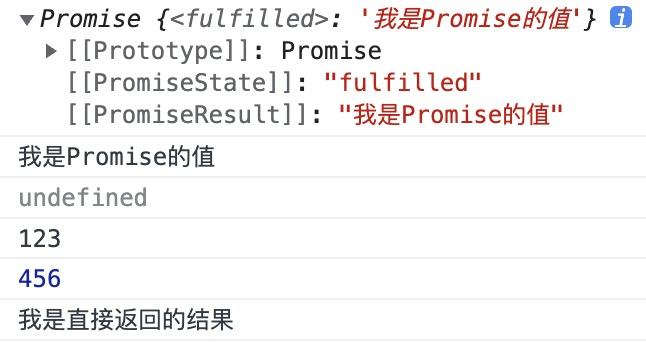
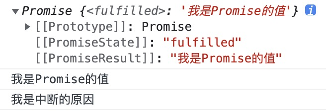
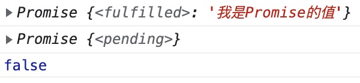
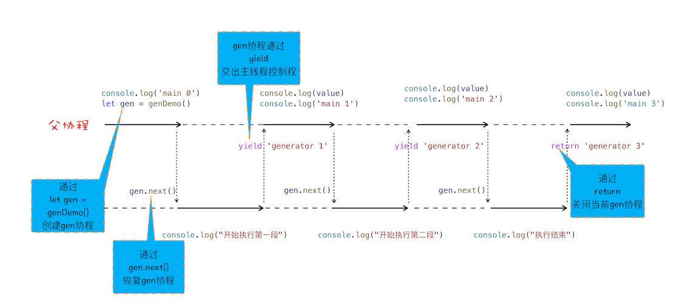

# JS异步编程史

JavaScript 语言是一门单线程语言，同一时刻只能干一件事，就算是 HTML5 提出的 Web Worker 标准，允许 JavaScript 创建多个线程，但是子线程不得操作 DOM，这也没有改变 JavaScript 单线程的本质。

关于同步和异步，同步的意思是对于一段代码 JavaScript 引擎会严格按照单线程执行代码的规则（从上到下、从左到右），进行代码的编译和执行，前面的没执行完，后面的就得等着，换句话说同步会阻塞；而异步，比如在某一步需要发起一个 AJAX 请求，如果这时后面的代码还是得等着，多多少少是有点儿浪费的，这时就需要异步了，异步是非阻塞的，可以先执行后面的代码，待某个时刻条件达成了，比如拿到服务端响应的数据了，再回过来执行先前的异步代码，当然这里面还涉及到事件循环的一系列知识，事件循环相关的知识点可移步 [事件循环Event Loop](https://github.com/llaurora/KnowledgeNote/blob/master/%E6%B5%8F%E8%A7%88%E5%99%A8%E7%BD%91%E7%BB%9C/Event%20Loop.md) 。

从时间线来看，JavaScript 异步编程先后经历了 Callback ⇒ Promise ⇒ Generator ⇒ Async/Await 阶段。

# Callback

Callback 即回调函数，以形参的形式传入另一函数，并在该函数中被调用，用以完成某些任务

> A callback function is a function passed into another function as an argument, which is then invoked inside the outer function to complete some kind of routine or action. — [MDN Callback function](https://developer.mozilla.org/en-US/docs/Glossary/Callback_function)
> 

回调函数使用简单倒是简单，但在保证有 N 个步骤的异步编程中有序进行等情况时，就容易出现“回调地狱”，比如下面例子要求先读取A文本内容，再根据A文本内容读取B再根据B的内容读取C...

```jsx
fs.readFile(A, 'utf-8', function(err, data) {
    fs.readFile(B, 'utf-8', function(err, data) {
        fs.readFile(C, 'utf-8', function(err, data) {
            fs.readFile(D, 'utf-8', function(err, data) {
                //....
            });
        });
    });
});
```

在比如下面这个例子，每隔 1s 运行一个任务，这三个任务必须按时间顺序执⾏，并且每个下⼀秒触发前都能先拿到上⼀秒运⾏的结果

```jsx
setTimeout(function () {
    console.log("第⼀秒之后执行的逻辑");
    setTimeout(function () {
        console.log("第二秒之后执行的逻辑");
        setTimeout(function () {
            console.log("第三秒之后执行的逻辑");
        }, 1000);
    }, 1000);
}, 1000);
```

使用回调函数的方式异步编程，确实是能保证异步流程的有序进行，但这无法避免⼤量的逻辑在回调函数中不停的进⾏嵌套，导致出现“回调地狱”，难以阅读和维护。

# Promise

Promise 最早由社区提出和实现，在 ES2015 的时候被标准化，提供了原生的 Promise 对象，相较于之前异步流程控制使用的回调嵌套结构，Promise 将其转换成了 “Promise对象.then().then()...”的链式调用结构，虽然还是离不开回调函数，但更容易阅读理解，也更符合编写代码时从上到下从左右的线性思维。

使用 Promise 来改造上面 readFile 文件读取那个例子

```jsx
function read(url) {
    return new Promise((resolve, reject) => {
        fs.readFile(url, "utf8", (err, data) => {
            if (err) {
                reject(err);
            }
            resolve(data);
        });
    });
}
read(A).then(data => {
    return read(B);
}).then(data => {
    return read(C);
}).then(data => {
    return read(D);
}).catch(reason => {
    console.log(reason);
});
```

同样的使用 Promise 来改造上面 setTimeout 的例子

```jsx
const p = new Promise(function (resolve) {
    setTimeout(function () {
        resolve();
    }, 1000);
});
p.then(function () {
    console.log("第⼀秒之后执行的逻辑");
    return new Promise(function (resolve) {
        setTimeout(function () {
            resolve();
        }, 1000);
    });
})
    .then(function () {
        console.log("第二秒之后执行的逻辑");
        return new Promise(function (resolve) {
            setTimeout(function () {}, 1000);
        });
    })
    .then(function () {
        console.log("第三秒之后执行的逻辑");
    });
```

Pomise 的定义就是声明⼀个等待未来结果的对象，在结果发⽣之前它⼀直是初始状态，在结果发⽣之后它会变成其中⼀种⽬标状态。

Promise 有且仅有三种状态：

- **pending**：初始状态，也叫就绪状态，这是在 Promise 对象定义初期的状态，这时 Promise 仅仅做了初始化并注册了它对象上所有的任务；
- **fulfilled**：已完成，通常代表成功执⾏了某⼀个任务，当初始化函数中的 resolve 执⾏时，Promise 的状态就变更为 fulfilled，并且 then 函数注册的回调函数会触发，resolve中传递的参数会进⼊回调函数作为形参；
- **rejected**：已拒绝，通常代表执⾏了⼀次失败任务，或者流程中断，当调⽤ reject 函数时，catch 注册的回调函数就会触发，并且reject中传递的内容会变成回调函数的形参。

Promise 中约定，当对象创建之后同⼀个 Promise 对象只能从 pending 状态变更为 fulfilled 或 rejected 中的其中⼀种，并且状态⼀旦变更就不会再改变。

## 链式调用

链式调⽤这个方式最经典的体现是在 JQuery 框架上，它本质就是在调⽤这些⽀持链式调⽤的函数的结尾时，它⼜返回了⼀个包含他⾃⼰的对象或者是⼀个新的自己

```jsx
function MyPromise() {
    return this;
}
MyPromise.prototype.then = function () {
    console.log("触发了then");
    return this;
};
new MyPromise().then().then().then();
```

## Promise 链式调用基本规则

1. 只要有 then() 并且触发了 resolve，整个链条就会执⾏到结尾，这个过程中的第⼀个回调函数的参数是 resolve 传⼊的值；
2. 后续每个函数都可以使⽤ return 返回⼀个结果，如果没有返回结果的话下⼀个 then 中回调函数的参数就是 undefined；
3. 返回结果如果是普通变量，那么这个值就是下⼀个then中回调函数的参数；
4. 如果返回的是⼀个 Promise 对象，那么这个 Promise 对象 resolve 的结果会变成下⼀次 then 中回调的函数的参数；
5. 如果 then 中传⼊的不是函数或者未传值，Promise 链条并不会中断 then 的链式调⽤，并且在这之前最后⼀次的返回结果，会直接进⼊离它最近的正确的 then 中的回调函数作为参数；

```jsx
const p = new Promise(function (resolve, reject) {
    resolve("我是Promise的值");
});
console.log(p);
p.then(function (res) {
    // 该res的结果是resolve传递的参数
    console.log(res);
})
    .then(function (res) {
        // 该res的结果是undefined
        console.log(res);
        return "123";
    })
    .then(function (res) {
        // 该res的结果是123
        console.log(res);
        return new Promise(function (resolve) {
            resolve(456);
        });
    })
    .then(function (res) {
        // 该res的结果是456
        console.log(res);
        return "我是直接返回的结果";
    })
    .then()
    .then("我是字符串")
    .then(function (res) {
        // 该res的结果是“我是直接返回的结果”
        console.log(res);
    });
```

控制台会输出结果如下



## Promise 的链式调用中断

Promise 的链式调用是可以中断的，可以使用 Promise.reject() 或者 throw() 的方式

```jsx
const p = new Promise(function (resolve, reject) {
    resolve("我是Promise的值");
});
console.log(p);
p.then(function (res) {
    console.log(res);
})
    .then(function (res) {
        // 有两种⽅式中断Promise
        // throw ("我是中断的原因");
        return Promise.reject("我是中断的原因");
    })
    .then(function (res) {
        console.log(res);
    })
    .then(function (res) {
        console.log(res);
    })
    .catch(function (error) {
        console.log(error);
    });
```

控制台输出结果如下



在介绍 Promise 的时候强调了 Promise 对象的状态要么从 pending 状态变更为 fullfilled 状态，要么从 pending 状态变更为 rejected 状态，并且状态⼀旦变更就不会再发⽣变化。当我们使⽤链式调⽤的时候正常都是 then 函数链式调⽤，但是当我们触发中断的时候 catch 却执⾏了，这是为啥，这不是违背了 Promise 的约定吗？不慌，看一个例子先

```jsx
const p = new Promise(function (resolve, reject) {
    resolve("我是Promise的值");
});
const p1 = p.then(function (res) {});
console.log(p);
console.log(p1);
console.log(p1 === p);
```

控制台输出结果结果如下



从输出的结果可以发现返回的 p 和 p1 的状态本身就不⼀样，并且他们的对⽐结果是 false，这就代表他们在堆内存中开辟了两个空间，p 和 p1 对象分别保存了两个 Promise 对象的引⽤地址，所以 then 函数虽然每次都返回 Promise对象，来实现链式调⽤，但是 then 函数每次返回的都是⼀个新的 Promise 对象，这样便解释的通了！也就是说每⼀次 then 函数在执⾏时，我们都可以让本次的结果在下⼀个异步步骤执⾏时，变成不同的状态，⽽且这也不违背Promise对象最初的约定。

Promise 虽然在一定程度上是解决了传统异步编程使用 Callback 导致的”回调地狱”问题，将回调嵌套调用转换成了 then() 链式调用，要更线性一些，但还是会充斥着大量的 then 函数，代码阅读性还是不高，还有没有其他更好的解决方案？

# Generator

Generator 即生成器，生成器函数是一个带星号函数，可以暂停执行和恢复执行，在 ES2015 的时候被标准化。

> 虽然 Promise 和 Generator 都是在 ES2015 版本的时候被标准化，但是在社区，Promise 和 Generator 都早有自己的雏形，不过 Promise 的概念出现的时间相对  Generator 而言还是要更早一些的。
> 

```jsx
function* genDemo() {
    console.log("开始执行第一段");
    yield "generator 1";
    console.log("开始执行第二段");
    yield "generator 2";
    console.log("执行结束");
    return "generator 3";
}
console.log("main 0");
const gen = genDemo();
console.log(gen.next().value);
console.log("main 1");
console.log(gen.next().value);
console.log("main 2");
console.log(gen.next().value);
console.log("main 3");
```

观察上面这段代码执行后的输出结果，会发现函数 genDemo 并不是一次执行完的，全局代码和 genDemo 函数是交替执行的，这就是生成器函数可以暂停执行和恢复执行的特性。Generator 函数是怎么做到暂停执行和恢复执行的？这里面涉及到协程对线程控制权的一个转让。

协程是一种比线程更加轻量级的存在，可以将协程看做是跑在线程上的任务，正如一个进程可以拥有多个线程一样，一个线程上可以存在多个协程，只是在一个进程中可以有多个线程并行执行，一个线程上同时却只能执行一个协程，比如当前在主线程上执行的是 A 协程，要启动 B 协程，那么 A 协程就需要将主线程的控制权交给 B 协程，这就体现在 A 协程暂停执行，B 协程恢复执行；同样，也可以从 B 协程中启动 A 协程。通常，如果从 A 协程启动 B 协程，我们就把 A 协程称为 B 协程的父协程。

调用生成器函数会返回一个遍历器对象，这个遍历器对象同时也是一个协程。

> 遍历器对象本质上是一个指针对象，指针对象有一个 next 方法用来移动指针，调用指针对象的 next 方法会返回给定数据结构的当前成员的信息，具体来说返回的是一个包含 value 和 done 两个属性的对象，value 属性是当前成员的值，done  属性是一个布尔值，表示遍历是否结束。
> 
> 
> ```tsx
> // 如果使用TypeScript来定义遍历器对象Iterator和next方法的返回值
> interface Iterator {
>     next(value?: any): IterationResult;
> }
> 
> interface IterationResult {
>     value: any;
>     done: boolean;
> }
> ```
> 



上图是结合前面那段代码执行过程的一个协程执行流程图，从图中可以看出协程的几点规则：

1. 通过调用生成器函数 genDemo 来创建一个协程 gen，创建之后，gen 协程并没有立即执行；
2. 要让 gen 协程执行，需要通过调用 gen.next（除了调用 gen.next，还可以调用 gen.throw 以及调用 gen.return 来让 gen 协程执行）；
3. 当协程正在执行的时候，可以通过 yield 关键字来暂停 gen 协程的执行，并将紧邻 yield 关键字后面表达式的值返回给父协程；
    
    > 注意：紧邻 yield 关键字后面表达式，不会立即求值，只有当调用 next 方法，指针指向该语句时才会执行
    > 
    > 
    > ```tsx
    > function* gen() {
    >   yield  123 + 456;
    > }
    > // yield 后面的表达式 123 + 456，不会立即求值，只会在 next 方法将指针移到这一句时，才会求值
    > ```
    > 
4. 如果协程在执行期间，遇到了 return 关键字，那么 JavaScript 引擎会结束当前协程，并将 return 后面的内容返回给父协程；

其实调用 Generator 函数生成的遍历器对象除了有 next 方法外，其实还有 return 方法和 throw 方法，这三者的共同点都是让 Generator 函数恢复执行（yield 暂停执行），并且使用不同的语句替换 yield 后面的表达式。

- next() 是将 yield 后面的表达式替换成一个值
    
    ```jsx
    const g = function* (x, y) {
        const result = yield x + y;
        return result;
    };
    
    const gen = g(1, 2);
    gen.next(); // Object {value: 3, done: false}，在首次执行next()时，传入任何值都是无效的，比如这儿传100或者undefined，始终会输出Object {value: 3, done: false}
    
    gen.next(1); // Object {value: 1, done: true}
    // 相当于将 let result = yield x + y
    // 替换成 let result = 1;
    ```
    
    上面代码中，第二个 next 方法就相当于将 x + y 表达式替换成一个值 1，如果 next 方法没有参数，就相当于替换成 undefined。
    
- throw() 是将 yield 后面的表达式替换成一个 throw 语句
    
    ```jsx
    gen.throw(new Error("出错了")); // Uncaught Error: 出错了
    // 相当于将 let result = yield x + y
    // 替换成 let result = throw(new Error('出错了'));
    ```
    
- return() 是将 yield 表达式替换成一个 return 语句
    
    ```jsx
    gen.return(2); // Object {value: 2, done: true}
    // 相当于将 let result = yield x + y
    // 替换成 let result = return 2;
    ```
    

关于 Generator 函数更多语法，可移步 [Generator 函数的语法](https://es6.ruanyifeng.com/#docs/generator)，利用 Generator 函数可以暂停执行和恢复执行的特性，换句话说，可以控制函数的分布执行，这个特性正好可以用于异步编程，同样的对于前面依次读取文本内容那个例子，先读取A文本内容，再根据A文本内容读取B再根据B的内容读取C...，如果是使用 Generator + co 库来实现的话

```jsx
const fs = require("fs");
const co = require("co");

function readFile(url) {
    return new Promise((resolve, reject) => {
        fs.readFile(url, "utf8", (err, data) => {
            if (err) {
                reject(err);
            }
            resolve(data);
        });
    });
}
function* read() {
    yield readFile(A);
    yield readFile(B);
    yield readFile(C);
    // ....
}
// Generator函数只要传入co函数，就会自动执行
co(read);
// co函数返回一个Promise对象
// co(read).then(data => {
//     //code
// }).catch(err => {
//     //code
// });
```

从上面代码可以看出，异步流程更加同步了，没有了回调地狱，也没了 Promise 的 then().then()... 链式调用，其中用的 [co 库](https://github.com/tj/co)  用于 Generator 函数的自动执行，其思路正式利用 generator 函数体可以停在 yield 语句处，直到下一次执行 next() 的这个特性，将异步操作跟在 yield 后面，当异步操作完成并返回结果后，再触发下一次 next()，下面实现一个简易版的 co

```jsx
function myCo(gen) {
    const generator = gen();
    return new Promise((resolve, reject) => {
        function next(data) {
            try {
                const result = generator.next(data);
                const { value, done } = result;
                if (done === true) {
                    resolve(value);
                } else if (done === false && value instanceof Promise) {
                    value.then(function (val) {
                        next(val);
                    });
                }
            } catch (error) {
                return reject(error);
            }
        }
        next();
    });
}
```

将上面例子中的 co 替换成 myCo，效果也是一样的，同样的对于前面在1秒后、2秒后、3秒后依次执行的那个例子，使用 Generator 函数结合上面简易版的 co 来写的话

```jsx
function* test() {
    const res1 = yield new Promise(function (resolve) {
        setTimeout(function () {
            resolve("第⼀秒之后执行的逻辑");
        }, 1000);
    });
    console.log(res1);
    const res2 = yield new Promise(function (resolve) {
        setTimeout(function () {
            resolve("第二秒之后执行的逻辑");
        }, 1000);
    });
    console.log(res2);
    const res3 = yield new Promise(function (resolve) {
        setTimeout(function () {
            resolve("第三秒之后执行的逻辑");
        }, 1000);
    });
    console.log(res3);
}

myCo(test);
/* 可以看到在控制台输出结果如下 */
// 第⼀秒之后执行的逻辑
// 第二秒之后执行的逻辑
// 第三秒之后执行的逻辑
```

从上面的例子可以看出，利用 Generator 函数可以使异步流程，看起来更加同步了。但其函数语义比如 yield 啥的还是比较晦涩，另外用 Generator  来异步编程，并不是开箱即用，基本需要进行较为完善的二次封装（增加执行器），才能成为一种异步编程模式，例如 co 库，那还没有既能用同步代码的思维来异步编程又是开箱即用的方案？

# Async/Await

async/await 在 ES2016 中得到了提案，并在 ES2017 中被标准化，有了 async/await 我们现在就可以用同步代码的思维来异步编程同时又可开箱即用，写法还特简单，这是到目前为止最完美的异步编程解决方案了，其语法定义可移步 [async函数](https://developer.mozilla.org/zh-CN/docs/Web/JavaScript/Reference/Statements/async_function)。

其实 async/await 只是一个 Generator 的语法糖，可以近似的认为是 Generator + 自执行器（比如 co） + Promise 的封装，可参考上面 Generator 结合 co 来进行异步流程控制的实现，另外就是 async/await 为向后兼容在使用 babel 时编译后的代码也不难发现这一点

```jsx
async function test () {
   const result = await func();
    console.log(result);
}

// 在使用babel编译（有经过格式整理）
function asyncGeneratorStep() {...}

function _asyncToGenerator(fn) {
    return function () {
        var self = this,
            args = arguments;
        return new Promise(function (resolve, reject) {
            var gen = fn.apply(self, args);
            function _next(value) {
                asyncGeneratorStep(gen, resolve, reject, _next, _throw, "next", value);
            }
            function _throw(err) {
                asyncGeneratorStep(gen, resolve, reject, _next, _throw, "throw", err);
            }
            _next(undefined);
        });
    };
}

function test() {
    return _test.apply(this, arguments);
}

function _test() {
    _test = _asyncToGenerator(
        /*#__PURE__*/ regeneratorRuntime.mark(...),
    );
    return _test.apply(this, arguments);
}
```

也正因为 async/await 是 Generator + 自执行器（比如 co） + Promise 的一个封装，await 关键字就类似于 yield 暂停标示，底层也是基于协程对主线程控制权的一个转让，可简单讲 async 函数中 await 上面的代码和紧邻 await 后面的代码视作 new Promise() 时传入的代码，而 await 左侧的代码以及 await 后面的代码可视作 Promise.then() 中的代码

```jsx
async function test() {
    console.log(3);
    const a = await 4;
    console.log(a);
    return 1;
}
console.log(1);
test();
console.log(2);
// 控制台输出顺序 1、3、4、2
```

# 参考资料

[浏览器工作原理与实践](https://time.geekbang.org/column/intro/100033601?tab=catalog)

[JavaScript异步发展历史](https://segmentfault.com/a/1190000040156178)

[细说JS异步发展历程](https://segmentfault.com/a/1190000019254694)