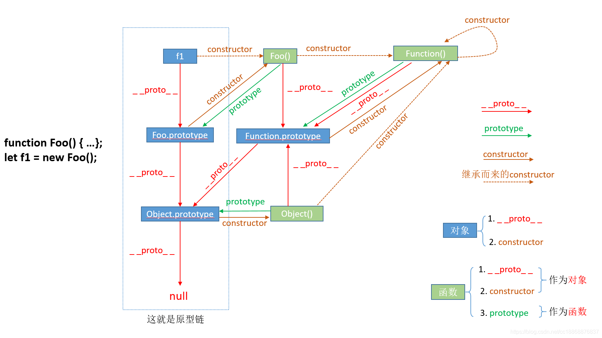
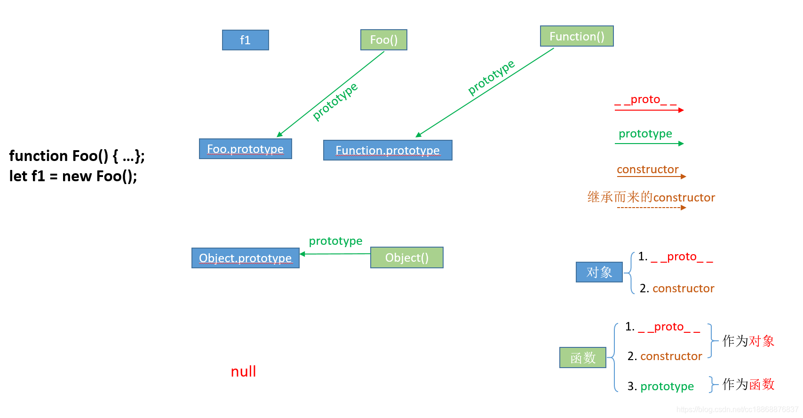
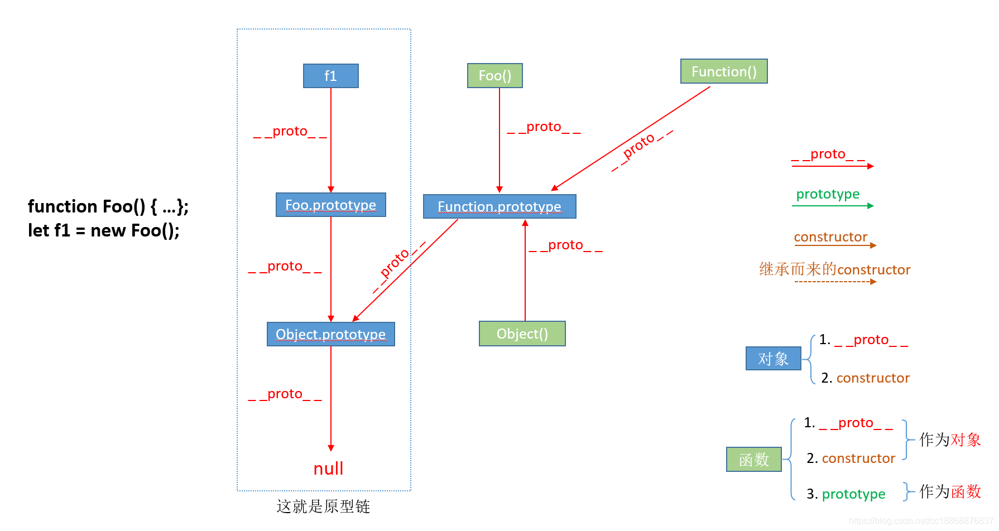
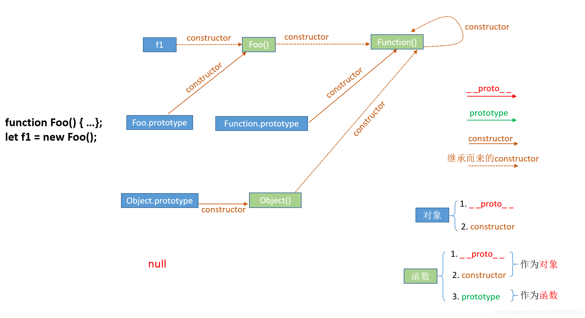
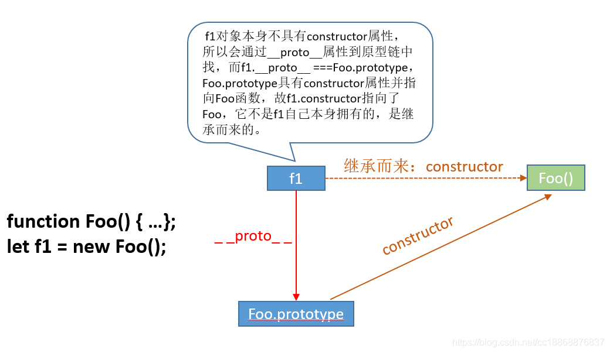

# prototype、__proto__与constructor

# 前言

从一个简单例子先记住几个概念（叫法）

```jsx
function Foo() {...};
let f1 = new Foo();
```

**构造函数**：用来初始化新创建的对象的函数就是构造函数。在上面例子中，`Foo()`即是构造函数。

**实例化对象**：通过构造函数的`new`操作创建的对象即被称为该构造函数的实例化对象（实例、实例对象、实例化对象指的都是它，叫法不一样而已）。在上面例子中，`f1`即为`Foo()`构造函数的实例化对象，并且一个构造函数可以构造多个实例化对象。

虽然是简简单单两行代码，但背后涉及到的 `prototype`、`__proto__`、`constructor`关系却是错综复杂的，如下图所示：



左图右下角为图例：

- 红色箭头表示`__proto__`属性指向；
- 绿色箭头表示`prototype`属性的指向；
- 棕色实线箭头表示本身具有的`constructor`属性的指向；
- 棕色虚线箭头表示继承而来的`constructor`r属性的指向；
- 蓝色方块表示对象；
- 浅绿色方块表示函数（这里为了更好看清，`Foo()`仅代表是函数，并不是指执行函数`Foo`后得到的结果，图中的其他函数同理）；
- 图的中间部分即为它们之间的联系，图的最左边即为例子代码。

我们还需要牢记两点：

- `__proto__`和`constructor`属性是对象所独有的；
- `prototype`属性是函数所独有的。但是由于JS 中函数也是一种对象，所以函数也拥有`__proto__`和`constructor`属性，这点是致使我们产生困惑的很大原因之一。

上图有点复杂，我们把它按照属性分别拆开，然后进行分析：

# prototype 属性

构造函数上有一个键名为 `prototype`的属性（原型属性，普通函数同样也有），其键值为一个对象，该对象即是该构造函数实例化得到的实例化对象的原型对象（prototype object），通过同一个构造函数实例化的多个实例化对象具有相同的原型对象。

如上面所说`prototype`属性是**函数所独有的**，所以在图上它总是从**一个函数指向一个对象**。



那 `prototype` 属性的作用又是什么呢？先看一个场景，假设要给通过`Foo()` 构造函数实例化后的实例对象`f1` 和`f2` （let f2 = new Foo()）都加上一个效果相同的 `say` 方法，可能会有如下代码：

```jsx
// 下面是给实例f1和f2添加了同一个效果的方法say
f1.say = function () {
    console.log("Hello!");
};
f2.say = function () {
    console.log("Hello!");
};
console.log(f1.say === f2.say); // false，它们并不指向堆内存同一个地方，而是各自都占有内存
```

当你去对比这两个方法的时候，你会发现它们只是效果相同、名字相同，本质上却是**各自都占用了部分内存**的不同方法。这时候就出问题了，如果这时候有千千万万个实例（夸张）要这样效果同样的方法，那内存岂不是要炸。

而这正是`prototype` 属性解决的问题，当需要为大量实例添加相同的属性和方法时，可以将它们存放在这些实例化对象的原型对象中，即对应的构造函数的`prototype` 属性（该属性值为一个对象）中而达到共享、公用的效果以节省内存。

还是上面那个场景，通过`prototype` 属性的话，代码如下：

```jsx
Foo.prototype.say = function () {
    console.log("Hello!");
};
console.log(f1.say === f2.say); // true，指向堆内存同一个地方
```

通过`prototype` 属性确实解决了给多个实例添加相同属性和方法而又不浪费内存的问题，可是这些实例对象又是怎么找到这个共用方法或者属性的呢？那就涉及到`__proto__` 属性了。

# ****__ proto__ 属性****

如上面所说`__proto__` 属性是**对象独有的**，从图上可以看到`__proto__` 属性总是由**一个对象指向一个对象**，即指向它们的原型对象（可以理解为父对象）。

<aside>
💡 **__proto__并非标准属性，ECMA-262第5版将该属性或指针称为[[Prototype]]，**具体实现是由浏览器厂商自己实现，比如谷歌浏览器的实现就是将[[Prototype]]命名为__proto__，大家清楚这个标准定义与具体实现的区别即可（名字有所差异，功能是一样的），可以通过该方式检测引擎是否支持这个属性：Object.getPrototypeOf({__**proto__**: null}) === null

</aside>



那`__proto__` 属性的作用是什么呢？它的作用就是当访问一个对象的属性时，如果该对象内部不存在这个属性，那么就会去它的`__proto__` 属性所指向的那个对象（即该实例对象的原型对象，可以理解为该实例对象的父对象）里找，如果父对象也不存在这个属性，则继续往父对象的`__proto__` 属性所指向的那个对象（可以理解为爷爷对象）里找，如果还没找到，则继续往上找…直到原型链顶端`null` （可以理解为原始人。。。），再往上找就相当于在`null`上取值，会报错（可以理解为，再往上就已经不是“人”的范畴了，找不到了，到此结束，`null`为原型链的终点），由以上这种通过`__proto__` 属性来连接对象直到`null` 的一条链即为我们所谓的原型链。

这也就可以解释上面实例化对象`f1` 和`f2`其是怎么找到公用方法`say()`了。其实我们平时调用的字符串方法、数组方法、对象方法、函数方法等都是靠`__proto__`继承而来的。

关于 `__proto__` 和 `prototype` 的关系：实例化对象的 `__proto__` 属性 和构造函数的`prototype` 属性指向的是堆内存里面同一个地方，所以图上的示例有 f1.**proto** === Foo.prototype。

# ****constructor 属性****

同样如上面所说`constructor`属性也是**对象才拥有的**，它是从**一个对象指向一个函数**，含义就是指向该对象的构造函数，任何一个对象都可以找到其构造函数（本身拥有或继承而来，继承而来的要结合__proto__属性查看会更清楚点，如下图所示）。

> 在 JS 中函数是拥有特定功能的对象，而`Function` 这个对象比较特殊，其构造函数就是`Function` 自身。另外任何一个构造函数都是构造函数 `Function()` 的实例化对象，内置的 `Object()` 、`Number()` 、`String()` 等构造函数都是 `Function()` 的实例化对象。
> 



之所以说“任何一个对象都可以找到其构造函数”而不是“任何一个对象都有构造函数”，是因为创建对象的前提是需要有`constructor`，而这个`constructor`可能是对象自己本身显式定义的或者通过`__proto__`在原型链中找到的。而纯粹的从`constructor`属性来讲的话，是只有构造函数.prototype（实例对象的原型对象）才显示定义有`constructor`属性，指向该原型对象对应的构造函数即构造函数.prototype.constructor === 构造函数本身。而实例化对象本身即使自己没有`constructor`属性的，也可以通过`__proto__` 找到其原型对象上的`constructor` 属性，所以任何一个对象最终都可以找到其构造函数（null如果当成对象的话，将null除外）。

> Foo.prototype（实例对象的原型对象）因其自身显示的定义有 constructor 属性，覆盖了其继承自原型对象 Object.prototype 的 constructor 属性，所以 Foo.prototype.constructor === Foo 输出的是 true，而 Foo.prototype.constructor === Foo 输出的是 false。
> 



# 总结

- 我们需要牢记两点：①`__proto__`和`constructor`属性是**对象**所独有的；② `prototype`属性是**函数**所独有的，因为函数也是一种对象，所以函数也拥有`__proto__`和`constructor` 属性；
- `__proto__`属性的**作用**就是当访问一个对象的属性时，如果该对象内部不存在这个属性，那么就会去它的`__proto__`属性所指向的那个对象（父对象）里找，一直找，直到`__proto__`属性的终点`nul`，再往上找就相当于在`nul`上取值，会报错。通过`__proto__`_属性将对象连接起来的这条链路即**我们所谓的原型链**；
- `prototype` 属性的作用就是让通过该函数所实例化的对象们都可以找到公用的属性和方法，即 f1.**proto** === Foo.prototype；
- `constructor`属性的含义就是指向该对象的构造函数，所有函数（此时看成对象了）最终的构造函数都指向`Function()`；
- 函数(`Function`也是函数)是`new Function()`的结果，所以函数可以作为实例对象，其构造函数是`Function()`，原型对象是`Function.prototype`；
- 对象(函数也是对象)是`new Object()`的结果，所以对象可以作为实例对象，其构造函数是`Object()`，原型对象是`Object.prototype`。

# 理一下

---


- 实例化对象`f1`是通过构造函数`Foo()`的new操作创建的。构造函数`Foo()`显示定义有原型（prototype）属性即`Foo.prototype`；实例化对象`f1`通过`__proto__`属性也指向其原型对象`Foo.prototype`。
    
    ```jsx
    console.log(f1.__proto === Foo.prototype);//true
    ```
    
- 实例对象`f1`本身并没有`constructor`属性，但它可以继承其原型对象`Foo.prototype`的`constructor`属性。
    
    ```jsx
    console.log(Foo.prototype.constructor === Foo);//true
    console.log(f1.constructor === Foo); //true
    console.log(f1.hasOwnProperty('constructor'));//false
    ```
    
- `Foo.prototype`是`f1`的原型对象，同时它也是实例对象。实际上，任何对象都可以看做是通过`Object()`构造函数的new操作实例化的对象。所以`Foo.prototype`作为实例对象，它的构造函数是`Object()`，原型对象是`Object.prototype`。
    
    ```jsx
    console.log(Foo.prototype.__proto__ === Object.prototype);//true
    ```
    
- `Foo.prototype` 作为实例化对象，因其本身具有`constructor`属性，所以它会覆盖继承自原型对象`Object.prototype`的`constructor`属性。
    
    ```jsx
    console.log(Foo.prototype.constructor === Object);//false
    console.log(Foo.prototype.constructor === Foo);//true
    console.log(Object.prototype.constructor === Object);//true
    console.log(Foo.prototype.hasOwnProperty('constructor'));//true
    ```
    
- 如果`Object.prototype`作为实例对象的话，其原型对象是什么，结果是null。这大概也是 typeof null 的结果是 'object' 的原因之一吧。
    
    ```jsx
    console.log(Object.prototype.__proto__ === null);//true
    ```
    
- 函数也是对象，只不过是具有特殊功能的对象而已。任何函数都可以看做是通过`Function()`构造函数的new操作实例化的结果，如果把函数`Foo()`当成实例对象的话，其构造函数是`Function()`，其原型对象是`Function.prototype`；类似地，函数`Object()`的构造函数也是`Function()`，其原型对象是`Function.prototype` 。
    
    ```jsx
    console.log(Foo.__proto__ === Function.prototype);//true
    console.log(Object.__proto__ === Function.prototype);//true
    ```
    
- 原型对象`Function.prototype`的`constructor`属性指向构造函数`Function()`；实例对象`Object`和`Foo`本身没有`constructor`属性，需要继承原型对象`Function.prototype`的`constructor`属性。
    
    ```jsx
    console.log(Function.prototype.constructor === Function);//true
    console.log(Foo.constructor === Function);//true
    console.log(Foo.hasOwnProperty('constructor'));//false
    console.log(Object.constructor === Function);//true
    console.log(Object.hasOwnProperty('constructor'));//false
    ```
    
- 所有的函数都可以看成是构造函数`Function()`的new操作的实例化对象，只是`Function`作为实例对象时，其比较特殊，它的构造函数就是`Function` 自身，它的原型对象是`Function.prototype`。
    
    ```jsx
    console.log(Function.__proto__ === Function.prototype);//true
    console.log(Function.prototype.constructor === Function);//true
    console.log(Function.prototype === Function.prototype);//true
    ```
    
- 如果`Function.prototype`作为实例对象的话，其原型对象是什么呢？和前面一样，所有的对象都可以看成是`Object()`构造函数的new操作的实例化结果。所以，`Function.prototype`的原型对象是`Object.prototype`，其构造函数是`Object()`。
    
    ```jsx
    console.log(Function.prototype.__proto__ === Object.prototype);//true
    ```
    
- 前面介绍过`Object.prototype`的原型对象是`null` 。
    
    ```jsx
    console.log(Object.prototype.__proto__ === null);//true
    ```
    

# 参考资料

[帮你彻底搞懂JS中的prototype、__proto__与constructor（图解）](https://blog.csdn.net/cc18868876837/article/details/81211729)

[一张图理解prototype、proto和constructor的三角关系](https://www.cnblogs.com/xiaohuochai/p/5721552.html)