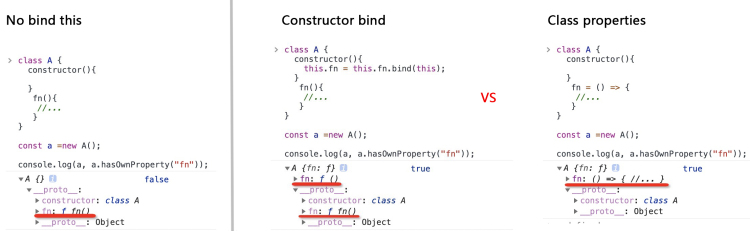

# Class组件this绑定

> 在 Hooks 组件中不存在使用 this 的困扰，所以这儿只针对 Class 类组件

# 为什么Class 类组件的事件处理函数需要绑定 this ？


这一点应该都知道，如果不对事件处理函数绑定 this，在处理函数中访问不到 this。

```jsx
class Foo extends React.Component{
  constructor(props){
    super(props);
  }
  handleClick(){
    console.log(this); // 'this' is undefined
  }
  render(){
    return (
      <button type="button" onClick={this.handleClick}>
        Click Me
      </button>
    );
  }
}
```

这和 React 其实并没有关系，是 JavaScript 的 this 绑定机制导致了上面的问题。

```jsx
class Foo {
  constructor(name){
    this.name = name
  }
  display(){
    console.log(this.name);
  }
}
const foo = new Foo('Saurabh');
foo.display(); // Saurabh

//下面的赋值操作模拟了上下文的丢失。 
//与实际在 React Component 中将处理程序作为 callback 参数传递 相似。

const display = foo.display; 
display();              // TypeError: this is undefined
```

更深层次原因在这儿不再赘述，今儿主要讨论 **Class类组件绑定 this 方法的区别。**

# Class类组件绑定 this

## 直接在 render 上绑定

```jsx
<button type="button" onClick={this.handleClick.bind(this)}>Click Me</button>
```

对于这种做法，会在每次 render 的时候，重新生成绑定函数，所以这种方式是不建议在在实际生产中使用的。

## Constructor bind

Constructor bind 就是在 Class 的 constructor 中为方法 bind this。

```jsx
class Foo extends React.Component{
  constructor(props){
    super(props);
    this.handleClick = this.handleClick.bind(this);
  }
  handleClick(){
    console.log(this);
  }
  render(){
    return (
      <button type="button" onClick={this.handleClick}>
        Click Me
      </button>
    );
  }
}
```

## Class properties

Class properties 就是在 Class 类方法中使用箭头函数语法。

> Class properties 现已经在 ES2022 规范中发布
> 

```jsx
class Foo extends React.Component{
  constructor(props){
    super(props);
  }
  handleClick = () => {
    console.log(this);
  }
  render(){
    return (
      <button type="button" onClick={this.handleClick}>
        Click Me
      </button>
    );
  }
}
```

# Constructor bind Vs Class properties

直接在 render 上绑定 this 的方法不建议在项目生成中使用，故不考虑在此处比较。讲清楚 Constructor bind 和 Class properties 两者之间的差异，说白了其实就是**构造原型上的方法和原型链上方法的优劣。**暂且不论 ES6 的 Class，我们先来看ES5 的使用构造函数的方法。

```jsx
function Student (name, subject) {
  this.name = name;
  this.subject = subject;
  this.study = function() {
    console.log('我在学习' + this.subject);
  }
}
```

现在我们来实例化 `Student` 构造函数， 生成 `student1`和 `student2`, 并分别调用其 `study`方法。

```jsx
const student1 = new Student('阿辉', '前端开发');
const student2 = new Student('阿傻', '大数据开发');

student1.study(); //我在学习前端开发
student2.study(); //我在学习大数据开发
```

这样生成的实例对象表面上看没有任何问题，但大家应该有知道这样其实是有性能问题的。

```jsx
console.log(student1.study === student2.study); //false
```

其实对于每一个实例对象 `studentx`，其 `study`方法的函数体是一模一样的，但是生成的每个实例都需要生成一个 `study`方法去占用一份内存，这样是非常不经济的做法。

所以不难知晓解决方法是将 `study`方法挂载到 `Student.prototype`原型对象上，所有的 `studentx`实例都能继承该方法。

```jsx
function Student (name, subject) {
  this.name = name;
  this.subject = subject;
}
Student.prototype.study = function() {
  console.log('我在学习' + this.subject);
}
```

现在再实例化 `student1`和 `student2`。

```jsx
const student1 = new Student('阿辉', '前端开发');
const student2 = new Student('阿傻', '大数据开发');

student1.study(); //我在学习前端开发
student2.study(); //我在学习大数据开发
console.log(student1.study === student2.study); //true
```

从上面的代码我们可以看出，`student1`和 `student2`的 `study`方法执行结果没有发生变化，但是 `study`本身指向了一个内存地址。

而 **ES6 的 Class 其实只是ES5 构造函数的一个语法糖而已，在其中声明的方法是挂载到原型链上的**，再回到话题上 Constructor bind Vs Class properties。



其实就不难看出，**若在 constructor 里面 bind 一次，不止在原型链上声明有一个 fn 方法，还在实例上有多一个 fn 方法。**

# 总结

在 React 中，如果我们的事件处理函数不需要访问 this，那么直接在 Class 组件中声明方法是要优于用Class properties（减少内存消耗），而如果我们的事件处理函数需要访问 this，那还是建议采用Class properties，毕竟你如果是在 constructor 里面 进行bind的话，相较采用 Class properties 的方式而言， 不但等同于用 Class properties 在实例上声明了方法，还多了一个原型链上面的方法。
