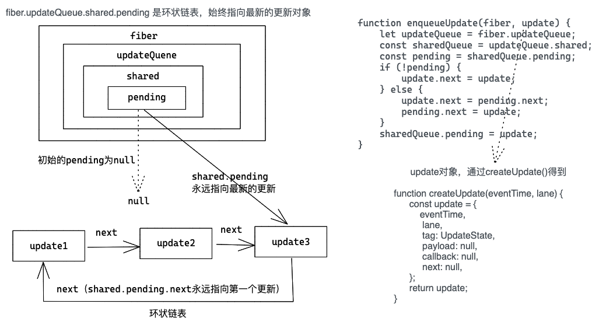
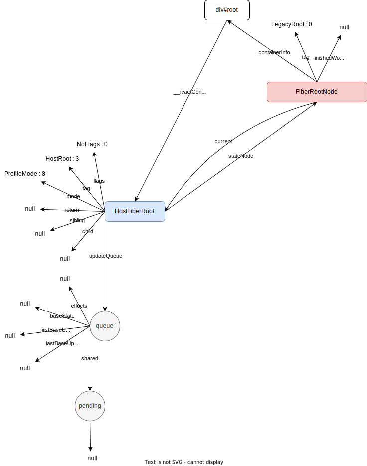
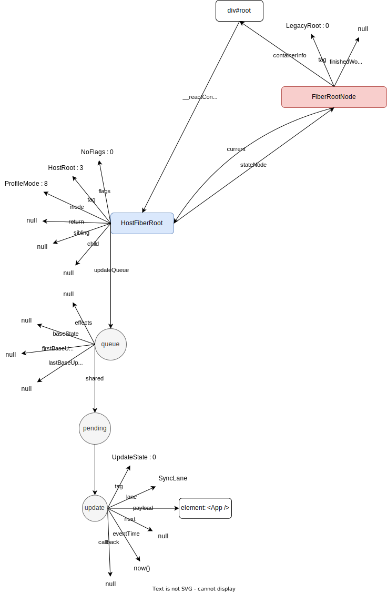

# React Hooks初次挂载

下面这段代码构建的 fiber 树是怎样的，是子组件的 useEffect 先执行还是父组件的 useEffect 先执行，如果再加上 useLayoutEffect 呢？

```jsx
const Child = () => {
    useEffect(() => {
        console.log("Child useEffect");
        return () => {
            console.log("Child useEffect destroy");
        };
    }, []);

    return <div id="Child-div">child comp</div>;
};

const App = () => {
    const [count, setCount] = useState(100);
    const [age, setAge] = useState(20);
    const domRef = useRef(null);

    const formatCount = useMemo(() => `useMemoCount${count}`, [count]);

    const onSearch = useCallback(() => {
        console.log(count, "useCallback");
    }, [count]);

		useLayoutEffect(() => {
        console.log("App useLayoutEffect");
        return () => {
            console.log("App useLayoutEffec destroy");
        };
    }, []);

    useEffect(() => {
        console.log("App useEffect");
        return () => {
            console.log("App useEffect destroy");
        };
    }, []);

    return (
        <div id="App-div" ref={domRef} onClick={onSearch}>
            <span id="App-div-span">数量{count}</span>
            <Child />
        </div>
    );
};

ReactDOM.render(<App />, document.querySelector("#root"));
```

# ReactElement对象

```jsx
<div id="title id" key="title key">title</div>
```

从 [ReactElement对象](https://github.com/llaurora/KnowledgeNote/blob/master/React/ReactElement%E5%AF%B9%E8%B1%A1.md) 我们知道，上面一段代码经编译后就是下面这么个 ReactElement 对象，React 17.0.2 版本中创建该对象的方法定义在 `ReactJSXElement.js`文件中（[见源码](https://github.com/facebook/react/blob/12adaffef7105e2714f82651ea51936c563fe15c/packages/react/src/jsx/ReactJSXElement.js#L147)）

```jsx
{
    // This tag allows us to uniquely identify this as a React Element
    $$typeof: REACT_ELEMENT_TYPE,
    type: "div",
    key: "title key",
    ref: null,
    props: {
        id: "title id",
        children: "title"
    },

    // Record the component responsible for creating this element.
    _owner: owner,
 }
```

# createFiberRoot

React 代码初始挂载的时候，会先初始化一些配置，里面包括创建根fiber 即 HostRootFiber、根fiberNode 即 FiberRootNode 以及初始化更新队列 updateQueue，这部分工作是在 createFiberRoot 里面完成的。

入口ReactDOM.render源码文件：ReactDOMLegacy.js （[见源码](https://github.com/facebook/react/blob/17.0.2/packages/react-dom/src/client/ReactDOMLegacy.js#L287)）；

createFiberRoot源码文件：ReactFiberRoot.old.js（[见源码](https://github.com/facebook/react/blob/17.0.2/packages/react-reconciler/src/ReactFiberRoot.old.js#L83)）；

createFiberRoot调用栈：`ReactDOM.ender` ⇒ `legacyRenderSubtreeIntoContainer` ⇒ `legacyCreateRootFromDOMContainer` ⇒ `createLegacyRoot` ⇒ `new ReactDOMBlockingRoot` ⇒ `createRootImpl` ⇒ `createContainer` ⇒ `createFiberRoot`

```jsx
export function createFiberRoot(containerInfo, tag, hydrate, hydrationCallbacks) {
  // 创建fiberRoot，注意这儿的tag是在createLegacyRoot()方法中传下来的，为const常量即LegacyRoot，在react17.0.2版本中为0
  const root: FiberRoot = new FiberRootNode(containerInfo, tag, hydrate);
  if (enableSuspenseCallback) {
    root.hydrationCallbacks = hydrationCallbacks;
  }

  // Cyclic construction. This cheats the type system right now because
  // stateNode is any.
  const uninitializedFiber = createHostRootFiber(tag);
  root.current = uninitializedFiber;
  uninitializedFiber.stateNode = root;

  initializeUpdateQueue(uninitializedFiber);

  return root;
}
```

`createFiberRoot` 方法就干了几个事：

1. 调用 new FiberRootNode() 创建了 FiberRootNode 对象，该对象的 containerInfo 属性指向的就是真实的 dom节点（在本文中就是指 div#root 节点）
   
    ```jsx
    // 该方法定义在ReactFiberRoot.old.js文件中，[见源码](https://github.com/facebook/react/blob/17.0.2/packages/react-reconciler/src/ReactFiberRoot.old.js#L29)
    function FiberRootNode(containerInfo, tag, hydrate) {
      this.tag = tag;
      this.containerInfo = containerInfo;
      this.current = null;
      this.finishedWork = null;
      // ...省略部分代码
    }
    ```
    
2. 调用 createHostRootFiber() 创建 HostRootFiber 对象，`createHostRootFiber` ⇒ `createFiber` ⇒ `new FiberNode`
   
    ```jsx
    // 该方法定义在ReactFiber.old.js文件中，[见源码](https://github.com/facebook/react/blob/17.0.2/packages/react-reconciler/src/ReactFiber.old.js#L116)
    function FiberNode(
      tag: WorkTag,
      pendingProps: mixed,
      key: null | string,
      mode: TypeOfMode,
    ) {
      // Instance 实例相关
      this.tag = tag;
      this.key = key;
      this.elementType = null;
      this.type = null;
      this.stateNode = null;
    
      // Fiber fiber节点相关
      this.return = null;
      this.child = null;
      this.sibling = null;
      this.index = 0;
    
      this.ref = null;
    
      this.pendingProps = pendingProps;
      this.memoizedProps = null;
      this.updateQueue = null;
      this.memoizedState = null;
      this.dependencies = null;
    
      this.mode = mode;
    
      // Effects 副作用相关
      this.flags = NoFlags;
      this.nextEffect = null;
    
      this.firstEffect = null;
      this.lastEffect = null;
    
      this.lanes = NoLanes;
      this.childLanes = NoLanes;
    
      this.alternate = null;
    
      // ... 省略部分代码
    }
    ```
    
3. 建立根node(FiberRootNode) 和根fibe(HostRootFiber) 的关联
   
    ```jsx
      root.current = uninitializedFiber;
      uninitializedFiber.stateNode = root;
    ```
    
4. 调用 initializeUpdateQueue() 初始化 HostRootFiber 上的更新队列 updateQueue
   
    ```jsx
    // 该方法定义在ReactUpdateQueue.old.js文件中，[见源码](https://github.com/facebook/react/blob/17.0.2/packages/react-reconciler/src/ReactFiber.old.js#L116)
    export function initializeUpdateQueue(fiber) {
      const queue = {
        baseState: fiber.memoizedState,
        firstBaseUpdate: null,
        lastBaseUpdate: null,
        shared: {
          pending: null,
        },
        effects: null,
      };
      fiber.updateQueue = queue;
    }
    ```
    
    HostRootFiber 上的更新队列 updateQueue 是一个环形链表，`HostRootFiber.updateQueue.shared.pending`初始为 null，而后每往该更新队列 updateQueue 中添加一个更新对象 update，就在该链表中连接一个更新对象，`HostRootFiber.updateQueue.shared.pending`始终指向最新的更新对象。
    
    
    

在 `ReactDOM.render` ⇒ `legacyRenderSubtreeIntoContainer` 中初始化完一些配置后（调用legacyCreateRootFromDOMContainer后，updateContainer 前），便有如下关系结构



# scheduleUpdateOnFiber

在上面完成一些初始化配置后即会调用 updateContainer 方法。

updateContainer源码文件：ReactFiberReconciler.old.js （[见源码](https://github.com/facebook/react/blob/17.0.2/packages/react-reconciler/src/ReactFiberReconciler.old.js#L250)）；

updateContainer调用栈：`ReactDOM.ender` ⇒ `legacyRenderSubtreeIntoContainer` ⇒ `updateContainer`

在 updateContainer 里面主要就是把 `<App />` 对应的ReactElement对象添加到 HostRootFiber 的的更新队列 updateQueue 上，然后在 HostRootFiber 发起调度更新即 scheduleUpdateOnFiber。

只是注意初次挂载的时候（HostRootFiber为空）的时候，调用 updateContainer 会被 unbatchedUpdates 包一下

```jsx
// 省略部分不相关代码
function legacyRenderSubtreeIntoContainer(
  parentComponent,
  children,
  container,
  forceHydrate,
  callback?,
) {
  let root: RootType = (container._reactRootContainer: any);
  let fiberRoot;
  if (!root) {
    // Initial mount
    // ...省略部分代码
    unbatchedUpdates(() => {
      updateContainer(children, fiberRoot, parentComponent, callback);
    });
  } else {
    // ...省略部分代码
    // Update
    updateContainer(children, fiberRoot, parentComponent, callback);
  }
  return getPublicRootInstance(fiberRoot);
}
```

在 unbatchedUpdates 里面会去设置执行上下文变量 executionContext：

```jsx
export function unbatchedUpdates(fn) {
  const prevExecutionContext = executionContext;
  executionContext &= ~BatchedContext;
  executionContext |= LegacyUnbatchedContext;
  try {
    return fn(a);
  } finally {
    // 执行之后executionContext又被重置了
    executionContext = prevExecutionContext;
    if (executionContext === NoContext) {
      // Flush the immediate callbacks that were scheduled during this batch
      resetRenderTimer();
      flushSyncCallbackQueue();
    }
  }
}
```

注意上面的执行上下文变量 executionContext 先是删除了 BatchedContext，而后又添加了 LegacyUnbatchedContext，这在后面 commitRoot 时候有用，这儿可以不用太关注。

调用 scheduleUpdateOnFiber 之前，因为 `<App />` 被添加到了根 HostRootFiber 的更新队列上，此时关系结构如下



scheduleUpdateOnFiber 方法定义在`ReactFiberWorkLoop.old.js` 文件中（[见源码](https://github.com/facebook/react/blob/17.0.2/packages/react-reconciler/src/ReactFiberWorkLoop.old.js#L517)）

```jsx
// 省略部分代码
export function scheduleUpdateOnFiber(fiber, lane, eventTime) {
  const root = markUpdateLaneFromFiberToRoot(fiber, lane);

  if (root === workInProgressRoot) {
    // ... 省略部分代码，初始化的时候进不到这儿
  }

  // TODO: requestUpdateLanePriority also reads the priority. Pass the
  // priority as an argument to that function and this one.
  const priorityLevel = getCurrentPriorityLevel();

  if (lane === SyncLane) {
    if (
      // Check if we're inside unbatchedUpdates
      (executionContext & LegacyUnbatchedContext) !== NoContext &&
      // Check if we're not already rendering
      (executionContext & (RenderContext | CommitContext)) === NoContext
    ) {
      // Register pending interactions on the root to avoid losing traced interaction data.
      schedulePendingInteractions(root, lane);
      performSyncWorkOnRoot(root);
    } else {
      ensureRootIsScheduled(root, eventTime);
      schedulePendingInteractions(root, lane);
      if (executionContext === NoContext) {
        resetRenderTimer();
        flushSyncCallbackQueue();
      }
    }
  } else {
    // Schedule a discrete update but only if it's not Sync.
    // ... 省略部分代码
  }

  mostRecentlyUpdatedRoot = root;
}
```

在初次挂载的时候`ReactDOM.ender` ⇒ `legacyRenderSubtreeIntoContainer` ⇒ `updateContainer` ⇒ `scheduleUpdateOnFiber`会走里面三部分逻辑：markUpdateLaneFromFiberToRoot、schedulePendingInteractions 和 performSyncWorkOnRoot。

调用 markUpdateLaneFromFiberToRoot 方法会处理一些优先级，然后从当前 fiber 节点一直向上找，最后返回 HostRootFiber 的 stateNode 即 FiberRootNode（其 containerInfo 为 div#root 节点）；

# performSyncWorkOnRoot

在上面调用 markUpdateLaneFromFiberToRoot 找到 FiberRootNode 后，最后会调用 performSyncWorkOnRoot 方法开始在根节点 FiberRootNode 上执行工作循环来生成 fiber树，在这里面有几个关键的步骤

## createWorkInProgress

源码文件：ReactFiber.old.js（[见源码](https://github.com/facebook/react/blob/17.0.2/packages/react-reconciler/src/ReactFiber.old.js#L254)）；

调用栈：`scheduleUpdateOnFiber` ⇒ `performSyncWorkOnRoot` ⇒ `renderRootSync`=>`prepareFreshStack` ⇒ `createWorkInProgress`；

调用 createWorkInProgress 方法会创建当前 fiber 的副本（如果有 fiber 的副本，则会更新复用 fiber 副本，只是会更新 fiber 副本的 pendingProps、flag标记等属性并清空 fiber 状态相关的值比如 firstEffect、lastEffect、nextEffect等），当该方法调用完以后，此时关系结构如下；


## workLoopSync

源码文件：ReactFiberWorkLoop.old.js（[见源码](https://github.com/facebook/react/blob/17.0.2/packages/react-reconciler/src/ReactFiberWorkLoop.old.js#L1558)）；

调用栈：`scheduleUpdateOnFiber` ⇒ `performSyncWorkOnRoot` ⇒ `renderRootSync`=>`workLoopSync`；

workLoopSync 是一个 while 循环，当构建的fiber即 workInProgress 不为空的时候，会不断的执行工作单元来构建fiber树，在执行工作单元的时候 wokrInProgress 会不断的变化；

```jsx
function workLoopSync() {
  // Already timed out, so perform work without checking if we need to yield.
  while (workInProgress !== null) {
    performUnitOfWork(workInProgress);
  }
}
```

## performUnitOfWork

源码文件：ReactFiberWorkLoop.old.js（[见源码](https://github.com/facebook/react/blob/17.0.2/packages/react-reconciler/src/ReactFiberWorkLoop.old.js#L1642)）；

调用栈：`scheduleUpdateOnFiber` ⇒ `performSyncWorkOnRoot` ⇒ `renderRootSync`=>`workLoopSync` ⇒ `performUnitOfWork`；

```jsx
function performUnitOfWork(unitOfWork: Fiber): void {
  // 获取当前正在构建fiber即workInProgress的副本
  const current = unitOfWork.alternate;
  // 开发环境相关，可忽略
  setCurrentDebugFiberInDEV(unitOfWork);

  let next;
  // enableProfilerTimer为常量true，unitOfWork.mode & ProfileMode) !== NoMode 涉及到位运算，HostRootFiber的mode为ProfileMode，该判断为true
  if (enableProfilerTimer && (unitOfWork.mode & ProfileMode) !== NoMode) {
    // fiber构建过程时间统计相关，可忽略
    startProfilerTimer(unitOfWork);
    // 构建fiber并返回该fiber的子fiber
    next = beginWork(current, unitOfWork, subtreeRenderLanes);
    stopProfilerTimerIfRunningAndRecordDelta(unitOfWork, true);
  } else {
    next = beginWork(current, unitOfWork, subtreeRenderLanes);
  }

  // 开发环境相关，可忽略
  resetCurrentDebugFiberInDEV();
  // 此次更新的props的放在memoizedProps存下来，供后面使用
  unitOfWork.memoizedProps = unitOfWork.pendingProps;
  if (next === null) {
    // If this doesn't spawn new work, complete the current work.
    // 如果当前fiber没有子fiber了则进入completeUnitOfWork
    completeUnitOfWork(unitOfWork);
  } else {
    // 如果当前fiber的子fiber不为空，那继续构建子fiber
    workInProgress = next;
  }

  ReactCurrentOwner.current = null;
}
```

## beginWork

源码文件：ReactFiberBeginWork.old.js（[见源码](https://github.com/facebook/react/blob/17.0.2/packages/react-reconciler/src/ReactFiberBeginWork.old.js#L3083)）；

调用栈：`scheduleUpdateOnFiber` ⇒ `performSyncWorkOnRoot` ⇒ `renderRootSync`=>`workLoopSync` ⇒ `performUnitOfWork` ⇒ `beginWork`；

beginWork 会自上而下构建当前 fiber 的第一个子 fiber 并给该子 fiber 登记副作用标记（比如 Placement、Update等），然后将该子 fiber 挂到当前 fiber上，最后再返回该子 fiber 作为`next = beginWork(current, unitOfWork, subtreeRenderLanes)`中 next 变量的值，如果 next 不为空，那 next 作为下一个工作执行单元的 workInProgress 继续 performUnitOfWork，而当返回的第一个子fiber 为空，即 next 为空时则进入 completeUnitOfWork；

```jsx
function beginWork(
    current: Fiber | null,
    workInProgress: Fiber,
    renderLanes: Lanes,
): Fiber | null {
    const updateLanes = workInProgress.lanes;

   // ... 省略部分开发环境相关代码

    if (current !== null) {
        // 省略部分性能优化相关代码，初次挂载的时候didReceiveUpdate始终为false
    } else {
        didReceiveUpdate = false;
    }

    workInProgress.lanes = NoLanes;

    // 根据fiber上不同的tag作不同的处理
    switch (workInProgress.tag) {
        case IndeterminateComponent: {}
        case LazyComponent: {}
        case FunctionComponent: {}
        case ClassComponent: {}
        case HostRoot:
            return updateHostRoot(current, workInProgress, renderLanes);
        case HostComponent:
            return updateHostComponent(current, workInProgress, renderLanes);
        case HostText:
            return updateHostText(current, workInProgress);
        // ... 省略workInProress.tag是其它类型情况时的代码
     
    }
}
```

workInPoress 初始为 HostRootFiber 的副本，其 tag 为 HostRoot，故会走到 updateHostRoot 方法里面去，updateHostRoot 方法定义在`ReactFiberBeginWork.old.js` 文件中（[见源码](https://github.com/facebook/react/blob/17.0.2/packages/react-reconciler/src/ReactFiberBeginWork.old.js#L1053)）

```jsx
function updateHostRoot(current, workInProgress, renderLanes) {
    // ... 省略部分代码
    cloneUpdateQueue(current, workInProgress);
    processUpdateQueue(workInProgress, nextProps, null, renderLanes);
    const nextState = workInProgress.memoizedState;
    // Caution: React DevTools currently depends on this property
    // being called "element".
    const nextChildren = nextState.element;
    if (nextChildren === prevChildren) {
        resetHydrationState();
        // 性能优化相关，先忽略
        return bailoutOnAlreadyFinishedWork(current, workInProgress, renderLanes);
    }
    const root: FiberRoot = workInProgress.stateNode;
    if (root.hydrate && enterHydrationState(workInProgress)) {
        // ...省略部分服务端渲染相关代码
    } else {
        // 生成子fiber并给子fiber打上副作用标记
        reconcileChildren(current, workInProgress, nextChildren, renderLanes);
        // ...省略部分服务端渲染相关代码
    }
    return workInProgress.child;
}
```

在 updateHostRoot 方法中会对此时根fiber的副本 workInPoress 上更新队列做一些处理，处理后可从 fiber 的 memoizedState 拿到`<App />`对应的 ReactElement 对象，在 updateHostRoot 方法调用 reconcileChildren 方法之前的关系结构如下


在 updateHostRoot 中调用 reconcileChildren 构建的子 fiber 即是 `<App />`对应的 fiber节点，并且该 fiber 上登记有副作用 Placement，此时关系结构如下


## mountIndeterminateComponent

在上面 updateHostRoot 步骤中调用 reconcileChildren 构建了 `<App />`对应的 fiber 节点并作为下作为下一个工作执行单元的 workInProgress 继续 performUnitOfWork，执行流程基本差不多，只是进入到 beginWork 里面后，因为其 fiber 节点的 tag 类型不一样，走的对应分支不一样，`<App />` 对应的 fiber 节点在前面步骤 updateHostRoot 构建它时其 tag 是 IndeterminateComponent，所以会对应走 IndeterminateComponent 分支

```jsx
function beginWork(
    current: Fiber | null,
    workInProgress: Fiber,
    renderLanes: Lanes,
): Fiber | null {
    // ... 省略部分开发环境相关代码

    // 根据fiber上不同的tag作不同的处理
    switch (workInProgress.tag) {
        case IndeterminateComponent: {
            return mountIndeterminateComponent(
                current,
                workInProgress,
                workInProgress.type,
                renderLanes,
           );
        }
        // ... 省略workInProress.tag是其它类型情况时的代码
     
    }
}
```

mountIndeterminateComponent 定义在`ReactFiberBeginWork.old.js` 文件中（[见源码](https://github.com/facebook/react/blob/17.0.2/packages/react-reconciler/src/ReactFiberBeginWork.old.js#L1352)）

```jsx
function mountIndeterminateComponent(
    _current,
    workInProgress,
    Component,
    renderLanes,
) {
    if (_current !== null) {
        // ... 初次挂载时，没有fiber对应的副本，省略部分代码
    }

    const props = workInProgress.pendingProps;
    // ... 省略context相关部分代码
    let value;

    if (__DEV__) {
        // ... 开发环境相关，省略部分代码
    } else {
        value = renderWithHooks(
            null,
            workInProgress,
            Component,
            props,
            context,
            renderLanes,
        );
    }
    // React DevTools reads this flag.
    workInProgress.flags |= PerformedWork;

    if (__DEV__) {
        // ... 开发环境相关，省略部分代码
    }

    if (
        // Run these checks in production only if the flag is off.
        // Eventually we'll delete this branch altogether.
        !disableModulePatternComponents &&
        typeof value === 'object' &&
        value !== null &&
        typeof value.render === 'function' &&
        value.$$typeof === undefined
    ) {
        // ... class组件相关，省略部分代码，class组件实例上才有render方法
    } else {
        // 更新fiber的tag标记为FunctionComponent
        workInProgress.tag = FunctionComponent;
        if (__DEV__) {
            // ... 开发环境相关，省略部分代码
        }
        reconcileChildren(null, workInProgress, value, renderLanes);
        if (__DEV__) {
            // ... 开发环境相关，省略部分代码
        }
        return workInProgress.child;
    }
}
```

从 mountIndeterminateComponent 代码来看，在 workInProgress 为 `<App />` 对应的 fiber 节点时，流经的主要流程是`renderWithHooks` ⇒ `reconcileChildren`，最后返回 reconcileChildren 后返回的第一个子fiber，`reconcileChildren` 作用前面提过，不再赘述，在这儿看下重点看下 `renderWithHooks` ，在这里面会涉及到处理 fiber 节点和 react hooks 之间的关系。

## renderWithHooks

源码文件：ReactFiberHooks.old.js（[见源码](https://github.com/facebook/react/blob/17.0.2/packages/react-reconciler/src/ReactFiberHooks.old.js#L342)）；

调用栈：`beginWork` ⇒ `mountIndeterminateComponent` ⇒ `renderWithHooks`；

```jsx
export function renderWithHooks<Props, SecondArg>(
    current: Fiber | null,
    workInProgress: Fiber,
    Component: (p: Props, arg: SecondArg) => any,
    props: Props,
    secondArg: SecondArg,
    nextRenderLanes: Lanes,
): any {
    renderLanes = nextRenderLanes;
    currentlyRenderingFiber = workInProgress;

    if (__DEV__) {
        // ... 开发环境相关，省略部分代码
    }

    workInProgress.memoizedState = null;
    workInProgress.updateQueue = null;
    workInProgress.lanes = NoLanes;

    if (__DEV__) {
        // ... 开发环境相关，省略部分代码
    } else {
        // 绑定当前fiber hooks 要用的HooksDispatcher，是一个对象，里面有useState、useEffect等属性
        ReactCurrentDispatcher.current =
            current === null || current.memoizedState === null
                ? HooksDispatcherOnMount
                : HooksDispatcherOnUpdate;
    }
    // 这儿的props即mountIndeterminateComponent中传入的props，默认为{}
    let children = Component(props, secondArg);

    if (didScheduleRenderPhaseUpdateDuringThisPass) {
        // didScheduleRenderPhaseUpdateDuringThisPass 初始值为false，省略部分代码
    }
    
    ReactCurrentDispatcher.current = ContextOnlyDispatcher;

    if (__DEV__) {
        // ... 开发环境相关，省略部分代码
    }

    // This check uses currentHook so that it works the same in DEV and prod bundles.
    // hookTypesDev could catch more cases (e.g. context) but only in DEV bundles.
    const didRenderTooFewHooks =
        currentHook !== null && currentHook.next !== null;

    // 做一些重置操作
    renderLanes = NoLanes;
    currentlyRenderingFiber = (null: any);

    currentHook = null;
    workInProgressHook = null;

    if (__DEV__) {
        // ... 开发环境相关，省略部分代码
    }

    didScheduleRenderPhaseUpdate = false;
    
    // 最后返回当前fiber的第一个子fiber
    return children;
}
```

从 renderWithHooks 代码来看，主要就做了三个事：

1. 重置 workInProgress 的一些状态比如 memoizedState、更新队列 updateQueue，然后绑定当前 fiber hooks 要用的 HooksDispatcher，从代码里面可以看到初次挂载的时候（workInProgress 没有老 fiber，current === null）或者 workInProgress 存在老 fiber 但老 fiber上的 memoizedState 为空时，`ReactCurrentDispatcher.current`用的是`HooksDispatcherOnMount`，不然就是用的`HooksDispatcherOnUpdate`。
   
    HooksDispatcherOnMount 就定义在同文件中 `ReactFiberHooks.old.js`（[见源码](https://github.com/facebook/react/blob/17.0.2/packages/react-reconciler/src/ReactFiberHooks.old.js#L1776)），HooksDispatcherOnMount 就是一个对象，里面包含 useState、useMemo、useCallback 以及 useEffect等react hooks 钩子属性定义
    
    ```jsx
    const HooksDispatcherOnMount: Dispatcher = {
      readContext,
      useCallback: mountCallback,
      useContext: readContext,
      useEffect: mountEffect,
      useImperativeHandle: mountImperativeHandle,
      useLayoutEffect: mountLayoutEffect,
      useMemo: mountMemo,
      useReducer: mountReducer,
      useRef: mountRef,
      useState: mountState,
      useDebugValue: mountDebugValue,
      useDeferredValue: mountDeferredValue,
      useTransition: mountTransition,
      useMutableSource: mountMutableSource,
      useOpaqueIdentifier: mountOpaqueIdentifier,
    
      unstable_isNewReconciler: enableNewReconciler,
    };
    ```
    
    HooksDispatcherOnUpdate 和 HooksDispatcherOnMount 的主要区别就是里面定义的一些 react hooks 钩子在 OnMount 的时候调用的是对应的 mount 方法，在 OnUpdate 的时候调用的是对应的 update 方法
    
    ```jsx
    const HooksDispatcherOnUpdate: Dispatcher = {
      readContext,
      useCallback: updateCallback,
      useContext: readContext,
      useEffect: updateEffect,
      useImperativeHandle: updateImperativeHandle,
      useLayoutEffect: updateLayoutEffect,
      useMemo: updateMemo,
      useReducer: updateReducer,
      useRef: updateRef,
      useState: updateState,
      useDebugValue: updateDebugValue,
      useDeferredValue: updateDeferredValue,
      useTransition: updateTransition,
      useMutableSource: updateMutableSource,
      useOpaqueIdentifier: updateOpaqueIdentifier,
    
      unstable_isNewReconciler: enableNewReconciler,
    };
    ```
    
    在这儿初次挂载的时候，`<App />` 对应的 fiber 是不存在老 fiber 的，故 current 为空，`ReactCurrentDispatcher.current` 绑定的自然而然是 HooksDispatcherOnMount
    
2. 调用 Component 方法得到 ReactElement 对象，并将 hook 对象挂载到 `<App />` 对应的 fiber 的 memoizedState 上
   
    这儿的 Component 是从 `beginWork` ⇒ `mountIndeterminateComponent` ⇒ `renderWithHooks` 依次传下来的，就是 workInProgress.type 也就是 const App = {return <div….}
    
    ```jsx
    // 省略部分代码
    function beginWork(current, workInProgress, renderLanes) {
        // ...
        switch (workInProgress.tag) {
            case IndeterminateComponent: {
                return mountIndeterminateComponent(
                    current,
    				workInProgress,
    				workInProgress.type,
    				renderLanes,
    			);
            }
        }
    }
    // 省略部分代码
    function mountIndeterminateComponent(_current, workInProgress, Component, renderLanes) {
        // ...
        if (__DEV__) {
            // ... 开发环境相关，省略部分代码
        } else {
            value = renderWithHooks(
                null,
                workInProgress,
                Component,
                props,
                context,
                renderLanes,
            );
        }
    }
    ```
    
    调用 Component 方法即会进入到 const App = {return <div….} 函数体里面去，依次从上到下执行代码
    
    ```jsx
    const App = () => {
        const [count, setCount] = useState(100);
        const [age, setAge] = useState(20);
        const domRef = useRef(null);
    
        const formatCount = useMemo(() => `useMemoCount${count}`, [count]);
    
        const onSearch = useCallback(() => {
            console.log(count, "useCallback");
        }, [count]);
    
    		useLayoutEffect(() => {
            console.log("App useLayoutEffect");
            return () => {
                console.log("App useLayoutEffec destroy");
            };
        }, []);
    
        useEffect(() => {
            console.log("App useEffect");
            return () => {
                console.log("App useEffect destroy");
            };
        }, []);
    
        return (
            <div id="App-div" ref={domRef} onClick={onSearch}>
                <span id="App-div-span">数量{count}</span>
                <Child />
            </div>
        );
    };
    ```
    
    ### useState
    
    执行到第一个 useState 时，会调用 ReactCurrentDispatcher.current.useState，因为是初次挂载，即是调用 HooksDispatcherOnMount.useState，故会进入到 mountState 方法里面去，mountState 定义在`ReactFiberHooks.old.js` 文件中（[见源码](https://github.com/facebook/react/blob/17.0.2/packages/react-reconciler/src/ReactFiberHooks.old.js#L1113)）
    
    ```jsx
    // 下面代码去除了Flow相关代码
    function mountState(initialState) {
    //给当前fiber创建hook对象，若果是fiber的第一个hook对象，存放在fiber的memoizedState上，如果当前fiber存在hook对象用next连成单链表
      const hook = mountWorkInProgressHook();
      if (typeof initialState === 'function') {
        // 如果传入initialState是函数，比如()=> {return 100}，则执行函数重新赋值initialState
        initialState = initialState();
      }
      // 将initialState依次赋值给hook.baseState和hook.memoizedState
      hook.memoizedState = hook.baseState = initialState;
      // 创建hook对象，并将其放在hook的queue属性上
      const queue = hook.queue = {
        pending: null,
        dispatch: null,
        lastRenderedReducer: basicStateReducer,
        lastRenderedState: initialState,
      };
      // 绑定 dispatch
      const dispatch = queue.dispatch = dispatchAction.bind(
        null,
        currentlyRenderingFiber,
        queue,
      );
      // 最后返回state和dispatch
      return [hook.memoizedState, dispatch];
    }
    ```
    
    在 mountState 先调用了 mountWorkInProgressHook 方法，这个方法也简单，就是创建 hook 对象并将第一个 hook 对象挂载到 fiber 的 memoizedState 上，在构建 fiber 的第二个 hook 对象时，使用 next 依次将 hook 对象连成单链表
    
    ```jsx
    function mountWorkInProgressHook(): Hook {
      const hook: Hook = {
        memoizedState: null,
        baseState: null,
        baseQueue: null,
        queue: null,
        next: null,
      };
    
      if (workInProgressHook === null) {
        // This is the first hook in the list
        currentlyRenderingFiber.memoizedState = workInProgressHook = hook;
      } else {
        // Append to the end of the list
        workInProgressHook = workInProgressHook.next = hook;
      }
      return workInProgressHook;
    }
    ```
    
    当第一个 useState 执行完以后，此时有如下关系结构
    
    
    
    当第二个 useState 执行完以后，第一个 hook 的 next 会指向新的 hook 对象，此时有如下关系结构
    
    
    
    ### useReducer
    
    仔细看下 useReducer 的代码，和 useState 非常像，看一段官网上 useReducer 的[使用示例](https://reactjs.org/docs/hooks-reference.html#usereducer)
    
    ```jsx
    const initialState = {count: 0};
    
    function reducer(state, action) {
      switch (action.type) {
        case 'increment':
          return {count: state.count + 1};
        case 'decrement':
          return {count: state.count - 1};
        default:
          throw new Error();
      }
    }
    
    function Counter() {
      const [state, dispatch] = useReducer(reducer, initialState);
      return (
        <>
          Count: {state.count}
          <button onClick={() => dispatch({type: 'decrement'})}>-</button>
          <button onClick={() => dispatch({type: 'increment'})}>+</button>
        </>
      );
    }
    ```
    
    在初次挂载的时候，自然也是调用的 HooksDispatcherOnMount.useReducer，进而会进入到 mountReducer 方法里面去，mountReducer 同样定义在`ReactFiberHooks.old.js` 文件中（[见源码](https://github.com/facebook/react/blob/17.0.2/packages/react-reconciler/src/ReactFiberHooks.old.js#L624)）
    
    ```jsx
    function mountReducer(reducer,initialArg, init?) {
      // 这个第一步所有react hook钩子都会走这一步，如果当前fiber有hook对象，则使用用next把这些hook对象连成单链表
      const hook = mountWorkInProgressHook();
      let initialState;
      // 处理获取初始的state值
      if (init !== undefined) {
        initialState = init(initialArg);
      } else {
        initialState = initialArg;
      }
      hook.memoizedState = hook.baseState = initialState;
      const queue = (hook.queue = {
        pending: null,
        dispatch: null,
        lastRenderedReducer: reducer, // 和useState主要的区别在这儿，这儿的reducer是从外面传进来的，而useState的这儿是一个内置的reducer
        lastRenderedState: initialState,
      });
      const dispatch = queue.dispatch = dispatchAction.bind(
        null,
        currentlyRenderingFiber,
        queue,
      );
      return [hook.memoizedState, dispatch];
    }
    ```
    
    可以看到 useReducer 和 useState 主要的不同就是 queue 对象上的 lastRenderedReducer 不同，useReducer 里面用的是外面传进来的 reducer，而 useState 里面用的是内置的 redcuer 即 basicStateReducer，basicStateReducer 的代码也很简单，所以说 useState 只是 useReducer 的一种特殊情况而已。
    
    ```jsx
    function basicStateReducer(state, action){
      // 如果action是函数则运行函数，否则直接返回action
      return typeof action === 'function' ? action(state) : action;
    }
    ```
    
    ### useRef
    
    执行到 useRef 时，同理会调用 HooksDispatcherOnMount.useRef，故会进入到 mountRef 方法里面去，mountRef 定义在`ReactFiberHooks.old.js` 文件中（[见源码](https://github.com/facebook/react/blob/17.0.2/packages/react-reconciler/src/ReactFiberHooks.old.js#L1178)）
    
    ```jsx
    function mountRef(initialValue) {
      const hook = mountWorkInProgressHook();
      const ref = {current: initialValue};
      if (__DEV__) {
        Object.seal(ref);
      }
      hook.memoizedState = ref;
      return ref;
    }
    ```
    
    mountRef 方法很简单，除了都会创建 hook 对象加到 fiber 的memoizedState 单链表上去外，就是创建一个有 current 属性的对象，将其放在 hook 对象的 memoizedState 上就行了，此时的关系结构如下
    
    
    
    ### useMemo
    
    执行到 useMemo 时，同理会调用 HooksDispatcherOnMount.useMemo，故会进入到 mountMemo 方法里面去，mountMemo 定义在`ReactFiberHooks.old.js` 文件中（[见源码](https://github.com/facebook/react/blob/17.0.2/packages/react-reconciler/src/ReactFiberHooks.old.js#L1397)）
    
    ```jsx
    function mountMemo(nextCreate, deps) {
      const hook = mountWorkInProgressHook();
      const nextDeps = deps === undefined ? null : deps;
      const nextValue = nextCreate();
      hook.memoizedState = [nextValue, nextDeps];
      // 执行nextCreate后将返回值返回去
      return nextValue;
    }
    ```
    
    mountMemo 方法也简单，和 useRef 对比的话，就是 hook 对象的 memoizedState 的值不一样，在这儿存的是 [nextCreate()执行后的返回值, nextDeps在这儿是空数组[]]，此时的关系结构如下
    
    
    
    ### useCallback
    
    执行到 useCallback 时，同理会调用 HooksDispatcherOnMount.mountCallback，故会进入到 mountCallback 方法里面去，mountCallback 定义在`ReactFiberHooks.old.js` 文件中（[见源码](https://github.com/facebook/react/blob/17.0.2/packages/react-reconciler/src/ReactFiberHooks.old.js#L1374)）
    
    ```jsx
    function mountCallback(callback, deps) {
      const hook = mountWorkInProgressHook();
      const nextDeps = deps === undefined ? null : deps;
      hook.memoizedState = [callback, nextDeps];
      // 直接返回的传进来的函数
      return callback;
    }
    ```
    
    mountCallback 和 mountMemo 有点儿类似，唯一的不同，就是 mountCallback 对传进来的函数，没有执行而已，此时的关系结构如下
    
    
    
    ### useLayoutEffect
    
    执行到 useLayoutEffect 时，同理会调用 HooksDispatcherOnMount.mountLayoutEffect，故会进入到 mountLayoutEffect 方法里面去，mountLayoutEffect 定义在`ReactFiberHooks.old.js` 文件中（[见源码](https://github.com/facebook/react/blob/17.0.2/packages/react-reconciler/src/ReactFiberHooks.old.js#L1268)）
    
    ```jsx
    function mountLayoutEffect(create,deps) {
      // UpdateEffect是常量Update，HookLayout是常量Layout
      return mountEffectImpl(UpdateEffect, HookLayout, create, deps);
    }
    ```
    
    可以看到里面调用了 mountEffectImpl，mountEffectImpl 也定义在 `ReactFiberHooks.old.js` 文件中（[见源码](https://github.com/facebook/react/blob/17.0.2/packages/react-reconciler/src/ReactFiberHooks.old.js#L1193)）
    
    ```jsx
    function mountEffectImpl(fiberFlags, hookFlags, create, deps) {
      const hook = mountWorkInProgressHook();
      const nextDeps = deps === undefined ? null : deps;
      // 给当前fiber的flags上添加一个标记
      currentlyRenderingFiber.flags |= fiberFlags;
      // HookHasEffect是常量HasEffect
      hook.memoizedState = pushEffect(
        HookHasEffect | hookFlags,
        create,
        undefined,
        nextDeps,
      );
    }
    ```
    
    在 mountEffectImpl 中往 hook 对象的 memoizedState 上存值的时候调用了 pushEffect，并将 pushEffect 的返回值赋给了 hook.memoizedState，pushEffect 定义在`ReactFiberHooks.old.js` 文件中（[见源码](https://github.com/facebook/react/blob/17.0.2/packages/react-reconciler/src/ReactFiberHooks.old.js#L1150)）
    
    ```jsx
    function pushEffect(tag, create, destroy, deps) {
      const effect = {
        tag,
        create,
        destroy,
        deps,
        // Circular
        next: null,
      };
      // 从当前fiber上取出更新队列updateQueue，初始为null
      let componentUpdateQueue = currentlyRenderingFiber.updateQueue;
      if (componentUpdateQueue === null) {
        // 如果为空，创建函数组件的updateQueue对象
        componentUpdateQueue = createFunctionComponentUpdateQueue();
        // 将componentUpdateQueue赋值给fiber的更新队列updateQueue
        currentlyRenderingFiber.updateQueue = componentUpdateQueue;
        // fiber的updateQueue的lastEffect指向了一个effect环形链表
        componentUpdateQueue.lastEffect = effect.next = effect;
      } else {
        const lastEffect = componentUpdateQueue.lastEffect;
        if (lastEffect === null) {
          componentUpdateQueue.lastEffect = effect.next = effect;
        } else {
          const firstEffect = lastEffect.next;
          lastEffect.next = effect;
          effect.next = firstEffect;
          componentUpdateQueue.lastEffect = effect;
        }
      }
      return effect;
    }
    ```
    
    在里面有调用 createFunctionComponentUpdateQueue ，然后将其返回值赋给fiber的更新队列，createFunctionComponentUpdateQueue，createFunctionComponentUpdateQueue 也定义在`ReactFiberHooks.old.js` 文件中（[见源码](https://github.com/facebook/react/blob/17.0.2/packages/react-reconciler/src/ReactFiberHooks.old.js#L613)），代码也很简单
    
    ```jsx
    function createFunctionComponentUpdateQueue() {
      return {
        lastEffect: null,
      };
    }
    ```
    
    待上面 mountLayoutEffect 执行完毕以后，此时关系结构如下
    
    
    
    ### useEffect
    
    执行到 useEffect 时，同理会调用 HooksDispatcherOnMount.mountEffect，故会进入到 mountEffect 方法里面去，mountEffect 定义在`ReactFiberHooks.old.js` 文件中（[见源码](https://github.com/facebook/react/blob/17.0.2/packages/react-reconciler/src/ReactFiberHooks.old.js#L1232)）
    
    ```jsx
    function mountEffect(create) {
      if (__DEV__) {
        // ...开发环境相关，省略部分代码
      }
      // UpdateEffect是常量Update，PassiveEffect是常量Passive，HookPassive是常量Passive
      return mountEffectImpl(
        UpdateEffect | PassiveEffect,
        HookPassive,
        create,
        deps,
      );
    }
    ```
    
    和 mountLayoutEffect 对比可以看到都是调用了 mountEffectImpl 并返回，不同的地方在与传参不一样，其它流程都是相同的：
    
    - mountEffect：传入`mountEffectImpl(fiberFlags, hookFlags, create, deps)`里面的 fiberFlags 和 hookFlags 分别是`Update | Passive` 和 `Passive`；
    - mountLayoutEffect：传入`mountEffectImpl(fiberFlags, hookFlags, create, deps)`里面的 fiberFlags 和 hookFlags 分别是`Update` 和 `Layout`；
    
    mountEffect 代码执行完毕以后，此时关系结构如下
    
    
    
3. `<App />`里面定义的 react hooks 处理完毕以后，沿`Component(props, secondArg)` ⇒ `renderWithHooks` ⇒ `mountIndeterminateComponent`回到 mountIndeterminateComponent，继续向下给 fiber 打上 PerformedWork 标记，更新 fiber 的 tag 为 FunctionComponent，最后调用 `reconcileChildren(null, workInProgress, value, renderLanes)`，生成第一个子 fiber 并返回
   
    ```jsx
    function mountIndeterminateComponent(
        _current,
        workInProgress,
        Component,
        renderLanes,
    ) {
        // ... 省略部分代码
        let value;
    
        if (__DEV__) {
            // ... 开发环境相关，省略部分代码
        } else {
            value = renderWithHooks(
                null,
                workInProgress,
                Component,
                props,
                context,
                renderLanes,
            );
        }
        // React DevTools reads this flag.
        workInProgress.flags |= PerformedWork;
    
        // ... 省略部分代码
    
        if (
            // Run these checks in production only if the flag is off.
            // Eventually we'll delete this branch altogether.
            !disableModulePatternComponents &&
            typeof value === 'object' &&
            value !== null &&
            typeof value.render === 'function' &&
            value.$$typeof === undefined
        ) {
            // ... class组件相关，省略部分代码，class组件实例上才有render方法
        } else {
            // 更新fiber的tag标记为FunctionComponent
            workInProgress.tag = FunctionComponent;
            // ... 省略部分代码
            reconcileChildren(null, workInProgress, value, renderLanes);
            return workInProgress.child;
        }
    }
    ```
    
    待 mountIndeterminateComponent 执行完毕以后，即最后返回 workInProgress.child 后，此时关系结构如下
    
    
    

## completeUnitOfWork

源码文件：reactFiberWorkLoop.old.js（[见源码](https://github.com/facebook/react/blob/17.0.2/packages/react-reconciler/src/ReactFiberWorkLoop.old.js#L1670)）；

调用栈：`performSyncWorkOnRoot` ⇒ `renderRootSync`=>`workLoopSync` ⇒ `performUnitOfWork` ⇒ `completeUnitOfWork`；

当前面在 performUnitOfWork 执行工作单元的时候，如果 beginWork 返回 next 为空之后就会进入 completeUnitOfWork

```jsx
function performUnitOfWork(unitOfWork: Fiber): void {
  // ... 省略部分代码

  let next;
  if (enableProfilerTimer && (unitOfWork.mode & ProfileMode) !== NoMode) {
    // ... 省略部分代码
    next = beginWork(current, unitOfWork, subtreeRenderLanes);
  } 

    // ... 省略部分代码
  if (next === null) {
    // If this doesn't spawn new work, complete the current work.
    // 如果当前fiber没有子fiber了则进入completeUnitOfWork
    completeUnitOfWork(unitOfWork);
  } else {
    // 如果当前fiber的子fiber不为空，那继续构建子fiber
    workInProgress = next;
  }

  ReactCurrentOwner.current = null;
}
```

这儿不详细分析 completeUnitOfWork 里面的代码了，completeUnitOfWork 会自下而上，在里面会完成 fiber 节点对应的真实 DOM 节点创建并挂到 fiber 节点的 stateNode 属性上，会收集当前 fiber 的副作用并上贡给父fiber，有弟弟继续 beginWork 处理弟弟，没有弟弟说明该 fiber 的父 fiber 也完成了，后面就是不断重复的这么一个过程，这儿也不再挨着分析了。


# commitRoot

待上面的工作循环执行完成，回到 performSyncWorkOnRoot 里面，执行提交 DOM 修改即 commitRoot 之前的关系结构如下


commitRoot 定义在`ReactFiberWorkLoop.old.js` 文件中（[见源码](https://github.com/facebook/react/blob/17.0.2/packages/react-reconciler/src/ReactFiberWorkLoop.old.js#L1879)），在里面做了一些优先级处理，最后进入 commitRootImpl

```jsx
function commitRoot(root) {
  // 获取渲染优先级renderPriorityLevel，此处为NormalPriority
  const renderPriorityLevel = getCurrentPriorityLevel();
  // 在commitRootImpl执行过程中，Scheduler里面的currentPriorityLevel变为ImmediatePriority，此前为NormalPriority
  runWithPriority(
    ImmediateSchedulerPriority,
    commitRootImpl.bind(null, root, renderPriorityLevel),
  );
  return null;
}
```

commitRoot 就是去 Scheduler 里面转了一下，做了一些优先级标记最终还是落到 commitRootImpl 上，在 commitRootImpl 执行过程中，Scheduler 里面的 currentPriorityLevel 变为 ImmediatePriority，此前为NormalPriority（先忽略其它更改 currentPriorityLevel 的情况），待 commitRootImpl 执行完以后又将 currentPriorityLevel 恢复为 NormalPriority。

commitRootImpl 定义在`ReactFiberWorkLoop.old.js` 文件中（[见源码](https://github.com/facebook/react/blob/17.0.2/packages/react-reconciler/src/ReactFiberWorkLoop.old.js#L1888)）

```jsx
function commitRootImpl(root, renderPriorityLevel) {
    do {
        flushPassiveEffects();
    } while (rootWithPendingPassiveEffects !== null);
    // ...开发环境相关，省略部分代码

    const finishedWork = root.finishedWork;
    const lanes = root.finishedLanes;

    // ...开发环境相关，性能统计指标相关，省略部分代码

    if (finishedWork === null) {
        // 初次挂载的时候finishedWork不为空，省略部分代码
        return null;
    }
    root.finishedWork = null;
    root.finishedLanes = NoLanes;

    // ...错误提示相关，省略部分代码

    root.callbackNode = null;

    // ...优先级相关，省略部分代码

    if (rootsWithPendingDiscreteUpdates !== null) {
        // rootsWithPendingDiscreteUpdates初始为空，省略部分代码
    }

    // root === workInProgressRoot，workInProgressRoot为null，省略部分代码

    let firstEffect;
    // 取出finishedWork的第一个副作用fiber
    if (finishedWork.flags > PerformedWork) {
        if (finishedWork.lastEffect !== null) {
            // 将finishedWork.lastEffect的next指针指向finishedWork
            finishedWork.lastEffect.nextEffect = finishedWork;
            firstEffect = finishedWork.firstEffect;
        } else {
            firstEffect = finishedWork;
        }
    } else {
        // There is no effect on the root.
        firstEffect = finishedWork.firstEffect;
    }

    if (firstEffect !== null) {
        let previousLanePriority;
        if (decoupleUpdatePriorityFromScheduler) {
            // ...decoupleUpdatePriorityFromScheduler为常量false，省略部分代码
        }
        // ... 省略部分代码

        nextEffect = firstEffect;
        do {
            if (__DEV__) {
                // ... 省略开发环境部分代码
            } else {
                try {
                    commitBeforeMutationEffects();
                } catch (error) {
                    // ... 省略catch部分代码
                }
            }
        } while (nextEffect !== null);

         // ... 省略部分代码

        // The next phase is the mutation phase, where we mutate the host tree.
        nextEffect = firstEffect;
        do {
            if (__DEV__) {
                 // ... 省略开发环境部分代码
            } else {
                try {
                    commitMutationEffects(root, renderPriorityLevel);
                } catch (error) {
                      // ... 省略catch部分代码
                }
            }
        } while (nextEffect !== null);

        // ... 省略部分代码
        // 将FiberRootNode指向finishedWok
        root.current = finishedWork;

        nextEffect = firstEffect;
        do {
            if (__DEV__) {
                 // ... 省略开发环境部分代码
            } else {
                try {
                    commitLayoutEffects(root, lanes);
                } catch (error) {
                   // ... 省略catch部分代码
                }
            }
        } while (nextEffect !== null);

        // 重置nextEffect
				nextEffect = null;

        // ...省略部分代码
    } else {
        // No effects.
        // finishedWork没有副作用队列，将FiberRootNode指向finishedWok
        root.current = finishedWork;
        // ...省略部分代码
    }

     const rootDidHavePassiveEffects = rootDoesHavePassiveEffects;

	    if (rootDoesHavePassiveEffects) {
	        // This commit has passive effects. Stash a reference to them. But don't
	        // schedule a callback until after flushing layout work.
	        // 有被动作用(使用useEffect), 保存一些全局变量
	        rootDoesHavePassiveEffects = false;
	        rootWithPendingPassiveEffects = root;
	        pendingPassiveEffectsLanes = lanes;
	        // 注意这个变量pendingPassiveEffectsRenderPriority，在进入commitRootImpl时初始值NoSchedulerPriority
	        pendingPassiveEffectsRenderPriority = renderPriorityLevel;
	    } else {
              // 分解副作用队列链表, 辅助垃圾回收.
              // 如果有被动作用(使用useEffect), 会把分解操作放在flushPassiveEffects函数中
              nextEffect = firstEffect;
              while (nextEffect !== null) {
                const nextNextEffect = nextEffect.nextEffect;
                nextEffect.nextEffect = null;
                if (nextEffect.flags & Deletion) {
                  detachFiberAfterEffects(nextEffect);
                }
                nextEffect = nextNextEffect;
	  }
	    }
	
	    // Read this again, since an effect might have updated it
	    remainingLanes = root.pendingLanes;
	
        // 重置一些全局变量(省略这部分代码)...
        // 下面代码用于检测是否有新的更新任务
        // 比如在componentDidMount函数中, 再次调用setState()
        
        // 1. 检测常规(异步)任务, 如果有则会发起异步调度(调度中心`scheduler`只能异步调用)
        ensureRootIsScheduled(root, now());
	    // executionContext 里面是包含有 LegacyUnbatchedContext，所以下面判断是true
        if ((executionContext & LegacyUnbatchedContext) !== NoContext) {
            // ... 省略部分不相关代码
            return null;
        }
        // 2. 检测同步任务, 如果有则主动调用flushSyncCallbackQueue(无需再次等待scheduler调度), 再次进入fiber树构造循环
        flushSyncCallbackQueue();
        
        return null;
}
```

commitRootImpl 主要逻辑就是处理副作用队列，将最新的 DOM 节点(已经在内存中, 只是还没渲染)渲染到界面上，这个过程被分为 3 个函数分布实现：

# commitBeforeMutationEffects

源码文件：reactFiberWorkLoop.old.js（[见源码](https://github.com/facebook/react/blob/17.0.2/packages/react-reconciler/src/ReactFiberWorkLoop.old.js#L2256)）；

调用栈：`commitRoot` ⇒ `commitRootImpl`=>`commitBeforeMutationEffects` ；

处理副作用标记：`Snapshot`、`Passive`；

在执行 commitBeforeMutationEffects 之前会做一些前置工作，比如取出第一个副作用 fiber、重置一些状态等，在执行 commitBeforeMutationEffects 之前还会将 finishedWork的最后一个fiber 的 nextEffect 指向自己，在 commitBeforeMutationEffects 执行之前的关系结构如下


```jsx
function commitBeforeMutationEffects() {
    // nextEffect为空的时候退出commitBeforeMutationEffects
    while (nextEffect !== null) {
        const current = nextEffect.alternate;

        if (!shouldFireAfterActiveInstanceBlur && focusedInstanceHandle !== null) {
            // ...省略部分代码，shouldFireAfterActiveInstanceBlur初始值为false，focusedInstanceHandle在前置工作中得到为null
        }

        // 取出当前正处理fiber上的副作用标记
        const flags = nextEffect.flags;
        // 如果fiber上有Snapshot标记（这个在根fiber，即finishedWork上有）
        if ((flags & Snapshot) !== NoFlags) {
            // setCurrentDebugFiberInDEV(nextEffect);  // 开发环境相关，忽略

            commitBeforeMutationEffectOnFiber(current, nextEffect);

            // resetCurrentDebugFiberInDEV();  // 开发环境相关，忽略
        }
        // 如果fiber上有Passive标记，里面有用到useEffect的才会打上这个标记
        if ((flags & Passive) !== NoFlags) {
            // rootDoesHavePassiveEffects初始值为false
            if (!rootDoesHavePassiveEffects) {
                // 将rootDoesHavePassiveEffects改为true，保证只注册一个flushPassiveEffects，而不是每处理一个带有useEffect的fiber节点就注册一个flushPassiveEffects
                rootDoesHavePassiveEffects = true;
                // 放到Scheduler里面注册任务而后调度
                scheduleCallback(NormalSchedulerPriority, () => {
                    flushPassiveEffects();
                    return null;
                });
            }
        }
        // 取下一个副作用fiber
        nextEffect = nextEffect.nextEffect;
    }
}
```

commitBeforeMutationEffects 会按照 finishedWork 副作用上的链表顺序（firstEffect ⇒ nextEffect）依次处理带有`Snapshot`和`Passive`标记的 fiber。

- **Passive标记**
  
    `Passive`标记只有在用到了`useEffect`钩子的函数式组件所对应的 fiber 上才有。
    
    从上面代码里面可以看到对带有`Passive` 标记的 fiber 节点，通过`scheduleCallback`单独注册了一个调度任务`task`，等待调度中心`scheduler`处理，而通过调度中心`scheduler`
    调度的任务`task`均是通过`MessageChannel`触发, 都是异步执行的（更多关于React调度相关的可移步 [React调度Scheduler](https://github.com/llaurora/KnowledgeNote/blob/master/React/React%E8%B0%83%E5%BA%A6Scheduler.md) ），所以这儿的`flushPassiveEffects` 并不会立即执行，而是再下一轮事件循环的时候被从宏任务队列里面抓取出来之后才会被执行。
    
- **Snapshot标记**
  
    `Snapshot`在本文示例代码中，从上面关系结构图可以知道，在 finishedWork 上才有这个标记，而 commitBeforeMutationEffectOnFiber 实际是 commitBeforeMutationLifeCycles 的别名，commitBeforeMutationLifeCycles 定义在`ReactFiberCommitWork.old.js`文件中（[见源码](https://github.com/facebook/react/blob/17.0.2/packages/react-reconciler/src/ReactFiberCommitWork.old.js#L217)）
    
    ```jsx
    // 省略部分不相关代码
    function commitBeforeMutationLifeCycles(current, finishedWork) {
      switch (finishedWork.tag) {
        case FunctionComponent:
        case ForwardRef:
        case SimpleMemoComponent:
        case Block: {
          return;
        }
        case ClassComponent: {
          if (finishedWork.flags & Snapshot) {
            if (current !== null) {
              const prevProps = current.memoizedProps;
              const prevState = current.memoizedState;
              const instance = finishedWork.stateNode;
              const snapshot = instance.getSnapshotBeforeUpdate(
                finishedWork.elementType === finishedWork.type
                  ? prevProps
                  : resolveDefaultProps(finishedWork.type, prevProps),
                prevState,
              );
              instance.__reactInternalSnapshotBeforeUpdate = snapshot;
            }
          }
          return;
        }
        case HostRoot: {
          if (supportsMutation) {
            if (finishedWork.flags & Snapshot) {
              const root = finishedWork.stateNode;
              clearContainer(root.containerInfo);
            }
          }
          return;
        }
        case HostComponent:
        case HostText:
        case HostPortal:
        case IncompleteClassComponent:
          // Nothing to do for these component types
          return;
      }
    }
    ```
    
    从上面代码可以看到，与`Snapshot`标记相关的类型仅处理`ClassComponent`和`HostRoot`。
    
    对于`ClassComponent`类型节点，调用了`instance.getSnapshotBeforeUpdate`生命周期函数，对于`HostRoot`类型节点，调用`clearContainer`清空了容器节点，即`div#root`这个 dom 节点（clearContainer 对于浏览器客户端定义在`ReactDOMHostConfig.js` 文件中（[见源码](https://github.com/facebook/react/blob/17.0.2/packages/react-dom/src/client/ReactDOMHostConfig.js#L633)））。
    

# commitMutationEffects

源码文件：reactFiberWorkLoop.old.js（[见源码](https://github.com/facebook/react/blob/17.0.2/packages/react-reconciler/src/ReactFiberWorkLoop.old.js#L2302)）；

调用栈：`commitRoot` ⇒ `commitRootImpl` ⇒ `commitMutationEffects` ；

处理副作用标记：`ContentReset`、`Ref(清空Ref)`、`Placement(处理后该标记会被移除)`、`Update`、`Deletion`、`Hydrating`；

commitMutationEffects 同样会沿着 finishedWork 副作用上的链表顺序挨着处理一遍上面的 fiber 节点，fiber 节点上不同的 flag 标记有不同的处理步骤，在这里面会增删更新操作原生DOM，并且会处理 fiber 的一些副作用，比如条件满足的时候执行 class 组件的 componentWillUnmount ，对于函数式组会对useLayoutEffect 和 useEffect 做一些处理。

在 commitMutationEffects 执行之后，会切换到当前的fiber树（`root.current = finishedWork`），保证 `fiberRoot.current` 指向代表当前界面的`fiber树`。

```jsx
// 省略部分不相关代码
function commitMutationEffects(root, renderPriorityLevel) {
    // nextEffect为空的时候退出commitBeforeMutationEffects
    while (nextEffect !== null) {
        // 取出当前正处理fiber上的副作用标记
        const flags = nextEffect.flags;

        // 处理带有ContentReset（内容重置）副作用标记的fiber
        if (flags & ContentReset) {
            // commitResetTextContent => resetTextContent => setTextContent(domElement, '')
            commitResetTextContent(nextEffect);
        }

        // 处理带有Ref副作用标记的fiber
        if (flags & Ref) {
            const current = nextEffect.alternate;
            if (current !== null) {
                // 如果有老fiber，先清空老fiber的ref, 在commitRoot的第三阶段(dom变更后), 再重新赋值
                commitDetachRef(current);
            }
        }

        // 处理带有Placement、Update、Deletion以及Hydrating副作用标记的fiber
        const primaryFlags = flags & (Placement | Update | Deletion | Hydrating);
        switch (primaryFlags) {
            // 新增节点
            case Placement: {
                commitPlacement(nextEffect);
                // 移除Placement标记
                nextEffect.flags &= ~Placement;
                break;
            }
            // 节点上既有Placement也有Update标记， PlacementAndUpdate = Placement | Update;
            case PlacementAndUpdate: {
                // Placement
                commitPlacement(nextEffect);
                // 移除Placement标记
                nextEffect.flags &= ~Placement;

                // Update
                const current = nextEffect.alternate;
                commitWork(current, nextEffect);
                break;
            }
            case Hydrating: {
                // SSR 无需 DOM 操作
                nextEffect.flags &= ~Hydrating;
                break;
            }
            case HydratingAndUpdate: {
                nextEffect.flags &= ~Hydrating;

                // Update
                const current = nextEffect.alternate;
                commitWork(current, nextEffect);
                break;
            }
            // 更新节点
            case Update: {
                const current = nextEffect.alternate;
                commitWork(current, nextEffect);
                break;
            }
            // 删除节点
            case Deletion: {
                commitDeletion(root, nextEffect, renderPriorityLevel);
                break;
            }
        }
        
        nextEffect = nextEffect.nextEffect;
    }
}
```

分析下上面代码中用到的几个函数：

## **commitDetachRef**

如果有老 fiber 且老 fiber 上有 ref，清除老 fiber 上的 ref。

```jsx
function commitDetachRef(current: Fiber) {
  const currentRef = current.ref;
  if (currentRef !== null) {
    if (typeof currentRef === 'function') {
      currentRef(null);
    } else {
      currentRef.current = null;
    }
  }
}
```

## **commitPlacement**

源码文件：ReactFiberCommitWork.old.js（[见源码](https://github.com/facebook/react/blob/17.0.2/packages/react-reconciler/src/ReactFiberCommitWork.old.js#L1148)）；

调用栈：`commitPlacement` ⇒ `insertOrAppendPlacementNode`/`insertOrAppendPlacementNodeIntoContainer` ⇒ `appendChild`

commitPlacement会把DOM节点添加到父容器里面，执行完以后会顺便从fiber节点上移除 Placement 标记。

## **commitDeletion**

源码文件：ReactFiberCommitWork.old.js（[见源码](https://github.com/facebook/react/blob/17.0.2/packages/react-reconciler/src/ReactFiberCommitWork.old.js#L1413)）；

调用栈：`commitDeletion` ⇒ `unmountHostComponents` ⇒ `removeChild`

commitDeletion 会从父容器里面将DOM节点删除，并且调用 detachFiberMutation 从fiber树上移除标记有 Deletion 的 fiber节点，在这过程中还会调用会调用 commitUnmount 触发class组件的 componentWillUnmount 执行，函数式组件的 useLayoutEffect 和 useEffect 里面的return 函数也会做对应的处理 。

**commitUnmount**

源码文件：ReactFiberCommitWork.old.js（[见源码](https://github.com/facebook/react/blob/17.0.2/packages/react-reconciler/src/ReactFiberCommitWork.old.js#L866)）；

调用栈：`commitDeletion` ⇒ `commitNestedUnmounts` ⇒ `commitUnmount`或者 `commitDeletion` ⇒ `unmountHostComponents`⇒`commitNestedUnmounts` ⇒ `commitUnmount`

```jsx
// 省略部分不相关代码
function commitUnmount(finishedRoot,current,renderPriorityLevel) {
  switch (current.tag) {
    case FunctionComponent:
    case ForwardRef:
    case MemoComponent:
    case SimpleMemoComponent:
    case Block: {
      // 取出当前正处理的fiber节点上的更新队列
      const updateQueue = current.updateQueue;
      if (updateQueue !== null) {
        const lastEffect = updateQueue.lastEffect;
        if (lastEffect !== null) {
          const firstEffect = lastEffect.next;
          // 从更新队列上拿到第一个副作用fiber依次处理
          let effect = firstEffect;
          do {
            // 只有useEffect和useLayoutEffect上才有destroy属性
            const {destroy, tag} = effect;
            if (destroy !== undefined) {
              // 只有useEffect的effect对象的tag才有 HookPassive 即Passive
              // useEffect的effect对象的tag标记是 HasEffect | Passive，useLayoutEffect的effect对象的tag标记是HasEffect | Layout
              if ((tag & HookPassive) !== NoHookEffect) {
                enqueuePendingPassiveHookEffectUnmount(current, effect);
              } else {
                if (
                  enableProfilerTimer &&
                  enableProfilerCommitHooks && // enableProfilerCommitHooks为const常量，值为false
                  current.mode & ProfileMode
                ) {
                  // ... 省略部分代码
                } else {
                  safelyCallDestroy(current, destroy);
                }
              }
            }
            effect = effect.next;
          } while (effect !== firstEffect);
        }
      }
      return;
    }
    case ClassComponent: {
      safelyDetachRef(current);
      const instance = current.stateNode;
      // 如果是class组件会调用生命周期函数componentWillUnmount
      if (typeof instance.componentWillUnmount === 'function') {
        safelyCallComponentWillUnmount(current, instance);
      }
      return;
    }
    // ...省略部分case代码
  }
}
```

从上面代码可以看到，如果 fiber 节点上被打上了 Deletion 标记，那该fiber节点会被移除，被移除的时候如果是 class 类组件则会调用生命周期函数 `componentWillUnmount`，而如果是函数式组件，会处理 useEffect 和 useLayoutEffect 里面的 return 函数（fiber节点effect对象的destroy），useLayoutEffect 的 return 函数会在 `safelyCallDestroy` 里面被直接执行掉，而如果是 useEffect 里面的 return 函数会调用enqueuePendingPassiveHookEffectUnmount(current, effect)，将当前的fiber和fiber的effect对象添加到 endingPassiveHookEffectsUnmount 数组里面去。

```jsx
function safelyCallDestroy(current: Fiber, destroy: () => void) {
  if (__DEV__) {
    // ... 省略开发环境代码
  } else {
    try {
      destroy();
    } catch (error) {
      // 忽略catch代码
      // captureCommitPhaseError(current, error);
    }
  }
}
```

## commitWork

源码文件：ReactFiberCommitWork.old.js（[见源码](https://github.com/facebook/react/blob/17.0.2/packages/react-reconciler/src/ReactFiberCommitWork.old.js#L1433)）；

调用栈：`commitWork` ⇒ `commitHookEffectListUnmount`  或者 `commitWork` ⇒ `commitUpdate` ⇒ `updateProperties`

```jsx
// 省略部分不相关代码
function commitWork(current, finishedWork) {
  switch (finishedWork.tag) {
    case FunctionComponent:
    case ForwardRef:
    case MemoComponent:
    case SimpleMemoComponent:
    case Block: {
      if (
        enableProfilerTimer &&
        enableProfilerCommitHooks && // enableProfilerCommitHooks为const常量，值为false
        finishedWork.mode & ProfileMode
      ) {
        // ... 省略部分代码
      } else {
        // HookLayout | HookHasEffect 即 HasEffect | Layout，useLayoutEffect的effect对象的tag是这俩
        commitHookEffectListUnmount(HookLayout | HookHasEffect, finishedWork);
      }
      return;
    }
    case ClassComponent: {
      return;
    }
    case HostComponent: {
      const instance: Instance = finishedWork.stateNode;
      if (instance != null) {
        // Commit the work prepared earlier.
        const newProps = finishedWork.memoizedProps;
        // For hydration we reuse the update path but we treat the oldProps
        // as the newProps. The updatePayload will contain the real change in
        // this case.
        const oldProps = current !== null ? current.memoizedProps : newProps;
        const type = finishedWork.type;
        // TODO: Type the updateQueue to be specific to host components.
        const updatePayload = finishedWork.updateQueue;
        finishedWork.updateQueue = null;
        if (updatePayload !== null) {
          commitUpdate(
            instance,
            updatePayload,
            type,
            oldProps,
            newProps,
            finishedWork,
          );
        }
      }
      return;
    }

   // ...省略部分case代码
  }
}
```

从上面代码可以看到：

- 对于原生标签对应的fiber节点，会直接去更新对应dom节点的属性并且会重置掉该fiber节点的更新队列updateQueue；
  
    注意这儿的updateQueue和函数式组件对应的fiber的updateQueue以及根fiber对应updateQueue都不一样，这儿的updateQueue是一个数组[propKey1, propValue1,propKey2, propValue3,…]
    
    ```jsx
    function updateDOMProperties(
      domElement,
      updatePayload,
      wasCustomComponentTag,
      isCustomComponentTag,
    ): void {
      // TODO: Handle wasCustomComponentTag
      for (let i = 0; i < updatePayload.length; i += 2) {
        const propKey = updatePayload[i];
        const propValue = updatePayload[i + 1];
        if (propKey === STYLE) {
          setValueForStyles(domElement, propValue);
        } else if (propKey === DANGEROUSLY_SET_INNER_HTML) {
          setInnerHTML(domElement, propValue);
        } else if (propKey === CHILDREN) {
          setTextContent(domElement, propValue);
        } else {
          setValueForProperty(domElement, propKey, propValue, isCustomComponentTag);
        }
      }
    }
    ```
    
- 对于函数式组件，里面会调用`commitHookEffectListUnmount(HookLayout | HookHasEffect, finishedWork)`，里面会处理 useLayoutEffect 里面的return 函数
  
    ```jsx
    function commitHookEffectListUnmount(tag, finishedWork) {
      const updateQueue = finishedWork.updateQueue;
      const lastEffect = updateQueue !== null ? updateQueue.lastEffect : null;
      if (lastEffect !== null) {
        const firstEffect = lastEffect.next;
        let effect = firstEffect;
        do {
          if ((effect.tag & tag) === tag) {
            // Unmount
            const destroy = effect.destroy;
            effect.destroy = undefined;
            if (destroy !== undefined) {
              destroy();
            }
          }
          effect = effect.next;
        } while (effect !== firstEffect);
      }
    }
    ```
    

# commitLayoutEffects

源码文件：reactFiberWorkLoop.old.js（[见源码](https://github.com/facebook/react/blob/17.0.2/packages/react-reconciler/src/ReactFiberWorkLoop.old.js#L2385)）；

调用栈：`commitRoot` ⇒ `commitRootImpl` ⇒ `commitLayoutEffects` ；

处理副作用标记：`Update`、`Callback`、`Ref(重新设置Ref)`；

```jsx
// 省略部分不相关代码
function commitLayoutEffects(root, committedLanes) {
    // nextEffect为空的时候退出commitLayoutEffects
    while (nextEffect !== null) {
        // 取出当前正处理fiber上的副作用标记
        const flags = nextEffect.flags;
        // 处理带有Update、Callback副作用标记的fiber
        if (flags & (Update | Callback)) {
            const current = nextEffect.alternate;
            commitLayoutEffectOnFiber(root, current, nextEffect, committedLanes);
        }

        if (flags & Ref) {
            commitAttachRef(nextEffect);
        }
        
        nextEffect = nextEffect.nextEffect;
    }
}
```

commitLayoutEffects 也同样会沿着 finishedWork 副作用上的链表顺序挨着处理一遍上面的 fiber 节点，fiber 节点上不同的 flag 标记有不同的处理步骤，在这儿会处理带有`Update`、`Callback`以及`Ref` 标记的的 fiber节点。

## commitLayoutEffectOnFiber

commitLayoutEffects 里面调用的 commitLayoutEffectOnFiber 实际是 commitLifeCycles；

源码文件：ReactFiberCommitWork.old.js（[见源码](https://github.com/facebook/react/blob/17.0.2/packages/react-reconciler/src/ReactFiberCommitWork.old.js#L454)）；

调用栈：`commitRoot` ⇒ `commitRootImpl` ⇒ `commitLayoutEffects` ⇒ `commitLifeCycles`

```jsx
// 省略部分不相关代码
function commitLifeCycles(
    finishedRoot,
    current,
    finishedWork,
    committedLanes,
) {
    switch (finishedWork.tag) {
        case FunctionComponent:
        case ForwardRef:
        case SimpleMemoComponent:
        case Block: {
            if (
                enableProfilerTimer &&
                enableProfilerCommitHooks && // enableProfilerCommitHooks为const常量，值为false
                finishedWork.mode & ProfileMode
            ) {
               // ... 省略部分代码
            } else {
               // HookLayout | HookHasEffect 即 Layout | HasEffet，useLayoutEffect的effect对象的tag是这俩
                commitHookEffectListMount(HookLayout | HookHasEffect, finishedWork);
            }

            schedulePassiveEffects(finishedWork);
            return;
        }
        case ClassComponent: {
            const instance = finishedWork.stateNode;
            if (finishedWork.flags & Update) {
                if (current === null) { // 没有老fiber，初次挂载
                    if (
                        enableProfilerTimer &&
                        enableProfilerCommitHooks && // enableProfilerCommitHooks为const常量，值为false
                        finishedWork.mode & ProfileMode
                    ) {
                        // ... 省略部分代码
                    } else {
                        // 调用class组件生命周期componentDidMount
                        instance.componentDidMount();
                    }
                } else {
                    const prevProps =
                        finishedWork.elementType === finishedWork.type
                            ? current.memoizedProps
                            : resolveDefaultProps(finishedWork.type, current.memoizedProps);
                    const prevState = current.memoizedState;
                    if (
                        enableProfilerTimer &&
                        enableProfilerCommitHooks && // enableProfilerCommitHooks为const常量，值为false
                        finishedWork.mode & ProfileMode
                    ) {
                        // ... 省略部分代码
                    } else {
                        // 调用class组件生命周期componentDidUpdate
                        instance.componentDidUpdate(
                            prevProps,
                            prevState,
                            instance.__reactInternalSnapshotBeforeUpdate,
                        );
                    }
                }
            }
            
            const updateQueue = finishedWork.updateQueue;
            if (updateQueue !== null) {
                // 处理update回调函数 如: this.setState({}, callback)
                commitUpdateQueue(finishedWork, updateQueue, instance);
            }
            return;
        }
        case HostRoot: {
            const updateQueue = finishedWork.updateQueue;
            if (updateQueue !== null) {
                let instance = null;
                if (finishedWork.child !== null) {
                    switch (finishedWork.child.tag) {
                        case HostComponent:
                            instance = getPublicInstance(finishedWork.child.stateNode);
                            break;
                        case ClassComponent:
                            instance = finishedWork.child.stateNode;
                            break;
                    }
                }
                commitUpdateQueue(finishedWork, updateQueue, instance);
            }
            return;
        }
        case HostComponent: {
            const instance = finishedWork.stateNode;
            if (current === null && finishedWork.flags & Update) {
                const type = finishedWork.type;
                const props = finishedWork.memoizedProps;
                // 设置focus等原生状态
                commitMount(instance, type, props, finishedWork);
            }

            return;
        }
        // 省略部分case代码
    }
}
```

在`commitLifeCycles`函数中：

- 对于class类组件（ClassComponent节点），初次挂载的时候会调用类组件生命周期函数`componentDidMount`，更新时会调用生命周期函数`componentDidUpdate`，还会调用`update.callback`回调函数；
- 对于原生节点（HostComponent节点），如有`Update`标记，需要设置一些原生状态（如: `focus`等）；
- 对于函数式组件（如FunctionComponent节点），会先后调用`commitHookEffectListMount`和`schedulePassiveEffects`（这俩都定义在ReactFiberCommitWork.old.js 文件中（[见源码](https://github.com/facebook/react/blob/17.0.2/packages/react-reconciler/src/ReactFiberCommitWork.old.js)）），依次分析下这俩；
    - **commitHookEffectListMount**
      
        注意在上面 commitLifeCycles 里面调用 commitHookEffectListMount，传入的 tag 是 HookLayout | HookHasEffect 即 Layout | HasEffet，只有useLayoutEffect 的 effect 对象的 tag 是这俩，从下面代码也可以看出在这儿会执行 useLayoutEffect 里面的回调函数，并将 return 函数赋值给 effect 对象的 destroy。
        
        ```jsx
        function commitHookEffectListMount(tag, finishedWork) {
            const updateQueue = finishedWork.updateQueue;
            const lastEffect = updateQueue !== null ? updateQueue.lastEffect : null;
            if (lastEffect !== null) {
                const firstEffect = lastEffect.next;
                let effect = firstEffect;
                do {
                    if ((effect.tag & tag) === tag) {
                        // Mount
                        const create = effect.create;
                        effect.destroy = create();
        
                        if (__DEV__) {
                            // 省略部分开发环境代码
                        }
                    }
                    effect = effect.next;
                } while (effect !== firstEffect);
            }
        }
        ```
        
    - **schedulePassiveEffects**
      
        ```jsx
        function schedulePassiveEffects(finishedWork: Fiber) {
          const updateQueue = finishedWork.updateQueue;
          const lastEffect = updateQueue !== null ? updateQueue.lastEffect : null;
          if (lastEffect !== null) {
            const firstEffect = lastEffect.next;
            let effect = firstEffect;
            do {
              const {next, tag} = effect;
              // HookPassive即Passive，HookHasEffect即HasEffect，仅useEffect满足
              if (
                (tag & HookPassive) !== NoHookEffect &&
                (tag & HookHasEffect) !== NoHookEffect
              ) {
                enqueuePendingPassiveHookEffectUnmount(finishedWork, effect);
                enqueuePendingPassiveHookEffectMount(finishedWork, effect);
              }
              effect = next;
            } while (effect !== firstEffect);
          }
        }
        ```
        
        从上面 schedulePassiveEffects ****代码看，会对带有 Passive 和 HasEffect 标记的 effect 对象进行处理，而同时满足这两个标记，只有 useEffect，而下面调用的两个函数enqueuePendingPassiveHookEffectUnmount 和 enqueuePendingPassiveHookEffectMount 也简单，分别往 pendingPassiveHookEffectsUnmount 和 pendingPassiveHookEffectsMount 数组里面添加当前fiber和fiber的effect对象。
        
        *在开发环境时 enqueuePendingPassiveHookEffectUnmount 函数里面会往当前fiber的 flag上添加一个 PassiveUnmountPendingDev 的标记，可忽略*
        
        ```jsx
        export function enqueuePendingPassiveHookEffectUnmount(
          fiber: Fiber,
          effect: HookEffect,
        ): void {
          pendingPassiveHookEffectsUnmount.push(effect, fiber);
          if (__DEV__) {
            // 开发环境时往fiber上添加了PassiveUnmountPendingDev标记
            fiber.flags |= PassiveUnmountPendingDev;
            const alternate = fiber.alternate;
            if (alternate !== null) {
              alternate.flags |= PassiveUnmountPendingDev;
            }
          }
          if (!rootDoesHavePassiveEffects) {
            rootDoesHavePassiveEffects = true;
            scheduleCallback(NormalSchedulerPriority, () => {
              flushPassiveEffects();
              return null;
            });
          }
        }
        ```
        

## commitAttachRef

fiber 节点上如果有 Ref 标记，如果是原生节点对应fiber节点，则会将真实的DOM节点赋值给fiber的ref属性。

```jsx
function commitAttachRef(finishedWork) {
  const ref = finishedWork.ref;
  if (ref !== null) {
    const instance = finishedWork.stateNode;
    let instanceToUse;
    switch (finishedWork.tag) {
      case HostComponent:
        // getPublicInstance对于浏览器客户端定义在ReactDOMHostConfig.js 文件中（[见源码](https://github.com/facebook/react/blob/17.0.2/packages/react-dom/src/client/ReactDOMHostConfig.js#L221)）
        instanceToUse = getPublicInstance(instance);
        break;
      default:
        instanceToUse = instance;
    }
    // Moved outside to ensure DCE works with this flag
    if (enableScopeAPI && finishedWork.tag === ScopeComponent) {
      instanceToUse = instance;
    }
    if (typeof ref === 'function') {
      ref(instanceToUse);
    } else {
      if (__DEV__) {
        // 省略开发环境不相关代码
      }
			// 将真实DOM节点赋值给ref的current属性
      ref.current = instanceToUse;
    }
  }
}
```

# flushPassiveEffectsImpl

在 commitRootImpl 里面执行完上面的步骤之后（主要是commitBeforeMutationEffects、commitMutationEffects 和 commitLayoutEffects）之后，而后就是收一些尾，比如重置一些全局变量，检查常规异步任务等，具体分析如下面代码注释：

只是注意两个变量：

- **rootDoesHavePassiveEffects**
  
    因为本示例中的代码，有在函数式组件里面用到 useEffect，在 commitBeforeMutationEffects 阶段会将 rootDoesHavePassiveEffects 设置为 true（见上面分析 `commitBeforeMutationEffects`），所以会进入 rootDoesHavePassiveEffects 为 true 的逻辑里面，在收尾代码（ensureRootIsScheduled 之前）之前将 pendingPassiveEffectsRenderPriority 设置为 renderPriorityLevel（pendingPassiveEffectsRenderPriority 初始值为 NoSchedulerPriority），而 renderPriorityLevel 是在 commitRoot 里面 bind 了 commitRootImpl 传进来的，可见上面分析 `commitRoot`，传进来的 renderPriorityLevel 是为 NormalPriority，所以 **pendingPassiveEffectsRenderPriority  会被设置为 NormalPriority**（这个在flushPassiveEffects会有用）
    
- **executionContext**
  
    executionContext 变量初始值为 NoContext，而在初次挂载的时候，在调用 updateContainer 的时候，updateContainer被用 unbatchedUpdates 包了一下，executionContext 上是有 LegacyUnbatchedContext（可见上面分析 `unbatchedUpdates`），在执行完 updateContainer 所有同步代码后又被重置成了 NoContext。
    

```jsx
function commitRootImpl(root, renderPriorityLevel) {
    // ... 省略前面部分代码

    const rootDidHavePassiveEffects = rootDoesHavePassiveEffects;

    if (rootDoesHavePassiveEffects) {
        // This commit has passive effects. Stash a reference to them. But don't
        // schedule a callback until after flushing layout work.
        // 有被动作用(使用useEffect), 保存一些全局变量
        rootDoesHavePassiveEffects = false;
        rootWithPendingPassiveEffects = root;
        pendingPassiveEffectsLanes = lanes;
        // 注意这个变量pendingPassiveEffectsRenderPriority，在进入commitRootImpl时初始值NoSchedulerPriority
        pendingPassiveEffectsRenderPriority = renderPriorityLevel;
    } else {
          // 分解副作用队列链表, 辅助垃圾回收.
          // 如果有被动作用(使用useEffect), 会把分解操作放在flushPassiveEffects函数中
          nextEffect = firstEffect;
          while (nextEffect !== null) {
            const nextNextEffect = nextEffect.nextEffect;
            nextEffect.nextEffect = null;
            if (nextEffect.flags & Deletion) {
              detachFiberAfterEffects(nextEffect);
            }
            nextEffect = nextNextEffect;
  }
    }

    // Read this again, since an effect might have updated it
    remainingLanes = root.pendingLanes;

    // 重置一些全局变量(省略这部分代码)...
    // 下面代码用于检测是否有新的更新任务
    // 比如在componentDidMount函数中, 再次调用setState()
    
    // 1. 检测常规(异步)任务, 如果有则会发起异步调度(调度中心`scheduler`只能异步调用)
    ensureRootIsScheduled(root, now());
    // executionContext 里面是包含有 LegacyUnbatchedContext，所以下面判断是true
    if ((executionContext & LegacyUnbatchedContext) !== NoContext) {
        // ... 省略部分不相关代码
        return null;
    }
    // 2. 检测同步任务, 如果有则主动调用flushSyncCallbackQueue(无需再次等待scheduler调度), 再次进入fiber树构造循环
    flushSyncCallbackQueue();

    return null;
}
```

因为 executionContext 里面是包含有 LegacyUnbatchedContext，所以 `executionContext & LegacyUnbatchedContext) !== NoContext` 返回的是 true，也就是 ensureRootIsScheduled（ensureRootIsScheduled 这儿不分析，[见源码](https://github.com/facebook/react/blob/17.0.2/packages/react-reconciler/src/ReactFiberWorkLoop.old.js#L674)） 执行完之后，同步代码基本就执行完了（在这儿 flushSyncCallbackQueue 并不会执行）

还记得前面 commitBeforeMutationEffects 里面如果有 useEffect，会注册一个调度任务吗？

```jsx
function commitBeforeMutationEffects() {
    while (nextEffect !== null) {
        // ... 省略部分代码
        // 如果fiber上有Passive标记，里面有用到useEffect的才会打上这个标记
        if ((flags & Passive) !== NoFlags) {
            // rootDoesHavePassiveEffects初始值为false
            if (!rootDoesHavePassiveEffects) {
                // 将rootDoesHavePassiveEffects改为true，保证只注册一个flushPassiveEffects，而不是每处理一个带有useEffect的fiber节点就注册一个flushPassiveEffects
                rootDoesHavePassiveEffects = true;
                // 放到Scheduler里面注册任务而后调度
                scheduleCallback(NormalSchedulerPriority, () => {
                    flushPassiveEffects();
                    return null;
                });
            }
        }
        // 取下一个副作用fiber
        nextEffect = nextEffect.nextEffect;
    }
}
```

当前面的同步代码都执行完以后，走事件循环（渲染时机Ok会走渲染流水线 [Event Loop](https://github.com/llaurora/KnowledgeNote/blob/master/BrowerNetwork/Event%20Loop.md) ）在下一轮循环时抓取任务后执行到注册任务回调里面（[React调度Scheduler](https://github.com/llaurora/KnowledgeNote/blob/master/React/React%E8%B0%83%E5%BA%A6Scheduler.md) ），即会执行 flushPassiveEffects，从前面分析我们知道 useLayoutEffect 的回调在 `commitRoot` ⇒ `commitRootImpl` ⇒ `commitLayoutEffects` ⇒ `commitLifeCycles` ⇒ `commitHookEffectListMount`就执行掉了，而且给effect 对象的 destory 赋了值（见上面分析 `commitHookEffectListMount`），而 useEffect 的回调到现在还并未执行，这个就要到 flushPassiveEffects，在执行 flushPassiveEffects 之前，此时关系结构如下


flushPassiveEffects 定义在`ReactFiberWorkLoop.old.js`文件（[见源码](https://github.com/facebook/react/blob/17.0.2/packages/react-reconciler/src/ReactFiberWorkLoop.old.js#L2434)）

```jsx
export function flushPassiveEffects(): boolean {
  // Returns whether passive effects were flushed.
  // 此时 pendingPassiveEffectsRenderPriority为NormalPriority
  if (pendingPassiveEffectsRenderPriority !== NoSchedulerPriority) {
    const priorityLevel =
      pendingPassiveEffectsRenderPriority > NormalSchedulerPriority
        ? NormalSchedulerPriority
        : pendingPassiveEffectsRenderPriority;
    pendingPassiveEffectsRenderPriority = NoSchedulerPriority;
    // decoupleUpdatePriorityFromScheduler为const常量false
    if (decoupleUpdatePriorityFromScheduler) {
      const previousLanePriority = getCurrentUpdateLanePriority();
      try {
        setCurrentUpdateLanePriority(
          schedulerPriorityToLanePriority(priorityLevel),
        );
        return runWithPriority(priorityLevel, flushPassiveEffectsImpl);
      } finally {
        setCurrentUpdateLanePriority(previousLanePriority);
      }
    } else {
      return runWithPriority(priorityLevel, flushPassiveEffectsImpl);
    }
  }
  return false;
}
```

从上面分析知道此时 pendingPassiveEffectsRenderPriority 为 NormalPriority，故会进入到 `runWithPriority(priorityLevel, flushPassiveEffectsImpl)`，而会进入到 flushPassiveEffectsImpl，flushPassiveEffectsImpl 定义在`ReactFiberWorkLoop.old.js`文件（[见源码](https://github.com/facebook/react/blob/17.0.2/packages/react-reconciler/src/ReactFiberWorkLoop.old.js#L2512)）

```jsx
function flushPassiveEffectsImpl() {
    // 在commitRootImpl里面rootWithPendingPassiveEffec被置为了root
    if (rootWithPendingPassiveEffects === null) {
        return false;
    }

    const root = rootWithPendingPassiveEffects;
    const lanes = pendingPassiveEffectsLanes;
    rootWithPendingPassiveEffects = null;
    pendingPassiveEffectsLanes = NoLanes;

    // ... 省略部分代码

    const prevExecutionContext = executionContext; // 此时executionContext为NoContext
    executionContext |= CommitContext; //此时executionContext为CommitContext
    const prevInteractions = pushInteractions(root);

    // 取出pendingPassiveHookEffectsUnmount并重置
    const unmountEffects = pendingPassiveHookEffectsUnmount; // 此时pendingPassiveHookEffectsUnmount为[Child的useEffect对应的effec对象, Child, App的useEffect对应的effect对象, App]
    pendingPassiveHookEffectsUnmount = [];
    for (let i = 0; i < unmountEffects.length; i += 2) {
        const effect = unmountEffects[i];
        const fiber = unmountEffects[i + 1];
        // 取出destroy并重置
        const destroy = effect.destroy;
        effect.destroy = undefined;
        // 如果destroy是函数
        if (typeof destroy === 'function') {
            if (__DEV__) {
               // ... 省略开发环境部分代码
            } else {
                try {
                    if (
                        enableProfilerTimer &&
                        enableProfilerCommitHooks && // enableProfilerCommitHooks为const常量false
                        fiber.mode & ProfileMode
                    ) {
                        // ...省略部分代码
                    } else {
                        destroy(); // 执行destroy
                    }
                } catch (error) {
                    // ...省略catch部分代码
                }
            }
        }
    }
    // 取出pendingPassiveHookEffectsMount并重置
    const mountEffects = pendingPassiveHookEffectsMount; // 此时pendingPassiveHookEffectsMount为[Child的useEffect对应的effec对象, Child, App的useEffect对应的effect对象, App]
    pendingPassiveHookEffectsMount = [];
    for (let i = 0; i < mountEffects.length; i += 2) {
        const effect = mountEffects[i];
        const fiber = mountEffects[i + 1];
        if (__DEV__) {
            // ... 省略开发环境部分代码
        } else {
            try {
                const create = effect.create;
                if (
                    enableProfilerTimer &&
                    enableProfilerCommitHooks && // enableProfilerCommitHooks为const常量false
                    fiber.mode & ProfileMode
                ) {
                    // ...省略部分代码
                } else {
                    effect.destroy = create(); // 执行create，即执行useEffect里面的回调，并将return返回的函数赋值给effect.destroy
                }
            } catch (error) {
                // ...省略catch部分代码
            }
        }
    }

    let effect = root.current.firstEffect;
    // 由于副作用队列是一个链表, 由于单个fiber对象的引用关系, 无法被gc回收,在这儿将链表拆开, 当fiber对象不再使用的时候, 可以被gc回收
    while (effect !== null) {
        const nextNextEffect = effect.nextEffect;
        // Remove nextEffect pointer to assist GC
        effect.nextEffect = null;
        if (effect.flags & Deletion) {
            detachFiberAfterEffects(effect);
        }
        effect = nextNextEffect;
    }

    // enableProfilerCommitHooks为常量false
    if (enableProfilerTimer && enableProfilerCommitHooks) {
        // ... 省略部分代码
    }

    // ... 省略部分不相关代码

    executionContext = prevExecutionContext; // 重置executionContext为NoContext
    
    // 检测同步任务, 如果有则主动调用flushSyncCallbackQueue(无需再次等待scheduler调度), 再次进入fiber树构造循环
    flushSyncCallbackQueue();

    // If additional passive effects were scheduled, increment a counter. If this
    // exceeds the limit, we'll fire a warning.
    nestedPassiveUpdateCount =
        rootWithPendingPassiveEffects === null ? 0 : nestedPassiveUpdateCount + 1;

    return true;
}
```

flushPassiveEffectsImpl 主要作用就是将之前存储在 pendingPassiveHookEffectsUnmount 和 pendingPassiveHookEffectsMount 里面的 hook 对象（useEffect对应的hook对象）挨着拿出来执行掉，执行 useEffect 回调之前，如果上一次有 destroy，会先挨着把 destroy执行完，再挨着执行 useEffect 并重新设置 destroy。

在 commitRoot 执行完，接着 flushPassiveEffectsImpl 也执行完毕以后，关系结构如下


# 总结

- performUnitOfWork 执行工作单元过程如下图：
  
    beginWork顺序：`WorkInProgress` ⇒ `App` ⇒ `div#App-div` ⇒ `span#App-div-span` ⇒ `“数量”` ⇒ `“100”` ⇒ `Child` ⇒ `div#Child-div`；
    
    completeUnitOfWork顺序：`“数量”` ⇒ `“100”` ⇒ `span#App-div-span` ⇒ `div#Child-div` ⇒ `Child` ⇒ `div#App-div` ⇒ `App` ⇒ `WorkInProgress`；
    
    
    
- **useRef**： useRef 只是将`{current: …}`间接的挂载了fiber对象上（fiber.memoizedState.hook对象.memoizedState上，fiber.memoizedState是一个单链表，useRef对应的hook对象不在第一个的话，则从单链表的next的hook上去拿） ，在`commitMutationEffects`时会重置老fiber的 ref（ `commitRootImpl` ⇒ `commitMutationEffects` ⇒ `commitDetachRef`，初次挂载的时候不存在老fiber，这一步会跳过，更新阶段才会有这一步），在`commitLayoutEffects`时会从 fiber 的 stateNode上拿到对应的 DOM 节点，然后赋值给`ref.current`（`commitRootImpl` ⇒ `commitLayoutEffects` ⇒ `commitAttachRef`），因为对象可变，useRef 对应的`hook对象.memoizedState.current`也就会指向 DOM 节点。
- **useEffect**：useEffect 在`commitRootImpl` 阶段并不会执行到里面的回调以及回调里面对应的 return 函数，只是会先在`commitBeforeMutationEffects`里面会通过`scheduleCallback`注册一个宏任务`task`，而后会在`commitMutationEffects` ⇒ `commitDeletion` ⇒ `enqueuePendingPassiveHookEffectUnmount` 时往 pendingPassiveHookEffectsUnmount 数组里面添加当前 fiber 和 fiber 的 effect 对象（更新阶段涉及到 fiber 删除时才会有这一步），在`commitLayoutEffects` ⇒ `commitLifeCycles` ⇒ `schedulePassiveEffects`时分别往 pendingPassiveHookEffectsUnmount 和 pendingPassiveHookEffectsMount 数组里面添加当前 fiber 和 fiber 的effect对象。
    - 往 pendingPassiveHookEffectsUnmount 和 pendingPassiveHookEffectsMount 添加元素是同步代码，拿里面的元素来执行（真正执行 useEffect 回调和回调里面对 return 函数）是异步的；
    - 子组件的 useEffect 会先于父组件的 useEffect 执行，因为往 pendingPassiveHookEffectsMount 添加元素的时候是在沿着 finishedWork 副作用上的链表顺序挨着处理 fiber 时收集的，执行的时候就是从数组里面依次拿出元素处理执行并赋值 useEffect 对应 effect 对象的 destroy 值（子组件的 useEffect 回调里面的 return 函数和父组件的 useEffect 回调里面的return函数执行顺序同理）；
    - 子组件和父组件的useEffect都存在 return 函数时，`子组件useEffect回调的return函数` ⇒ `父组件useEffect回调的return函数` ⇒ `子组件useEffect回调`⇒ `父组件useEffect回调`，因为在执行时（flushPassiveEffectsImpl 执行时）是先处理 pendingPassiveHookEffectsUnmount，后处理 pendingPassiveHookEffectsMount；
- **useLayoutEffect**：不同于 useEffect 真正执行时机在宏任务里面，useLayoutEffect 执行时机是同步的，所以 uesLayoutEffect 是先于 useEffect 执行的；
    - useLayoutEffect 回调里面对应的 return 函数有两种执行时机**：**1、更新阶段涉及到 fiber 删除时在 `commitMutationEffects` ⇒ `commitDeletion`⇒ `safelyCallDestroy` 会直接同步执行掉；2、更新阶段比如 deps 变更了会在`commitMutationEffects` ⇒ `commitWork` ⇒ `commitHookEffectListUnmount` 会直接同步执行掉；
    - useLayoutEffect 回调在`commitLayoutEffects` ⇒ `commitLifeCycles`  ⇒ `commitHookEffectListMount` 直接同步执行掉，并在这儿赋值 useLayoutEffect 对应 effect 对象的 destroy 值；
    - useLayoutEffect和 class 组件的的componentDidMount、componentDidUpdate从调用时机上来讲是等价的, 因为他们都在commitLayoutEffects ⇒ commitLifeCycles函数中被调用的，如果完全类比，useLayoutEffect比useEffect更符合componentDidMount、componentDidUpdate的定义；
    - 子组件的 useLayoutEffect 会先于父组件的 useEffectLayout 执行，因为 commitRoot 里面是沿着 finishedWork 副作用上的链表顺序挨着处理 fiber 的；
- `子组件useLayoutEffect回调的return函数` ⇒ `父组件useLayoutEffect回调的return函数` ⇒ `子组件useLayoutEffect回调`⇒ `父组件useLayoutEffect回调` ⇒`子组件useEffect回调的return函数` ⇒ `父组件useEffect回调的return函数` ⇒ `子组件useEffect回调`⇒ `父组件useEffect回调`。

# 附件

[reactHooksMount.drawio](assets/reactHooksMount.drawio)

[performUnitOfWork.drawio](assets/performUnitOfWork.drawio)

# 参考资料

[7kms的fiber树渲染](https://7kms.github.io/react-illustration-series/main/fibertree-commit)