# React18 批量更新

> Until React 18, we only batched updates during the React event handlers. Updates inside of promises, setTimeout, native event handlers, or any other event were not batched in React by default.
> 
> Starting in React 18 with [createRoot](https://github.com/reactwg/react-18/discussions/5), all updates will be automatically batched, no matter where they originate from.
> 
> This means that updates inside of timeouts, promises, native event handlers or any other event will batch the same way as updates inside of React events.
> 
> __ [Automatic batching for fewer renders in React 18](https://github.com/reactwg/react-18/discussions/21)

在 React 18之前，批量更新只存在于React合成事件、函数式组件Hooks钩子或者Class组件的生命周期中，而在Promise(更准确的说是Promise.then/catch)、setTimeout和原生注册事件中是非批量更新的；

在React18 之后，批量更新不再区分是否是合成事件还是Promise、setTimeout又或者是原生注册事件，都是默认的批量更新了，批量更新带来的好处就是在 multiple state update 中 只会造成一次 re-render ，从而有了更好的性能，关于 React18 批量更新更多的介绍可前往 [Automatic batching for fewer renders in React 18](https://github.com/reactwg/react-18/discussions/21)。

我们先分析下 React18 之前的版本比如 React17.0.2 中 multiple state update 的更新逻辑，再来看下 React18.2.0 又是咋做的。

# React17 onMouseDown

这里还是借前文示例代码 [React Hooks初次挂载](https://github.com/llaurora/KnowledgeNote/blob/master/React/React%20Hooks%E5%88%9D%E6%AC%A1%E6%8C%82%E8%BD%BD.md) 中的例子

```jsx
const Child = () => {
    useEffect(() => {
        console.log("Child useEffect");
        return () => {
            console.log("Child useEffect destroy");
        };
    }, []);

    return <div id="Child-div">child comp</div>;
};

const App = () => {
    const [count, setCount] = useState(100);
    const [age, setAge] = useState(20);
    const domRef = useRef(null);

    const formatCount = useMemo(() => `useMemoCount${count}`, [count]);

    const onSearch = useCallback(() => {
        console.log(count, "useCallback");
    }, [count]);

    const onChangeCount = ()=> {
        console.log("start");
        setCount(100);
        setCount(200);
        setCount(300);
    }

    useLayoutEffect(() => {
        console.log("App useLayoutEffect");
        return () => {
            console.log("App useLayoutEffec destroy");
        };
    }, []);

    useEffect(() => {
        console.log("App useEffect");
        return () => {
            console.log("App useEffect destroy");
        };
    }, []);

    console.log("re-render");

    return (
        <div id="App-div" ref={domRef} onClick={onSearch}>
            <span id="App-div-span">数量{count}</span>
            <Child />
        </div>
    );
};

ReactDOM.render(<App />, document.querySelector("#root"));
```

然后在`span#App-div-span`节点上触发 onmousedown 行为，分析下面几种情况下的 multiple state update 会触发几次“re-render”？

- **React合成事件**
    
    ```jsx
    const App = () => {
        const [count, setCount] = useState(100);
        // ...
        const onChangeCount = ()=> {
            console.log("start");
            setCount(100);
            setCount(200);
            setCount(300);
        }
        // ...
        console.log("re-render");
    
        return (
            <div id="App-div" ref={domRef} onClick={onSearch}>
                <span id="App-div-span" onMouseDown={onChangeCount}>数量{count}</span>
                <Child />
            </div>
        );
    };
    ```
    
- **setTimeout**
    
    ```jsx
    const App = () => {
        const [count, setCount] = useState(100);
        // ...
        const onChangeCount = ()=> {
            console.log("start");
    				setTimeout(()=> {
    						setCount(100);
    		        setCount(200);
    		        setCount(300);
    				})
        }
        // ...
        console.log("re-render");
    
        return (
            <div id="App-div" ref={domRef} onClick={onSearch}>
                <span id="App-div-span" onMouseDown={onChangeCount}>数量{count}</span>
                <Child />
            </div>
        );
    };
    ```
    
- **原生注册事件**
    
    ```jsx
    const App = () => {
        const [count, setCount] = useState(100);
        // ...
    		useEffect(() => {
    	        document.querySelector("#App-div-span").addEventListener(
    	            "onmousedwon",
    	            () => {
    	                console.log("start");
    	                setCount(100);
    	                setCount(200);
    	                setCount(300);
    	            },
    	            false,
    	        );
    	  }, []);
    
        console.log("re-render");
    
        return (
            <div id="App-div" ref={domRef} onClick={onSearch}>
                <span id="App-div-span" onMouseDown={onChangeCount}>数量{count}</span>
                <Child />
            </div>
        );
    };
    ```
    

先分析下 react17.0.2 版本中常见的 React 合成事件的情况下的更新逻辑，从前文 [React Hooks初次挂载](https://github.com/llaurora/KnowledgeNote/blob/master/React/React%20Hooks%E5%88%9D%E6%AC%A1%E6%8C%82%E8%BD%BD.md) 容易得知在触发 onMouseDown 之前整个Fiber树结构如下（在初始挂载完以后，之前的 workInProgess 节点即转换成当前最新的 HostRootFiber，之前的 HostRootFiber 做为了备份）


从前文 [React事件系统](https://github.com/llaurora/KnowledgeNote/blob/master/React/React%E4%BA%8B%E4%BB%B6%E7%B3%BB%E7%BB%9F.md) 也不难知道在`span#App-div-span`上触发 onmousedown 后到真正执行 onMouseDown 之前流经的链路是：**dispatchDiscreteEvent** ⇒ **ReactFiberWorkLoop.old.js 里面的 discreteUpdates** ⇒ **dispatchEvent** ⇒ **attemptToDispatchEvent** ⇒ **dispatchEventForPluginEventSystem** ⇒ **ReactFiberWorkLoop.old.js 里面的batchedEventUpdates** ⇒ **dispatchEventsForPlugins** ⇒ **processDispatchQueue** ⇒ **processDispatchQueueItemsInOrder** ⇒ **executeDispatch** ⇒ **onMouseDown里面去** 。

其中有两个环节这里注意下：`discreteUpdates`、`batchedEventUpdates`。

## discreteUpdates

源码文件：`ReactFiberWorkLoop.old.js`（[见源码](https://github.com/facebook/react/blob/v17.0.2/packages/react-reconciler/src/ReactFiberWorkLoop.old.js#L1147)）；

discreteUpdates 主要逻辑：执行`fn.bind(null, a, b, c, d)`（`fn.bind`(...) 即 dispatchEvent 的 bind 函数）前更新执行上下文 executionContext 和 优先级 priority，待执行完以后又相继还原 executionContext 和 priority，以便下次调用。

注意：在这一步中在执行`fn.bind(…)`之前执行上下文 executionContext 被加上了 DiscreteEventContext。

```jsx
export function discreteUpdates<A, B, C, D, R>(
  fn: (A, B, C) => R,
  a: A,
  b: B,
  c: C,
  d: D,
): R {
  const prevExecutionContext = executionContext; // executionContext初始为NoContext
  executionContext |= DiscreteEventContext; // executionContext添加上DiscreteEventContext

  if (decoupleUpdatePriorityFromScheduler) { // decoupleUpdatePriorityFromScheduler为const常量false
    // ...
  } else {
    try {
      // 1.这儿进入到 Scheduler_runWithPriority将currentPriorityLevel变为UserBlockingPriority（Scheduler 优先级 UserBlockingPriority 为2）；
      // 2.执行完fn.bind(...)后回到Scheduler_runWithPriority里面将currentPriorityLevel还原为之前的NormalPriority（Scheduler 优先级 NormalPriority 为 3）；
      return runWithPriority(
        UserBlockingSchedulerPriority,
        fn.bind(null, a, b, c, d),
      );
    } finally {
      // 善后：重置executionContext为prevExecutionContext，即NoContext，判断是否执行 flushSyncCallbackQueue
      executionContext = prevExecutionContext;
      if (executionContext === NoContext) {
        // Flush the immediate callbacks that were scheduled during this batch
        resetRenderTimer();
        flushSyncCallbackQueue();
      }
    }
  }
}
```

另外去直接看源码的时候，你会发现明明在 dispatchDiscreteEvent 调用的 discreteUpdates 是定义在 `ReactDOMUpdateBatching.js`文件中的，而 debugger 的时候却去到了 `ReactFiberWorkLoop.old.js` 文件里面 discreteUpdates，这是怎么回事？

这是因为定义在 `ReactDOMUpdateBatching.js`中的 discreteUpdates（[见源码](https://github.com/facebook/react/blob/v17.0.2/packages/react-dom/src/events/ReactDOMUpdateBatching.js#L78)）里面调用了 discreteUpdatesImpl，而 discreteUpdatesImpl 在初始引入 ReactDOM 的时候就通过 setBatchingImplementation 重新赋值为了 `ReactFiberWorkLoop.old.js` 文件里面 discreteUpdates（[见源码](https://github.com/facebook/react/blob/v17.0.2/packages/react-reconciler/src/ReactFiberWorkLoop.old.js#L1147)），batchedEventUpdates 同理。

```jsx
function dispatchDiscreteEvent(domEventName,eventSystemFlags,container,nativeEvent) {
  // ...
  discreteUpdates(
    dispatchEvent,
    domEventName,
    eventSystemFlags,
    container,
    nativeEvent,
  );
}

//-------分隔线-----
//这儿的discreteUpdates定义在ReactDOMUpdateBatching.js
export function discreteUpdates(fn, a, b, c, d) {
  // ...
  try {
    return discreteUpdatesImpl(fn, a, b, c, d);
  } finally {
     // ...
  }
}

//-------分隔线-----
export function setBatchingImplementation(
  _batchedUpdatesImpl,
  _discreteUpdatesImpl,
  _flushDiscreteUpdatesImpl,
  _batchedEventUpdatesImpl,
) {
  batchedUpdatesImpl = _batchedUpdatesImpl;
  discreteUpdatesImpl = _discreteUpdatesImpl;
  flushDiscreteUpdatesImpl = _flushDiscreteUpdatesImpl;
  batchedEventUpdatesImpl = _batchedEventUpdatesImpl;
}

//-------分隔线-----
setBatchingImplementation(
  batchedUpdates,
  discreteUpdates, // 这儿的discreteUpdates引入自ReactFiberWorkLoop.old.js
  flushDiscreteUpdates,
  batchedEventUpdates,
);
```

## batchedEventUpdates

源码文件：`ReactFiberWorkLoop.old.js`（[见源码](https://github.com/facebook/react/blob/v17.0.2/packages/react-reconciler/src/ReactFiberWorkLoop.old.js#L1132)）；

batchedEventUpdates 主要逻辑：执行 fn（这里的`fn`即是层层传进来的`()⇒ dispatchEventsForPlugins(…)`）前后赋值和还原执行上下文 executionContext。

注意：在这一步中在执行`fn`之前执行上下文 executionContext 被加上了 EventContext 变成了 DiscreteEventContext | EventContext。

```jsx
export function batchedEventUpdates<A, R>(fn: A => R, a: A): R {
  const prevExecutionContext = executionContext; // 在前面discreteUpdates里面executionContext加上了DiscreteEventContext
  executionContext |= EventContext; // executionContext在有DiscreteEventContext的基础上再加了一个EventContext
  try {
    return fn(a);
  } finally {
    // 善后：重置executionContext为了DiscreteEventContext，判断是否执行 flushSyncCallbackQueue
    executionContext = prevExecutionContext;
    if (executionContext === NoContext) {
      // Flush the immediate callbacks that were scheduled during this batch
      resetRenderTimer();
      flushSyncCallbackQueue();
    }
  }
}
```

# React17 dispatchAction

上面在 batchedEventUpdates 执行 fn，即执行`dispatchEventsForPlugins`，最后进入 onChangeCount，然后依次执行同步代码，这里主要看下三次setCount，从前面 [React Hooks初次挂载](https://github.com/llaurora/KnowledgeNote/blob/master/React/React%20Hooks%E5%88%9D%E6%AC%A1%E6%8C%82%E8%BD%BD.md) 也知道，setCount 即是 dispatchAction.bind(null,currentlyRenderingFiber,queue)，调用三次 setCount 即是调用了三次 dispatchAction，分别来分析下这三次 dispatchAction。

## 第一次dispatchAction

```jsx
// 省略部分不相关代码
function dispatchAction<S, A>(
  fiber: Fiber,
  queue: UpdateQueue<S, A>,
  action: A,
) {
  // ...省略开发环境相关代码
  const eventTime = requestEventTime();
  // 因为<App/>对应fiber的mode是ProfileMode，所以这儿返回的lane是SyncLane
  const lane = requestUpdateLane(fiber);
  // 创建update对象
  const update: Update<S, A> = {
    lane,
    action,
    eagerReducer: null,
    eagerState: null,
    next: (null: any),
  };

  // 将update对象连成环形链表，queue.pengding始终指向最新的update对象
  const pending = queue.pending;
  if (pending === null) {
    // 如果是第一个update对象，next指针指向自己
    update.next = update;
  } else {
    update.next = pending.next;
    pending.next = update;
  }
  queue.pending = update;

  const alternate = fiber.alternate; // 此时alternate为null
  if (
    fiber === currentlyRenderingFiber || // 此时currentlyRenderingFiber为null
    (alternate !== null && alternate === currentlyRenderingFiber)
  ) {
    // ...省略部分代码
  } else {
    if (
      fiber.lanes === NoLanes &&
      (alternate === null || alternate.lanes === NoLanes)
    ) {
      // 此时的queue.lastRenderedReducer即basicStateReducer
      const lastRenderedReducer = queue.lastRenderedReducer;
      if (lastRenderedReducer !== null) {
        let prevDispatcher;
        // ...省略开发环境相关代码
        try {
          // 此前queue上存放的state值
          const currentState: S = (queue.lastRenderedState: any);
          // 先计算下待更新的state值
          const eagerState = lastRenderedReducer(currentState, action);
          // 暂存`eagerReducer`和`eagerState`, 如果在render阶段reducer==update.eagerReducer, 则可以直接使用无需再次计算
          update.eagerReducer = lastRenderedReducer;
          update.eagerState = eagerState;
          if (is(eagerState, currentState)) {
          // 快速通道, eagerState与currentState相同, 无需调度更新
          // 注: update已经被添加到了queue.pending, 并没有丢弃. 之后需要更新的时候, 此update还是会起作用
            return;
          }
        } catch (error) {
          // Suppress the error. It will throw again in the render phase.
        } finally {
           // ...省略开发环境相关代码
        }
      }
    }
    // ...省略开发环境相关代码

    // 发起调度更新, 进入`reconciler 运作流程`中的输入阶段.
    scheduleUpdateOnFiber(fiber, lane, eventTime);
  }

   // ...省略开发环境相关代码及性能分析相关代码
}
```

dispatchAction 的主要逻辑：

1. 创建 updata 对象，并连成环形链表，queue.pending 始终指向最新的 update 对象；
2. 先计算下下次待更新的 state 值，并暂存 eagerReducer 和 eagerState；
3. 通过`is`方法比对 eagerState 和 currentState，如果相同，则直接跳出，不需要进入调度更新；

第一次 dispatchAction 因为 action 是 100，计算出的 eagerState 的 currentState 相同，所以直接跳出返回了，不再进入调度更新。

这儿的`is`方法也可以看到源码里面在浏览器支持`Object.is`的时候优先用`Object.is`，不支持的话写了个兼容方法：

> [Object.is](http://Object.is) 用于判断两个值是否为同一个值，和全等 === 比较很近似，差别是它们对待有符号的零和 NaN 不同，可移步 [Object.is MDN](https://developer.mozilla.org/en-US/docs/Web/JavaScript/Reference/Global_Objects/Object/is)
> 

```jsx
function is(x: any, y: any) {
  return (
    (x === y && (x !== 0 || 1 / x === 1 / y)) || (x !== x && y !== y) // eslint-disable-line no-self-compare
  );
}

const objectIs: (x: any, y: any) => boolean =
  typeof Object.is === 'function' ? Object.is : is;

export default objectIs;
```

第一次 dispatchAction 后，`<App />`对应 fiber 的 memoizedState 有如下关系：



## 第二次dispatchAction

dispatchAction 的主要逻辑，上面已经分析过，不再赘述，只是第二次 dispatchAction 相比第一次 dispatchAction 因为 action 是 200，所以在比对 eagerState 和 currentState 的时候返回值是 false，故会调用 scheduleUpdateOnFiber，进入调度更新。

在进入 scheduleUpdateOnFiber 调度更新前，`<App />`对应 fiber 的 memoizedState 有如下关系：


### **scheduleUpdateOnFiber**

源码文件：`ReactFiberWorkLoop.old.js` （[见源码](https://github.com/facebook/react/blob/17.0.2/packages/react-reconciler/src/ReactFiberWorkLoop.old.js#L517)）；

scheduleUpdateOnFiber 在前面 [React Hooks初次挂载](https://github.com/llaurora/KnowledgeNote/blob/master/React/React%20Hooks%E5%88%9D%E6%AC%A1%E6%8C%82%E8%BD%BD.md) 里面也分析过，这儿简单再写下：

```jsx
// 省略部分不相关代码
export function scheduleUpdateOnFiber(
  fiber: Fiber,
  lane: Lane,
  eventTime: number,
) {
  // ...
  const root = markUpdateLaneFromFiberToRoot(fiber, lane);
  // ...
  // Mark that the root has a pending update.
  // 在markRootUpdated里面将root.pendingLanes从NoLanes变为传进来的了SyncLane
  markRootUpdated(root, lane, eventTime);
  // ...
  // 之前在discreteUpdates通过调用runWithPriority将currentPriorityLevel变为了UserBlockingPriority，这儿再转换成react事件优先级
  const priorityLevel = getCurrentPriorityLevel();

  if (lane === SyncLane) {
    // 上面传下来的lane是SyncLane
    if (
      // 由前面分析得知此时executionContext为DiscreteEventContext和EventContext，所以下面判断为false
      (executionContext & LegacyUnbatchedContext) !== NoContext &&
      // Check if we're not already rendering
      (executionContext & (RenderContext | CommitContext)) === NoContext
    ) {
      // ...
    } else {
      ensureRootIsScheduled(root, eventTime);
      schedulePendingInteractions(root, lane);
      if (executionContext === NoContext) {
        resetRenderTimer();
        flushSyncCallbackQueue();
      }
    }
  } else {
    // ...
  }
  // ...
}
```

注意上面的 markRootUpdated 方法（[见源码](https://github.com/facebook/react/blob/v17.0.2/packages/react-reconciler/src/ReactFiberLane.js#L652)），将`root.pendingLanes`从 NoLanes 变为传进来的了 SyncLane，这个`root.pendingLanes`在后面通过getNextLanes 计算下次更新的优先级的时候有用。

### **markUpdateLaneFromFiberToRoot**

源码文件：`ReactFiberWorkLoop.old.js`（[见源码](https://github.com/facebook/react/blob/v17.0.2/packages/react-reconciler/src/ReactFiberWorkLoop.old.js#L625)）；

markUpdateLaneFromFiberToRoot 主要逻辑：

1. 更新当前 fiber 的 lanes，如果当前 fiber 有 alternate，其 alternate fiber 节点也会被更新 lanes（该例中在这第二次dispatchAction 走到markUpdateLaneFromFiberToRoot 这儿时，当前 fiber 即 `<App />` 对应的 fiber 的 lanes 被更新为了 SyncLane）；
2. 当前 fiber 开始往上倒，倒至根 fiber 即 HostRootFiber 为止，并返回根 fiber 的 stateNode 即 HoostFiberRoot，其 containerInfo 属性值为`div#root`；
3. 从当前fiebr倒至HostRootFiber途经的父辈级 fiber 以及 父辈级的 alternate fiber，更新其 childLanes；

由于`<App/>`对应 fiber 的 mode 是 ProfileMode，所以经前面 dispatchAction 计算出的 lane 为 SyncLane，然后经 dispatchAction ⇒ scheduleUpdateOnFiber ⇒ markUpdateLaneFromFiberToRoot 层层传过来的这儿的 lane 也就是 SyncLane，所以 markUpdateLaneFromFiberToRoot 执行完以后，有如下关系结构：


### **ensureRootIsScheduled**

由于是在`span#App-div-span`上触发的 onmousedown，从前面分析我们知道，在 onMouseDown 绑定函数的同步代码在执行过程中 executionContext 先后在 discreteUpdates 阶段和 batchedEventUpdates 阶段分别加上了 DiscreteEventContext 和 EventContext，所以在进入 scheduleUpdateOnFiber 时其 executionContext 为 DiscreteEventContext | EventContext，会进入到 ensureRootIsScheduled 里面去，定义在 `ReactFiberWorkLoop.old.js` 文件中，[见源码](https://github.com/facebook/react/blob/v17.0.2/packages/react-reconciler/src/ReactFiberWorkLoop.old.js#L674)。

```jsx
function ensureRootIsScheduled(root: FiberRoot, currentTime: number) {
  // 初始root.callbackNode为null，root.callbackPriority为NoLanePriority
  const existingCallbackNode = root.callbackNode;

  // Check if any lanes are being starved by other work. If so, mark them as
  // expired so we know to work on those next.
  markStarvedLanesAsExpired(root, currentTime);

  // 通过计算下次的lanes和优先级priority
  const nextLanes = getNextLanes(
    root,
    root === workInProgressRoot ? workInProgressRootRenderLanes : NoLanes,
  );
  // 取出在上面getNextLanes中计算出的当前优先级
  const newCallbackPriority = returnNextLanesPriority();

  if (nextLanes === NoLanes) {
    // Special case: There's nothing to work on.
    // 从Scheduler调度器中取消注册任务，并重置根节点上的callbackNode和NoLanePriority
    if (existingCallbackNode !== null) {
      cancelCallback(existingCallbackNode);
      root.callbackNode = null;
      root.callbackPriority = NoLanePriority;
    }
    return;
  }

  // Check if there's an existing task. We may be able to reuse it.
  // 如果存在任务，并且新旧优先级相同，直接返回，否则取消旧任务，创建新任务
  if (existingCallbackNode !== null) {
    const existingCallbackPriority = root.callbackPriority;
    if (existingCallbackPriority === newCallbackPriority) {
      // The priority hasn't changed. We can reuse the existing task. Exit.
      return;
    }
    // The priority changed. Cancel the existing callback. We'll schedule a new
    // one below.
    cancelCallback(existingCallbackNode);
  }

  // Schedule a new callback.
  // 根据上面取得的优先级，设置任务
  let newCallbackNode;
  if (newCallbackPriority === SyncLanePriority) {
    // Special case: Sync React callbacks are scheduled on a special
    // internal queue
    newCallbackNode = scheduleSyncCallback(
      performSyncWorkOnRoot.bind(null, root),
    );
  } else if (newCallbackPriority === SyncBatchedLanePriority) {
    newCallbackNode = scheduleCallback(
      ImmediateSchedulerPriority,
      performSyncWorkOnRoot.bind(null, root),
    );
  } else {
    const schedulerPriorityLevel = lanePriorityToSchedulerPriority(
      newCallbackPriority,
    );
    newCallbackNode = scheduleCallback(
      schedulerPriorityLevel,
      performConcurrentWorkOnRoot.bind(null, root),
    );
  }
  // 创建新任务后，重新赋值root.callbackPriority和root.callbackNode
  root.callbackPriority = newCallbackPriority;
  root.callbackNode = newCallbackNode;
}
```

ensureRootIsScheduled 的主要逻辑可参考下图：



### **getNextLanes**

源码文件：`ReactFiberLane.js`文件，[见源码](https://github.com/facebook/react/blob/v17.0.2/packages/react-reconciler/src/ReactFiberLane.js#L249)；

上面 ensureRootIsScheduled 里面的 getNextLanes 方法决定了此次更新的 Lanes 和优先级 callbackPriority：

```jsx
export function getNextLanes(root: FiberRoot, wipLanes: Lanes): Lanes {
  // Early bailout if there's no pending work left.
  // 没有剩余任务的时候，跳出更新
  const pendingLanes = root.pendingLanes;
  if (pendingLanes === NoLanes) {
    return_highestLanePriority = NoLanePriority;
    return NoLanes;
  }

  let nextLanes = NoLanes;
  let nextLanePriority = NoLanePriority;

  const expiredLanes = root.expiredLanes;
  const suspendedLanes = root.suspendedLanes;
  const pingedLanes = root.pingedLanes;

  // Check if any work has expired.
  // 检查是否有任务过期了
  if (expiredLanes !== NoLanes) {
    nextLanes = expiredLanes;
    nextLanePriority = return_highestLanePriority = SyncLanePriority;
  } else {
    // Do not work on any idle work until all the non-idle work has finished,
    // even if the work is suspended.
    // 检查是否有非闲置任务
    const nonIdlePendingLanes = pendingLanes & NonIdleLanes;
    // 如果有非闲置任务
    if (nonIdlePendingLanes !== NoLanes) {
      // 非闲置任务中是否有阻塞性任务（nonIdlePendingLanes & ~suspendedLanes 即从非闲置任务中排除挂起类任务）
      const nonIdleUnblockedLanes = nonIdlePendingLanes & ~suspendedLanes;
      // 如果非闲置任务重有阻塞性任务
      if (nonIdleUnblockedLanes !== NoLanes) {
        nextLanes = getHighestPriorityLanes(nonIdleUnblockedLanes);
        nextLanePriority = return_highestLanePriority;
      } else {
        // 如果非闲置任务中没有阻塞性任务，那么则从剩下的，也就是挂起的任务中找到优先级最高的来执行
        const nonIdlePingedLanes = nonIdlePendingLanes & pingedLanes;
        if (nonIdlePingedLanes !== NoLanes) {
          nextLanes = getHighestPriorityLanes(nonIdlePingedLanes);
          nextLanePriority = return_highestLanePriority;
        }
      }
    } else {
      // The only remaining work is Idle.
      // 如果非闲置任务未空，检查闲置任务重是否有挂起类任务
      const unblockedLanes = pendingLanes & ~suspendedLanes;
      // 如果闲置任务中有挂起类任务
      if (unblockedLanes !== NoLanes) {
        nextLanes = getHighestPriorityLanes(unblockedLanes);
        nextLanePriority = return_highestLanePriority;
      } else {
        if (pingedLanes !== NoLanes) {
          nextLanes = getHighestPriorityLanes(pingedLanes);
          nextLanePriority = return_highestLanePriority;
        }
      }
    }
  }
  // 从pendingLanes中找不到有任务，则返回一个空
  if (nextLanes === NoLanes) {
    // This should only be reachable if we're suspended
    // TODO: Consider warning in this path if a fallback timer is not scheduled.
    return NoLanes;
  }

  // If there are higher priority lanes, we'll include them even if they
  // are suspended.
  nextLanes = pendingLanes & getEqualOrHigherPriorityLanes(nextLanes);

  // If we're already in the middle of a render, switching lanes will interrupt
  // it and we'll lose our progress. We should only do this if the new lanes are
  // higher priority.
  // wipLanes是正在执行任务的lane，nextLanes是本次需要执行的任务的lane
  // wipLanes !== NoLanes：wipLanes不为空，表示有任务正在执行
  // 如果正在渲染，突然新添加了一个任务，但是这个新任务比正在执行的任务的优先级低，那么则不会去管它，继续渲染
  // 如果新任务的优先级比正在执行的任务高，那么则取消当前任务，执行新任务
  if (
    wipLanes !== NoLanes &&
    wipLanes !== nextLanes &&
    // If we already suspended with a delay, then interrupting is fine. Don't
    // bother waiting until the root is complete.
    (wipLanes & suspendedLanes) === NoLanes
  ) {
    getHighestPriorityLanes(wipLanes);
    const wipLanePriority = return_highestLanePriority;
    if (nextLanePriority <= wipLanePriority) {
      return wipLanes;
    } else {
      return_highestLanePriority = nextLanePriority;
    }
  }

  const entangledLanes = root.entangledLanes;
  if (entangledLanes !== NoLanes) {
    const entanglements = root.entanglements;
    let lanes = nextLanes & entangledLanes;
    while (lanes > 0) {
      const index = pickArbitraryLaneIndex(lanes);
      const lane = 1 << index;

      nextLanes |= entanglements[index];

      lanes &= ~lane;
    }
  }

  return nextLanes;
}
```

在第二次 dispatchAction 中通过 getNextLanes 得出的 nextLanes 为 SyncLane，当前的 return_highestLanePriority 为 SyncLanePriority。

回到上面 ensureRootIsScheduled 中，也即是在 ensureRootIsScheduled 中的 nextLanes 和 newCallbackPriority 分别为 SyncLane 和 SyncLanePriority，故会走到  `newCallbackNode = scheduleSyncCallback(performSyncWorkOnRoot.bind(null, root))`。

顺着往下走，进入到 scheduleSyncCallback （[见源码](https://github.com/facebook/react/blob/v17.0.2/packages/react-reconciler/src/SchedulerWithReactIntegration.old.js#L144)）:

```javascript
export function scheduleSyncCallback(callback: SchedulerCallback) {
  // Push this callback into an internal queue. We'll flush these either in
  // the next tick, or earlier if something calls `flushSyncCallbackQueue`.
  // syncQueue初始为nul
  if (syncQueue === null) {
    // syncQueue为空的话，初始化队列并将callbakc添加到队列中去
    syncQueue = [callback];
    // Flush the queue in the next tick, at the earliest.
    // 往Scheduler调度器中注册任务
    immediateQueueCallbackNode = Scheduler_scheduleCallback(
      Scheduler_ImmediatePriority,
      flushSyncCallbackQueueImpl,
    );
  } else {
    // Push onto existing queue. Don't need to schedule a callback because
    // we already scheduled one when we created the queue.
    // 不为空的话，直接将callback添加到队列中去
    syncQueue.push(callback);
  }
  return fakeCallbackNode; // fakeCallbackNode为{}
}
```

在 scheduleSyncCallback 通过 Scheduler 调度器注册了任务，并将`performSyncWorkOnRoot.bind(null, root)`存放在了syncQueue 队列中，回到ensureRootIsScheduled 中后赋值 root 的 callbackNode 和 callbackPriority 分别为 `{}` 和 `SyncLanePriority`，再依次回到 scheduleUpdateOnFiber 中，由于 executionContext 为 DiscreteEventContext | EventContext，自此第 2 次 dispatchAction 结束。

```jsx
// 省略部分不相关代码
export function scheduleUpdateOnFiber(
  fiber: Fiber,
  lane: Lane,
  eventTime: number,
) {
  // ...

  if (lane === SyncLane) {
    // ...
    } else {
      ensureRootIsScheduled(root, eventTime);
      schedulePendingInteractions(root, lane);
      // 这儿的executionContext为DiscreteEventContext | EventContext，下面判断为false
      if (executionContext === NoContext) {
        resetRenderTimer();
        flushSyncCallbackQueue();
      }
    }
  } else {
    // ...
  }
  // ...
}
```

第二次 dispatchAction 结束后，有如下关系结构：


## 第三次dispatchAction

dispatchAction 的逻辑上面已经分析过，这儿不再赘述，只是注意在第二次 dispatchAction 后，sourceFiber 即 `<App />` 对应 fiber 的 lanes 被更新为了 SyncLane，所以在第三次这儿 dispatchAction 时只是单纯的将 update 对象连到 update 环形链表上去之后，也不计算 eagerState 就进入了 scheduleUpdateOnFiber 阶段。

```jsx
// 省略部分不相关代码
function dispatchAction<S, A>(
  fiber: Fiber,
  queue: UpdateQueue<S, A>,
  action: A,
) {
  // ...
  if (
    fiber === currentlyRenderingFiber || // 此时currentlyRenderingFiber为null
    (alternate !== null && alternate === currentlyRenderingFiber)
  ) {
    // ...省略部分代码
  } else {
    if (
      // fiber.lanes在第二次dispatchAction后已经被设置为了SyncLane，故下面判断为false，直接进入后面的调度更新阶段
      fiber.lanes === NoLanes &&
      (alternate === null || alternate.lanes === NoLanes)
    ) {
      // ...
    }
  
    // 发起调度更新, 进入`reconciler 运作流程`中的输入阶段.
    scheduleUpdateOnFiber(fiber, lane, eventTime);
  }

   // ...省略开发环境相关代码及性能分析相关代码
}
```

scheduleUpdateOnFiber 也没啥分析的了，和第二次 dispatchAction 进入 scheduleUpdateOnFiber 一样。

只是在 scheduleUpdateOnFiber 中进入到 ensureRootIsScheduled 后里面走的流程有点儿不一样：因为在第二次 dispatchAction 时 HostFiberRoot 的callbackNode 被置为了 {}，然后计算出的新旧优先级又一样，所以也就走不到后面去设置注册任务啥的了，到此就直接返回了。

```jsx
function ensureRootIsScheduled(root: FiberRoot, currentTime: number) {
  const existingCallbackNode = root.callbackNode;
  // ...

  const nextLanes = getNextLanes(
    root,
    root === workInProgressRoot ? workInProgressRootRenderLanes : NoLanes,
  );
  const newCallbackPriority = returnNextLanesPriority();

  // ...
  
 // existingCallbackNode在第二次被赋值为了{}
  if (existingCallbackNode !== null) {
    // 而计算出的新旧优先级一样，都是SyncLanePriority
    const existingCallbackPriority = root.callbackPriority;
    if (existingCallbackPriority === newCallbackPriority) {
      return;
    }
    cancelCallback(existingCallbackNode);
  }

  // ...
}
```

在上面 ensureRootIsScheduled 执行结束后，有如下关系结构


上面三次 dispatchAction 的同步代码执行完毕以后，依次回到 batchedEventUpdates 将执行上下文 executionContext 还原为 DiscreteEventContext，回到 discreteUpdates 执行上下文 executionContext 还原为 NoContext。

```jsx
export function batchedEventUpdates<A, R>(fn: A => R, a: A): R {
  const prevExecutionContext = executionContext; // 之前在discreteUpdates阶段executionContext被从NoContext设置为了DiscreteEventContext
  executionContext |= EventContext;
  try {
    return fn(a);
  } finally {
    executionContext = prevExecutionContext; // 还原为DiscreteEventContext，故下面也判断也是false
    if (executionContext === NoContext) {
      // Flush the immediate callbacks that were scheduled during this batch
      resetRenderTimer();
      flushSyncCallbackQueue();
    }
  }
}

// ------------

export function discreteUpdates<A, B, C, D, R>(
  fn: (A, B, C) => R,
  a: A,
  b: B,
  c: C,
  d: D,
): R {
  const prevExecutionContext = executionContext; // 之前初始为NoContext
  executionContext |= DiscreteEventContext;

  if (decoupleUpdatePriorityFromScheduler) {
    // ...
  } else {
    try {
      return runWithPriority(
        UserBlockingSchedulerPriority,
        fn.bind(null, a, b, c, d),
      );
    } finally {
      executionContext = prevExecutionContext; // 被还原为NoContext
      if (executionContext === NoContext) {
        // Flush the immediate callbacks that were scheduled during this batch
        resetRenderTimer();
        flushSyncCallbackQueue();
      }
    }
  }
}
```

因为回到 discreteUpdates 后 executionContext 被还原为了 NoContext，所以会进入到 flushSyncCallbackQueue

```jsx
export function flushSyncCallbackQueue() {
  if (immediateQueueCallbackNode !== null) {
    const node = immediateQueueCallbackNode;
    immediateQueueCallbackNode = null;
    Scheduler_cancelCallback(node);
  }
  flushSyncCallbackQueueImpl();
}
```

分析下 flushSyncCallbackQueue：

- immediateQueueCallbackNode 在上面第二次 dispatchAction 中后面 scheduleSyncCallback 里被设置为了 `Scheduler_scheduleCallback(Scheduler_ImmediatePriority,flushSyncCallbackQueueImpl)`，在 Schduler 注册了一个任务后返回了该任务并赋值给了 mmediateQueueCallbackNode，所以 flushSyncCallbackQueue 前面的代码也就好理解了：immediateQueueCallbackNode 存在的话重置immediateQueueCallbackNode，并将之前注册的任务取消掉；
  - 进入 flushSyncCallbackQueueImpl：
    
      ```jsx
      function flushSyncCallbackQueueImpl() {
        // isFlushingSyncQueue初始为false，syncQueue在上面第二次 dispatchAction中后面scheduleSyncCallback被设置为了[performSyncWorkOnRoot.bind(null, root)]
        if (!isFlushingSyncQueue && syncQueue !== null) {
          isFlushingSyncQueue = true;
          let i = 0;
          // decoupleUpdatePriorityFromScheduler为const常量false
          if (decoupleUpdatePriorityFromScheduler) {
             //...
          } else {
            try {
             // 取出存到syncQueue里面的函数，立刻依次执行
              const isSync = true;
              const queue = syncQueue;
              runWithPriority(ImmediatePriority, () => {
                for (; i < queue.length; i++) {
                  let callback = queue[i];
                  do {
                    callback = callback(isSync);
                  } while (callback !== null);
                }
              });
              syncQueue = null;
            } catch (error) {
              // ...省略catch代码
            } finally {
              // isFlushingSyncQueue被还原为false
              isFlushingSyncQueue = false;
            }
          }
        }
      }
      ```
    
      从上面 flushSyncCallbackQueueImpl 分析容易知道，之前存在 syncQueue 队列里面的函数会被拿出来以高优先级依次执行，故会在这儿进入到 `performSyncWorkOnRoot`，在进入 performSyncWorkOnRoot 之前，有如下关系结构
    
      
    
      performSyncWorkOnRoot 这儿就不再分析了就是在根节点 FiberRootNode 上执行工作循环来生成 fiber 树，更多的可移步参考 [React Hooks初次挂载](https://github.com/llaurora/KnowledgeNote/blob/master/React/React%20Hooks%E5%88%9D%E6%AC%A1%E6%8C%82%E8%BD%BD.md) 里面的分析，fiber 树构建好后进入提交阶段，最后更新界面；
    
      针对 React17.0.2的版本，在React 合成事件中 multiple state update 的更新逻辑在这儿小总结下：
    
      1. 从在`span#App-div-span`触发 onmousedown 动作开始到真正执行到里面绑定的函数体 onChangeCount 之前，executionContext 先后在 discreteUpdates 阶段和 batchedEventUpdates 阶段分别加上了 DiscreteEventContext 和 EventContext，所以在执行 onChangeCount 里面的同步代码的时候， executionContext 始终为DiscreteEventContext | EventContext；
      2. 第一次 dispatchAction：
          1. <App />对应fiber的lanes为NoLanes ；
          2. 比对待更新state值和当前state值即is(eagerState, currentState) ；
          3. 比对结果为true直接返回 ；
          4. 进入第二次dispatchAction；
      3. 第二次 dispatchAction：
          1. <App />对应fiber的lanes为NoLanes；
          2. 比对待更新state值和当前state值即is(eagerState, currentState) ；
          3. 比对结果为false ⇒ 进入scheduleUpdateOnFiber发起调度更新；
          4. 在markUpdateLaneFromFiberToRoot里面更新当前fiber的lanes和父fiber的childLanes为SyncLane；
          5. 进入ensureRootIsScheduled计算下次的lanes和优先级priority ；
          6. 通过计算的lanes和优先级priority在Scheduler调度器中注册任务，并将performSyncWorkOnRoot.bind(null, root)存放在了syncQueue队列中 ；
          7. 在HostFiberRoot上存放此次计算出的优先级和在在Scheduler调度器中注册的任务 ⇒进入第三次dispatchAction；
      4. 第三次 dispatchAction：
          1. <App />对应fiber的lanes为SyncLane；
          2. 直接进入scheduleUpdateOnFiber发起调度更新；
          3. 在markUpdateLaneFromFiberToRoot里面更新当前fiber的lanes和父fiber的childLanes为SyncLane；
          4. 进入ensureRootIsScheduled计算下次的lanes和优先级priority；
          5. 计算出的新旧优先级一样 ；
          6. 第三次dispatchAction结束；
          7. onChangeCount执行结束；
          8. 回到batchedEventUpdates还原executionContext为DiscreteEventContext；
          9. 回到discreteUpdates还原executionContext为NoContext ；
          10. 进入flushSyncCallbackQueue取消在Scheduler调度器中注册的任务；
          11. 进入flushSyncCallbackQueueImpl；
          12. 将存放在syncQueue中的performSyncWorkOnRoot.bind(null, root)拿出来执行(只存放了一个) ；
          13. 进入performSyncWorkOnRoot构建fiber树后提交更新；
    
      所以在React17.0.2版本中触发多次 state update，只触发了一次”re-render”。
    
      # React17 setTimeout
    
      上面是分析了React17.0.2 版本中 multiple state update 其中一种情况，在React 合成事件中的更新逻辑，那如果是 setTimeout 中又或者是原生注册事件中呢：
    
      ```jsx
      const App = () => {
          const [count, setCount] = useState(100);
          // ...
          const onChangeCount = ()=> {
              console.log("start");
                      setTimeout(()=> {
                              setCount(100);
                      setCount(200);
                      setCount(300);
                      })
          }
          // ...
          console.log("re-render");
    
          return (
              <div id="App-div" ref={domRef} onClick={onSearch}>
                  <span id="App-div-span" onMouseDown={onChangeCount}>数量{count}</span>
                  <Child />
              </div>
          );
      };
      ```
    
      前面也分析过在`span#App-div-span`上触发`onmousedown`后到真正执行 onMouseDown 之前流经的链路，其中有两个先后流经的环节是：`discreteUpdates`、`batchedEventUpdates`。
    
      分析下 executionContext  的变化过程：
    
      1. 执行上下文 executionContext 先分别在`discreteUpdates`和`batchedEventUpdates` 先后被加上了 DiscreteEventContext 和 EventContext；
      2. 去到 onChangeCount 执行里面的函数体，同步代码执行完，setTimeout 注册的宏任务等待下次事件循环的时候抓取执行；
      3. 回到`batchedEventUpdates` 在 finally 里执行上下文 executionContext 被还原为 DiscreteEventContext；
      4. 回到`discreteUpdates`在 finally 里执行上下文 executionContext 被还原为 NoContext；
    
      可以看到在 setTimeout 里面函数体执行之前，执行上下文 executionContext 是 NoContext。那如果是被放在 Promise 或者直接原生事件注册呢？
    
      - Promise：把 setTimeout 替换成 Promise.then/catch 结果也是一样的，在执行 Promise.then/catch 里面函数体时，执行上下文 executionContext 也是 NoContext，因为在一次事件循环中微任务在同步代码执行完毕后才会执行。
      - 原生事件注册：如果是原生事件注册的话，根本就不会走 react 事件系统那一套，所以执行上下文一直是 NoContext，自然在执行函数体之前里面的执行上下文 executionContext 也是 NoContext；
    
      综上上面三种情况：原生事件注册、setTimeout 和 Promise.then/catch  在执行里面函数体的时候，执行上下文 executionContext 是 NoContext。
    
      这儿就只拿 setTImeout 这种情况来继续分析：
    
      ## 第一次 dispatchAction
    
      第一次 dispatchAction 和上面第一次 dispatchAction 的情况是一样的，在`is`方法比对 eagerState 和 currentState 时因为都是 100，直接跳出了来到第二次 dispatchAction。
    
      ## 第二次 dispatchAction
    
      1. `is`方法比对 eagerState 和 currentState 不相同，进入到调度更新 scheduleUpdateOnFiber；
      2. 进入 scheduleUpdateOnFiber 通过 markUpdateLaneFromFiberToRoot 标记当前 fiber 的 lanes 和依次向上直到根fiber 标记 childLanes 的过程，进入 ensureRootIsScheduled 比对优先级注册任务，在 scheduleSyncCallback 里面存放任务在 syncQueue 等过程和上面第二次 dispatchAction 也是一样的；
      3. 只是在执行完 ensureRootIsScheduled 回到 scheduleUpdateOnFiber 里面后，因为执行上下文是 NoContext 直接就进入了 flushSyncCallbackQueue；
        
          ```jsx
          // 省略部分不相关代码
          export function scheduleUpdateOnFiber(
            fiber: Fiber,
            lane: Lane,
            eventTime: number,
          ) {
            // ...
        
            if (lane === SyncLane) {
              // 上面传下来的lane是SyncLane
              if (
                // 由前面分析得知此时executionContext为NoContext，所以下面判断为false
                (executionContext & LegacyUnbatchedContext) !== NoContext &&
                // Check if we're not already rendering
                (executionContext & (RenderContext | CommitContext)) === NoContext
              ) {
                // ...
              } else {
                ensureRootIsScheduled(root, eventTime);
                schedulePendingInteractions(root, lane);
                if (executionContext === NoContext) {
                  resetRenderTimer();
                  flushSyncCallbackQueue();
                }
              }
            } else {
              // ...
            }
            // ...
          }
          ```
        
      4. flushSyncCallbackQueue 在上面第三次 dispatchAction 中分析过，会 将存放在 syncQueue 队列中的 performSyncWorkOnRoot.bind(null, root) 拿出来执行掉，即会进入 performSyncWorkOnRoot；
      5. 进入 performSyncWorkOnRoot 就是在根节点 FiberRootNode 上执行工作循环来生成 fiber 树，而后进入提交阶段，进行渲染更新，待下次 dispachAction 时像 HostFiberRoot 的 callbackNode、syncQueue 队列等状态又会被重置为初始默认状态，一切又重来；
    
      ## 第三次 dispatchAction
    
      待上面第二次 dispatchAction 执行完界面也更新之后，进入到第三次 dispacthAction，这一次和第二次的过程就是一模一样的又来了一遍；
    
      针对 React17.0.2的版本，在 setTimeout、Promise.then/catch 又或者是原生注册事件中 multiple state update 的更新逻辑在这儿小总结下：都是在执行 dispatchAction 之前执行上下文 executionContext 是 NoContext，在 dispatchAction 进入到 scheduleUpdateOnFiber 中在 ensureRootIsScheduled 执行完毕后因为 **executionContext === NoContext** 判断为 true 从而去同步刷新执行了 `performSyncWorkOnRoot.bind(null, root)`，而导致有多少次 state update 更新（待更新state和当前state相同的那次除外） 便有多少次 re-render。
    
      # React18 onMouseDown
    
      代码示例代码还是上面的示例，只是将 React的启动改为`[createRoot](https://github.com/reactwg/react-18/discussions/5)` 
    
      ```jsx
      const root = ReactDOM.createRoot(document.getElementById('root'));
      root.render(
        <App />
      );
      ```
    
      同样先分析下React合成事件中 multiple state update 会触发几次“re-render”？
    
      这儿简单罗列下在 React18 事件系统中在`span#App-div-span`上触发`onmousedown`后到真正执行 onMouseDown 之前流经的链路：**dispatchDiscreteEvent** ⇒ **dispatchEventWithEnableCapturePhaseSelectiveHydrationWithoutDiscreteEventReplay** ⇒ **dispatchEventForPluginEventSystem ⇒ ReactFiberWorkLoop.old.js 里面的 batchedUpdates** ⇒ **dispatchEventsForPlugins** ⇒ **processDispatchQueue** ⇒ **processDispatchQueueItemsInOrder** ⇒ **executeDispatch** ⇒ **onMouseDown里面去**。
    
      React18 事件系统相较 React17 事件系统而言大体逻辑没啥变化，其中少了一环 React 17中的 discreteUpdates，也就没有了在 discreteUpdates 里面去给执行上下文 executionContext 添加 DiscreteEventContext 这一步了。 
    
      ## dispatchDiscreteEvent
    
      源码文件：`ReactDOMEventListener.js`（[见源码](https://github.com/facebook/react/blob/v18.2.0/packages/react-dom/src/events/ReactDOMEventListener.js#L113)）；
    
      dispatchDiscreteEvent 这一步相较 React17 而言有一点儿变化，在这儿设置了当前更新优先级，这儿是设置成了 DiscreteEventPriority，为1。
    
      ```jsx
      function dispatchDiscreteEvent(
        domEventName,
        eventSystemFlags,
        container,
        nativeEvent,
      ) {
        // 上一次优先级为默认的NoLane，为0
        const previousPriority = getCurrentUpdatePriority();
        const prevTransition = ReactCurrentBatchConfig.transition;
        ReactCurrentBatchConfig.transition = null;
        try {
          // 设置当前优先级currentUpdatePriority为DiscreteEventPriority，即SyncLane，为1
          setCurrentUpdatePriority(DiscreteEventPriority);
          dispatchEvent(domEventName, eventSystemFlags, container, nativeEvent);
        } finally {
          setCurrentUpdatePriority(previousPriority);
          ReactCurrentBatchConfig.transition = prevTransition;
        }
      }
      ```
    
      设置当前优先级setCurrentUpdatePriority、获取当前优先级getCurrentUpdatePriority，都在同一个文件`ReactDOMEventListener.js`
    
      ```jsx
      // 当前优先级初始为NoLane，为0
      let currentUpdatePriority: EventPriority = NoLane;
      // 获取当前优先级
      export function getCurrentUpdatePriority(): EventPriority {
        return currentUpdatePriority;
      }
      // 设置当前优先级
      export function setCurrentUpdatePriority(newPriority: EventPriority) {
        currentUpdatePriority = newPriority;
      }
      ```
    
      ## batchedUpdates
    
      源码文件：`ReactFiberWorkLoop.old.js`（[见源码](https://github.com/facebook/react/blob/v18.2.0/packages/react-reconciler/src/ReactFiberWorkLoop.old.js#L1314)）；
    
      batchedUpdates 主要逻辑：执行 fn（这里的`fn`即是层层传进来的`()⇒ dispatchEventsForPlugins(…)`）前后赋值和还原执行上下文 executionContext。
    
      在 batchedUpdates 这一步中，执行上下文 executionContext 被加上了 BatchedContext
    
      ```jsx
      export function batchedUpdates<A, R>(fn: A => R, a: A): R {
        const prevExecutionContext = executionContext; // executionContext初始为NoContext，为0
        executionContext |= BatchedContext; // 执行上下文executionContext被加上BatchedContext，为1
        try {
          return fn(a);
        } finally {
          // 善后：重置executionContext为NoContext，判断是否执行flushSyncCallbacksOnlyInLegacyMode
          executionContext = prevExecutionContext;
          // If there were legacy sync updates, flush them at the end of the outer
          // most batchedUpdates-like method.
          if (
            executionContext === NoContext &&
            // Treat `act` as if it's inside `batchedUpdates`, even in legacy mode.
            !(__DEV__ && ReactCurrentActQueue.isBatchingLegacy)
          ) {
            resetRenderTimer();
            flushSyncCallbacksOnlyInLegacyMode();
          }
        }
      }
    
      ```
    
      ## flushSyncCallbacksOnlyInLegacyMode
    
      源码文件：`ReactFiberSyncTaskQueue.old.js`（[见源码](https://github.com/facebook/react/blob/v18.2.0/packages/react-reconciler/src/ReactFiberSyncTaskQueue.old.js)）；
    
      ```jsx
      export function batchedUpdates<A, R>(fn: A => R, a: A): R {
        const prevExecutionContext = executionContext; // executionContext初始为NoContext，为0
        executionContext |= BatchedContext; // 执行上下文executionContext被加上BatchedContext，为1
        try {
          return fn(a);
        } finally {
          // 善后：重置executionContext为NoContext，判断是否执行flushSyncCallbacksOnlyInLegacyMode
          executionContext = prevExecutionContext;
          // If there were legacy sync updates, flush them at the end of the outer
          // most batchedUpdates-like method.
          if (
            executionContext === NoContext &&
            // Treat `act` as if it's inside `batchedUpdates`, even in legacy mode.
            !(__DEV__ && ReactCurrentActQueue.isBatchingLegacy)
          ) {
            resetRenderTimer();
            flushSyncCallbacksOnlyInLegacyMode();
          }
        }
      }
    
      ```
    
      在React18 中的 batchedUpdates 也是在执行 dispatchEventsForPlugins 前设置执行上下文 executionContext，而后再还原 executionContext 而已，至于还原后的执行上下文然后判断是否执行 flushSyncCallbacksOnlyInLegacyMode 对于 React18 用 createRoot 作为入口没啥影响，因为变量 includesLegacySyncCallbacks 为默认的 false，并不会变更为true。
    
      # React18 dispatchSetState
    
      同样的在上面 batchedUpdates 执行 fn，即执行`dispatchEventsForPlugins`，最后进入 onChangeCount，依次执行同步代码，还是来看下三次 state update。
    
      在 React18 中 Hooks 挂载的时候，在 mountState（[见源码](https://github.com/facebook/react/blob/v18.2.0/packages/react-reconciler/src/ReactFiberHooks.old.js#L1509)） 里面最后返回的 dispatch 是 dispatchSetState.bind(null, currentlyRenderingFiber, queue)。dispatchSetState 和 React17 中的 dispatchAction 功能差不多，那下面就分析下这三次 dispatchSetState。
    
      ```jsx
      // 下面代码去除了Flow相关代码
      function mountState(nitialState) {
      //给当前fiber创建hook对象，如果是fiber的第一个hook对象，存放在fiber的memoizedState上，如果当前fiber存在hook对象用next连成单链表
        const hook = mountWorkInProgressHook();
        if (typeof initialState === 'function') {
          // 如果传入initialState是函数，比如()=> {return 100}，则执行函数重新赋值initialState
          initialState = initialState();
        }
        // 将initialState依次赋值给hook.baseState和hook.memoizedState
        hook.memoizedState = hook.baseState = initialState;
        // 创建hook对象
          const queue = {
          pending: null,
          interleaved: null, // 相比react17多了一个interleaved属性，在最新版本里面这个属性又干掉了
          lanes: NoLanes, // 相比react17多了一个lanes属性
          dispatch: null,
          lastRenderedReducer: basicStateReducer,
          lastRenderedState: initialState,
        };
        // 将创建的hook对象放在hook的queue属性上
        hook.queue = queue;
        // 绑定 dispatch
        const dispatch = queue.dispatch = dispatchSetState.bind(null, currentlyRenderingFiber, queue);
        // 最后返回state和dispatch
        return [hook.memoizedState, dispatch];
      }
      ```
    
      ## 第一次dispatchSetState
    
      ```jsx
      function dispatchSetState<S, A>(
        fiber: Fiber,
        queue: UpdateQueue<S, A>,
        action: A,
      ): void {
         // ...省略开发环境相关代码
    
        // 在里面调用了getCurrentUpdatePriority()获取了优先级，即为上面在dispatchDiscreteEvent设置的DiscreteEventPriority，即SyncLane，为1
        const lane = requestUpdateLane(fiber);
    
        const update: Update<S, A> = {
          lane,
          action,
          hasEagerState: false,
          eagerState: null,
          next: (null: any),
        };
    
        // 当前<App/>对应的fiber.alternate为null，下面判断isRenderPhaseUpdate(fiber)为false
        if (isRenderPhaseUpdate(fiber)) {
          enqueueRenderPhaseUpdate(queue, update);
        } else {
          // 此次alternate为null
          const alternate = fiber.alternate;
          if (
            fiber.lanes === NoLanes &&
            (alternate === null || alternate.lanes === NoLanes)
          ) {
            // 此时的queue.lastRenderedReducer即basicStateReducer
            const lastRenderedReducer = queue.lastRenderedReducer;
            if (lastRenderedReducer !== null) {
              let prevDispatcher;
             // ...省略开发环境相关代码
              try {
                // 此前queue上存放的state值
                const currentState: S = (queue.lastRenderedState: any);
                // 先计算下待更新的state值
                const eagerState = lastRenderedReducer(currentState, action);
                // Stash the eagerly computed state, and the reducer used to compute
                // it, on the update object. If the reducer hasn't changed by the
                // time we enter the render phase, then the eager state can be used
                // without calling the reducer again.
                // 暂存eagerState和更改hasEagerState标记
                update.hasEagerState = true;
                update.eagerState = eagerState;
               if (is(eagerState, currentState)) {
                  // Fast path. We can bail out without scheduling React to re-render.
                  // It's still possible that we'll need to rebase this update later,
                  // if the component re-renders for a different reason and by that
                  // time the reducer has changed.
                  // TODO: Do we still need to entangle transitions in this case?
                  enqueueConcurrentHookUpdateAndEagerlyBailout(
                    fiber,
                    queue,
                    update,
                    lane,
                  );
                  return;
                }
              } catch (error) {
                // Suppress the error. It will throw again in the render phase.
              } finally {
                // ...省略开发环境相关代码
              }
            }
          }
    
          const root = enqueueConcurrentHookUpdate(fiber, queue, update, lane);
          if (root !== null) {
            const eventTime = requestEventTime();
            scheduleUpdateOnFiber(root, fiber, lane, eventTime);
            entangleTransitionUpdate(root, queue, lane);
          }
        }
    
        markUpdateInDevTools(fiber, lane, action);
      }
      ```
    
      dispatchSetState 的主要逻辑：
    
      1. 通过 requestUpdateLane 获取此次更新的 lane，在这儿的例子中，里面最后通过调用 getCurrentUpdatePriority，获取了在上面 dispatchDiscreteEvent 设置的DiscreteEventPriority 即 SyncLane，返回并赋值给了此次的 lane，requestUpdateLane 定义在 `ReactFiberWorkLoop.js`文件中([见源码](https://github.com/facebook/react/blob/v18.2.0/packages/react-reconciler/src/ReactFiberWorkLoop.old.js#L447)) ；
      2. 先计算下下次待更新的 state 值，并暂存 eagerState 和更改此次更新对象的 hasEagerState 标记；
      3. 通过`is`方法比对 eagerState 和 currentState，如果相同，则跳出，不再需要进入后面调度更新；
    
      第一次 dispatchAction 因为 action 是 100，计算出的 eagerState 的 currentState 相同，相较于 React17 而言在这儿直接跳出而言，这儿在跳出之前多了一步 enqueueConcurrentHookUpdateAndEagerlyBailout。
    
      ### enqueueConcurrentHookUpdateAndEagerlyBailout
    
      源码文件：`ReactFiberConcurrentUpdates.old.js` （[见源码](https://github.com/facebook/react/blob/v18.2.0/packages/react-reconciler/src/ReactFiberConcurrentUpdates.old.js#L92)），最新版本的定义在`ReactFiberConcurrentUpdates.js`（[见源码](https://github.com/facebook/react/blob/main/packages/react-reconciler/src/ReactFiberConcurrentUpdates.js#L126)）有点儿不一样；
    
      ```jsx
      export function enqueueConcurrentHookUpdateAndEagerlyBailout<S, A>(
        fiber: Fiber,
        queue: HookQueue<S, A>,
        update: HookUpdate<S, A>,
      ): void {
        // This function is used to queue an update that doesn't need a rerender. The
        // only reason we queue it is in case there's a subsequent higher priority
        // update that causes it to be rebased.
        const lane = NoLane;
        const concurrentQueue: ConcurrentQueue = (queue: any);
        const concurrentUpdate: ConcurrentUpdate = (update: any);
        enqueueUpdate(fiber, concurrentQueue, concurrentUpdate, lane);
    
        // Usually we can rely on the upcoming render phase to process the concurrent
        // queue. However, since this is a bail out, we're not scheduling any work
        // here. So the update we just queued will leak until something else happens
        // to schedule work (if ever).
        //
        // Check if we're currently in the middle of rendering a tree, and if not,
        // process the queue immediately to prevent a leak.
        // 这时的WorkInProgressRoot为null，故会进入到finishQueueingConcurrentUpdates
        const isConcurrentlyRendering = getWorkInProgressRoot() !== null;
        if (!isConcurrentlyRendering) {
          finishQueueingConcurrentUpdates();
        }
      }
      export function enqueueConcurrentHookUpdateAndEagerlyBailout<S, A>(
        fiber: Fiber,
        queue: HookQueue<S, A>,
        update: HookUpdate<S, A>,
        lane: Lane,
      ): void {
        // queue.interleaved初始为null
        const interleaved = queue.interleaved;
        if (interleaved === null) {
          // This is the first update. Create a circular list.
          update.next = update;
          // At the end of the current render, this queue's interleaved updates will
          // be transferred to the pending queue.
          pushConcurrentUpdateQueue(queue);
        } else {
          update.next = interleaved.next;
          interleaved.next = update;
        }
        queue.interleaved = update;
      }
      ```
    
      在 React18.2.0 Tag版本中的 enqueueConcurrentHookUpdateAndEagerlyBailout 将当前更新连接到了 hook.queue.interleaved 上，同样是一个 update对象连成的环形链表（在最新版的 React 中，在 enqueueConcurrentHookUpdateAndEagerlyBailout 里面先后通过 enqueueUpdate（[见源码](https://github.com/facebook/react/blob/main/packages/react-reconciler/src/ReactFiberConcurrentUpdates.js#L89)） 和 finishQueueingConcurrentUpdates（[见源码](https://github.com/facebook/react/blob/main/packages/react-reconciler/src/ReactFiberConcurrentUpdates.js#L50)） 将当前更新加入到了当前 hook.queue.pending 上）。
    
      而后第一次 dispatchSetState结束，此时`<App />`对应 fiber 的 memoizedState 有如下关系
    
      
    
      ## 第二次dispatchSetState
    
      dispatchSetState 的主要逻辑，上面已经分析过，不再赘述，只是第二次 dispatchSetState 相比第一次 dispatchSetState 因为 action 是 200，所以在比对 eagerState 和 currentState 的时候返回值是 false，会进入到后面的调度更新scheduleUpdateOnFiber。
    
      ```jsx
      function dispatchSetState<S, A>(
        fiber: Fiber,
        queue: UpdateQueue<S, A>,
        action: A,
      ): void {
          // ...省略部分代码
          // 比对eagerState和currentState为false，所以会进入到下面流程
          const root = enqueueConcurrentHookUpdate(fiber, queue, update, lane);
          if (root !== null) {
            const eventTime = requestEventTime();
            scheduleUpdateOnFiber(root, fiber, lane, eventTime);
            entangleTransitionUpdate(root, queue, lane);
          }
        }
    
        markUpdateInDevTools(fiber, lane, action);
      }
      ```
    
      在 enqueueConcurrentHookUpdate（[见源码](https://github.com/facebook/react/blob/v18.2.0/packages/react-reconciler/src/ReactFiberConcurrentUpdates.old.js#L70)）会将当前更新连接到 hook.queue.interleaved 上的update环形链表上之后调用 markUpdateLaneFromFiberToRoot（[见源码](https://github.com/facebook/react/blob/v18.2.0/packages/react-reconciler/src/ReactFiberConcurrentUpdates.old.js#L142)） 去更新当前 fiber 和当前fiber.alternate 的 lanes 为 SyncLane，并从当前 fiber 开始沿着更新起父辈级fiber 以及父辈级的 fiber.alternate 的 childLanes 为 SyncLane 并最终返回 HoostFiberRoot，其 containerInfo 属性值为`div#root`（这里 markUpdateLaneFromFiberToRoot 和 React17.0.2 版本里的作用是一样的）。继续往下走进入 scheduleUpdateOnFiber
    
      ### scheduleUpdateOnFiber
    
      源码文件：`ReactFiberWorkLoop.old.js` （[见源码](https://github.com/facebook/react/blob/v18.2.0/packages/react-reconciler/src/ReactFiberWorkLoop.old.js#L528)）；
    
      ```jsx
      export function scheduleUpdateOnFiber(
        root: FiberRoot,
        fiber: Fiber,
        lane: Lane,
        eventTime: number,
      ) {
          // ... 省略部分代码
    
          ensureRootIsScheduled(root, eventTime);
          // 此时的lane为SyncLane，但执行上下文executionContext为BatchedContext，故下面判断为false
          if (
            lane === SyncLane &&
            executionContext === NoContext &&
            (fiber.mode & ConcurrentMode) === NoMode &&
            // Treat `act` as if it's inside `batchedUpdates`, even in legacy mode.
            !(__DEV__ && ReactCurrentActQueue.isBatchingLegacy)
          ) {
            // Flush the synchronous work now, unless we're already working or inside
            // a batch. This is intentionally inside scheduleUpdateOnFiber instead of
            // scheduleCallbackForFiber to preserve the ability to schedule a callback
            // without immediately flushing it. We only do this for user-initiated
            // updates, to preserve historical behavior of legacy mode.
            resetRenderTimer();
            flushSyncCallbacksOnlyInLegacyMode();
          }
        }
      }
      ```
    
      scheduleUpdateOnFiber 其实和 React17 版本差异不大，主要也是调用 ensureRootIsScheduled 然后通过执行上下文 executionContext 来判断收下尾（这儿React18.2.0 里面除了executionContext 还有其它比如 fiber.mode 等判断满足条件）。继续往下走看下 ensureRootIsScheduled
    
      ### ensureRootIsScheduled
    
      源码文件：`ReactFiberWorkLoop.old.js` （[见源码](https://github.com/facebook/react/blob/v18.2.0/packages/react-reconciler/src/ReactFiberWorkLoop.old.js#L691)）；
    
      ```jsx
      function ensureRootIsScheduled(root: FiberRoot, currentTime: number) {
        // 初始root.callbackNode为null，root.callbackPriority为NoLanePriority
        const existingCallbackNode = root.callbackNode;
    
        // Check if any lanes are being starved by other work. If so, mark them as
        // expired so we know to work on those next.
        markStarvedLanesAsExpired(root, currentTime);
    
        // 通过计算下次的lanes和优先级priority
        const nextLanes = getNextLanes(
          root,
          root === workInProgressRoot ? workInProgressRootRenderLanes : NoLanes,
        );
    
        if (nextLanes === NoLanes) {
          // Special case: There's nothing to work on.
          // 从Scheduler调度器中取消注册任务，并重置根节点上的callbackNode和NoLanePriority
          if (existingCallbackNode !== null) {
            cancelCallback(existingCallbackNode);
          }
          root.callbackNode = null;
          root.callbackPriority = NoLane;
          return;
        }
    
        // We use the highest priority lane to represent the priority of the callback.
        // 获取此次更新优先级
        const newCallbackPriority = getHighestPriorityLane(nextLanes);
    
        // Check if there's an existing task. We may be able to reuse it.
        // 如果存在任务，并且新旧优先级相同，直接返回
        const existingCallbackPriority = root.callbackPriority;
        if (
          existingCallbackPriority === newCallbackPriority &&
          // Special case related to `act`. If the currently scheduled task is a
          // Scheduler task, rather than an `act` task, cancel it and re-scheduled
          // on the `act` queue.
          !(
            __DEV__ &&
            ReactCurrentActQueue.current !== null &&
            existingCallbackNode !== fakeActCallbackNode
          )
        ) {
           // ... 省略开发环境代码
          // The priority hasn't changed. We can reuse the existing task. Exit.
          return;
        }
        // 如果存在旧任务，先取消掉，再创建新任务
        if (existingCallbackNode != null) {
          // Cancel the existing callback. We'll schedule a new one below.
          cancelCallback(existingCallbackNode);
        }
    
        // Schedule a new callback.
        // 根据上面取得的优先级，设置任务
        let newCallbackNode;
        // 此次newCallbackPriority为SyncLane
        if (newCallbackPriority === SyncLane) {
          // Special case: Sync React callbacks are scheduled on a special
          // internal queue
          // 通过createRoot创建的入口，其tag为ConcurrentRoot
          if (root.tag === LegacyRoot) {
            if (__DEV__ && ReactCurrentActQueue.isBatchingLegacy !== null) {
              ReactCurrentActQueue.didScheduleLegacyUpdate = true;
            }
            scheduleLegacySyncCallback(performSyncWorkOnRoot.bind(null, root));
          } else {
            // 注册同步任务
            scheduleSyncCallback(performSyncWorkOnRoot.bind(null, root));
          }
          // supportsMicrotasks为const常量true
          if (supportsMicrotasks) {
            // Flush the queue in a microtask.
            if (__DEV__ && ReactCurrentActQueue.current !== null) {
              // Inside `act`, use our internal `act` queue so that these get flushed
              // at the end of the current scope even when using the sync version
              // of `act`.
              ReactCurrentActQueue.current.push(flushSyncCallbacks);
            } else {
              // 注册微任务
              scheduleMicrotask(() => {
                // In Safari, appending an iframe forces microtasks to run.
                // https://github.com/facebook/react/issues/22459
                // We don't support running callbacks in the middle of render
                // or commit so we need to check against that.
                // 执行上下文executionContext是否既不包含RenderContext也不包含CommitContext
                if (
                  (executionContext & (RenderContext | CommitContext)) ===
                  NoContext
                ) {
                  // Note that this would still prematurely flush the callbacks
                  // if this happens outside render or commit phase (e.g. in an event).
                  flushSyncCallbacks();
                }
              });
            }
          } else {
            // Flush the queue in an Immediate task.
            // 如果不支持微任务，则通过调度器注册一个高优任务
            scheduleCallback(ImmediateSchedulerPriority, flushSyncCallbacks);
          }
          newCallbackNode = null;
        } else {
          let schedulerPriorityLevel;
          switch (lanesToEventPriority(nextLanes)) {
            case DiscreteEventPriority:
              schedulerPriorityLevel = ImmediateSchedulerPriority;
              break;
            case ContinuousEventPriority:
              schedulerPriorityLevel = UserBlockingSchedulerPriority;
              break;
            case DefaultEventPriority:
              schedulerPriorityLevel = NormalSchedulerPriority;
              break;
            case IdleEventPriority:
              schedulerPriorityLevel = IdleSchedulerPriority;
              break;
            default:
              schedulerPriorityLevel = NormalSchedulerPriority;
              break;
          }
          newCallbackNode = scheduleCallback(
            schedulerPriorityLevel,
            performConcurrentWorkOnRoot.bind(null, root),
          );
        }
    
        root.callbackPriority = newCallbackPriority;
        root.callbackNode = newCallbackNode;
      }
      ```
    
      ensureRootIsScheduled 主要逻辑可参考下图：
  
      
    
      注意 ensureRootIsScheduled 在 React18.2.0 中和 React17.0.2 中有有些不一样：
    
      - 如果判断优先级为同步优先级 SyncLane 的话，这儿任务的注册和 React17.0.2 有点儿不一样，在 React17.0.2 中就算是同步优先级，也通过 Scheduler调度器注册了任务，只是后面同步刷新的时候先取消掉了，而在这儿是并没有通过 Scheduler 调度器注册任务的，而是直接将任务存放在同步任务队列 syncQueue 里面（React17.0.2 存任务到 syncQueue 这一步也有）；
      - 在优先级为同步优先级 SyncLane 后，在 React17.0.2中注册任务之后就直接赋值 root.callbackPriority 和 root.callbackNode，而在 React18.2.0 中还直接添加了同步刷新任务 flushSyncCallbacks，如果浏览器支持微任务则将 flushSyncCallbacks 放在微任务里面，如果不支持则通过调度器Scheduler注册为 ImmediateSchedulerPriority 高优级别的任务；
    
      ### scheduleSyncCallback
    
      源码文件：`ReactFiberSyncTaskQueue.old.js` （[见源码](https://github.com/facebook/react/blob/v18.2.0/packages/react-reconciler/src/ReactFiberSyncTaskQueue.old.js#L23)）；
    
      在 scheduleSyncCallback 里面往同步任务队列 syncQueue 里面入队任务
    
      ```jsx
      export function scheduleSyncCallback(callback: SchedulerCallback) {
        // Push this callback into an internal queue. We'll flush these either in
        // the next tick, or earlier if something calls `flushSyncCallbackQueue`.
        if (syncQueue === null) {
          syncQueue = [callback];
        } else {
          // Push onto existing queue. Don't need to schedule a callback because
          // we already scheduled one when we created the queue.
          syncQueue.push(callback);
        }
      }
      ```
    
      ### scheduleMicrotask
    
      源码文件：`ReactDOMHostConfig.js` （[见源码](https://github.com/facebook/react/blob/v18.2.0/packages/react-dom/src/client/ReactDOMHostConfig.js#L392)）；
    
      可以看到 scheduleMicrotask 会优先使用浏览器支持的 queueMicrotask（[见MDN](https://developer.mozilla.org/zh-CN/docs/Web/API/queueMicrotask)），如果不支持 queueMicrotask 再降级为 Promise.then，如果  Promise.then 也不支持则回退为 setTimeout。
    
      ```jsx
      // -------------------
      //     Microtasks
      // -------------------
      export const supportsMicrotasks = true;
      export const scheduleMicrotask: any =
        typeof queueMicrotask === 'function'
          ? queueMicrotask
          : typeof localPromise !== 'undefined'
          ? callback =>
              localPromise
                .resolve(null)
                .then(callback)
                .catch(handleErrorInNextTick)
          : scheduleTimeout; // TODO: Determine the best fallback here.
    
      function handleErrorInNextTick(error) {
        setTimeout(() => {
          throw error;
        });
      }
      ```
    
      第二次的 dispatchSetState 进入到 ensureRootIsScheduled 后因为计算出的优先级为同步优先级 SyncLane，在存放任务`performSyncWorkOnRoot.bind(null, root)`到同步任务对列 syncQueue 后并赋值 root.callbackPriority 为 SyncLane 和 root.callbackNode 为 null ，再依次回到 scheduleUpdateOnFiber 中，由于执行上下文executionContext 此时为BatchedContext，自此第二次的 dispatchSetState 结束。
    
      ## 第三次dispatchSetState
    
      dispatchSetState 的逻辑上面已经分析过，这儿不再赘述，dispatchSetState 和 scheduleUpdateOnFiber 里面的逻辑流程和第二次  dispatchSetState 一模一样，只是在进入到 ensureRootIsScheduled 后里面走的流程有点儿不一样：因为新优先级 newCallbackPriority 和旧优先级 root.callbackPriority 一样，所以同样也就走不到后面去设置注册任务啥的了，到此就直接返回了。
    
      上面三次 dispatchSetState 的同步代码执行完毕以后，依次回到 batchedUpdates 将执行上下文 executionContext 还原为 NoContext，虽然因为执行上下文被还原为了 NoContext有些善后，但和 React17.0.2 善后不一样，这儿因为使用 createRoot 作为的入口并没什么用（具体见上面 batchedUpdates 分析）。然后待同步代码执行完毕，进入到之前在 ensureRootIsScheduled 里面注册的微任务。
    
      ```jsx
      function ensureRootIsScheduled(root: FiberRoot, currentTime: number) {
        // ... 省略部分代码
    
        // Schedule a new callback.
        let newCallbackNode;
        // 此次newCallbackPriority为SyncLane
        if (newCallbackPriority === SyncLane) {
          // ... 省略部分代码
          if (supportsMicrotasks) {
            // Flush the queue in a microtask.
            if (__DEV__ && ReactCurrentActQueue.current !== null) {
              ReactCurrentActQueue.current.push(flushSyncCallbacks);
            } else {
              // 注册微任务
              scheduleMicrotask(() => {
                // 此时执行上下文executionContext为NoContext，既不包含RenderContext也不包含CommitContext
                if (
                  (executionContext & (RenderContext | CommitContext)) ===
                  NoContext
                ) {
                  // Note that this would still prematurely flush the callbacks
                  // if this happens outside render or commit phase (e.g. in an event).
                  flushSyncCallbacks();
                }
              });
            }
          } else {
            // Flush the queue in an Immediate task.
            // 如果不支持微任务，则通过调度器注册一个高优任务
            scheduleCallback(ImmediateSchedulerPriority, flushSyncCallbacks);
          }
          newCallbackNode = null;
        } else {
          // ... 省略部分代码
        }
          // ... 省略部分代码
     
      }
      ```
    
      在执行注册的微任务时因为此时执行上下文 executionContext 为 NoContext，所以进入到 flushSyncCallbacks
    
      ### flushSyncCallbacks
    
      源码文件：`ReactFiberSyncTaskQueue.old.js`（[见源码](https://github.com/facebook/react/blob/v18.2.0/packages/react-reconciler/src/ReactFiberSyncTaskQueue.old.js#L51)）；
    
      ```jsx
      export function flushSyncCallbacks() {
        // isFlushingSyncQueue初始为false，syncQueue 在上面第二次dispatchSetState中后面scheduleSyncCallback被设置为了[performSyncWorkOnRoot.bind(null, root)]
        if (!isFlushingSyncQueue && syncQueue !== null) {
          // Prevent re-entrance.
          isFlushingSyncQueue = true;
          let i = 0;
          const previousUpdatePriority = getCurrentUpdatePriority();
          try {
            const isSync = true;
            const queue = syncQueue;
            // TODO: Is this necessary anymore? The only user code that runs in this
            // queue is in the render or commit phases.
            setCurrentUpdatePriority(DiscreteEventPriority);
            for (; i < queue.length; i++) {
              let callback = queue[i];
              do {
                callback = callback(isSync);
              } while (callback !== null);
            }
            syncQueue = null;
            includesLegacySyncCallbacks = false;
          } catch (error) {
            // If something throws, leave the remaining callbacks on the queue.
            if (syncQueue !== null) {
              syncQueue = syncQueue.slice(i + 1);
            }
            // Resume flushing in the next tick
            scheduleCallback(ImmediatePriority, flushSyncCallbacks);
            throw error;
          } finally {
            setCurrentUpdatePriority(previousUpdatePriority);
            isFlushingSyncQueue = false;
          }
        }
        return null;
      }
      ```
    
      从上面 flushSyncCallbacks 代码可以知道，就是将之前存在 syncQueue 队列里面的函数拿出来依次执行掉，故会在这儿进入到 `performSyncWorkOnRoot`，performSyncWorkOnRoot 这儿就不再分析了就是在根节点 FiberRootNode 上执行工作循环来生成 fiber 树，fiber 树构建好后进入提交阶段，最后更新界面。
    
      针对 React18.2.0的版本，在React 合成事件中 multiple state update 的更新逻辑在这儿小总结下：
    
      1. 从在`span#App-div-span`触发 onmousedown 动作开始到真正执行到里面绑定的函数体 onChangeCount 之前，executionContext 会在 batchedUpdates 阶段将执行上下文设置为 BatchedContext；
      2. 第一次 dispatchSetState：
          1. <App />对应fiber的lanes为NoLanes ；
          2. 比对待更新state值和当前state值即is(eagerState, currentState) ；
          3. 比对结果为true进入enqueueConcurrentHookUpdateAndEagerlyBailout ；
          4. 将当前更新update连接到hook.queue.interleaved上形成update环形链表；
          5. 返回然后进入第二次dispatchSetState；
      3. 第二次 dispatchSetState：
          1. <App />对应fiber的lanes为NoLanes；
          2. 比对待更新state值和当前state值即is(eagerState, currentState) ；
          3. 比对结果为false ⇒ 进入enqueueConcurrentHookUpdate；
          4. 在enqueueConcurrentHookUpdate里面将当前更新添加到hook.queue.interleaved指向的环形链表上，进入markUpdateLaneFromFiberToRoot；
          5. 在markUpdateLaneFromFiberToRoot里面更新当前fiber的lanes和父fiber的childLanes为SyncLane；
          6. 进入ensureRootIsScheduled计算下次的lanes和优先级priority ；
          7. 通过计算的lanes和获取的优先级priority判断此次优先级为 SyncLane，直接通过 scheduleSyncCallback  往同步任务队列 syncQueue 添加任务 performSyncWorkOnRoot.bind(null, root)；
          8. 更新 HostFiberRoot的callbackNode和callbackPriority ⇒进入第三次dispatchSetState；
      4. 第三次 dispatchSetState：
          1. <App />对应fiber的lanes为SyncLane；
          2. 比对待更新state值和当前state值即is(eagerState, currentState) ；
          3. 比对结果为false ⇒ 进入enqueueConcurrentHookUpdate；
          4. 在enqueueConcurrentHookUpdate里面将当前更新添加到hook.queue.interleaved指向的环形链表上，进入markUpdateLaneFromFiberToRoot；
          5. 在markUpdateLaneFromFiberToRoot里面更新当前fiber的lanes和父fiber的childLanes为SyncLane；
          6. 进入ensureRootIsScheduled计算下次的lanes和优先级priority；
          7. 计算出的新旧优先级一样 ；
          8. 第三次dispatchSetState结束；
          9. onChangeCount执行结束；
          10. 回到batchedUpdates还原executionContext为NoContext；
          11. 进入通过scheduleMicrotask注册的微任务；
          12. 进入flushSyncCallbackQueue取消在Scheduler调度器中注册的任务；
          13. 因此时executionContext为NoContext，故`executionContext & (RenderContext | CommitContext)) === NoContext` 判断为false；
          14. 进入flushSyncCallbacks，将存放在syncQueue中的performSyncWorkOnRoot.bind(null, root)拿出来执行(只存放了一个) 
          15. 进入performSyncWorkOnRoot构建fiber树后提交更新；
    
      所以在React18.2.0版本中触发多次 state update，也只触发了一次”re-render”。
    
      # React18 setTimeout
    
      上面是分析了React18.2.0 版本中 multiple state update 其中一种情况，在React 合成事件中的更新逻辑，那如果是 setTimeout 中又或者是原生注册事件中呢：
    
      ```jsx
      const App = () => {
          const [count, setCount] = useState(100);
          // ...
          const onChangeCount = ()=> {
              console.log("start");
                      setTimeout(()=> {
                              setCount(100);
                      setCount(200);
                      setCount(300);
                      })
          }
          // ...
          console.log("re-render");
    
          return (
              <div id="App-div" ref={domRef} onClick={onSearch}>
                  <span id="App-div-span" onMouseDown={onChangeCount}>数量{count}</span>
                  <Child />
              </div>
          );
      };
      ```
    
      在 React18.2.0 中 setTimeout、Promise或者原生注册事件其实比 React17.0.2 版本中更简单，和合成事件的逻辑流程虽然有区别但不大。
    
      同样在`span#App-div-span`上触发`onmousedown`后到真正执行 onMouseDown 之前会流经 batchedUpdates 将执行上下文 executionContext 加上 BatchedContext，而后在同步代码执行完毕后在 finally 将执行上下文还原为 NoContext。其实执行上下文这块儿和 React17.0.2 逻辑差不多，反正都是在真正执行到 dispatchSetState 之前执行上下文被还原为了 NoContext，setTimeout因为是宏任务下一次事件循环才会被执行故在本次同步代码之后，Promise.then/catch 因为是微任务也在本次同步代码之后，原生注册事件根本不会走事件系统那那一套，执行上下文一直都是 NoContext。
    
      其实在 React18.2.0 的批量更新逻辑里面，执行上下文 executionContext 并不像 React17.0.2 里面那样有用，这儿就只拿 setTImeout 这种情况来继续分析：
    
      ## 第一次 dispatchSetState
    
      第一次 dispatchSetState 和上面合成事件里面的第一次 dispatchSetState 的情况是一样的，在`is`方法比对 eagerState 和 currentState 时因为都是 100，在进入 enqueueConcurrentHookUpdateAndEagerlyBailout 将当前更新更新放到hook.queue.interleaved上后形成update环形链表后，就直接跳出来了，然后进入到第二次 dispatchAction。
    
      ## 第二次 dispatchSetState
    
      第二次 dispatchSetState 和合成事件的第二次 dispatchSetState 的流程逻辑是一模一样的。
    
    >   只是注意因为在同步代码执行完毕后除了回到 batchedUpdates 将执行上下文 executionContext 还原为 NoContext，还回到 dispatchDiscreteEvent 里面将当前更新优先级 currentUpdatePriority 还原为了 NoLane，导致在 scheduleUpdateOnFiber 通过调用 requestUpdateLane 获取的 lane 为默认的 DefaultLane，一个二进制“0b0000000000000000000000000010000”，为16
    > 
      1. `is`方法比对 eagerState 和 currentState 不相同，先后进入enqueueConcurrentHookUpdate 和 scheduleUpdateOnFiber；
      2. 进入enqueueConcurrentHookUpdate 将当前更新添加到 hook.queue.interleaved 指向的环形链表上，并调用 markUpdateLaneFromFiberToRoot 标记当前 fiber 的 lanes 和依次向上直到根fiber 标记 childLanes 的过程；
      3. 进入scheduleUpdateOnFiber 和上面合成事件的第二次 dispatchSetState 进入 scheduleUpdateOnFiber 一样，一番判断后进入 ensureRootIsScheduled；
      4. 在进入到 ensureRootIsScheduled 后因为此次优先级不是 SyncLane 而是 DefaultLane，注册任务有点儿不一样
        
          ```jsx
          function ensureRootIsScheduled(root: FiberRoot, currentTime: number) {
            // ...省略部分代码
        
            // 在这儿获取的下次更新的lanes为DefaultLane，不同于合成事件中的SyncLane 
            const nextLanes = getNextLanes(
              root,
              root === workInProgressRoot ? workInProgressRootRenderLanes : NoLanes,
            );
        
            // ... 省略部分代码
        
            // 在这儿获取的下次更新的优先级为DefaultLane，不同于合成事件中的SyncLane 
            const newCallbackPriority = getHighestPriorityLane(nextLanes);
        
            // ... 省略部分代码
        
            // Schedule a new callback.
            let newCallbackNode;
            if (newCallbackPriority === SyncLane) {
              // ... 省略部分代码
            } else {
              let schedulerPriorityLevel;
              switch (lanesToEventPriority(nextLanes)) {
                case DiscreteEventPriority:
                  schedulerPriorityLevel = ImmediateSchedulerPriority;
                  break;
                case ContinuousEventPriority:
                  schedulerPriorityLevel = UserBlockingSchedulerPriority;
                  break;
                case DefaultEventPriority:
                  schedulerPriorityLevel = NormalSchedulerPriority;
                  break;
                case IdleEventPriority:
                  schedulerPriorityLevel = IdleSchedulerPriority;
                  break;
                default:
                  schedulerPriorityLevel = NormalSchedulerPriority;
                  break;
              }
              newCallbackNode = scheduleCallback(
                schedulerPriorityLevel,
                performConcurrentWorkOnRoot.bind(null, root),
              );
            }
        
            root.callbackPriority = newCallbackPriority;
            root.callbackNode = newCallbackNode;
          }
          ```
        
          从上面代码 ensureRootIsScheduled 可以看到因为下次更新的优先级为 DefaultLane，不同于合成事件中的SyncLane，在后面通过调度器注册了一个 NormalSchedulerPriority 优先级的任务，并将其赋值给了root.callbackNode，然后更新 root.callbackPriority 为 DefaultLane后便结束了，回到scheduleUpdateOnFiber；
        
      5. 回到 scheduleUpdateOnFiber，因为 lane 为 DefaultLane，故此次结束，进入到第三次 dispatchSetState。但其实就算这儿的 lane 为 SyncLane，executionContext 也为 NoCotext，其他条件也满足进入到了 flushSyncCallbacksOnlyInLegacyMode（[见源码](https://github.com/facebook/react/blob/v18.2.0/packages/react-reconciler/src/ReactFiberSyncTaskQueue.old.js)），因为使用的是 createRoot 作为的入口，也进行不下去，见上面分析 flushSyncCallbacksOnlyInLegacyMode。
        
          ```jsx
          export function scheduleUpdateOnFiber(
            root: FiberRoot,
            fiber: Fiber,
            lane: Lane,
            eventTime: number,
          ) {
              // ... 省略部分代码
        
              ensureRootIsScheduled(root, eventTime);
              // 此时的lane为DefaultLane，虽然上下文executionContext为NoContext，故下面判断为false
              if (
                lane === SyncLane &&
                executionContext === NoContext &&
                (fiber.mode & ConcurrentMode) === NoMode &&
                // Treat `act` as if it's inside `batchedUpdates`, even in legacy mode.
                !(__DEV__ && ReactCurrentActQueue.isBatchingLegacy)
              ) {
                // Flush the synchronous work now, unless we're already working or inside
                // a batch. This is intentionally inside scheduleUpdateOnFiber instead of
                // scheduleCallbackForFiber to preserve the ability to schedule a callback
                // without immediately flushing it. We only do this for user-initiated
                // updates, to preserve historical behavior of legacy mode.
                resetRenderTimer();
                flushSyncCallbacksOnlyInLegacyMode();
              }
            }
          }
          ```

      ## 第三次 dispatchSetState
    
      第三次 diapatchSetState 和上面第二次 diapatchSetState 的流程基本一模一样，只是在进入 ensureRootIsScheduled，因为上次更新优先级 root.callbackPriority 和此次更新优先级 newCallbackPriority 一样，直接就返回了，不再进入到后面注册任务的流程。
    
      ```jsx
      function ensureRootIsScheduled(root: FiberRoot, currentTime: number) {
        // ... 省略部分代码
    
        // 在这儿获取的下次更新的优先级也为DefaultLane
        const newCallbackPriority = getHighestPriorityLane(nextLanes);
     
        // 前面第二次存放的优先级也为DefaultLane
        const existingCallbackPriority = root.callbackPriority;
        // 新旧优先级一样，直接返回
        if (
          existingCallbackPriority === newCallbackPriority &&
          // Special case related to `act`. If the currently scheduled task is a
          // Scheduler task, rather than an `act` task, cancel it and re-scheduled
          // on the `act` queue.
          !(
            __DEV__ &&
            ReactCurrentActQueue.current !== null &&
            existingCallbackNode !== fakeActCallbackNode
          )
        ) {
          // The priority hasn't changed. We can reuse the existing task. Exit.
          return;
        }
    
         // ... 省略部分代码
      }
      ```
    
      三次 dispatchSetState 的同步代码执行完毕后，回到在第二次 dispatchSetState 在 ensureRootIsScheduled 通过 scheduleCallback 注册的宏任务中去执行一次 `performConcurrentWorkOnRoot.bind(null, root)`，performConcurrentWorkOnRoot 这儿也不再分析了，相对 performSyncWorkOnRoot 多了时间分片，但总之都是在根节点 FiberRootNode 上执行工作循环来生成 fiber 树，fiber 树构建好后进入提交阶段，最后更新界面，只”re-render”一次。所以在 React18.2.0中即使在 setTimeout里面也能做到批量更新。
    
      **setTimeout、Promise.then/catch以及原生注册事件在 React18.2.0 也能做到批量更新，相对于 React17.0.2 其实主要就是在 scheduleUpdateOnFiber 在调用 ensureRootIsScheduled 注册完任务之后，回到 scheduleUpdateOnFiber 收尾的时候去除了根据执行上下文 executionContext 是否是 NoContext 而去判断是否同步刷新任务的逻辑**。
    
      