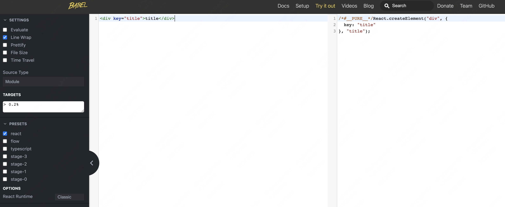
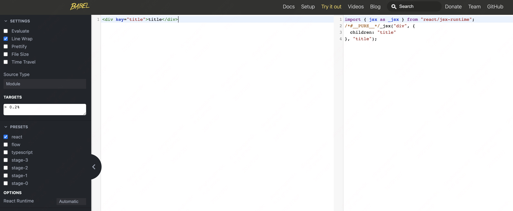

# ReactElement对象

# JSX 装换

JSX是一种语法糖，全称 JavaScript XML，是 React 定义的一种类似于 XML 的 JS 扩展语法。JSX 代码是无法在浏览器中直接使用的，需要依靠 Babel 或者 TypeScript **将 JSX 代码转换为 JavaScript**。

```jsx
<div key="title">title</div>
```

在 [Babel REPL](https://babeljs.io/repl)  可以去看下上面这段 JSX 代码进行编译后输出的是啥，选定预设 [@babel/preset-react](https://babeljs.io/docs/en/babel-preset-react/) 并将配置项 runtime 设置为 classic。



可以看到经 Babel 编译后，上面的 JSX 代码变成了下面这段 JavaScript 代码：

```jsx
React.createElement("div", {key: "title"}, "title")
```

那如果将预设 [@babel/preset-react](https://babeljs.io/docs/en/babel-preset-react/) 的配置项 runtime 设置为 automatic 呢？



可以看到经 Babel 编译后，上面的 JSX 代码变成了下面这段 JavaScript 代码：

```jsx
import { jsx as _jsx } from "react/jsx-runtime";
_jsx("div", {children: "title"}, "title");
```

而之所以会有这两种输出，是因为在 React 17 之后，React 官方与 Babel 进行了合作，对 JSX 进行了新的转换， 在 React 17 之后如果只是使用 JSX 而不使用 React 提供的其他 api，在源代码中则可以不引入 React，更多有关于 JSX 转换的内容可移步 React 官网：[介绍全新的 JSX 转换](https://zh-hans.reactjs.org/blog/2020/09/22/introducing-the-new-jsx-transform.html) 。

# React.createElement

> 后面代码分析针对 React17.0.2 版本。
> 

虽然在 React 17 之后，只是使用 JSX 语法是可以不用在源代码引入 React，但在实际场景中以及很多开源包中使用`React.createElement`手动创建元素的场景并不少见，学习下 [React.createElemt 源码](https://github.com/facebook/react/blob/17.0.2/packages/react/src/ReactElement.js) 还是有必要的。

`React.createElement`定义在`ReactElement.js`文件中（[见源码](https://github.com/facebook/react/blob/12adaffef7105e2714f82651ea51936c563fe15c/packages/react/src/ReactElement.js#L348)）。

```jsx
export function createElement(type, config, children) {
  let propName;

  // Reserved names are extracted
  const props = {};

  let key = null;
  let ref = null;
  let self = null;
  let source = null;

  if (config != null) {
    if (hasValidRef(config)) {
      ref = config.ref;

      if (__DEV__) {
        warnIfStringRefCannotBeAutoConverted(config);
      }
    }
    if (hasValidKey(config)) {
      key = '' + config.key;
    }

    self = config.__self === undefined ? null : config.__self;
    source = config.__source === undefined ? null : config.__source;
    // Remaining properties are added to a new props object
    for (propName in config) {
      if (
        hasOwnProperty.call(config, propName) &&
        !RESERVED_PROPS.hasOwnProperty(propName)
      ) {
        props[propName] = config[propName];
      }
    }
  }

  // Children can be more than one argument, and those are transferred onto
  // the newly allocated props object.
  const childrenLength = arguments.length - 2;
  if (childrenLength === 1) {
    props.children = children;
  } else if (childrenLength > 1) {
    const childArray = Array(childrenLength);
    for (let i = 0; i < childrenLength; i++) {
      childArray[i] = arguments[i + 2];
    }
    if (__DEV__) {
      if (Object.freeze) {
        Object.freeze(childArray);
      }
    }
    props.children = childArray;
  }

  // Resolve default props
  if (type && type.defaultProps) {
    const defaultProps = type.defaultProps;
    for (propName in defaultProps) {
      if (props[propName] === undefined) {
        props[propName] = defaultProps[propName];
      }
    }
  }
  if (__DEV__) {
    if (key || ref) {
      const displayName =
        typeof type === 'function'
          ? type.displayName || type.name || 'Unknown'
          : type;
      if (key) {
        defineKeyPropWarningGetter(props, displayName);
      }
      if (ref) {
        defineRefPropWarningGetter(props, displayName);
      }
    }
  }
  return ReactElement(
    type,
    key,
    ref,
    self,
    source,
    ReactCurrentOwner.current,
    props,
  );
}
```

忽略掉开发环境的配置，大致可以分成四个部分：

1. 处理元素的 props
    
    ```jsx
    let propName;
    
      // Reserved names are extracted
      const props = {};
    
      let key = null;
      let ref = null;
      let self = null;
      let source = null;
    
      // 如果元素上有配置属性，则对配置属性进行提取处理，内置的保留属性会从props中被剔除
      if (config != null) {
        //如果存在有效的ref值（config.ref !== undefined），赋值给上面的 ref
        if (hasValidRef(config)) {
          ref = config.ref;
    			// 开发环境相关，忽略
          if (__DEV__) {
            warnIfStringRefCannotBeAutoConverted(config);
          }
        }
    		// 如果存在有效的key值（config.key !== undefined）,对key转字符串处理
        if (hasValidKey(config)) {
          key = '' + config.key;
        }
    
    		// self 和 source 是开发环境下对代码在编译器中位置等信息进行记录，用于开发环境下调试
        // 更多关于这俩的作用，可参考该 [issue](https://github.com/alangpierce/sucrase/issues/232)
        self = config.__self === undefined ? null : config.__self;
        source = config.__source === undefined ? null : config.__source;
        // Remaining properties are added to a new props object
        // 除去内置的属性将会被添加到props，内置的属性RESERVED_PROPS包含key、ref、__self和__source
        for (propName in config) {
          if (
            hasOwnProperty.call(config, propName) &&
            !RESERVED_PROPS.hasOwnProperty(propName)
          ) {
            props[propName] = config[propName];
          }
        }
      }
    ```
    
    从上面这段代码也不难看出，如果一个父组件给子组件传递了 key 值，在子组件中是没办法通过 props.key 来取到值的，因为在处理 props 的时候，key 是内置保留属性，在 props 中被剔除掉了
    
    ```jsx
    const Child = (props) => {
        console.log(props.key); // undefined
        return <div>child</div>;
    };
    
    const Parent = () => {
        return (
            <div>
                <Child key="key value" />
            </div>
        );
    };
    ```
    
2. 将子节点添加到 props 的 children 属性上
    
    ```jsx
      // Children can be more than one argument, and those are transferred onto
      // the newly allocated props object.
      // arguments 前两个分别为 type 和 config，后面的均为 children
      const childrenLength = arguments.length - 2;
      // 如果子节点长度为1，则表明只有一个子节点，直接将其赋值给 props.children
      if (childrenLength === 1) {
        props.children = children;
      // 如果子节点的长度大于1，则将子节点 push 到一个数组中，最后将这个数组赋值给 props.children
      } else if (childrenLength > 1) {
        const childArray = Array(childrenLength);
        for (let i = 0; i < childrenLength; i++) {
          childArray[i] = arguments[i + 2];
        }
        // 开发环境相关，忽略
        if (__DEV__) {
          if (Object.freeze) {
            Object.freeze(childArray);
          }
        }
        props.children = childArray;
      }
    ```
    
3. 处理 defaultProps，如果存在 defaultProps，则给 props 对应的属性赋一个默认值
    
    ```jsx
    // Resolve default props
      if (type && type.defaultProps) {
        const defaultProps = type.defaultProps;
        for (propName in defaultProps) {
          if (props[propName] === undefined) {
            props[propName] = defaultProps[propName];
          }
        }
      }
    ```
    
    无论是函数组件还是 class 组件都是支持 defaultProps，只是在函数组件中使用 defaultProps 给组件添加默认 props 不常用
    
    ```jsx
    // 函数组件
    const Child = (props) => {
        console.log(props.id); // 100
        return <div>child</div>;
    };
    
    Child.defaultProps = {
        id: "100",
    };
    
    // 类组件
    class Child1 extends Component {
        static defaultProps = {
            id: "100",
        };
    
        render() {
            const { id } = this.props;
            console.log(id); // 100
            return <div>child</div>;
        }
    }
    ```
    
4. 最后一段好说，就是将相应参数传递给 ReactElement 方法，并返回
    
    ```jsx
    // 开发环境相关，可忽略 
    if (__DEV__) {
        if (key || ref) {
          const displayName =
            typeof type === 'function'
              ? type.displayName || type.name || 'Unknown'
              : type;
          if (key) {
            defineKeyPropWarningGetter(props, displayName);
          }
          if (ref) {
            defineRefPropWarningGetter(props, displayName);
          }
        }
      }
      return ReactElement(
        type,
        key,
        ref,
        self,
        source,
        ReactCurrentOwner.current,
        props,
      );
    ```
    

# ReactElement()

从上面 React.createElement() 代码可以看到最后收尾在 ReactElement() 上，这里调用的 ReactElement() 也是定义在`ReactElement.js`文件中（[见源码](https://github.com/facebook/react/blob/12adaffef7105e2714f82651ea51936c563fe15c/packages/react/src/ReactElement.js#L146)），忽略开发环境相关代码的话，ReactElement() 的代码很简单，其实就是返回了一个 JS 对象，这个 JS 对象也就是我们经常听到的虚拟 DOM，也可以将该对象称为 ReactElement 对象，其标志特征就是有一个 $$typeof 属性，其值为 REACT_ELEMENT_TYPE。

```jsx
const ReactElement = function(type, key, ref, self, source, owner, props) {
  const element = {
    // This tag allows us to uniquely identify this as a React Element
    $$typeof: REACT_ELEMENT_TYPE,

    // Built-in properties that belong on the element
    type: type,
    key: key,
    ref: ref,
    props: props,

    // Record the component responsible for creating this element.
    _owner: owner,
  };

  if (__DEV__) {
    // The validation flag is currently mutative. We put it on
    // an external backing store so that we can freeze the whole object.
    // This can be replaced with a WeakMap once they are implemented in
    // commonly used development environments.
    element._store = {};

    // To make comparing ReactElements easier for testing purposes, we make
    // the validation flag non-enumerable (where possible, which should
    // include every environment we run tests in), so the test framework
    // ignores it.
    Object.defineProperty(element._store, 'validated', {
      configurable: false,
      enumerable: false,
      writable: true,
      value: false,
    });
    // self and source are DEV only properties.
    Object.defineProperty(element, '_self', {
      configurable: false,
      enumerable: false,
      writable: false,
      value: self,
    });
    // Two elements created in two different places should be considered
    // equal for testing purposes and therefore we hide it from enumeration.
    Object.defineProperty(element, '_source', {
      configurable: false,
      enumerable: false,
      writable: false,
      value: source,
    });
    if (Object.freeze) {
      Object.freeze(element.props);
      Object.freeze(element);
    }
  }

  return element;
};
```

这个 REACT_ELEMENT_TYPE 定义位置在 `ReactSymbols.js`文件中（[见源码](https://github.com/facebook/react/blob/17.0.2/packages/shared/ReactSymbols.js)），就是一个常量值，如果浏览器支持 Symbol 这种数据类型，则优先用 Symbol 表示。

```
export let REACT_ELEMENT_TYPE = 0xeac7;
export let REACT_PORTAL_TYPE = 0xeaca;
// 省略...

if (typeof Symbol === 'function' && Symbol.for) {
  const symbolFor = Symbol.for;
  REACT_ELEMENT_TYPE = symbolFor('react.element');
  REACT_PORTAL_TYPE = symbolFor('react.portal');
  // 省略...
}
```

上面代码除了定义 REACT_ELEMENT_TYPE 常量外，还定义有其他常量，比如 REACT_PORTAL_TYPE，调用 createPortal() 返回的 JS 对象的 $$typeof 值就是 REACT_PORTAL_TYPE。

```jsx
// 文件路径 [react/packages/react-reconciler/src/ReactPortal.js](https://github.com/facebook/react/blob/17.0.2/packages/react-reconciler/src/ReactPortal.js)
export function createPortal(
  children: ReactNodeList,
  containerInfo: any,
  // TODO: figure out the API for cross-renderer implementation.
  implementation: any,
  key: ?string = null,
): ReactPortal {
  return {
    // This tag allow us to uniquely identify this as a React Portal
    $$typeof: REACT_PORTAL_TYPE,
    key: key == null ? null : '' + key,
    children,
    containerInfo,
    implementation,
  };
}
```

# _jsx()

再看下 React 17 之后这个新的 JSX 转换，引用自 [react/jsx-runtime.js](https://github.com/facebook/react/blob/17.0.2/packages/react/jsx-runtime.js) 文件，只是该方法仅由编译器引入，禁止在开发项目代码时自己手动引入，这个 _jsx() 方法最后是定义在 `ReactJSXElement.js`文件中（[见源码](https://github.com/facebook/react/blob/12adaffef7105e2714f82651ea51936c563fe15c/packages/react/src/jsx/ReactJSXElement.js#L209)）。

```jsx
// 同文件中还定义有 jsxDEV() 方法，供开发环境使用，和下面的jsx方法差不多
export function jsx(type, config, maybeKey) {
  let propName;

  // Reserved names are extracted
  const props = {};

  let key = null;
  let ref = null;

  // Currently, key can be spread in as a prop. This causes a potential
  // issue if key is also explicitly declared (ie. <div {...props} key="Hi" />
  // or <div key="Hi" {...props} /> ). We want to deprecate key spread,
  // but as an intermediary step, we will use jsxDEV for everything except
  // <div {...props} key="Hi" />, because we aren't currently able to tell if
  // key is explicitly declared to be undefined or not.
  if (maybeKey !== undefined) {
    key = '' + maybeKey;
  }

  if (hasValidKey(config)) {
    key = '' + config.key;
  }

  if (hasValidRef(config)) {
    ref = config.ref;
  }

  // Remaining properties are added to a new props object
  for (propName in config) {
    if (
      hasOwnProperty.call(config, propName) &&
      !RESERVED_PROPS.hasOwnProperty(propName)
    ) {
      props[propName] = config[propName];
    }
  }

  // Resolve default props
  if (type && type.defaultProps) {
    const defaultProps = type.defaultProps;
    for (propName in defaultProps) {
      if (props[propName] === undefined) {
        props[propName] = defaultProps[propName];
      }
    }
  }

  return ReactElement(
    type,
    key,
    ref,
    undefined,
    undefined,
    ReactCurrentOwner.current,
    props,
  );
}
```

其实仔细看下上面这个 jsx() 方法和 React.createElement() 的作用差不多，都是对调用 ReactElement() 方法的入参做一些预处理，都是调用 ReactElement() 方法然后返回一个 JS 对象，即 ReactElement 对象。

而且这里 jsx() 里面调用的 ReactElement() 方法虽然是定义在文件`ReactJSXElement.js`文件（[见源码](https://github.com/facebook/react/blob/12adaffef7105e2714f82651ea51936c563fe15c/packages/react/src/jsx/ReactJSXElement.js#L147)）中的，但是和 React.createElement() 里面调用的 ReactElement() 方法（定义在`ReactElement.js`文件（[见源码](https://github.com/facebook/react/blob/12adaffef7105e2714f82651ea51936c563fe15c/packages/react/src/ReactElement.js#L146)））内容是一模一样的，也就不再分析了。