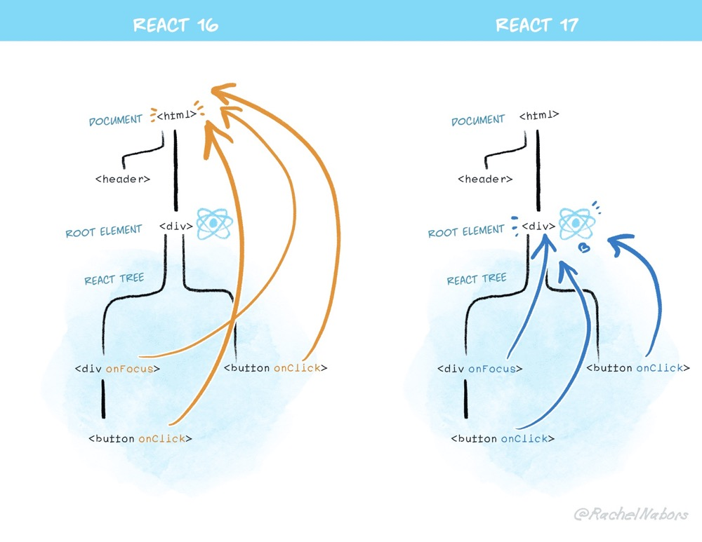
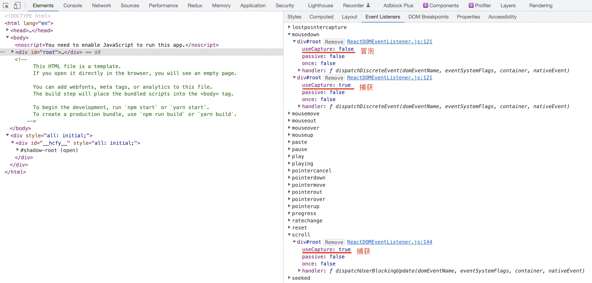
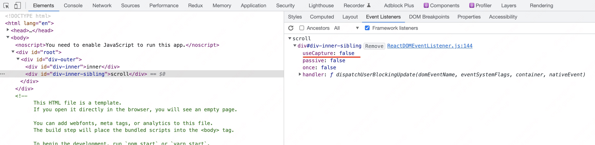

# React事件系统

从`v17.0.0`开始，React 不会再将事件处理添加到 `document`上，而是将事件处理添加到渲染 React 树的根 DOM 容器中，本文分析基于`v17.0.2` 版本。



思考下面这段代码在点击`div#inner`时，控制台的输出顺序是咋样的？React 是怎样将合成事件和原生事件联系起来的？

```jsx
const App = () => {
    return (
        <div
            id="outer"
            onMouseDown={() => {
                console.log("outer bubble");
            }}
            onMouseDownCapture={() => {
                console.log("outer capture");
            }}
        >
            <div
                id="inner"
                onMouseDown={() => {
                    console.log("inner bubble");
                }}
                onMouseDownCapture={() => {
                    console.log("inner capture");
                }}
            >
                inner
            </div>
            <div
                id="inner-sibling"
                onScroll={() => {
                    console.log("inner sibling scroll");
                }}
            >
                scroll
            </div>
        </div>
    );
};

ReactDOM.render(<App />, document.querySelector("#root"));
```

为什么在`div#root`上有那么多监听的事件，这些监听事件注册有捕获有冒泡比如 click、mousedown，而有的又只要捕获比如 scroll、load，那 scroll 冒泡的事件监听又注册在哪儿？



为什么`div#inner-sibling`上会有监听 scroll 冒泡事件？



# allNativeEvents

allNativeEvents 初始为空（是一个 Set 数据类型以保证不重复注册），在 React 应用启动的时候（ ReactDOM.render 的时候）通过插件机制在 `DOMPluginEventSystem.js`（[见源码](https://github.com/facebook/react/blob/v17.0.2/packages/react-dom/src/events/DOMPluginEventSystem.js#L89-L93)）中完成了填充（给不同事件名称登记不同的优先级，原生事件名称和合成事件名称映射都是在这里面完成的），allNativeEvents 包括了大量的原生事件名称。

```jsx
SimpleEventPlugin.registerEvents();
// 后面几个其实都是直接调用的registerTwoPhaseEvent
EnterLeaveEventPlugin.registerEvents();
ChangeEventPlugin.registerEvents();
SelectEventPlugin.registerEvents();
BeforeInputEventPlugin.registerEvents();
```

虽然上面几个插件都是调用的 registerEvents，但具体到里面有点儿不一样

- SimpleEventPlugin：`SimpleEventPlugin.registerEvents` ⇒ `registerSimpleEvents` ⇒ `registerSimplePluginEventsAndSetTheirPriorities` ⇒ `registerTwoPhaseEvent([见源码](https://github.com/facebook/react/blob/v17.0.2/packages/react-dom/src/events/EventRegistry.js#L35))` ⇒ `registerDirectEvent`；
- EnterLeaveEventPlugin：`EnterLeaveEventPlugin.registerEvents` ⇒ `registerDirectEvent`；
- ChangeEventPlugin、SelectEventPlugin 以及 BeforeInputEventPlugin 同 EnterLeaveEventPlugin；

可以看到最终都是落到了 `registerDirectEvent` 上面，而正是在 registerDirectEvent（[见源码](https://github.com/facebook/react/blob/v17.0.2/packages/react-dom/src/events/EventRegistry.js#L43)） 完成了 allNativeEvents 的填充。

```jsx
// ... 省略部分代码
export function registerDirectEvent(
  registrationName: string,
  dependencies: Array<DOMEventName>,
) {
  registrationNameDependencies[registrationName] = dependencies;

  for (let i = 0; i < dependencies.length; i++) {
    allNativeEvents.add(dependencies[i]);
  }
}
```

在通过调用SimpleEventPlugin、EnterLeaveEventPlugin等插件注册完事件后有 allNativeEvents、registrationNameDependencies、eventPriorities 以及topLevelEventsToReactNames 内容如下



## SimpleEventPlugin

虽然通过插件系统最终都调用了 registerDirectEvent 去做了 allNativeEvents 的填充，但在这儿分析下 SimpleEventPlugin，其中途还做了给不同事件名称登记不同的优先级，原生事件名称和合成事件名称映射等工作；

SimpleEventPlugin 调用 registerEvents 实际是调用了 registerSimpleEvents 方法

```jsx
export function registerSimpleEvents() {
  registerSimplePluginEventsAndSetTheirPriorities(
    discreteEventPairsForSimpleEventPlugin,
    DiscreteEvent,
  );
  registerSimplePluginEventsAndSetTheirPriorities(
    userBlockingPairsForSimpleEventPlugin,
    UserBlockingEvent,
  );
  registerSimplePluginEventsAndSetTheirPriorities(
    continuousPairsForSimpleEventPlugin,
    ContinuousEvent,
  );
  // otherDiscreteEvents包含change、selectionchange以及textInput等6个事件名称
  setEventPriorities(otherDiscreteEvents, DiscreteEvent);
}
```

先说下两个前置信息：

- 在 react 里面事件优先级有三种：`DiscreteEvent`、`UserBlockingEvent` 和 `ContinuousEvent`（[见源码](https://github.com/facebook/react/blob/v17.0.2/packages/shared/ReactTypes.js#L91-L93)）；
- discreteEventPairsForSimpleEventPlugin（[见源码](https://github.com/facebook/react/blob/v17.0.2/packages/react-dom/src/events/DOMEventProperties.js#L45-L80)）、userBlockingPairsForSimpleEventPlugin（[见源码](https://github.com/facebook/react/blob/v17.0.2/packages/react-dom/src/events/DOMEventProperties.js#L100-L116)） 和 continuousPairsForSimpleEventPlugin （[见源码](https://github.com/facebook/react/blob/v17.0.2/packages/react-dom/src/events/DOMEventProperties.js#L119-L145)）对应不同的分类，以方便后面给不同的事件名称登记不同的优先级；
    
    ```jsx
    const discreteEventPairsForSimpleEventPlugin = [
      ('cancel': DOMEventName), 'cancel',
      ('click': DOMEventName), 'click',
      ('mousedown': DOMEventName), 'mouseDown',
      // ...省略部分事件名称
    ];
    
    const userBlockingPairsForSimpleEventPlugin: Array<string | DOMEventName> = [
      ('scroll': DOMEventName), 'scroll',
      ('toggle': DOMEventName), 'toggle',
      // ...省略部分事件名称
    ];
    
    const continuousPairsForSimpleEventPlugin: Array<string | DOMEventName> = [
      ('ended': DOMEventName), 'ended',
      ('load': DOMEventName), 'load',
        // ...省略部分事件名称
    ];
    ```
    

然后看上面 registerSimpleEvents 代码，调用的 setEventPriorities（[见源码](https://github.com/facebook/react/blob/v17.0.2/packages/react-dom/src/events/DOMEventProperties.js#L180)） 方法好说就是给放在 otherDiscreteEvents 分类里面的事件名称登记 DiscreteEvent 优先级，主要看下 registerSimplePluginEventsAndSetTheirPriorities 方法（[见源码](https://github.com/facebook/react/blob/v17.0.2/packages/react-dom/src/events/DOMEventProperties.js#L159)）。

```
// 省略部分注释，flow代码
function registerSimplePluginEventsAndSetTheirPriorities(
  eventTypes: Array<DOMEventName | string>, // 比如 discreteEventPairsForSimpleEventPlugin
  priority: EventPriority, // 比如 DiscreteEvent
): void {
  for (let i = 0; i < eventTypes.length; i += 2) {
    const topEvent = eventTypes[i]; // 比如 mousedown
    const event = eventTypes[i + 1]; // 比如 mouseDown
    const capitalizedEvent = event[0].toUpperCase() + event.slice(1); // 比如 MouseDown
    const reactName = 'on' + capitalizedEvent; // 比如 onMouseDown
    // 给原生事件登记优先级标记
    eventPriorities.set(topEvent, priority);
    // 对原生事件名称与合成事件名称做映射
    topLevelEventsToReactNames.set(topEvent, reactName);
    // 去填充 allNativeEvents
    registerTwoPhaseEvent(reactName, [topEvent]);
  }
}
```

可以看到里面有对事件名称登记优先级，对原生事件名称与合成事件名称做映射，调用 registerTwoPhaseEvent 填充 allNativeEvents。

# 事件绑定

## listenToAllSupportedEvents

在 React 代码初次挂载启动的时候，在初始化配置创建根fiber 即 HostRootFiber、根fiberNode 即 FiberRootNode 的时候会调用 createRootImpl（[见源码](https://github.com/facebook/react/blob/v17.0.2/packages/react-dom/src/client/ReactDOMRoot.js#L120)。

createRootImpl 调用栈：`ReactDOM.ender` ⇒ `legacyRenderSubtreeIntoContainer` ⇒ `legacyCreateRootFromDOMContainer` ⇒ `createLegacyRoot` ⇒ `new ReactDOMBlockingRoot` ⇒ `createRootImpl`）。

```jsx
function createRootImpl(
  container: Container,
  tag: RootTag,
  options: void | RootOptions,
) {
  // ... 省略无关代码
  // const root = createContainer(container, tag, hydrate, hydrationCallbacks);
  // markContainerAsRoot(root.current, container);
  const containerNodeType = container.nodeType;

  if (enableEagerRootListeners) { // enableEagerRootListeners为const常量true
    const rootContainerElement =
      container.nodeType === COMMENT_NODE ? container.parentNode : container;
    listenToAllSupportedEvents(rootContainerElement);
  } 
  // ... 省略无关代码
  return root;
}
```

在 createRootImpl 里面完成根fiber和根fiberNode后，即会调用 listenToAllSupportedEvents（[见源码](https://github.com/facebook/react/blob/v17.0.2/packages/react-dom/src/events/DOMPluginEventSystem.js#L322)） 函数，在该函数里面实际上完成了往 `div#root`上的注册事件监听。

```jsx
// 省略部分无关代码
export function listenToAllSupportedEvents(rootContainerElement: EventTarget) {
  if (enableEagerRootListeners) {
    // 1. 节流优化, 保证全局注册只被调用一次
    if (rootContainerElement[listeningMarker]) {
      return;
    }
    rootContainerElement[listeningMarker] = true;
    // 2. 遍历allNativeEvents 监听冒泡和捕获阶段的事件
    allNativeEvents.forEach(domEventName => {
      // 不能委托的事件、不能在浏览器里面冒泡的事件先排除掉往div#root上注册
      if (!nonDelegatedEvents.has(domEventName)) {
        listenToNativeEvent(
          domEventName,
          false, // 冒泡阶段监听
          rootContainerElement,
          null,
        );
      }
      listenToNativeEvent(
        domEventName,
        true, // 捕获阶段监听
        rootContainerElement,
        null,
      );
    });
  }
}
```

listenToAllSupportedEvents 的核心逻辑：

1. 节流优化, 保证全局注册只被调用一次；
2. 遍历`allNativeEvents`，调用 listenToNativeEvent 监听冒泡和捕获阶段的事件；

注意 nonDelegatedEvents 里面的事件不会往`div#root` 注册冒泡事件监听，nonDelegatedEvents 里面的事件都是不能委托的以及不能在浏览器里面冒泡的事件（所以上图在`div#root`上比如 close、scroll 事件只注册有捕获监听）。

```jsx
// 省略部分代码
export const nonDelegatedEvents = new Set([
  'cancel',
  'close',
  'invalid',
  'load',
  'scroll',
  'toggle',
  ...mediaEventTypes,
]);

export const mediaEventTypes = [
  'pause',
  'play',
  'playing',
  'progress',
  'ratechange',
  'seeked',
  'seeking',
  // ... 省略部分媒体事件名称
];
```

### listenToNativeEvent

源码文件：DOMPluginEventSystem.js（[见源码](https://github.com/facebook/react/blob/v17.0.2/packages/react-dom/src/events/DOMPluginEventSystem.js#L351)）；

调用栈：`createRootImpl` ⇒ `listenToAllSupportedEvents` ⇒ `listenToNativeEvent` ；

listenToNativeEvent 主要作用就是做一些开关控制以保证给DOM元素注册的事件监听只注册一次，而后调用 addTrappedEventListener 注册事件监听。

```jsx
// ... 省略无关代码
export function listenToNativeEvent(
  domEventName: DOMEventName,
  isCapturePhaseListener: boolean,
  rootContainerElement: EventTarget,
  targetElement: Element | null,
  eventSystemFlags?: EventSystemFlags = 0,
): void {
  let target = rootContainerElement;
  // 如果是selectionchange，target是document，换句话说selectionchange注册冒泡和捕获是往document上注册而不是div#root
	if (
	    domEventName === 'selectionchange' &&
	    rootContainerElement.nodeType !== DOCUMENT_NODE
	  ) {
	    target = rootContainerElement.ownerDocument;
	  }
  // 在DOM元素上储存一个Set类型用来标识当前元素监听了那些事件
  const listenerSet = getEventListenerSet(target);
  // listenerSetKey就是添加了是捕获还是冒泡标记的一个字符串，比如click__capture、click__bubble
  const listenerSetKey = getListenerSetKey(
    domEventName,
    isCapturePhaseListener,
  );
  // 利用set数据结构, 保证相同的事件类型只会被注册一次.
  if (!listenerSet.has(listenerSetKey)) {
    if (isCapturePhaseListener) {
      // eventSystemFlags 添加捕获标记，初始为0
      eventSystemFlags |= IS_CAPTURE_PHASE;
    }
    // 注册事件监听
    addTrappedEventListener(
      target,
      domEventName,
      eventSystemFlags,
      isCapturePhaseListener,
    );
    // 添加到Set
    listenerSet.add(listenerSetKey);
  }
}
```

### addTrappedEventListener

源码文件：DOMPluginEventSystem.js（[见源码](https://github.com/facebook/react/blob/v17.0.2/packages/react-dom/src/events/DOMPluginEventSystem.js#L468)）；

调用栈：`createRootImpl` ⇒ `listenToAllSupportedEvents` ⇒ `listenToNativeEvent`  ⇒ `addTrappedEventListener`；

在 addTrappedEventListener 里面构造好 listener 往 DOM 元素上（这儿是`div#root`）注册监听或者捕获事件。

```jsx
// ... 省略无关代码
function addTrappedEventListener(
  targetContainer: EventTarget,
  domEventName: DOMEventName,
  eventSystemFlags: EventSystemFlags,
  isCapturePhaseListener: boolean,
  isDeferredListenerForLegacyFBSupport?: boolean,
) {
  // 1. 构造listener
  let listener = createEventListenerWrapperWithPriority(
    targetContainer,
    domEventName,
    eventSystemFlags,
  );
  let unsubscribeListener;
  // 2. 注册事件监听
  if (isCapturePhaseListener) {
    unsubscribeListener = addEventCaptureListener(
      targetContainer,
      domEventName,
      listener,
    );
  } else {
    unsubscribeListener = addEventBubbleListener(
      targetContainer,
      domEventName,
      listener,
    );
  }
}

// 注册原生事件 冒泡
export function addEventBubbleListener(
  target: EventTarget,
  eventType: string,
  listener: Function,
): Function {
  target.addEventListener(eventType, listener, false);
  return listener;
}

// 注册原生事件 捕获
export function addEventCaptureListener(
  target: EventTarget,
  eventType: string,
  listener: Function,
): Function {
  target.addEventListener(eventType, listener, true);
  return listener;
}
```

从`listenToAllSupportedEvents`开始，沿调用链路`createRootImpl` ⇒ `listenToAllSupportedEvents` ⇒ `listenToNativeEvent`  ⇒ `addTrappedEventListener` ⇒ `addEventBubbleListener`/`addEventCaptureListener` 往`div#root` 上注册了事件监听。

### createEventListenerWrapperWithPriority

源码文件：ReactDOMEventListener.js（[见源码](https://github.com/facebook/react/blob/v17.0.2/packages/react-dom/src/events/ReactDOMEventListener.js#L94)）；

调用栈：`createRootImpl` ⇒ `listenToAllSupportedEvents` ⇒ `listenToNativeEvent`  ⇒ `addTrappedEventListener` ⇒ `createEventListenerWrapperWithPriority`；

在给DOM元素注册事件监听的时候，从上面代码可以发现，最后这个监听 listener 是通过 createEventListenerWrapperWithPriority 构造出来的。

```jsx
export function createEventListenerWrapperWithPriority(
  targetContainer: EventTarget,
  domEventName: DOMEventName,
  eventSystemFlags: EventSystemFlags,
): Function {
  // 从填充的eventPriorities里面拿到事件的优先级
  const eventPriority = getEventPriorityForPluginSystem(domEventName);
  // 根据优先级设置 listenerWrapper
  let listenerWrapper;
  switch (eventPriority) {
    case DiscreteEvent:
      listenerWrapper = dispatchDiscreteEvent;
      break;
    case UserBlockingEvent:
      listenerWrapper = dispatchUserBlockingUpdate;
      break;
    case ContinuousEvent:
    default:
      listenerWrapper = dispatchEvent;
      break;
  }
  // 2. 返回 listenerWrapper
  return listenerWrapper.bind(
    null,
    domEventName,
    eventSystemFlags,
    targetContainer,
  );
}
```

不同的`domEventName`调用`getEventPriorityForPluginSystem`后返回不同的优先级，然后不同的优先级对应不同的`listener`：

- `DiscreteEvent`：优先级最高，包括`click`、`mousedown`等事件，对应的`listener`是 [dispatchDiscreteEvent](https://github.com/facebook/react/blob/v17.0.2/packages/react-dom/src/events/ReactDOMEventListener.js#L121-L142)；
- `UserBlockingEvent`：优先级适中，包括`drag, scroll`等事件，对应的`listener`是[dispatchUserBlockingUpdate](https://github.com/facebook/react/blob/v17.0.2/packages/react-dom/src/events/ReactDOMEventListener.js#L144-L180)；
- `ContinuousEvent`：优先级最低，包括`animation, load`等事件，对应的`listener`是[dispatchEvent](https://github.com/facebook/react/blob/v17.0.2/packages/react-dom/src/events/ReactDOMEventListener.js#L182-L271)；

而这 3 种`listener`实际上都是对 dispatchEvent（[见源码](https://github.com/facebook/react/blob/v17.0.2/packages/react-dom/src/events/ReactDOMEventListener.js#L182)） 的包装，到后面触发的时候再分析 dispatchEvent：

```jsx
export function dispatchEvent(
  domEventName: DOMEventName,
  eventSystemFlags: EventSystemFlags,
  targetContainer: EventTarget,
  nativeEvent: AnyNativeEvent,
): void {
  // ... 省略部分代码

  const blockedOn = attemptToDispatchEvent(
    domEventName,
    eventSystemFlags,
    targetContainer,
    nativeEvent,
  );

  // ... 省略部分代码

  // This is not replayable so we'll invoke it but without a target,
  // in case the event system needs to trace it.
  dispatchEventForPluginEventSystem(
    domEventName,
    eventSystemFlags,
    nativeEvent,
    null,
    targetContainer,
  );
}
```

整个 listenToAllSupportedEvents 调用完成后，allNativeEvents 里面的事件有的在`div#root` 既注册了冒泡事件监听又注册了捕获事件监听（比如click、mousedown），有的只在`div#root`注册了捕获事件监听（比如scroll），而产生这个的原因，就是在 nonDelegatedEvents（[见源码](https://github.com/facebook/react/blob/v17.0.2/packages/react-dom/src/events/DOMPluginEventSystem.js#L208)） 的事件没办法冒泡（比如scroll）或者没办法委托给`div#root`，只能委托注册捕获监听。

> allNativeEvents 的 size 是 80，而使用 getEventListeners 获取`div#root`上的事件监听是 79 组，少了一个 selectionchange，因为 selectionchange 是往`document`上注册的（上面分析listenToNativeEvent有在注释里面解释过）。
> 

那像比如 scroll 的冒泡监听又是监听在哪儿的呢，什么时候绑定的呢？

## nonDelegatedEvents 冒泡监听注册

先说结论：nonDelegatedEvents 里面的这些事件（比如 scroll）注册冒泡事件监听是直接注册到自身元素上面的（比如上面示例代码的 scroll 是注册在`div#inner-sibling` 真实DOM节点上的），完成这类冒泡事件到自身元素的注册是在构建fiber树的工作循环 workLoopSync 中执行 fiber 工作单元的completeUnitOfWork 阶段，再具体点儿是更里面的 setInitialProperties 阶段。

setInitialProperties 源码文件：ReactDOMComponent.js（[见源码](https://github.com/facebook/react/blob/v17.0.2/packages/react-dom/src/client/ReactDOMComponent.js#L517)）；

setInitialProperties 调用栈：`performSyncWorkOnRoot` ⇒ `renderRootSync` ⇒ `workLoopSync` ⇒ `performUnitOfWork` ⇒ `completeUnitOfWork` ⇒ `completeWork` ⇒ `finalizeInitialChildren` ⇒ `finalizeInitialChildren` ⇒ `setInitialProperties`

fiber 树的构建过程这儿就不展开了，可前往 [React Hooks初次挂载](https://www.notion.so/React-Hooks-368b5e5d3e4347949cd453eb7958a1ba) 了解查看，这儿分析下 completeUnitOfWork 中的 completedWork 变量为`div#inner-silbling` 对应的 fiber 节点的时候：

```jsx
function completeUnitOfWork(unitOfWork: Fiber): void {
    let completedWork = unitOfWork;
    do {
        // 此时completedWork为div#inner-silbling对应的fiber节点
        const current = completedWork.alternate;
        const returnFiber = completedWork.return;
        
        if ((completedWork.flags & Incomplete) === NoFlags) {
            // 省略setCurrentDebugFiberInDEV代码
            let next;
            if (
                !enableProfilerTimer ||
                (completedWork.mode & ProfileMode) === NoMode
            ) {
                next = completeWork(current, completedWork, subtreeRenderLanes);
            } else {
                // 省略startProfilerTimer代码
                next = completeWork(current, completedWork, subtreeRenderLanes);
                // 省略stopProfilerTimerIfRunningAndRecordDelta代码
            }
            // ... 省略部分代码
        } else {
            // ... 省略部分代码
        }

        const siblingFiber = completedWork.sibling;
        if (siblingFiber !== null) {
            // If there is more work to do in this returnFiber, do that next.
            workInProgress = siblingFiber;
            return;
        }
        // Otherwise, return to the parent
        completedWork = returnFiber;
        // Update the next thing we're working on in case something throws.
        workInProgress = completedWork;
    } while (completedWork !== null);
    // ... 省略部分代码
}

// --------------------------------------------------------------------------

function completeWork(
    current: Fiber | null,
    workInProgress: Fiber,
    renderLanes: Lanes,
): Fiber | null {
    const newProps = workInProgress.pendingProps;

    switch (workInProgress.tag) {
        // ... 省略部分代码
        case HostComponent: {
            popHostContext(workInProgress);
            const rootContainerInstance = getRootHostContainer();
            const type = workInProgress.type;
            if (current !== null && workInProgress.stateNode != null) {
                // ... 省略部分代码
            } else {
                // ... 省略部分代码
                if (wasHydrated) {
                    // ... 省略部分代码
                } else {
                    // 创建DOM实例
                    const instance = createInstance(
                        type,
                        newProps,
                        rootContainerInstance,
                        currentHostContext,
                        workInProgress,
                    );
                    
                    appendAllChildren(instance, workInProgress, false, false);
                    // 将fiber的stateNode指向DOM实例
                    workInProgress.stateNode = instance;

                    // Certain renderers require commit-time effects for initial mount.
                    // (eg DOM renderer supports auto-focus for certain elements).
                    // Make sure such renderers get scheduled for later work.
                    if (
                        finalizeInitialChildren(
                            instance,
                            type,
                            newProps,
                            rootContainerInstance,
                            currentHostContext,
                        )
                    ) {
                        markUpdate(workInProgress);
                    }
                }

                if (workInProgress.ref !== null) {
                    // If there is a ref on a host node we need to schedule a callback
                    markRef(workInProgress);
                }
            }
            return null;
        }
        // ... 省略部分代码
    }
}

// --------------------------------------------------------------------------

export function finalizeInitialChildren(
  domElement: Instance,
  type: string,
  props: Props,
  rootContainerInstance: Container,
  hostContext: HostContext,
): boolean {
  setInitialProperties(domElement, type, props, rootContainerInstance);
  return shouldAutoFocusHostComponent(type, props);
}
```

在 completeUnitOfWork 里面会调用 completeWork，然后到 finalizeInitialChildren，再到 setInitialProperties，我们看下 setInitialProperties 的代码（[见源码](https://github.com/facebook/react/blob/v17.0.2/packages/react-dom/src/client/ReactDOMComponent.js#L517)）

```jsx
export function setInitialProperties(
    domElement: Element,
    tag: string,
    rawProps: Object,
    rootContainerElement: Element | Document,
): void {
    const isCustomComponentTag = isCustomComponent(tag, rawProps);

    // TODO: Make sure that we check isMounted before firing any of these events.
    let props: Object;
    switch (tag) {
        case 'dialog':
            listenToNonDelegatedEvent('cancel', domElement);
            listenToNonDelegatedEvent('close', domElement);
            props = rawProps;
            break;
        case 'iframe':
        case 'object':
        case 'embed':
            // We listen to this event in case to ensure emulated bubble
            // listeners still fire for the load event.
            listenToNonDelegatedEvent('load', domElement);
            props = rawProps;
            break;
        case 'video':
        case 'audio':
            // We listen to these events in case to ensure emulated bubble
            // listeners still fire for all the media events.
            for (let i = 0; i < mediaEventTypes.length; i++) {
                listenToNonDelegatedEvent(mediaEventTypes[i], domElement);
            }
            props = rawProps;
            break;
        case 'source':
            // We listen to this event in case to ensure emulated bubble
            // listeners still fire for the error event.
            listenToNonDelegatedEvent('error', domElement);
            props = rawProps;
            break;
        case 'img':
        case 'image':
        case 'link':
            // We listen to these events in case to ensure emulated bubble
            // listeners still fire for error and load events.
            listenToNonDelegatedEvent('error', domElement);
            listenToNonDelegatedEvent('load', domElement);
            props = rawProps;
            break;
        case 'details':
            // We listen to this event in case to ensure emulated bubble
            // listeners still fire for the toggle event.
            listenToNonDelegatedEvent('toggle', domElement);
            props = rawProps;
            break;
        case 'input':
            ReactDOMInputInitWrapperState(domElement, rawProps);
            props = ReactDOMInputGetHostProps(domElement, rawProps);
            // We listen to this event in case to ensure emulated bubble
            // listeners still fire for the invalid event.
            listenToNonDelegatedEvent('invalid', domElement);
            if (!enableEagerRootListeners) {
                // For controlled components we always need to ensure we're listening
                // to onChange. Even if there is no listener.
                ensureListeningTo(rootContainerElement, 'onChange', domElement);
            }
            break;
        case 'option':
            ReactDOMOptionValidateProps(domElement, rawProps);
            props = ReactDOMOptionGetHostProps(domElement, rawProps);
            break;
        case 'select':
            ReactDOMSelectInitWrapperState(domElement, rawProps);
            props = ReactDOMSelectGetHostProps(domElement, rawProps);
            // We listen to this event in case to ensure emulated bubble
            // listeners still fire for the invalid event.
            listenToNonDelegatedEvent('invalid', domElement);
            if (!enableEagerRootListeners) {
                // For controlled components we always need to ensure we're listening
                // to onChange. Even if there is no listener.
                ensureListeningTo(rootContainerElement, 'onChange', domElement);
            }
            break;
        case 'textarea':
            ReactDOMTextareaInitWrapperState(domElement, rawProps);
            props = ReactDOMTextareaGetHostProps(domElement, rawProps);
            // We listen to this event in case to ensure emulated bubble
            // listeners still fire for the invalid event.
            listenToNonDelegatedEvent('invalid', domElement);
            if (!enableEagerRootListeners) {
                // For controlled components we always need to ensure we're listening
                // to onChange. Even if there is no listener.
                ensureListeningTo(rootContainerElement, 'onChange', domElement);
            }
            break;
        default:
            props = rawProps;
    }

    assertValidProps(tag, props);

    setInitialDOMProperties(
        tag,
        domElement,
        rootContainerElement,
        props,
        isCustomComponentTag,
    );

    // ... 省略部分代码
}
```

可以看到里面基本都有调用一个方法叫 listenToNonDelegatedEvent，并且它的第一个入参就是上面 nonDelegatedEvents 里面的事件名称，没看到入参是 scroll 的？在上面代码尾部还调用有 setInitialDOMProperties

```jsx
function setInitialDOMProperties(
    tag: string,
    domElement: Element,
    rootContainerElement: Element | Document,
    nextProps: Object,
    isCustomComponentTag: boolean,
): void {
    for (const propKey in nextProps) {
        if (!nextProps.hasOwnProperty(propKey)) {
            continue;
        }
        const nextProp = nextProps[propKey];
        if (propKey === STYLE) {
            // ... 省略部分代码
        } else if (registrationNameDependencies.hasOwnProperty(propKey)) {
            if (nextProp != null) {
                if (!enableEagerRootListeners) {
                    // ... 省略部分代码
                } else if (propKey === "onScroll") {
                    listenToNonDelegatedEvent("scroll", domElement);
                }
            }
        } else if (nextProp != null) {
            // ... 省略部分代码
        }
    }
}
```

从上面代码看出最后都是对 listenToNonDelegatedEvent 进行了调用，listenToNonDelegatedEvent 定义在`DOMPluginEventSystem.js`文件中（[见源码](https://github.com/facebook/react/blob/v17.0.2/packages/react-dom/src/events/DOMPluginEventSystem.js)）

```jsx
export function listenToNonDelegatedEvent(
  domEventName: DOMEventName,
  targetElement: Element,
): void {
  // 界定为冒泡
  const isCapturePhaseListener = false;
  const listenerSet = getEventListenerSet(targetElement);
  const listenerSetKey = getListenerSetKey(
    domEventName,
    isCapturePhaseListener,
  );
  // 上面分析过，利用set数据结构, 保证相同的事件类型只会被注册一次
  if (!listenerSet.has(listenerSetKey)) {
    addTrappedEventListener(
      targetElement,
      domEventName,
      IS_NON_DELEGATED, // 注意这儿的这个eventSystemFlags，不同于默认的EventSystemFlags或者是捕获阶段的IS_CAPTURE_PHASE
      isCapturePhaseListener,
    );
    listenerSet.add(listenerSetKey);
  }
}
```

调用 listenToNonDelegatedEvent 的都会将事件名称界定为冒泡事件，然后调用 addTrappedEventListener 往自身元素上去添加冒泡事件监听，自此解释了为什么像 scroll、load 等 nonDelegatedEvents 里面的事件的冒泡监听是注册在自身元素上的了。

自此事件的绑定完成了，**总结下：**

1. 在React代码初始化的时候会调用 listenToAllSupportedEvents 在`div#root`上完成大部分的事件委托注册，这里面包括 allNativeEvents 里面所有事件的捕获注册（selectionchange 除外，其实注册在 document 上的），allNativeEvents 里面除去 nonDelegatedEvents 包含事件外的其它事件的冒泡注册；
2. allNativeEvents 里面包含在 nonDelegatedEvents 里面的事件冒泡注册是注册在自身元素上的并非`div#root`上，这个过程是在 fiber 树构建过程中的 completeWork 完成的，具体的话是在更里面的 setInitialProperties 完成的。

# 事件触发

在React代码挂载好以后，事件触发前，有如下关系结构：



我们知道在上面示例代码中，`div#root`上注册有大部分的事件委托（比如 click 冒泡/捕获监听、mousedown 冒泡/捕获监听），在`div#inner-sibling`上注册有 scroll 事件冒泡监听。

不管事件是注册在哪儿的，最终都是调用的 addTrappedEventListener 方法完成注册的（参考上面事件绑定[分析addTrappedEventListener](https://www.notion.so/React-b86144dc10b0400989d7454ad64b8a92)）

```jsx
// ... 省略无关代码
function addTrappedEventListener(
  targetContainer: EventTarget,
  domEventName: DOMEventName,
  eventSystemFlags: EventSystemFlags,
  isCapturePhaseListener: boolean,
  isDeferredListenerForLegacyFBSupport?: boolean,
) {
  // 1. 构造listener
  let listener = createEventListenerWrapperWithPriority(
    targetContainer,
    domEventName,
    eventSystemFlags,
  );
  let unsubscribeListener;
  // 2. 注册事件监听
  if (isCapturePhaseListener) {
    unsubscribeListener = addEventCaptureListener(
      targetContainer,
      domEventName,
      listener,
    );
  } else {
    unsubscribeListener = addEventBubbleListener(
      targetContainer,
      domEventName,
      listener,
    );
  }
}
```

`node.addEventListener(type, listener, useCapture)` 里面的这个listener 就是通过 createEventListenerWrapperWithPriority 方法返回的，从上面[分析createEventListenerWrapperWithPriority](https://www.notion.so/React-b86144dc10b0400989d7454ad64b8a92) 中我们也知道这个 listener 就是对 dispatchEvent 的包装，只是这个包装根据 React 对事件优先级划分的不同而有略微的区别而已。

<aside>
💡 稍微提下在对 dispatchEvent 包装时用的 bind：

- bind 并不会立即调用而且会产生了一个新的函数方法（可移步[MDN](https://developer.mozilla.org/en-US/docs/Web/JavaScript/Reference/Global_Objects/Function/bind)）；
- bind 可以改变 this 的指向，如果第一个参数是 null 或者 undefined，this 指向并不会被改变；
- bind 第一个参数后面的其余参数有一个占位的作用，调用新函数入参会依次先检查前面的参数有没有被占位，第一个没有被占位的参数会被用来接收新的入参，如果都被占位了，那新的入参传不进来；
    
    ```jsx
    function calcTotal(x, y, z) {
        console.log(x * y * z);
    }
    calcTotal(); // NaN
    calcTotal(1, 2, 3); // 6
    const bindCalcTotal = calcTotal.bind(null, 4, 5);
    bindCalcTotal(6); // 4*5*6=120，最后输出为120
    const otherBindCalcTotal = calcTotal.bind(null, 4, 5, 6);
    otherBindCalcTotal(7); // 还是 4*5*6=120，输出为120
    ```
    

上面的 listener 即是对 dispatchEvent 不同程度的包装，比如`dispatchEvent.bind(null,domEventName,eventSystemFlags,targetContainer)`返回的新函数即 listener 将 dispatchEvent 的前 3 个参数都固定了，在触发 listener 调用时传入的新的入参即会被第 4 个参数 nativeEvent 接收。

</aside>

## mousedown

先分析下在`div#div-inner` 触发 mousedown 行为：

因为`div#div-inner`上并没有监听 mousedown 事件，mousedown 是委托注册到外面`div#root`上的，而`div#root`上是既注册有 mousedown 的捕获事件，又注册有 mousedown 的冒泡事件，而我们知道这个时候会先执行捕获，再执行冒泡，所以在`div#div-inner` 触发 mousedown 行为，`div#root`上监听的 mousedown 捕获事件会先执行，再执行`div#root`上监听的 mousedown 冒泡事件。

但不管是冒泡监听还是捕获监听，都是触发在`div#root`上通过 addEventListener 注册的 mousedown 监听的的 listener 的执行，因为是 mousedown 事件，所以即是 dispatchDiscreteEvent 会被调用执行。

dispatchDiscreteEvent（[见源码](https://github.com/facebook/react/blob/v17.0.2/packages/react-dom/src/events/ReactDOMEventListener.js#L121)） 的第4个参数，即是原生 listener 的 nativeEvent，这个 nativeEvent 可以通过 nativeEvent.target 或者 nativeEvent.srcElement 拿到是在哪个真实 DOM 节点上触发的，这儿指向的即是`div#div-inner`，dispatchDiscreteEvent 是对 dispatchEvent 的包装，从dispatchEvent 开始到最后函数执行，整个调用链路较长，核心步骤如图所示：


梳理下其中几个主要的环节：

1. `attemptToDispatchEvent`：定位原生DOM节点，并找到 DOM 节点对应的 fiber 节点；
2. `extractEvents`：从定位到的 fiber 节点开始向上遍历 fiber 树，收集 listener，存入 listeners 中；
3. `processDispatchQueue`：遍历 listeners，捕获的话倒序执行，冒泡的话正序执行；

### **attemptToDispatchEvent**

```jsx
export function attemptToDispatchEvent(
  domEventName: DOMEventName,
  eventSystemFlags: EventSystemFlags,
  targetContainer: EventTarget,
  nativeEvent: AnyNativeEvent,
): null | Container | SuspenseInstance {
  // ...省略无关代码

  // 1. 定位原生DOM节点
  const nativeEventTarget = getEventTarget(nativeEvent);
  // 2. 获取与DOM节点对应的fiber节点
  let targetInst = getClosestInstanceFromNode(nativeEventTarget);
  // 3. 通过插件系统, 派发事件
  dispatchEventForPluginEventSystem(
    domEventName,
    eventSystemFlags,
    nativeEvent,
    targetInst,
    targetContainer,
  );
  return null;
}
```

源码文件：ReactDOMEventListener.js（[见源码](https://github.com/facebook/react/blob/v17.0.2/packages/react-dom/src/events/ReactDOMEventListener.js#L274)）；

核心逻辑：

- 通过调用 getEventTarget 定位原生 DOM 节点（这儿即是指`div#inner`）；
- 通过调用 getClosestInstanceFromNode 获取与原生 DOM 节点对应的 fiber节点（这儿即是`div#inner`对应的 fiber 节点）；
- 通过插件系统 `dispatchEventForPluginEventSystem` 派发事件；

### extractEvents

源码文件：DOMPluginEventSystem.js（[见源码](https://github.com/facebook/react/blob/v17.0.2/packages/react-dom/src/events/DOMPluginEventSystem.js#L95)）

从 fiber 树上收集 listener 并存入 listeners 是在该方法中完成的，该方法中有多种插件，对应着处理不同的事件，其中最常见的事件都会由`SimpleEventPlugin.extractEvents`进行处理：

```jsx
function extractEvents(
  dispatchQueue: DispatchQueue,
  domEventName: DOMEventName,
  targetInst: null | Fiber,
  nativeEvent: AnyNativeEvent,
  nativeEventTarget: null | EventTarget,
  eventSystemFlags: EventSystemFlags,
  targetContainer: EventTarget,
): void {
  const reactName = topLevelEventsToReactNames.get(domEventName);
  if (reactName === undefined) {
    return;
  }
  let SyntheticEventCtor = SyntheticEvent;
  let reactEventType: string = domEventName;
  // ... 省略部分代码

  const inCapturePhase = (eventSystemFlags & IS_CAPTURE_PHASE) !== 0;
  if (
    enableCreateEventHandleAPI && // enableCreateEventHandleAPI为const常量false
    eventSystemFlags & IS_EVENT_HANDLE_NON_MANAGED_NODE
  ) {
  // ... 省略部分代码
	} else {
	  const accumulateTargetOnly = !inCapturePhase && domEventName === 'scroll';
	  // 1. 收集所有监听该事件的函数.
	  const listeners = accumulateSinglePhaseListeners(
	    targetInst,
	    reactName,
	    nativeEvent.type,
	    inCapturePhase,
	    accumulateTargetOnly,
	  );
	  if (listeners.length > 0) {
	    // 2. 构造合成事件, 添加到派发队列
	    const event = new SyntheticEventCtor(
	      reactName,
	      reactEventType,
	      null,
	      nativeEvent,
	      nativeEventTarget,
	    );
	    dispatchQueue.push({ event, listeners });
	  }
	}
}
```

核心逻辑：

- 从当前 fiber 节点向上遍历 fiber 树，收集 listener，这部分内容是在 accumulateSinglePhaseListeners（[见源码](https://github.com/facebook/react/blob/v17.0.2/packages/react-dom/src/events/DOMPluginEventSystem.js#L712)） 完成的；
    
    ```jsx
    // 省略部分不相关代码及flow类型定义
    export function accumulateSinglePhaseListeners(
      targetFiber: Fiber | null, // 比如此时的div#inner对应的fiber
      reactName: string | null, // 比如此时的onMouseDown
      nativeEventType: string, // 比如此时的mousedown
      inCapturePhase: boolean, // 现在是div#root上注册的mousedown捕获监听触发，为true
      accumulateTargetOnly: boolean, // 现在是false
    ): Array<DispatchListener> {
      const captureName = reactName !== null ? reactName + 'Capture' : null;
      const reactEventName = inCapturePhase ? captureName : reactName; // reactEventName比如onMouseDown , onMouseDownCapture等
      const listeners = [];
    
      let instance = targetFiber;
      let lastHostComponent = null;
    
      // 从targetFiber开始, 向上遍历, 直到root为止
      while (instance !== null) {
        const { stateNode, tag } = instance;
        // 当节点类型是HostComponent时(如: div, span, button等类型)
        if (tag === HostComponent && stateNode !== null) {
          lastHostComponent = stateNode;
          // ... 省略部分代码
          if (reactEventName !== null) {
            // 获取标准的监听函数 (如onMouseDown , onMouseDownCapture等)
            const listener = getListener(instance, reactEventName);
            if (listener != null) {
              listeners.push(
                createDispatchListener(instance, listener, lastHostComponent),
              );
            }
          }
        }
        // 如果只收集目标节点, 则不用向上遍历, 直接退出
        if (accumulateTargetOnly) {
          break;
        }
        instance = instance.return;
      }
      return listeners;
    }
    ```
    
    上面通过 getListener（[见源码](https://github.com/facebook/react/blob/v17.0.2/packages/react-dom/src/events/getListener.js#L52)） 从fiber节点上拿到了真正的函数体
    
    ```jsx
    export default function getListener(
      inst: Fiber,
      registrationName: string, // 比如onMouseDownCapture
    ): Function | null {
      const stateNode = inst.stateNode;
      if (stateNode === null) {
        // Work in progress (ex: onload events in incremental mode).
        return null;
      }
      // stateNode即真实的DOM节点，比如这儿的div#inner，然后该构建fiber树的时候，真实DOM节点的[internalPropsKey]指向jsx的的props
      const props = getFiberCurrentPropsFromNode(stateNode); // 比如{id: "div-inner", onMouseDownCapture:()=> {...},...}
      if (props === null) {
        // Work in progress.
        return null;
      }
      const listener = props[registrationName]; // 拿到真正的函数体
      if (shouldPreventMouseEvent(registrationName, inst.type, props)) {
        return null;
      }
      invariant(
        !listener || typeof listener === 'function',
        'Expected `%s` listener to be a function, instead got a value of `%s` type.',
        registrationName,
        typeof listener,
      );
      return listener;
    }
    ```
    
- 构造合成事件`SyntheticEvent`, 添加到派发队列`dispatchQueue`，等待派发；
    
    `SyntheticEvent`是 react 内部创建的一个对象，是原生事件的跨浏览器包装器，拥有和浏览器原生事件相同的接口(stopPropagation、preventDefault等)，抹平不同浏览器 api 的差异，兼容性好，定义在文件中（[见源码](https://github.com/facebook/react/blob/v17.0.2/packages/react-dom/src/events/SyntheticEvent.js#L28-L136)）。
    

### processDispatchQueue

源码文件：DOMPluginEventSystem.js（[见源码](https://github.com/facebook/react/blob/v17.0.2/packages/react-dom/src/events/DOMPluginEventSystem.js#L260)）；

`extractEvents` 完成之后, 逻辑来到 processDispatchQueue，真正执行派发：

```jsx
export function processDispatchQueue(
  dispatchQueue: DispatchQueue,
  eventSystemFlags: EventSystemFlags,
): void {
  const inCapturePhase = (eventSystemFlags & IS_CAPTURE_PHASE) !== 0;
  for (let i = 0; i < dispatchQueue.length; i++) {
    const { event, listeners } = dispatchQueue[i];
    processDispatchQueueItemsInOrder(event, listeners, inCapturePhase);
  }
  // ...省略无关代码
}

function processDispatchQueueItemsInOrder(
  event: ReactSyntheticEvent,
  dispatchListeners: Array<DispatchListener>,
  inCapturePhase: boolean,
): void {
  let previousInstance;
  if (inCapturePhase) {
    // 1. capture事件: 倒序遍历listeners
    for (let i = dispatchListeners.length - 1; i >= 0; i--) {
      const { instance, currentTarget, listener } = dispatchListeners[i];
      if (instance !== previousInstance && event.isPropagationStopped()) {
        return;
      }
      executeDispatch(event, listener, currentTarget);
      previousInstance = instance;
    }
  } else {
    // 2. bubble事件: 顺序遍历listeners
    for (let i = 0; i < dispatchListeners.length; i++) {
      const { instance, currentTarget, listener } = dispatchListeners[i];
      if (instance !== previousInstance && event.isPropagationStopped()) {
        return;
      }
      executeDispatch(event, listener, currentTarget);
      previousInstance = instance;
    }
  }
}
```

在 processDispatchQueueItemsInOrder（[见源码](https://github.com/facebook/react/blob/v17.0.2/packages/react-dom/src/events/DOMPluginEventSystem.js#L233-L258)）遍历`dispatchListeners`数组，通过 executeDispatch（[见源码](https://github.com/facebook/react/blob/v17.0.2/packages/react-dom/src/events/DOMPluginEventSystem.js#L222-L231)）执行派发事件，在`fiber`节点上绑定的`listener`函数被执行。

在 processDispatchQueueItemsInOrder 函数中，根据`捕获(capture)`或`冒泡(bubble)`的不同，采取了不同的遍历方式：

- 捕获事件： 从上至下调用fiber树中绑定的回调函数, 所以`倒序`遍历`dispatchListeners`；
- 冒泡事件： 从下至上调用fiber树中绑定的回调函数, 所以`顺序`遍历`dispatchListeners`；

再来解释下在`div#div-inner` 触发 mousedown 行为后为什么打印顺序是：outer capture ⇒ inner capture ⇒ inner bubble ⇒ outer bubble：

1. 在`div#div-inner` 触发 mousedown 行为后会先触发`div#root`上监听的 mousedown 的捕获事件，然后从`div#inner`对应的fiber节点依次向上遍历fiber树，先后收集到`div#inner`上的 onMouseDownCaputure，再收集到`div#outer`上的 onMouseDownCaputure依次存入 listeners 里面，由于是捕获所以会倒序遍历执行，所以会先打印”outer capture”，再打印”inner capture”。
2. 然后触发`div#root`上监听的 mousedown 的冒泡事件，同样从`div#inner`对应的fiber节点依次向上遍历fiber树，先后收集到`div#inner`上的 onMouseDown，再收集到`div#outer`上的 onMouseDown依次存入 listeners 里面，由于是冒泡所以会正序遍历执行，所以会先打印”inner bubble”，再打印”outer bubble”。

## scroll

上面的 mousedown 代表大部分的事件，这一类事件即可以捕获又可以冒泡，冒泡监听和捕获监听都委托在`div#root`上注册，而这类事件外还有部分事件不能冒泡或者不能委托注册到`div#root`上，也就是`nonDelegatedEvents`里面的事件，典型的比如 scroll 事件，从上面我们也知道像`div#inner-sibling`上的 scroll 事件是注册到自身元素上的，其实触发的时候，大致流程和上面也差不多，只是在进入到 extractEvents 的时候因为 eventSystemFlags 不一样，而导致后面的逻辑不一样：

在`div#inner-sibling`触发 scorll 事件时，同样也会先触发`div#root`上注册的 scroll 上的捕获监听（注意此时进入到 dispatchEvent 函数里面的 eventSystemFlags 是 IS_CAPTURE_PHASE），流程和上面触发`div#root`上注册监听的 mousedown 的捕获事件一样，这儿也就不再分析了，因为在`div#inner-sibling`对应的 jsx 的 props 里面没有 onScrollCapture，往上找的`div#outer`对应的 jsx props 里面上也没有 onScrollCapture，所以在 scroll 的捕获阶段没有任何输出，如果`div#inner-sibling`和`div#outer`对应的 jsx上都有 onScrollCapture，那同样会先执行`div#outer`的 onScrollCapture 再执行 `div#inner-sibling` 的 onScrollCapture。

因为`div#root`上并没有注册 scroll 的冒泡监听，scroll 的冒泡监听是注册到自身元素即`div#inner-sibling`上的，接下来就该轮到`div#inner-sibling` 上注册的 scroll 对应的 listener 执行了，同样会走到 dispatchEvent（只是现在传给 dispatchEvent 函数里面的 eventSystemFlags 是 IS_NON_DELEGATED，可参考上面[分析 listenToNonDelegatedEvent](https://www.notion.so/React-b86144dc10b0400989d7454ad64b8a92) 的时候），然后分析下进到 extractEvents 收集 listeners 的时候：

```jsx
function extractEvents(
  dispatchQueue: DispatchQueue,
  domEventName: DOMEventName,
  targetInst: null | Fiber,
  nativeEvent: AnyNativeEvent,
  nativeEventTarget: null | EventTarget,
  eventSystemFlags: EventSystemFlags,
  targetContainer: EventTarget,
): void {
  // ... 省略部分代码
  // 注意此时传进来的eventSystemFlags是IS_NON_DELEGATED，而不是IS_CAPTURE_PHASE，所以是不包含的，也就是羡慕判断是false
  const inCapturePhase = (eventSystemFlags & IS_CAPTURE_PHASE) !== 0; 
  if (
    //...
  ) {
    // ... 省略部分代码
  } else {
    // Some events don't bubble in the browser.
    // In the past, React has always bubbled them, but this can be surprising.
    // We're going to try aligning closer to the browser behavior by not bubbling
    // them in React either. We'll start by not bubbling onScroll, and then expand.
    const accumulateTargetOnly =  // domEventName是scroll，而且上面判断inCapturePhase是false，所以accumulateTargetOnly是true
      !inCapturePhase &&
      // TODO: ideally, we'd eventually add all events from
      // nonDelegatedEvents list in DOMPluginEventSystem.
      // Then we can remove this special list.
      // This is a breaking change that can wait until React 18.
      domEventName === 'scroll';

    const listeners = accumulateSinglePhaseListeners(
      targetInst,
      reactName,
      nativeEvent.type,
      inCapturePhase,
      accumulateTargetOnly,
    );
    // ... 省略部分代码
  }
}
```

注意在 extractEvents 里面调用 accumulateSinglePhaseListeners 收集 listeners 的时候传入的 accumulateTargetOnly 是 true，进入到 accumulateSinglePhaseListeners 里面就是一个从当前 fiber 向上遍历 fiber 树的过程，accumulateSinglePhaseListeners 在上面也分析过（[见上面分析](https://www.notion.so/React-b86144dc10b0400989d7454ad64b8a92)）

```jsx
// 省略部分不相关代码及flow类型定义
export function accumulateSinglePhaseListeners(
  targetFiber,
  reactName,
  nativeEventType,
  inCapturePhase,
  accumulateTargetOnly,
): Array<DispatchListener> {
  // ... 省略部分代码
  // while第一轮的时候instance即为div#inner-sibling对应的fiber节点
  while (instance !== null) {
    const { stateNode, tag } = instance;
    // 当节点类型是HostComponent时
    if (tag === HostComponent && stateNode !== null) {
      lastHostComponent = stateNode;
      // ... 省略部分代码
      if (reactEventName !== null) {
        // while第一栏的时候拿到div#inner-sibling上的onScroll
        const listener = getListener(instance, reactEventName);
        if (listener != null) {
          listeners.push(
            createDispatchListener(instance, listener, lastHostComponent),
          );
        }
      }
    }
    // 特别注意这里，accumulateTargetOnly为true，只收集当前目标节点, 则不用向上遍历, 直接退出
    if (accumulateTargetOnly) {
      break;
    }
    instance = instance.return;
  }
  return listeners;
}
```

可以看到因为 accumulateTargetOnly 是true，所以只收集了当前目标节点即`div#inner-sibling`上的 onScroll，就立即退出收集 listeners 了，即使外面的`div#outer`对应的 jsx 的 props 里面有 onScroll，也收集不到（除非外面`div#outer`自身触发了 scorll 事件），listeners 里面有且只有一个`div#inner-sibling`上的 onScroll，而后面的遍历 listeners 执行就没啥了，和前面的一样，最后只执行了`div#inner-sibling`上的 onScroll，这也符合有些事件比如scroll 没办法冒泡的行为。

# 附件

[reactEventDispatch.drawio](./assets/reactEventDispatch.drawio)

# 参考资料

[7kms的合成事件](https://7kms.github.io/react-illustration-series/main/synthetic-event)