# React源码调试环境搭建


# 创建项目

---

通过官方脚手架 [create-react-app](https://create-react-app.dev/) 创建一个 react项目，在终端执行以下命令（在这儿的创建的项目的 react 版本是 18.2.0）：

```bash
npx create-react-app react-debug
```

# 暴露webpack配置

---

> 之所以要暴露 webpack 配置，是因为后面在修改引用 react 路径的时候，需要用到 webpack 的 alias 别名功能。并且最好在创建好项目后就去暴露，因为后面步骤因为或多或少有目录中的文件或代码有变更，再去暴露的话，会提示文件有变化，让回退或提交之后才能暴露。
> 

创建好项目后，通过`npm run eject`（通过 create-react-app 创建的项目默认是使用的 npm 作为包管理器）。

在执行`npm run eject`的时候会提示 `Are you sure you want to eject? This action is permanent.`直接选择 y 就可以，命令执行完毕后在新增的 config 文件夹下可以看到 webpack 的配置文件了。

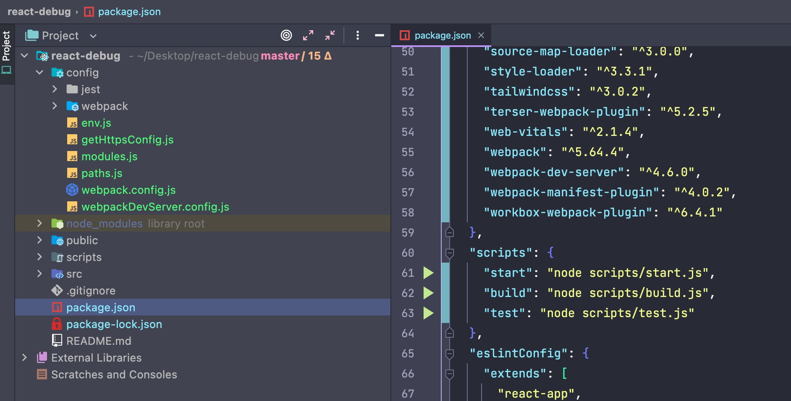

另外通过 create-react-app 创建的项目，默认有 eslint，这个感觉有点儿烦人，可以禁用掉，对源码调试没有影响。

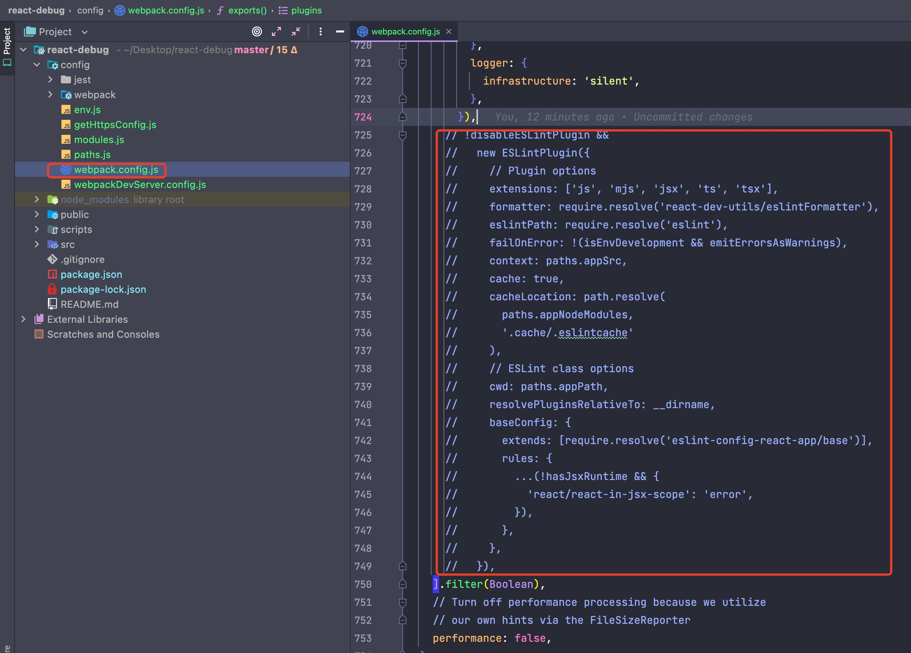

# 用编辑器调试项目

---

项目创建好了之后，进入项目并运行 `npm run start` 即可跑起来，这时候是是可以通过浏览器控制台调试的。

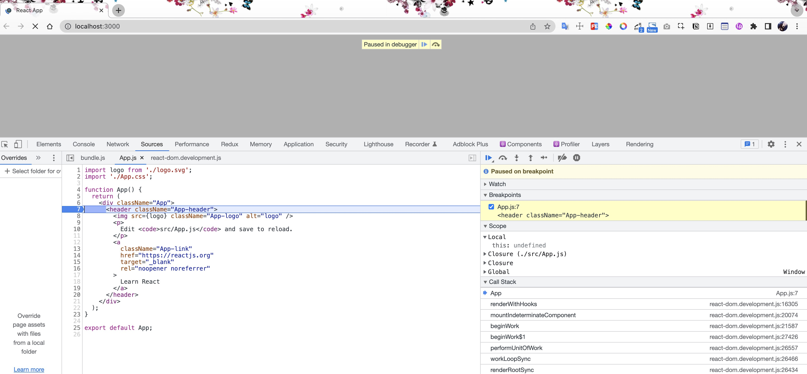

那有没有办法通过编辑器来断点调试，当然是可以的，在这儿记录通过 Webstorm 和 VSCode 进行断点调试。

## Webstorm 断点调试

1. 如果是用的 Webstorm，在插件 Plugins 里面搜索 `JavaScript Debugger` 并安装；
2. 点击编辑器右上角 `Add Configurations` => 点击`+`号并找到`JavaScript Debugger` => 点击进入配置界面；
    
    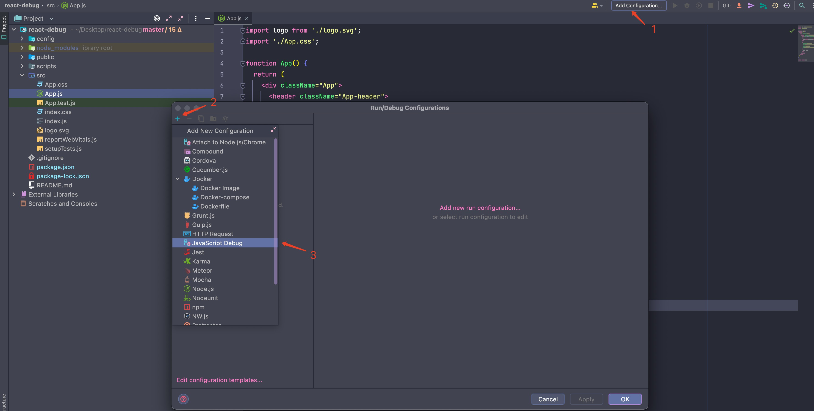
    
3. 在配置界面命名 debugger 名称，输入 URL，选择浏览器后，点击 OK 后在编辑器右上角（上图图 1 的位置）就可以看到刚刚的配置了；
    
    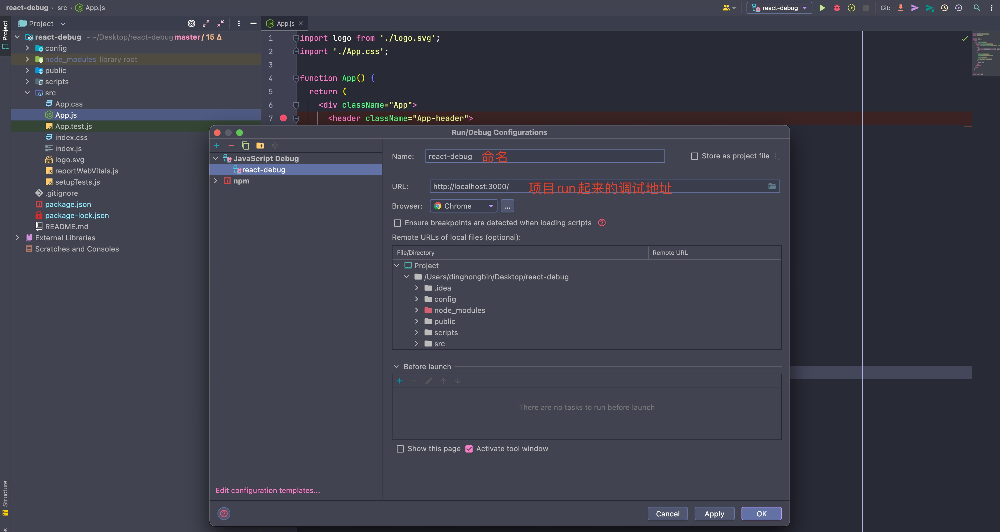
    
4. 选择刚配置的 `react-debug`，点击旁边的甲壳虫按钮，这时会自动打开浏览器，不过这时打开的界面是空白的，因为项目没有启起来嘛；
    
    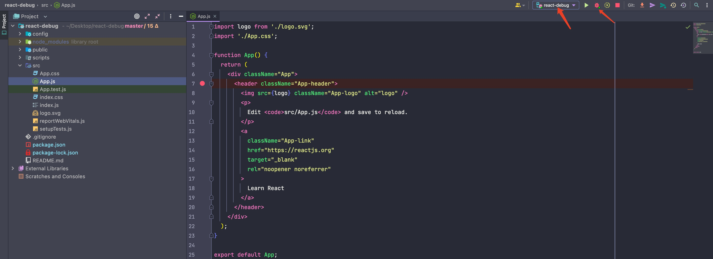
    
5. 在代码某个位置打上断点，在终端运行`npm run start`，项目在 3000 端口跑起来，这个时候 Webstorm 即可在代码打断点的地方断住了（如果没断住，项目跑起来之后重复上面第4步）；
    
    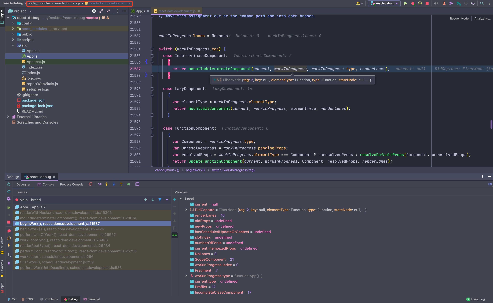
    

## VSCode 断点调试

1. 在根目录下建一个 `.vscode/launch.json`的文件，添加一个 Chrome 类型的调试配置；
    
    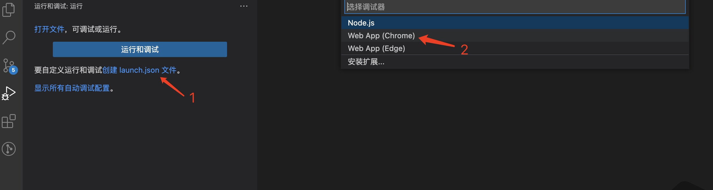
    
2. 输入调试的 URL（项目跑起来的调试地址）；
    
    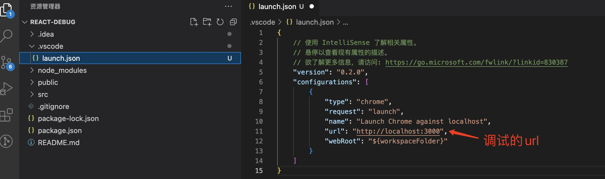
    
3. 点击运行 Debug 按钮，这时同样会自动打开浏览器，不过界面也是空白的，同样因为项目没有启动嘛；
    
    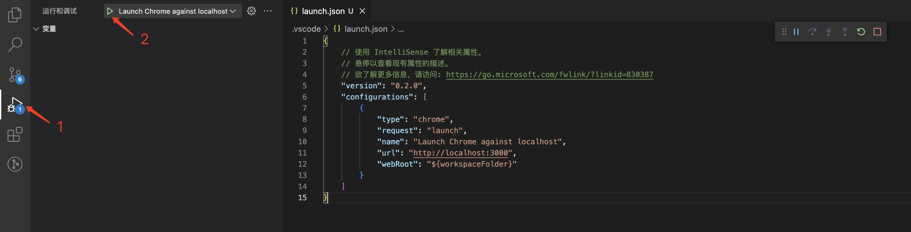
    
4. 在代码某个位置打上断点，在终端运行`npm run start`，项目在 3000 端口跑起来，这个时候 VSCode 即可在代码打断点的地方断住了（如果没断住，项目跑起来之后重复上面第3步）；
    
    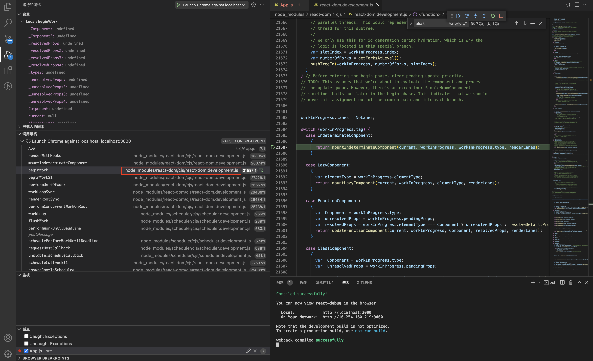
    

# 构建有 sourcemap 的 react 包

---

到目前为止，不管是在浏览器调试，还是在编辑器里面调试，调试的都是 node_modules 中的打包好之后的 react 中的文件，许多代码都糅杂在一个文件中（比如 react-dom.development.js、scheduler.development.js等），而源码里这些逻辑是分散在不同的包里的，所以就算搞懂了逻辑，也不知道这些逻辑在哪些包里哪些位置，只能靠搜索来定位，那怎么能调试 react 最初的源码呢？这儿就涉及到需要构建一个带有 sourcemap 的 react 包了。

因此在项目根目录下引入一下 react 的源码（在这儿 clone 的是 react 当前最新的版本 18.2.0）：

```bash
git clone https://github.com/facebook/react
# git clone https://github.com/facebook/react.git -b 17.0.2
```

并进入到刚引入的`react`目录下执行下命令安装依赖：

```bash
yarn install
```

注：因为 react 源码本身是用 yarn 管理包依赖，这儿用 npm install 的话，会报错 `npm ERR! Unsupported URL Type "link:": link:./scripts/eslint-rules` ，虽然可将`link`关键字改为`file`，但用 npm 的话可能还会导致其他报错，这儿建议直接使用 yarn。 

此时在`react`目录下运行构建命令`yarn run build`的话，构建出来的代码是不带有 sourcemap 的（和通过`npm install react`安装在项目`node_modules`目录下的东西是一样的），需要改造下 build 配置。

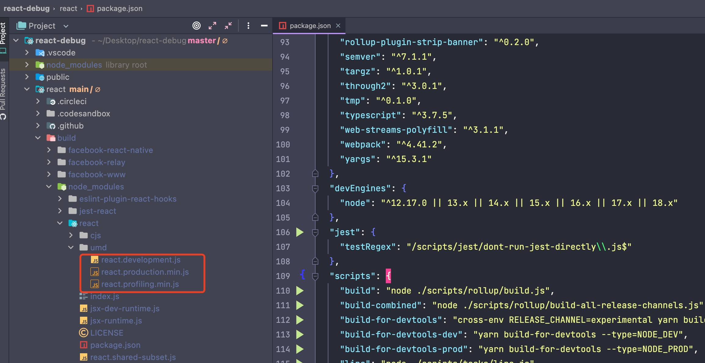

build 命令执行的是`./scripts/rollup/build.js`，打开这个文件做一些修改，找到 rollup 的配置，将 sourcemap 改为 true。

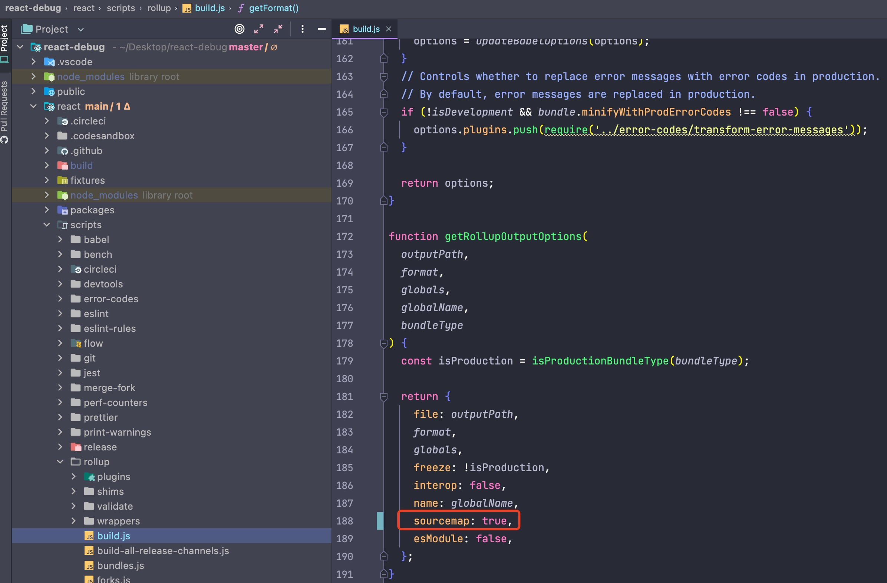

再次运行构建命令 `yarn run build`，会报如下错误：

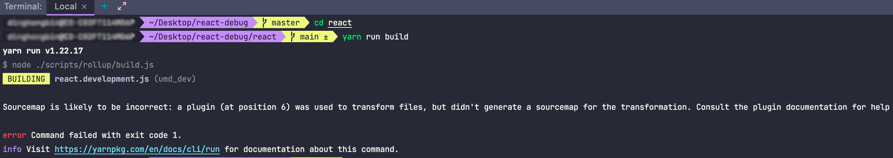

sourcemap 被中断了，某个转换的插件没有生成 sourcemap。这是因为构建的过程中会进行多次转换，会生成多次 sourcemap，然后把 sourcemap 串联起来就是最终的 sourcemap。如果中间有一步转换没有生成 sourcemap，那就断掉了，也就没法把 sourcemap 串联起来了，解决这个问题的办法就是找出没有生成 sourcemap 的那几个插件注释掉就可以了。

在 `./scripts/rollup/build.js` 文件中找到 getPlugins 方法然后注释掉下面几个插件：

```jsx
// Remove 'use strict' from individual source files.
// {
//   transform(source) {
//     return source.replace(/['"]use strict["']/g, '');
//   },
// },
```

```jsx
// Apply dead code elimination and/or minification.
// isProduction &&
//   closure({
//     compilation_level: 'SIMPLE',
//     language_in: 'ECMASCRIPT_2015',
//     language_out:
//       bundleType === BROWSER_SCRIPT ? 'ECMASCRIPT5' : 'ECMASCRIPT5_STRICT',
//     env: 'CUSTOM',
//     warning_level: 'QUIET',
//     apply_input_source_maps: false,
//     use_types_for_optimization: false,
//     process_common_js_modules: false,
//     rewrite_polyfills: false,
//     inject_libraries: false,
//
//     // Don't let it create global variables in the browser.
//     // https://github.com/facebook/react/issues/10909
//     assume_function_wrapper: !isUMDBundle,
//     renaming: !shouldStayReadable,
//   }),
```

```jsx
// Note that this plugin must be called after closure applies DCE.
// isProduction && stripUnusedImports(pureExternalModules),
```

```jsx
// Add the whitespace back if necessary.
// shouldStayReadable &&
//   prettier({
//     parser: 'babel',
//     singleQuote: false,
//     trailingComma: 'none',
//     bracketSpacing: true,
//   }),
```

```jsx
// License and haste headers, top-level `if` blocks.
// {
//   renderChunk(source) {
//     return Wrappers.wrapBundle(
//       source,
//       bundleType,
//       globalName,
//       filename,
//       moduleType,
//       bundle.wrapWithModuleBoundaries
//     );
//   },
// },
```

注释掉上面这几个插件之后，再运行构建命令`yarn run build`，这时候就能正常进行构建了，然后构建出的代码就是带有 sourcemap 的。

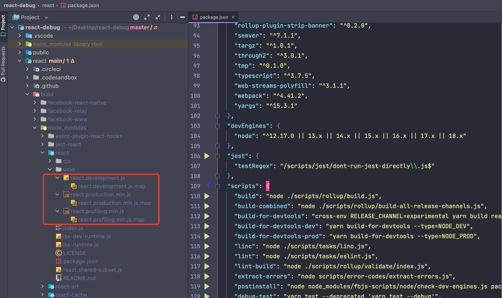

# 修改项目react引用路径

---

从之前的`react`目录回到项目`react-debug`根目录，在之前通过`npm run eject` 暴露出的 webpack 配置文件`config/webpack.config.js`中通过 alias 配置修改 react 相关的包的引用路径（将其指向改为刚引入的源码）。

```jsx
alias: {
        // ....
        'react-dom$': path.resolve(__dirname, '../react/build/node_modules/react-dom/umd/react-dom.development.js'),
        'react$': path.resolve(__dirname, '../react/build/node_modules/react/umd/react.development.js'),
        // ...
      },
```

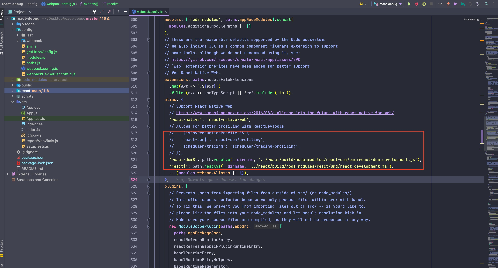

这时候通过`npm run start`跑起来会报错，如下图：

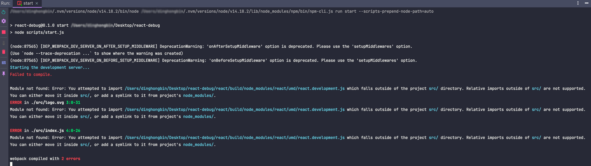

这个是因为`ModuleScopePlugin`的限制，去webpack 配置文件`config/webpack.config.js`里把这个插件注释掉，再重新跑就能跑起来了。

```jsx
// new ModuleScopePlugin(paths.appSrc, [
//   paths.appPackageJson,
//   reactRefreshRuntimeEntry,
//   reactRefreshWebpackPluginRuntimeEntry,
//   babelRuntimeEntry,
//   babelRuntimeEntryHelpers,
//   babelRuntimeRegenerator,
// ]),
```

# 编辑器调试react最初的源码

---

到此，如果是用的 webstorm 调试的话，在代码里面想断点的地方打上断点，然后运行`npm run start`，再运行之前配置的断点，即可以在 webstorm 里面愉快的调试最初的源码（可以定位到代码在react源码中具体的包具体的行）了。

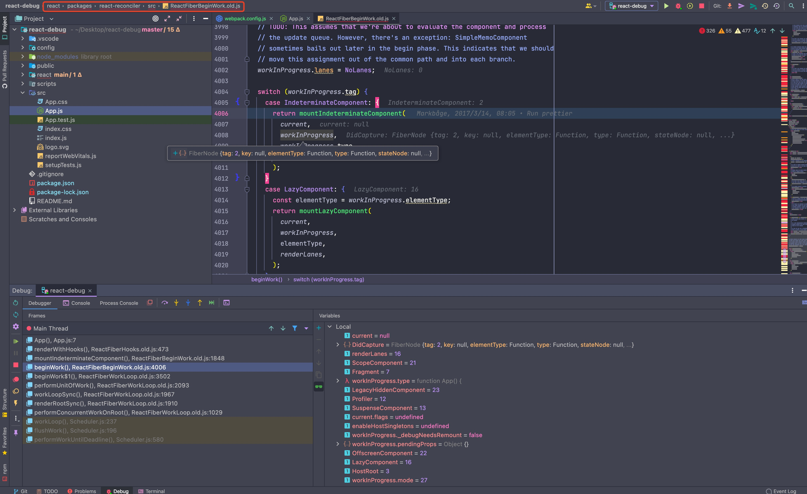

而如果是用 VSCode的话，需要 VSCode Debugger 也支持 sourcemap，有个 sourceMaps 的调试配置选项来开启和关闭 sourcemap 功能，将 sourceMaps 设置为 true。

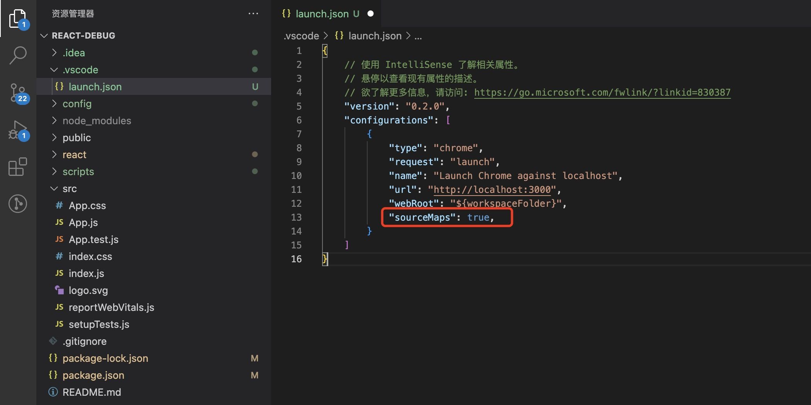

在命令行运行`npm run start`，再运行 Debug 按钮就可以在 VSCode 里面愉快的调试最初的源码了。

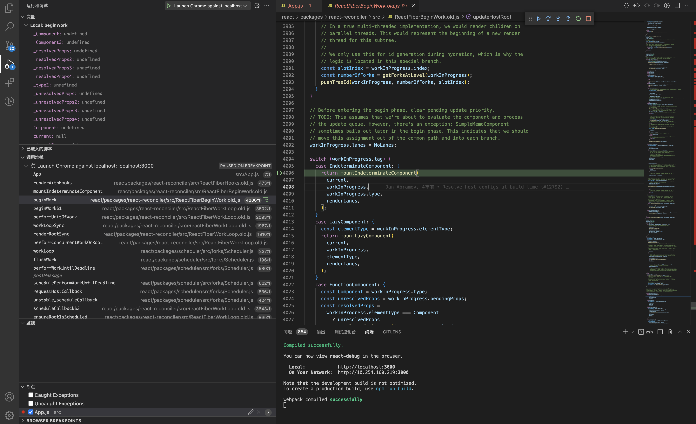

# 参考资料

---

[全网最优雅的 React 源码调试方式](https://juejin.cn/post/7126501202866470949)

[React源码学习进阶篇（一）新版React如何调试源码？](https://mp.weixin.qq.com/s/rjSrV6opaef1lqLM7S5F_Q)