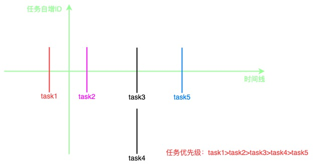

# React调度Scheduler

`react`中的`scheduler`就是一个任务调度器，协调任务的执行顺序（先执行哪个后执行哪个）以及执行时机（什么时候执行什么任务），包位于[react/packages/scheduler](https://github.com/facebook/react/tree/v17.0.2/packages/scheduler)，是一个独立的包，可以独立于`react`单独使用


# SchedulerPriority

与`scheduler`调度中心相关的优先级使用`SchedulerPriority`，属于`scheduler`包, 定义于`SchedulerPriorities.js`中（[见源码](https://github.com/facebook/react/blob/v17.0.2/packages/scheduler/src/SchedulerPriorities.js)）

```jsx
export const NoPriority = 0;           // 没有任何优先级
export const ImmediatePriority = 1;    // 立即执行的优先级，级别最高
export const UserBlockingPriority = 2; // 用户阻塞级别的优先级
export const NormalPriority = 3;       // 正常的优先级
export const LowPriority = 4;          // 较低的优先级
export const IdlePriority = 5;         // 优先级最低，表示任务可以闲置
```

# 调度入口

调度的入口即 `unstable_scheduleCallback`（[见源码](https://github.com/facebook/react/blob/12adaffef7105e2714f82651ea51936c563fe15c/packages/scheduler/src/Scheduler.js#L282)），`scheduleCallback` 的作用就是创建任务并放入任务队列然后触发调度

```jsx
function unstable_scheduleCallback(priorityLevel, callback, options) {
  // 获取当前时间currentTime，定义在 SchedulerHostConfig.default.js([见源码](https://github.com/facebook/react/blob/12adaffef7105e2714f82651ea51936c563fe15c/packages/scheduler/src/forks/SchedulerHostConfig.default.js#L24))，优先使用performance.now()，如果不支持performance降级为Date.now()
  var currentTime = getCurrentTime();

  // 计算开始时间startTime，如果有延时时间，则开始时间 = 当前时间 + 延时时间，否则开始时间 = 当前时间
  var startTime;
  if (typeof options === 'object' && options !== null) {
    var delay = options.delay;
    if (typeof delay === 'number' && delay > 0)
      startTime = currentTime + delay;
    } else {
      startTime = currentTime;
    }
  } else {
    startTime = currentTime;
  }

  // 根据任务传入的优先级设置过期时间 expirationTime
  var timeout;
  switch (priorityLevel) {
    case ImmediatePriority:
      timeout = IMMEDIATE_PRIORITY_TIMEOUT; // 常量 -1
      break;
    case UserBlockingPriority:
      timeout = USER_BLOCKING_PRIORITY_TIMEOUT; // 常量 250
      break;
    case IdlePriority:
      timeout = IDLE_PRIORITY_TIMEOUT; // 常量 1073741823（约12天）
      break;
    case LowPriority:
      timeout = LOW_PRIORITY_TIMEOUT; // 常量 10000
      break;
    case NormalPriority:
    default:
      timeout = NORMAL_PRIORITY_TIMEOUT; // 常量 5000
      break;
  }

  var expirationTime = startTime + timeout;

  // 创建任务
  var newTask = {
    id: taskIdCounter++, // 每个任务有一个自增的ID，这个自增ID在后面排序的时候有用
    callback, // 传进来真正要执行的任务（函数）
    priorityLevel, // 传入的任务优先级
    startTime, // 任务开始时间
    expirationTime, // 任务过期时间
    sortIndex: -1, // 任务优先顺序的排序值
  };

  // react性能分析相关，可忽略
  if (enableProfiling) {
    newTask.isQueued = false;
  }

  // 任务入队并触发调度
  // //如果任务开始时间大于当前时间，说明该任务有延时，不需要立刻开始，需要等一段时间后才开始
  if (startTime > currentTime) {
    // This is a delayed task.
    // 如果是延时任务，那么在timeQueue中的排序值就是开始时间
    newTask.sortIndex = startTime;
    // 添加到延时任务队列（是一个最小堆）
    push(timerQueue, newTask);
    // 如果此刻任务队列taskQueue里已经为空了，并且新添加的这个延时任务是延时任务队列timerQueue优先级最高的那个任务
    if (peek(taskQueue) === null && newTask === peek(timerQueue)) {
      // All tasks are delayed, and this is the task with the earliest delay.
      // isHostTimeoutScheduled 初始值为false
      if (isHostTimeoutScheduled) {
        // Cancel an existing timeout.
        cancelHostTimeout();
      } else {
        isHostTimeoutScheduled = true;
      }
      // Schedule a timeout.
      // 开启一个定时器，等到此任务的开始时间到达的时候检查延迟任务并添加到taskQueue中
      requestHostTimeout(handleTimeout, startTime - currentTime);
    }
  } else {
    // 非延时任务在任务队列taskQueue（是一个最小堆）的排序值就是过期时间
    newTask.sortIndex = expirationTime;
    // 向任务队列taskQueue添加非延时任务
    push(taskQueue, newTask);
    // react性能分析相关，可忽略
    if (enableProfiling) {
      markTaskStart(newTask, currentTime);
      newTask.isQueued = true;
    }
    // Schedule a host callback, if needed. If we're already performing work,
    // wait until the next time we yield.
    // isHostCallbackScheduled初始值为false，isPerformingWork初始值也为false
    if (!isHostCallbackScheduled && !isPerformingWork) {
      isHostCallbackScheduled = true;
      // 触发调度
      requestHostCallback(flushWork);
    }
  }

  return newTask;
}
```

## 创建任务并添加到任务队列

`scheduleCallback` 会先将传进来的函数`callback` 包装成任务，然后根据是否是延时任务分别添加到相应的任务队列里面去。

添加到任务队列中的任务是有排序的，在这儿不管是延时任务队列`timerQueue`还是非延时任务队列`taskQueue` 都是用的一种叫做最小堆（最小堆是二叉堆的一种形式）的数据结构。

> 注意延时任务队列`timerQueue` 的中的任务 sortIndex 排序值是取的开始时间 startTime，而非延时任务队列`taskQueue` 的中的任务 sortIndex 排序值是取的过期时间 expirationTime = startTime + timeout。
> 

<aside>
💡 二叉堆是一种特殊的完全二叉树，有**最大堆**和**最小堆**两种形式，**最大堆**的每个父节点的值都大于等于它左、右子孩子节点的值.。**最小堆**的每个父节点的值都小于等于它左、右子孩子节点的值. 二叉堆的根节点叫做 **堆顶**，最大堆的堆顶是整个堆的最大元素，最小堆的堆顶是整个堆的最小元素。基于这种特性， 二叉堆能够高效快速地找出最大值或最小值，经常被用于**优先队列**， 也常用于经典的**堆排序算法。**

参考链接：[二叉堆 Binary Heap](https://algorithm.yanceyleo.com/data-structure/tree/binary-heap/)

</aside>

在这儿记住最小堆的三种操作就行了：

- peek：从最小堆里面取出堆顶最小的那个节点（从任务优先队列里面取出优先级最高的那个的任务）；
- pop：从最小堆里面删除节点（从任务优先队列里面删除指定的任务）；
- push：将节点添加到最小堆里面（将指定的任务添加到任务优先队列）；

在这儿最小堆里面的排序是依据 sortIndex 和任务的自增 id，排序方法定义 `SchedulerMinHeap.js`（[见源码](https://github.com/facebook/react/blob/12adaffef7105e2714f82651ea51936c563fe15c/packages/scheduler/src/SchedulerMinHeap.js#L89)）

```jsx
function compare(a, b) {
  // Compare sort index first, then task id.
  // 首先比较两个任务的排序值sortIndex，值越小，优先级越高
  const diff = a.sortIndex - b.sortIndex;
  // 如果两个任务的sortIndex一样，则比较任务的的自增id，越先入队的，id值越小，优先级更高
  return diff !== 0 ? diff : a.id - b.id;
}
```



## 触发调度

回到上面`scheduleCallback` 代码，先看下如果任务是非延时任务的情况，到末尾的时候发现会调用一个`requestHostCallback(flushWork)`的方法

```jsx
// isHostCallbackScheduled初始值为false，isPerformingWork初始值也为false
if (!isHostCallbackScheduled && !isPerformingWork) {
  isHostCallbackScheduled = true;
  requestHostCallback(flushWork);
}
```

`requestHostCallback`定义在`SchedulerHostConfig.default.js`（[见源码](https://github.com/facebook/react/blob/12adaffef7105e2714f82651ea51936c563fe15c/packages/scheduler/src/forks/SchedulerHostConfig.default.js#L224)），里面会用到 `MessageChannel`（[MDN MessageChannel](https://developer.mozilla.org/zh-CN/docs/Web/API/MessageChannel)），如果不支持`MessageChannel会`降级为`setTimeout`

```jsx
const channel = new MessageChannel();
const port = channel.port2;
channel.port1.onmessage = performWorkUntilDeadline;

requestHostCallback = function(callback) {
  scheduledHostCallback = callback;
  // isMessageLoopRunning初始值为false
  if (!isMessageLoopRunning) {
    isMessageLoopRunning = true;
    port.postMessage(null);
  }
};
```

调用`requestHostCallback`会将传入的 `flushWork` 赋值给变量 `scheduledHostCallback`，而后在`MessageChannel`端口 port2 处发送消息，那在另外一端 port1 注册的`onmessage` 方法会被触发，只是`onmessage`方法是一个宏任务，`onmessage`并不会立即被执行只是被推入到浏览器的任务队列（注意这儿的任务队列并不是上面的任务队列，这个任务队列是浏览器中的任务队列，隶属于浏览器事件循环去调度，更多的可移步 [Event Loop](https://www.notion.so/Event-Loop-b027477804d04c938a0aad91d372a900) ）中去，等到下一轮事件循环的时候，如果任务队列中的`onmessage`方法优先级是最高的，则才会被抓取执行。

而`onmessage` 被赋值为`performWorkUntilDeadline`，所以调用`requestHostCallback`，到头来是将`performWorkUntilDeadline`方法加入到浏览器的任务队列中去，等待事件循环轮到的时候调用。

# 消费任务

待事件循环轮到抓取执行`performWorkUntilDeadline`时，该方法又做了什么？

继续看 `performWorkUntilDeadline`，该方法同样定义在`SchedulerHostConfig.default.js`（[见源码](https://github.com/facebook/react/blob/12adaffef7105e2714f82651ea51936c563fe15c/packages/scheduler/src/forks/SchedulerHostConfig.default.js#L185)）

```jsx
const performWorkUntilDeadline = () => {
  // 在requestHostCallback()被调用时，scheduledHostCallback被赋值为了callback，即flushWork
  if (scheduledHostCallback !== null) {
    // 获取当前时间
    const currentTime = getCurrentTime();
    // Yield after `yieldInterval` ms, regardless of where we are in the vsync
    // cycle. This means there's always time remaining at the beginning of
    // the message event.
    // 计算截止时间，默认为0，yieldInterval如果不被手动更改的话，值为5ms
    deadline = currentTime + yieldInterval;
    // 是否还有剩余时间
    const hasTimeRemaining = true;
    try {
      // 如果hasMoreWork为true，说明还有任务（比如任务没执行完就被打断了放弃了，又或者任务执行完了又产生了新的任务），后还得接着干
      const hasMoreWork = scheduledHostCallback(
        hasTimeRemaining,
        currentTime,
      );
      if (!hasMoreWork) {
        // 如果没有任务了，重置isMessageLoopRunning和scheduledHostCallback，这两变量在requestHostCallback()的时候分别被设置为false和flushWork
        isMessageLoopRunning = false;
        scheduledHostCallback = null;
      } else {
        // If there's more work, schedule the next message event at the end
        // of the preceding one.
        // 如果还有任务，则重新发起调度，往浏览器的任务队列里面再添加一个performWorkUntilDeadline()，等待事件循环轮到的时候抓取执行
        port.postMessage(null);
      }
    } catch (error) {
      // If a scheduler task throws, exit the current browser task so the
      // error can be observed.
      // 如果有异常，则重新发起调度
      port.postMessage(null);
      throw error;
    }
  } else {
    isMessageLoopRunning = false; // 如果scheduledHostCallback为null，则将isMessageLoopRunning重置为false，便于requestHostCallback(callback)的时候能顺利触发port.postMessage(null);
  }
  // Yielding to the browser will give it a chance to paint, so we can
  // reset this.
  needsPaint = false; // 重置开关
};
```

`performWorkUntilDeadline`简单讲就是执行了之前传入的 `flushWork`，调用`flushWork`时传入了执行时的当前时间 currentTime 和是否有剩余时间 hasTimeRemaining 为 true。如果执行`flushWork`后还有任务则发起新一轮的调度，执行异常的会也会重新发起新的调度。

`performWorkUntilDeadline` 中在调用`flushWork`之前还有设置一个截止时间 deadline = currentTime + yieldInterval，这个 yieldInterval 默认值是 5ms，5ms 是 react 团队的一个经验值也是时间分片的周期，react 和浏览器是一个合作式调度的关系，浏览器给 react 5ms 的时间执行任务，5ms 之后 react 将控制权交还给浏览器供浏览器处理绘制啊一些操作。这个 yieldInterval 也是可以手动设置更改的，更改 yieldInterval 值的方法 叫`forceFrameRate`，定义在`SchedulerHostConfig.default.js` 文件中（[见源码](https://github.com/facebook/react/blob/12adaffef7105e2714f82651ea51936c563fe15c/packages/scheduler/src/forks/SchedulerHostConfig.default.js#L168)）。

```jsx
// 如果不是浏览器环境（typeof window === 'undefined'）或者是浏览器环境但不支持MessageChannel（typeof MessageChannel !== 'function'），调用forceFrameRate不起任何作用，即不会调整yieldInterval值
requestPaint = forceFrameRate = function() {};

// 如果是浏览器环境且浏览器支持MessageChannel
forceFrameRate = function(fps) {
    if (fps < 0 || fps > 125) {
      // Using console['error'] to evade Babel and ESLint
      console['error'](
        'forceFrameRate takes a positive int between 0 and 125, ' +
          'forcing frame rates higher than 125 fps is not supported',
      );
      return;
    }
    if (fps > 0) {
      yieldInterval = Math.floor(1000 / fps);
    } else {
      // reset the framerate
      yieldInterval = 5;
    }
  };
```

`flushWork` 定义在`Scheduler.js`（[见源码](https://github.com/facebook/react/blob/12adaffef7105e2714f82651ea51936c563fe15c/packages/scheduler/src/Scheduler.js#L121)）

```jsx
function flushWork(hasTimeRemaining, initialTime) {
  // react性能分析相关，可忽略
  if (enableProfiling) {
    markSchedulerUnsuspended(initialTime);
  }

  // We'll need a host callback the next time work is scheduled.
  // 在scheduleCallback()里面requestHostCallback(flushWork)调用之前isHostCallbackSchedule被设置成了true
  // 在这儿isHostCallbackScheduled被重置为false，以保证有下一个任务进来的时候，能触发requestHostCallback(flushWork)
  isHostCallbackScheduled = false;
  if (isHostTimeoutScheduled) {
    // We scheduled a timeout but it's no longer needed. Cancel it.
    isHostTimeoutScheduled = false;
    cancelHostTimeout();
  }

  isPerformingWork = true;
  // currentPriorityLevel 初始值为 NormalPriority
  const previousPriorityLevel = currentPriorityLevel;
  try {
    // react性能分析相关，可忽略
    if (enableProfiling) {
      try {
        return workLoop(hasTimeRemaining, initialTime);
      } catch (error) {
        if (currentTask !== null) {
          const currentTime = getCurrentTime();
          markTaskErrored(currentTask, currentTime);
          currentTask.isQueued = false;
        }
        throw error;
      }
    } else {
      // No catch in prod code path.
      // 执行工作循环，
      // hasTimeRemaining和initialTime为performWorkUntilDeadline()执行时调用scheduledHostCallback(hasTimeRemaining,currentTime)传入的参数，分别为true和
      // 执行performWorkUntilDeadline()时的当前时间
      return workLoop(hasTimeRemaining, initialTime);
    }
  } finally {
    // 重置变量，还原全局标记
    currentTask = null;
    currentPriorityLevel = previousPriorityLevel;
    isPerformingWork = false;
    // react性能分析相关，可忽略
    if (enableProfiling) {
      const currentTime = getCurrentTime();
      markSchedulerSuspended(currentTime);
    }
  }
}
```

执行`flushWork`就是做了一些开关标记（比如将 isHostCallbackScheduled 重置为false），核心的地方还是在于里面调用了工作循环`workLoop`。

工作循环 `workLoop` 也定义在`Scheduler.js`（[见源码](https://github.com/facebook/react/blob/12adaffef7105e2714f82651ea51936c563fe15c/packages/scheduler/src/Scheduler.js#L163)）

```jsx
function workLoop(hasTimeRemaining, initialTime) {
  // 当前时间，其实就是performWorkUntilDeadline()执行时的那个时间点
  let currentTime = initialTime;
  // 和延时任务队列有关，先忽略，后面再说
  advanceTimers(currentTime);
  // 从非延时任务队列中取出堆顶的任务，即任务优先级最高的任务（过期时间expirationTime越小，任务优先级越高，如果expirationTime相同，则任务自增id越高，优先级越高）
  currentTask = peek(taskQueue);
  while (
    currentTask !== null &&
    !(enableSchedulerDebugging && isSchedulerPaused) // enableSchedulerDebugging通过const声明为常量false，isSchedulerPaused通过var声明初始值为false
  ) {
    // currentTask.expirationTime > currentTime 说明任务过期了
    // hasTimeRemaining 其实是performWorkUntilDeadline()调用scheduledHostCallback(hasTimeRemaining,currentTime)传进来的hasTimeRemaining，为true
    // shouldYieldToHost()是否将控制权交还给浏览器
    if (
      currentTask.expirationTime > currentTime && 
      (!hasTimeRemaining || shouldYieldToHost())
    ) {
      // This currentTask hasn't expired, and we've reached the deadline.
      // 如果任务过期了而且又要交还控制权给浏览器则不消费currentTask了，返回true，重新发起调度，performWorkUntilDeadline()中 port.postMessage(null)，等待后面工作循环workLoop时再择机消费
      break;
    }
    // 取出当前任务的回调函数，在调度入口unstable_scheduleCallback(priorityLevel, callback, options)传入的回调函数callback
    const callback = currentTask.callback;
    // 如果callback是一个函数的话
    if (typeof callback === 'function') {
      // 清空当前任务currentTask的回调函数callback
      currentTask.callback = null;
      // 取出当前任务的优先级，在调度入口unstable_scheduleCallback(priorityLevel, callback, options)传入的那个任务优先级priorityLevel
      currentPriorityLevel = currentTask.priorityLevel;
      // 判断任务是否过期了，如果currentTask.expirationTime <= currentTime则说明还未过期
      const didUserCallbackTimeout = currentTask.expirationTime <= currentTime;
      // react性能分析相关，可忽略
      if (enableProfiling) {
        markTaskRun(currentTask, currentTime);
      }
      // 调用callback，并传入任务是否过期的标志，返回是否有需要继续执行的函数回调continuationCallback
      const continuationCallback = callback(didUserCallbackTimeout);
      // callback执行后的当前时间点
      currentTime = getCurrentTime();
      // 如果continuationCallback是一个函数的话
      if (typeof continuationCallback === 'function') {
        // 将continuationCallback赋值给当前任务currentTask的callback
        currentTask.callback = continuationCallback;
        // react性能分析相关，可忽略
        if (enableProfiling) {
          markTaskYield(currentTask, currentTime);
        }
      } else {
        // 如果返回的continuationCallback不是一个函数的话
        // react性能分析相关，可忽略
        if (enableProfiling) {
          markTaskCompleted(currentTask, currentTime);
          currentTask.isQueued = false;
        }
        // 如果当前的currentTask还是非延时任务队列里面任务优先级最高的那个的话，则从非延时任务队列里面移除
        if (currentTask === peek(taskQueue)) {
          pop(taskQueue);
        }
      }
      // 和延时任务队列有关，先忽略，后面再说
      advanceTimers(currentTime);
    } else {
      // 如果取出的当前任务currentTask的callback不是一个函数（比如可能为null）,则从非延时任务队列里面删除
      pop(taskQueue);
    }
    // 从非延时任务队列里面取出当前优先级最高的任务并赋值给currentTask，满足while条件的话，继续执行while，否则退出while循环
    currentTask = peek(taskQueue);
  }
  // Return whether there's additional work
  if (currentTask !== null) {
    // 如果currentTask不为空，则重新发起新一轮调度，performWorkUntilDeadline()中 port.postMessage(null)，等待后面工作循环workLoop时再择机消费
    return true;
  } else {
    // 延时任务队列相关，后面再说
    const firstTimer = peek(timerQueue);
    if (firstTimer !== null) {
      requestHostTimeout(handleTimeout, firstTimer.startTime - currentTime);
    }
    return false;
  }
}
```

工作循环`workLoop`的核心工作就是循环消费非延时任务队列`taskQueue`中的任务，也是真正调用入口`unstable_scheduleCallback`传入的`callback`的地方，在这儿注意下**进入 while 循环的前提判断条件以及进入 while 循环后退出的时机**。

- 进入 while 循环有一个前提判断条件判断是否有暂停标记 isSchedulerPaused，该变量可通过调用 `unstable_pauseExecution` 和 `unstable_continueExecution` 更改
    
    ```jsx
    // 均定义在Scheduler.js文件中，和工作循环workLoop在同一文件，isSchedulerPaused被定义在该文件代码开始的地方
    function unstable_pauseExecution() {
      isSchedulerPaused = true;
    }
    
    function unstable_continueExecution() {
      isSchedulerPaused = false;
      if (!isHostCallbackScheduled && !isPerformingWork) {
        isHostCallbackScheduled = true;
        requestHostCallback(flushWork);
      }
    }
    ```
    
- 进入 while 循环有一个退出的时机是如果满足当前任务已经过期并且需要交还控制权给浏览器的话，则退出 while 循环，重新在`performWorkUntilDeadline`通过调用port.postMessage(null) 发起新一轮的调度，而判断是否需要交还控制权给浏览器是通过 shouldYieldToHost() 来判断，`shouldYieldToHost`定义在`SchedulerHostConfig.default.js`文件中（[见源码](https://github.com/facebook/react/blob/12adaffef7105e2714f82651ea51936c563fe15c/packages/scheduler/src/forks/SchedulerHostConfig.default.js#L160)）。
    
    ```jsx
    // 如果不是浏览器环境（typeof window === 'undefined'）或者是浏览器环境但不支持MessageChannel（typeof MessageChannel !== 'function'），则shouldYieldToHost()永远都是false
    shouldYieldToHost = function() {
        return false;
    };
    
    // 如果是浏览器环境且支持MessageChannel且支持navigator.scheduling.isInputPending的话
    // enableIsInputPending && navigator !== undefined && navigator.scheduling !== undefined && navigator.scheduling.isInputPending !== undefined
    // navigator.scheduling.isInputPending是React团队贡献给Chromium的一个api，现在已经列入 W3C 标准([前往链接](https://engineering.fb.com/2019/04/22/developer-tools/isinputpending-api/)), 用于判断是否有输入事件(包括: input 框输入事件, 点击事件等)，以在不让出主线程的情况下提高响应能力（移步[Better JS scheduling with isInputPending()](https://developer.chrome.com/articles/isinputpending/)）.
    shouldYieldToHost = function() {
      const currentTime = getCurrentTime();
      // 当前时间是否大于截止时间，这个截止时间deadline在performWorkUntilDeadline()执行时会设置一个截止时间deadline = currentTime + yieldInterval（在调用scheduledHostCallback()之前，即调用flushWork()之前，在flushWork里面会调用workLoop()消费任务）; 
      if (currentTime >= deadline) {
        // There's no time left. We may want to yield control of the main
        // thread, so the browser can perform high priority tasks. The main ones
        // are painting and user input. If there's a pending paint or a pending
        // input, then we should yield. But if there's neither, then we can
        // yield less often while remaining responsive. We'll eventually yield
        // regardless, since there could be a pending paint that wasn't
        // accompanied by a call to `requestPaint`, or other main thread tasks
        // like network events.
        // 浏览器需要绘制了或者有用户输入事件发生
        if (needsPaint || scheduling.isInputPending()) { // const scheduling = navigator.scheduling;
          // There is either a pending paint or a pending input.
          return true;
        }
        // There's no pending input. Only yield if we've reached the max
        // yield interval.
        // 在持续运行的react应用中, currentTime肯定大于300ms, 这个判断只在初始化过程中才有可能返回false
        return currentTime >= maxYieldInterval; // maxYieldInterval为一个常量值 300
      } else {
        // There's still time left in the frame.
        return false;
      }
    };
    
    // 如果是浏览器环境且支持MessageChannel但不支持navigator.scheduling.isInputPending的话
    shouldYieldToHost = function() {
      // 当前时间是否大于截止时间，这个截止时间解释同上
      return getCurrentTime() >= deadline;
    };
    
    ```
    
    `shouldYieldToHost`的判断逻辑简单来说就是判断当前时间点是否已经超出了在执行工作循环之前设置的那个截止时间，如果超出了则 react 将控制权交还给浏览器。
    
    这个截止时间 deadline 是在`performWorkUntilDeadline`被事件循环抓取执行时设置的（以当前的那个时间点为坐标加了 yieldInterval，yieldInterval 如果不更改的话为 5ms），然后继续调用 scheduledHostCallback(hasTimeRemaining, currentTime)，即调用 flushWork(hasTimeRemaining, currentTime)，在flushWork做一些开关标记后，调用工作循环 workLoop(hasTimeRemaining, currentTime)，在工作循环 workLoop 中会从非延时任务队列`taskQueue` 中取出任务开始消费，假如消费一个任务 currentTask.callback 后还有 continuationCallback，那么该 currentTask 不会从 taskQueue 中出队，只是将 currentTask.callback 设置为 continuationCallback，该任务 current.callback 从之前的 callback 变成 continuationCallback，但 current.expirationTime 没变过，然后从 taskQueue 里面又取出了之前的那个 currentTask，那在进入 while 循环的时候，就有可能过期了currentTask.expirationTime > currentTime ，而经 shouldYieldToHost() 判断 getCurrentTime() >= deadline 要交出控制权给浏览器（毕竟 `performWorkUntilDeadline` 当时只给了 currentTask 5ms 的执行时间，虽然执行 current.task 之后有 continuationCallback 而且经 peek(taksQueue) 拿出来又进入了 while 循环，但可能在执行current.task的时候就用了6ms，那 getCurrentTime() >= deadline 就会返回 true 了），那就只能退出 while 循环，然后在`performWorkUntilDeadline`通过 port.postMessage(null) 发起新一轮的调度了，而那个 current.continuationCallback 只能在后面的工作循环 workLoop 中择机再被消费了。
    
- 另外这个`shouldYieldToHost`是导出去的是可以在外面主动调用的，比如在执行 current.callback 本身执行完的时间就很长（比如200ms），那可以在调用的时候主动去调用`shouldYieldToHost`，那就可以把 current.callback 切分成多次执行（执行 current.callback 返回 continuationCallback ），这也是可中断渲染的原理。
    
    ```jsx
    let result = 0;
    let i = 0;
    
    function calculate(didTimeout) {
        // 主动调用shouldYieldToHost，浏览器分配的5ms时间已经到期了，就会放弃本任务的执行
        for (; i < 1000 && (!shouldYieldToHost() || didTimeout); i++) {
            result += 1;
        }
        // 当退出本任务的时候，如果任务没有完成，返回任务函数本身即后面赋值给workLoop里面的那个continuationCallback，如果任务完成了就返回 null
        if (i < 1000) {
            return calculate;
        }
        return false;
    }
    scheduleCallback(NormalPriority, calculate);
    ```
    

# 延时任务

延时任务的处理流程先从调度入口 `unstable_scheduleCallback`看起

```jsx
function unstable_scheduleCallback(priorityLevel, callback, options) {
  // ...省略部分代码

  // //如果任务开始时间大于当前时间，说明该任务有延时，不需要立刻开始，需要等一段时间后才开始
  if (startTime > currentTime) {
    // This is a delayed task.
    // 如果是延时任务，那么在timeQueue中的排序值就是开始时间
    newTask.sortIndex = startTime;
    // 添加到延时任务队列（是一个最小堆）
    push(timerQueue, newTask);
    // 如果此刻任务队列taskQueue里已经为空了，并且新添加的这个延时任务是延时任务队列timerQueue优先级最高的那个任务
    if (peek(taskQueue) === null && newTask === peek(timerQueue)) {
      // All tasks are delayed, and this is the task with the earliest delay.
      // isHostTimeoutScheduled 初始值为false
      if (isHostTimeoutScheduled) {
        // Cancel an existing timeout.
        cancelHostTimeout();
      } else {
        isHostTimeoutScheduled = true;
      }
      // Schedule a timeout.
      // 开启一个定时器，等到此任务的开始时间到达的时候检查延迟任务并添加到taskQueue中，startTime-currentTime正好是options.delay
      requestHostTimeout(handleTimeout, startTime - currentTime);
    }
  } else {
    // ...省略部分代码
  }

  return newTask;
}
```

如果开始时间大于当前时间，说明有开始时间有叠加延时时间 options.delay，则该任务是一个延时任务，将其放入延时任务队列`timerQueue`，如果此刻任务队列`taskQueue`里已经为空了，并且新添加的这个延时任务是延时任务队列`timerQueue`优先级最高的那个任务的话，因为 isHostTimeoutScheduled 初始值为 false，那接下来会立马调用`requestHostTimeout`。

`requestHostTimeout`定义在`SchedulerHostConfig.default.js`文件中（[见源码](https://github.com/facebook/react/blob/12adaffef7105e2714f82651ea51936c563fe15c/packages/scheduler/src/forks/SchedulerHostConfig.default.js#L236)）

```jsx
// 如果不是浏览器环境（typeof window === 'undefined'）或者是浏览器环境但不支持MessageChannel
requestHostTimeout = function(cb, ms) {
    _timeoutID = setTimeout(cb, ms);
  };

// 如果是浏览器环境且浏览器支持MessageChannel
requestHostTimeout = function(callback, ms) {
    taskTimeoutID = setTimeout(() => {
      callback(getCurrentTime());
    }, ms);
  };
```

不管是否是浏览器环境，其实`requestHostTimeout` 都是一个对`setTimeout`的包装而已，`setTimeout`的延时时间是之前`unstable_scheduleCallback`传入的 options.delay，而回调即是调用`requestHostTimeout`传入的`handleTimeout`，只是是浏览器环境的话会给`handleTimeout`传入一个当前时间而已，看下`handleTimeout`的代码，定义在`Scheduler.js`文件中（[见源码](https://github.com/facebook/react/blob/12adaffef7105e2714f82651ea51936c563fe15c/packages/scheduler/src/Scheduler.js#L104)）

```jsx
function handleTimeout(currentTime) {
  // 在unstable_scheduleCallback执行时调用requestHostTimeout()前，会将isHostTimeoutScheduled设置为true，在这儿重新设置为false，以确保下一个延时任务能正常进入requestHostTimeout，进而在setTimeout中倒计时
  isHostTimeoutScheduled = false;
  // 这个下面再分析
  advanceTimers(currentTime);

  if (!isHostCallbackScheduled) {
    if (peek(taskQueue) !== null) {
      isHostCallbackScheduled = true;
      // 如果非延时任务队列taskQueue里面有任务，则调用requestHostCallback，进去将flushWork赋值给scheduledHostCallback，然后port.postMessage(null)触发调度，具体过程上面已有分析
      requestHostCallback(flushWork);
    } else {
      // 从延时任务队列里面取出优先级最高的那个任务，如果不为空，则调用requestHostTimeout重新通过setTimeout去倒计时，只是这时倒计时的时间不再是unstable_scheduleCallback中传入的options.delay
      const firstTimer = peek(timerQueue);
      if (firstTimer !== null) {
        requestHostTimeout(handleTimeout, firstTimer.startTime - currentTime);
      }
    }
  }
}
```

如果 isHostCallbackScheduled 为 true 的话，会重新调用`requestHostTimeout`，去重新倒计时来一遍，而如果是 fasle 的话，且有非延时任务会触发非延时任务的调度`requestHostCallback`，从上面的代码分析可以知道`flushWork`会被执行，然后消费非延时任务队列`taskQueue`中任务的工作循环`workLoop`会被执行，而不管是`workLoop`还是上面`handleTimeout`里面都有`advanceTimers`这个方法的身影

```jsx
function workLoop(hasTimeRemaining, initialTime) {
  // ... 省略部分代码
  advanceTimers(currentTime);
  // ... 省略部分代码
  while (
    currentTask !== null &&
    !(enableSchedulerDebugging && isSchedulerPaused) // enableSchedulerDebugging通过const声明为常量false，isSchedulerPaused通过var声明初始值为false
  ) {
     // ... 省略部分代码
    const callback = currentTask.callback;
    // 如果callback是一个函数的话
    if (typeof callback === 'function') {
      // ... 省略部分代码
      advanceTimers(currentTime);
    } else {
      // ... 省略部分代码
    }
    // ... 省略部分代码
  }
  // Return whether there's additional work
  if (currentTask !== null) {
    // ... 省略部分代码
  } else {
    // 如果非延时任务队列taskQueue里面没有任务了，则开始从延时任务队列timerQueue取延时任务，取出来有延时任务，则调用requestHostTimeout，即去setTimeout中倒计时，和上面分析的handleTimeout后面的操作一样
    const firstTimer = peek(timerQueue);
    if (firstTimer !== null) {
      requestHostTimeout(handleTimeout, firstTimer.startTime - currentTime);
    }
    return false;
  }
}
```

调用`advanceTimers`方法的地方还是比较多的，其定义在`Scheduler.js`文件中（[见源码](https://github.com/facebook/react/blob/12adaffef7105e2714f82651ea51936c563fe15c/packages/scheduler/src/Scheduler.js#L80)）

```jsx
function advanceTimers(currentTime) {
  // Check for tasks that are no longer delayed and add them to the queue.
  // 从延时任务队列timerQueue里面取出优先级最高的那个任务
  let timer = peek(timerQueue);
  while (timer !== null) {
    // 如果延时任务队列的callback为null的话，则从延时任务队列中删除该任务
    if (timer.callback === null) {
      // Timer was cancelled.
      pop(timerQueue);
    } else if (timer.startTime <= currentTime) {
      // Timer fired. Transfer to the task queue.
      // 如果延时任务的开始时间小于当前时间了，则将其变成非延时任务并添加到非延时任务队列taskQueue里面去
      pop(timerQueue);
      // 注意非延时任务的sortIndex值是过期时间expirationTime，而延时任务的sortIndex是startTime
      timer.sortIndex = timer.expirationTime;
      push(taskQueue, timer);
      // react性能分析相关，可忽略
      if (enableProfiling) {
        markTaskStart(timer, currentTime);
        timer.isQueued = true;
      }
    } else {
      // Remaining timers are pending.
      // 否则直接结束，退出advanceTimers，比如延时任务的开始时间还未达到，就不做任何处理
      return;
    }
    // 重复从延时任务队列取任务
    timer = peek(timerQueue);
  }
}
```

`advanceTimers` 就是不停的检查延时任务队列`timerQueue`中的延时任务，对延时任务有几种处理办法：

- 如果延时任务队列`timerQueue`中没有任务，那进不去 while 循环，直接结束；
- 如果从延时任务队列`timerQueue`中取出了延时任务，但该任务的回调函数`callback`是空的，那则将其从延时任务队列`timerQueue`中删除，这也提供了一种取消延时任务的方法，即`cancelHostTimeout`方法（在`unstable_scheduleCallback`方法和`flushWork`方法中均有出现），`cancelHostTimeout`方法比较简单就是取消定时器，定义在`SchedulerHostConfig.default.js` 文件中（[见源码](https://github.com/facebook/react/blob/12adaffef7105e2714f82651ea51936c563fe15c/packages/scheduler/src/forks/SchedulerHostConfig.default.js#L242)）
    
    ```jsx
    // 如果不是浏览器环境（typeof window === 'undefined'）或者是浏览器环境但不支持MessageChannel
    cancelHostTimeout = function() {
      clearTimeout(_timeoutID);
    };
    
    // 如果是浏览器环境且浏览器支持MessageChannel
    cancelHostTimeout = function() {
      clearTimeout(taskTimeoutID);
      taskTimeoutID = -1;
    };
    ```
    
    `cancelHostTimeout`方法取消的是延时任务队列中的`timerQueue`任务，那有没有办法取消非延时任务队列`taskQueue`中的方法？当然是有的，即`unstable_cancelCallback`，定义在`Scheduler.js` 文件中（[见源码](https://github.com/facebook/react/blob/12adaffef7105e2714f82651ea51936c563fe15c/packages/scheduler/src/Scheduler.js#L380)）
    
    ```jsx
    function unstable_cancelCallback(task) {
      // react性能分析相关，可忽略
      if (enableProfiling) {
        if (task.isQueued) {
          const currentTime = getCurrentTime();
          markTaskCanceled(task, currentTime);
          task.isQueued = false;
        }
      }
    
      // Null out the callback to indicate the task has been canceled. (Can't
      // remove from the queue because you can't remove arbitrary nodes from an
      // array based heap, only the first one.)
      task.callback = null;
    }
    ```
    
    `unstable_cancelCallback` 的代码更简单，就是将任务的回调置空了，而置空了在哪儿从非延时任务队列中真正移除呢，是在工作循环`workLoop`中
    
    ```jsx
    function workLoop(hasTimeRemaining, initialTime) {
      // ... 省略部分代码
      while (
        currentTask !== null &&
        !(enableSchedulerDebugging && isSchedulerPaused) // enableSchedulerDebugging通过const声明为常量false，isSchedulerPaused通过var声明初始值为false
      ) {
        // ... 省略部分代码
        if (typeof callback === 'function') {
          // ... 省略部分代码
        } else {
          // 如果取出的当前任务currentTask的callback不是一个函数（比如可能为null）,则从非延时任务队列里面删除
          pop(taskQueue);
        }
        // 从非延时任务队列里面取出当前优先级最高的任务并赋值给currentTask，满足while条件的话，继续执行while，否则退出while循环
        currentTask = peek(taskQueue);
      }
      // Return whether there's additional work
      if (currentTask !== null) {
        // 如果currentTask不为空，则重新发起新一轮调度，performWorkUntilDeadline()中 port.postMessage(null)，等待后面工作循环workLoop时再择机消费
        return true;
      } else {
        // ... 省略部分代码
      }
    }
    ```
    
- 如果从延时任务队列`timerQueue`中取出了延时任务，并且该延时任务的回调`callback`不为空，开始时间又达到了，则将其从延时任务队列`timerQueue`中移到非延时任务队列`taskQueue`中去，然后再去延时任务队列`timerQueue`取任务出来继续检查；
- 如果从延时任务队列`timerQueue`中取出了延时任务，并且该延时任务的回调`callback`不为空，但开始时间未达到，那啥也不做，直接退出；

# 附件

[reactScheduler.drawio](./assets/reactScheduler.drawio)