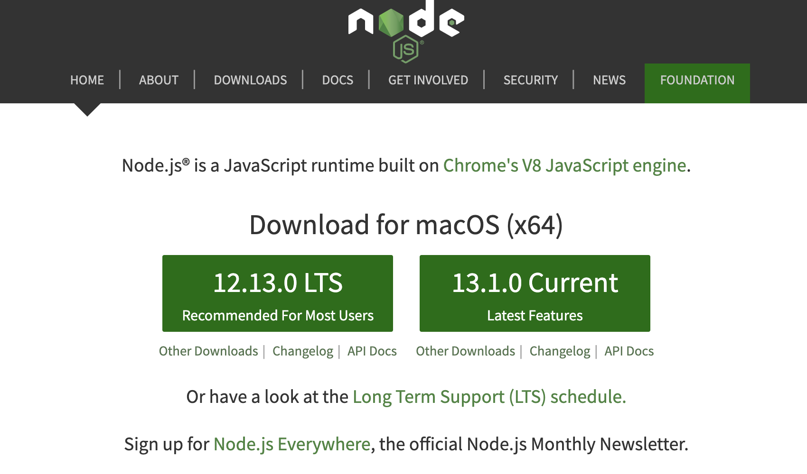
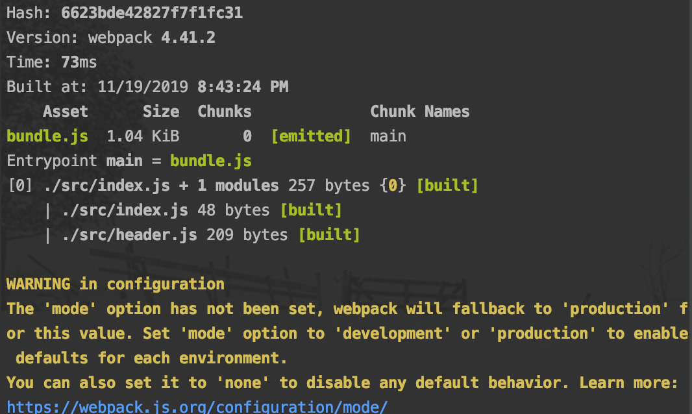
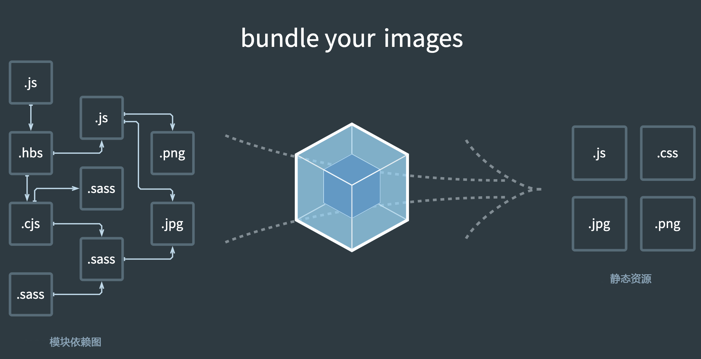
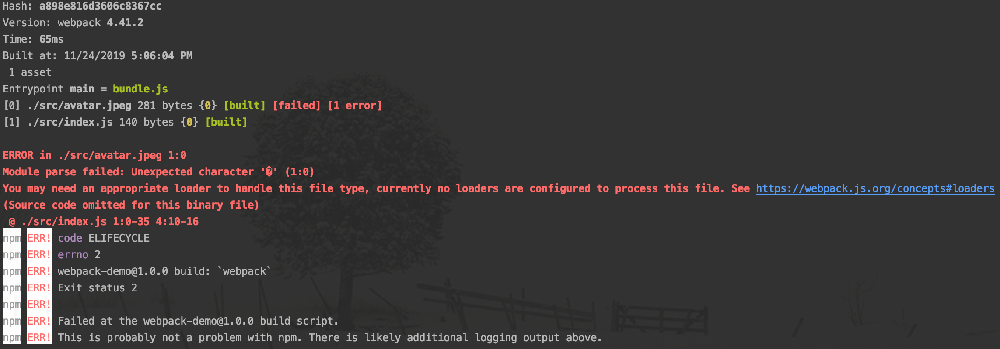

## webpack 基础

1. [webpack 是什](#what-webpack)
2. [搭建 webpack 环境](#webpack-environment)
3. [使用 webpack 配置文件](#use-config)
4. [浅析 webpack 打包输出内容](#build-content)
5. [webpack 概念之 Entry](#entry)
6. [webpack 概念之 Output](#output)
7. [webpack 概念之 Loaders](#loaders)
8. [webpack 概念之 Plugins](#plugins)
9. [webpack 概念之 Mode](#mode)
10. [解析 ECMAScript 2016+](#es6)

###  <a name="what-webpack">webpack 是什么</a>

原始的网页开发：

```html
<!DOCTYPE html>
<html lang="en">
<head>
    <meta charset="UTF-8">
    <title>原始网页开发</title>
</head>
<body>
  <div id="root"></div>
  <script src="./index.js"></script>
</body>
</html>
```

```javascript
// index.js

var root = document.getElementById('root');

var header = document.createElement('div');
header.innerText='header';
root.append(header);

var content = document.createElement('div');
content.innerText='content';
root.append(content);
```

如上采用`面向过程`的方式来写代码，所有的 Js 逻辑都堆在一个文件里，这个文件会堆得越来越长，最终变得难以维护。

后我们采用`面向对象`的方式来写代码：

```html
<!DOCTYPE html>
<html lang="en">
<head>
    <meta charset="UTF-8">
    <title>原始网页开发</title>
</head>
<body>
  <div id="root"></div>
  <script src="./header.js"></script>
  <script src="./content.js"></script>
  <script src="./index.js"></script>
</body>
</html>
```

```javascript
// header.js
function Header() {
  var header = document.createElement('div');
  header.innerText='header';
  root.append(header);
}

// content.js
function Content() {
  var content = document.createElement('div');
  content.innerText='content';
  root.append(content);
}

// index.js
var root = document.getElementById('root');

new Header();
new Content();

```

使用如上面向对象的方式确实在一定程度上提高了代码的可维护性，但同时也存在如下问题：

* http 请求增加；
* 从代码中看不出 js 文件之间的依赖关系；

* 对引入 js 文件的顺序有要求；

我们再来改造一下：

```html
<!DOCTYPE html>
<html lang="en">
<head>
    <meta charset="UTF-8">
    <title>webpack-learn</title>
</head>
<body>
  <div id="root"></div>
  <script src="./index.js"></script>
</body>
```

```javascript
// index.js
//ES Moudle 模块引入方式
import Header from './header.js';
import Content from './content.js';

new Header();
new Content();

// header.js
function Header() {
  var root = document.getElementById('root');
  var header = document.createElement('div');
  header.innerText='header';
  root.append(header);
}

// content.js
function Content() {
  var root = document.getElementById('root');
  var content = document.createElement('div');
  content.innerText='content';
  root.append(content);
}

```

但这样直接运行的话，会报错 `Uncaught SyntaxError: Unexpected identifier`，因为浏览器压根就不认识 `ES Module` 模块引入方式。这个时候 `webpack` 就派上用场了，虽然浏览器不认识，但经 `webpack` "翻译”之后就能识别了。

在上面代码基础之上，在当前目录下运行 `npm init` 并安装 `webpack` 和 `webpack-cli`；运行 `npx webpack index.js`(用 `webpack` 去翻译 `index.js` 文件)；


这个时候会发现在目录下多了个 `dist` 文件夹，`dist ` 文件夹下多了一个 `main.js` 文件；

```
.
├── dist
│   └── main.js
├── node_modules
├── index.html
├── index.js
├── header.js
├── content.js
├── package.json
```

现在我们在 `index.html` 引入经 `webpack` "翻译"过后的文件:

```html
<!DOCTYPE html>
<html lang="en">
<head>
    <meta charset="UTF-8">
    <title>webpack-learn</title>
</head>
<body>
  <div id="root"></div>
  <script src="./dist/main.js"></script>
</body>
</html>
```

现在浏览器里打开 `index.html` 还是会报错（因为使用了 `ES Module` 模块引入方式，但 `header.js` 和`content.js` 并没有采用 `ES Module` 模块导出方式），再修改下代码：

```javascript
// index.js
//ES Moudle 模块引入方式
import Header from './header.js';
import Content from './content.js';

new Header();
new Content();

// header.js
function Header() {
  var root = document.getElementById('root');
  var header = document.createElement('div');
  header.innerText='header';
  root.append(header);
}

export default Header


// content.js
function Content() {
  var root = document.getElementById('root');
  var content = document.createElement('div');
  content.innerText='content';
  root.append(content);
}

export default Content
```

再运行 `npx webpack index.js`重新"翻译" ` index.js`，就能正常打开了。那 **webpack 就是一个 Js 代码的翻译器？**

其实官网对 webpack 的定义是：**webpack  is a module bundler**

[模块、webpack模块？](https://webpack.js.org/concepts/modules/#what-is-a-webpack-module)

```javascript
import Header from './header.js';
import Content from './content.js';
```

可以将 import 后面的 `Header`或者`Content`视为一个个模块，当然除了这种 `ES6 模块 ` 引入方法还有诸如`Common JS`、`CMD` 及 `AMD`等模块引入规范。webpack 打包的模块也不仅限于 js 文件了，比如 css 文件、jpg等图片等等都可以用 webpack 进行打包。


### <a name="webpack-environment">搭建 webpack 环境</a>

webpack 是基于 `Node.js` 开发的模块打包工具，自然得先安装 `Node.js`，这儿推荐用 [nvm 安装]([https://github.com/DlLucky/Note/tree/master/Node%E7%89%88%E6%9C%AC%E7%AE%A1%E7%90%86%E5%B7%A5%E5%85%B7%E5%AE%89%E8%A3%85](https://github.com/DlLucky/Note/tree/master/Node版本管理工具安装))。

> 什么是 [nvm](https://github.com/nvm-sh/nvm) ？nvm(Node.js Version Manager) 是 Node.js 的包管理器，可以通过它方便安装和切换不同的Node.js 版本

1. 安装webpack，`nvm install v12.13.0`

   

2. 创建空目录和 `package.json`

   ```json
   mkdir my-project
   cd my-project
   npm init -y // 初始化项目以符合 node 规范, -y 默认选择 yse
   ```

   

3. 安装 webpack 和 webpack-cli

   > 什么是[webpack-cli](https://webpack.js.org/api/#cli)？自webpack 4以后独立的 webpack 命令行工具包

   * 在全局安装，并不推荐，因为不同项目可能使用的 webpack 版本或者配置不一样而至打包可能出错

     ```json
     npm install webpack webpack-cli -g
     webpack -v // 检查 webapck 是否安装成功
     ```

   * 在项目内安装

     ```json
  npm install webpack webpack-cli -D
     npx webpack -v // 检查 webapck 是否安装成功
     // 或者 ./node_modules/.bin/webpack -v
     ```


### <a name="use-config">使用 webpack 配置文件</a>

前面的例子，虽然没有看到 webpack 的配置文件，但用 `npx webpack index.js` 照样能打包？其实是运行 `npx webpack` 的时候，webpack 会去找默认的配置文件 `webpack.config.js` ，其默认配置文件默认是打包的 `src` 下面的 `index.js` 到 `dist` 目录下，但前面的例子 `index.js`并没有在 `src`下，如果在在 `src`下，直接运行 `npx webpack` 或者 `./node_modules/.bin/webpack` 便可用 webpack 的默认配置文件进行打包。

但开发中，我们可能要指定不同的配置文件应用于不同的环境，那 webpack 如何使用指定的配置文件进行打包？
用 `npx webpack --config 指定的配置文件` ，比如 `npx webpack --config webpack.dev.js`

而且在实际开发中，可能很少看到用 `npx webpack` 或者 `./node_modules/.bin/webpack` 去打包我们的项目，而更常见是用 `npm run` 这样的方式去打包。

用 `npm scripts` 方式打包的一个简单示例：

```json
.
├── dist
│   └── bundle.js
├── node_modules
├── index.html
├── package-lock.json // 锁定 npm 包版本，暂且不管
├── package.json
├── src
│   ├── header.js
│   └── index.js
└── webpack.config.js

```

```javascript
// webpack.config.js
const path = require('path');

module.exports = {
    entry: './src/index.js',
    output: {
        path: path.resolve(__dirname, 'dist'),
        filename: "bundle.js"
    }
};
```

```jso
// package.json

{
  "name": "webpack-demo",
  "version": "1.0.0",
  "description": "",
  "main": "index.js",
  "scripts": {
    "build": "webpack"
  },
  "author": "",
  "license": "ISC",
  "devDependencies": {
    "webpack": "^4.41.2",
    "webpack-cli": "^3.3.10"
  }
}

```

运行 `npm run build` 构建的时候，其实就是运行的 `package.json` 里面 `scripts` 下面的 `build` 命令，从而运行 webpack，而在 scripts 下面能直接运行 webpack，是因为模块局部安装的时候会在 `node_modules/.bin` 目录下创建一个软链接


### <a name="build-content">浅析 webpack 打包输出内容</a>

对上面例子，运行 `npm run build` 进行打包，其输出信息如下图



`Hash`：代表本次打包唯一一个 hash 值；

`Version`：打包所使用的 webpack 版本是 4.41.2 ；

`Time`：打包耗时 73 ms；

`Asset`：打包输出的文件，在这儿是 `bundle.js`，在复杂的打包输出中，可能并不止一个文件；

`Size`：打包输出的文件对应大小，在这儿即 `bundle.js` 大小为 1.04 kb；

`Chunks`：打包输出的文件对应的 id，在这儿即 `bundle.js` 对应的 id 是 0；

`Chunk Names`：打包输出的文件对应的名称，在这儿即 `bundle.js` 对应的名称是 `main`；

> 这儿的`main`，其实来自于 webpack 配置文件中的 entry
>
> ```javascript
> // 在 webpack 配置文件 webpack.config.js 中 
> entry: "./src/index.js",
> // 等价于
> entry: {
>   main: "./src/index.js"
> }
> ```

`Entrypoint main`：整个打包过程中的入口文件；

再往下是依次打包的文件；

最后有一个警告，它意思 `mode` 没有被设置，webpack 将默认设置 `mode` 值为 'development' 。根据提示，去设置上 `mode`，自然也就没有这个警告了


### <a name='entry'>webpack 概念之 Entry</a>

> * [Entry Points](https://webpack.js.org/concepts/entry-points/)
> * [Dependency Graph](https://webpack.js.org/concepts/dependency-graph/#root)

**entry 用于指定 webpack 的打包入口**



如上面模块依赖图所示，依赖图从入口起点即 entry 开始，webpack 递归地构建一个*依赖图*，这个依赖图包含着应用程序所需的每个模块（对于非代码比如图片、字体依赖也会不断的加入到依赖图中），然后将所有这些模块打包为少量的 bundle

> 依赖图从入口起点即 entry 开始，找到 entry 的依赖，entry 的依赖呢，可能又依赖于其它文件，这样就会存在一颗依赖树，在这颗依赖树上只要遇到依赖，webpack 就会将依赖文件加入到依赖图中

* entry 用方法之单入口

  ```javascript
  module.exports = {
    entry: './src/index.js', // 等价于 ['./src/index.js']，等价于 {main: './src/index.js'}
  };
  ```

* entry 用法之多入口

  ```javascript
  module.exports = {
    entry: {
      app: './src/app.js',
      search: './src/search.js'
    }
  };
  ```

如果 entey 的属性值为 string 或者 array，则打包后对应的 chunk 名称为 main；如果 entry 的属性值为对象，每个属性名为打包后对应的 chunk 名称，其属性值则是描述对应 chunk 的入口。

比如上面 entry 的多入口，打包信息如下

```she
Hash: 728e117fb51d38a51ab5
Version: webpack 4.41.2
Time: 176ms
Built at: 02/09/2020 4:59:50 PM
    Asset       Size  Chunks             Chunk Names
 index.js  946 bytes       0  [emitted]  index
search.js  947 bytes       1  [emitted]  search
Entrypoint index = index.js
Entrypoint search = search.js
[0] ./src/index.js 53 bytes {0} [built]
[1] ./src/search.js 17 bytes {1} [built]

```


### <a name='output'>webpack 概念之 Output</a>

> [Output](https://webpack.js.org/concepts/output/)

`output` **用于控制 webpack 如何向硬盘写入编译文件**。即使可能存在多个 `entry` 起点，但也只指定一个 `output` 配置

> output 的 filename 如果不写，默认为 '[name].js'，输出的文件名是 entry 入口配置的 属性名
>
> entry:  './src/index.js'  等价于 entry: { main: './src/index.js'} 输出文件名为 main.js

* Output 用法之单入口配置

  ```javascript
  module.exports = {
    entry: './src/index.js'
    output: {
      filename: 'bundle.js',
      path: __dirname + '/dist'
    }
  };
  ```

* Output 用法之多入口配置

  ```javascript
  module.exports = {
    entry: {
      app: './src/app.js',
      search: './src/search.js'
    },
    output: {
      // 通过占位符确保文件名称的唯一或者不写，因为默认为 '[name].js'，但若写成固定名称比如 'bundle.js'打包会报错
      filename: '[name].js',
      path: __dirname + '/dist'
    }
  };
  
  // 写入到硬盘：./dist/app.js, ./dist/search.js
  ```


### <a name='loaders'>webpack 概念之 Loaders</a>

>  [Loaders](https://webpack.js.org/concepts/loaders/)

webpack 开箱即用只支持 JS 和 JSON 两种文件类型，**通过 Loaders 去支持其他文件类型**(比如css/less文件、jsx语法糖、vue指令、字体等)并把它们转换成有效的模块，并可以添加到依赖图中。

其本身是一个函数，接受源文件作为参数，返回转换的结果。

常见的一些 Loaders：

| 名称          | 描述                       |
| :------------ | -------------------------- |
| babel-loader  | 转换ES6、ES7等JS新特性语法 |
| css-loader    | 支持.css文件的加载和解析   |
| less-loader   | 将less文件转换成css        |
| s-loader      | 将TS转换成JS               |
| file-loade    | 进行图片、字体等的打包     |
| raw-loader    | 将文件以字符串的形式导入   |
| thread-loader | 多进程打包JS和CSS          |

Loaders 的用法：

```javascript
module.exports = {
  module: {
    rules: [
      {
        test: /\.css$/,
        use: [
          { loader: 'style-loader' },
          {
            loader: 'css-loader',
            options: {
              modules: true
            }
          },
        ]
      }
    ]
  }
};
```

`test`：指定匹配规则

`use`：指定使用的 loader 名称

一个简单的例子处理图片：

```json
// 结构目录
.
├── index.html
├── package-lock.json
├── package.json
├── src
│   ├── avatar.jpeg
│   └── index.js
└── webpack.config.js
```

```json
// package.json

{
  "name": "webpack-demo",
  "version": "1.0.0",
  "description": "",
  "main": "index.js",
  "scripts": {
    "build": "webpack"
  },
  "author": "",
  "license": "ISC",
  "devDependencies": {
    "file-loader": "^4.3.0",
    "webpack": "^4.41.2",
    "webpack-cli": "^3.3.10"
  }
}
```

```html
// index.html

<!DOCTYPE html>
<html lang="en">
<head>
    <meta charset="UTF-8">
    <title>webpack-demo</title>
</head>
<body>
    <div id="root"></div>
</body>
</html>
```

```javascript
// index.js

import avatar from './avatar.jpeg';

var img = new Image();
img.src = avatar;

var root = document.getElementById('root');
root.append(img);
```

```javascript
// webpack.config.js

const path = require('path');

module.exports = {
    mode: 'production',
    entry: './src/index.js',
    output: {
        path: path.resolve(__dirname, 'dist'),
        filename: "bundle.js"
    },
};
```


现在在命令行里运行打包名称`npm run build`，会报错，因为 webpack 并不知道如何处理图片文件



然后我们改造一下  `webpack.config.js`，添加对图片类文件的处理

```javascript
// 改造后的 webpack.config.js

const path = require('path');

module.exports = {
    mode: 'production',
    entry: './src/index.js',
    output: {
        path: path.resolve(__dirname, 'dist'),
        filename: "bundle.js"
    },
    module: {
        rules: [
            {
                test: /\.jpeg$/,
                use: {
                    loader: "file-loader"
                }
            }
        ]
    }
};
```

再运行打包命令就能打包成功了


然后将`index.html`复制到`dist`目录，再引入打包后的文件`bundle.js`文件，便能正常的显示图片了

```html
// index.html

<!DOCTYPE html>
<html lang="en">
<head>
    <meta charset="UTF-8">
    <title>webpack-learn</title>
</head>
<body>
  <div id="root"></div>
  <script src="./bundle.js"></script>
</body>
</html>
```


### <a name='plugins'>webpack 概念之 Plugins</a>

> [Plugins](https://webpack.js.org/concepts/plugins/)

`Plugins` 的目的在于解决 loader 无法实现的其它事情，增加 webpack 的功能（在 webpack 运行到某个时刻的时候，帮着做一些其它事情），**通常用于打包输出文件(bundle)的优化**，资源管理和环境变量注入，作用于整个构建过程

常见的一些 Plugins：

| 名称                 | 描述Cl                         |
| -------------------- | ------------------------------ |
| CleanWebpackPlugin   | 清除构建目录                   |
| MiniCssExtractPlugin | 将CSS提取到单独的文件中        |
| CopyWebpackPlugin    | 将文件或者文件夹拷贝到构建目录 |
| HtmlWebpackPlugin    | 创建htm文件去承载输出的 bundle |
| TerserWebpackPlugin  | 压缩JS                         |

Plugins 的用法

```javascript
// html-webpack-plugin 在整个打包过程结束的时刻帮着生成一个html文件，然后把打包的结果注入到html文件中
var HtmlWebpackPlugin = require('html-webpack-plugin');
var path = require('path');

module.exports = {
  entry: 'index.js',
  output: {
    path: path.resolve(__dirname, './dist'),
    filename: 'index_bundle.js'
  },
  plugins: [new HtmlWebpackPlugin()] // 放到 plugins 数组里
};
```


### <a name='mode'>webpack 概念之 Mode</a>

> [Mode](https://webpack.js.org/configuration/mode/)（在 webpack 4 以前并没有这个概念）

`Mode` **用于指定当前的构建环境**是：production、development 还是 none；
设置 mode 可以使用 webpack 内置的函数，默认值为 production

| 选项          | 描述                                                         |
| ------------- | ------------------------------------------------------------ |
| `development` | 会将 `DefinePlugin` 中 `process.env.NODE_ENV` 的值设置为 `development`。启用 `NamedChunksPlugin` 和 `NamedModulesPlugin`。 |
| `production`  | 会将 `DefinePlugin` 中 `process.env.NODE_ENV` 的值设置为 `production`。启用 `FlagDependencyUsagePlugin`, `FlagIncludedChunksPlugin`, `ModuleConcatenationPlugin`, `NoEmitOnErrorsPlugin`, `OccurrenceOrderPlugin`, `SideEffectsFlagPlugin` 和 `TerserPlugin`。 |
| `none`        | 退出任何默认优化选项                                         |

Mode 的用法：

* 在配置对象中提供 `mode` 选项：

  ```javascript
  module.exports = {
    mode: 'production'
  };
  ```

* 从 [CLI](https://webpack.docschina.org/api/cli/) 参数中传递：

  ```javascript
  webpack --mode=production
  ```


### <a name="es6">解析 ECMAScript 2015+</a>

`webpack` 并不支持对  `ECMAScript 2015+` 的编译，得借助 `babel`，而 `babel-loader` 就是 `babel`结合 `webpack` 的使用方式

> `babel` 是什么？
>
> 简单来说，babel 就是一个 JavaScript 的语法编译器，主要用于将 ECMAScript 2015+ 代码转换为向后兼容的 JavaScript 版本，以便能够运行在当前和旧版本的浏览器或其他环境中。
>
> * 把 ES6 的代码转换为 ES5 代码，这样即使代码最终的运行环境（如浏览器）不支持 ES6，在开发期间也能使用最新语法提升开发效率和质量；
> * 有些 ES6 最新 Api，目标运行环境还没有普遍提供实现，babel 借助 core-js 对可以自动给 js 代码添加polyfill，以便最终在浏览器运行的代码能够正常使用那些 api；babel 始终能提供对最新 ES 提案的支持；
> * ...
>
> 更多关于 `babel` 的介绍，请查看这篇文章 [关于 babel 配置项的这点事](https://github.com/DlLucky/Note/tree/master/Webpack%20Note/%E5%85%B3%E4%BA%8Ebabel%E9%85%8D%E7%BD%AE%E9%A1%B9%E7%9A%84%E8%BF%99%E7%82%B9%E4%BA%8B)

下面贴出 `babel` 应用于项目的配置文件 `babel.config.js`

```javascript
module.exports = {
    presets: [
        [
            "@babel/preset-env",
            {
                useBuiltIns : "usage",
                modules: false,
                corejs: {version: 3, proposals: true},
            }
        ]
    ],
    plugins: [
        [
            "@babel/plugin-transform-runtime",
            {
                regenerator: false
            }
        ]
    ]
};
```

并安装相应的 npm 包

```shell
npm install --save-dev babel-loader @babel/core @babel/preset-env @babel/plugin-transform-runtime

npm install --save core-js @babel/runtime
```

在 webpack 中添加 `babel-loader` 对 js 文件的解析

```javaScript
 rules: [
          {
             test: /\.js$/,
             use: {
                   loader: "babel-loader",
                   options: {
                      cacheDirectory: true,
                  }
               }
           }
        ]
```


