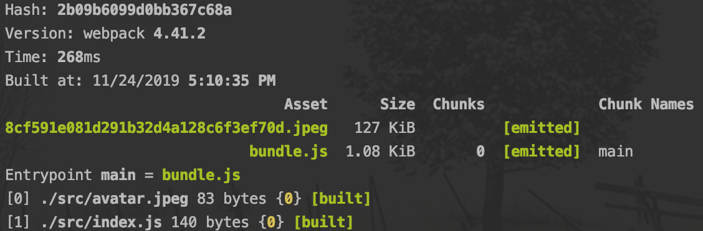

## webpack 基础用法

1. [webpack 概念之 Entry](#entry)
2. [webpack 概念之 Output](#output)
3. [webpack 概念之 Loaders](#loaders)
4. [webpack 概念之 Plugins](#plugins)
5. [webpack 概念之 Mode](#mode)
6. [解析 ECMAScript 2016+](#es6)

### <a name='entry'>webpack 概念之 Entry</a>

> * [Entry Points](https://webpack.js.org/concepts/entry-points/)
> * [Dependency Graph](https://webpack.js.org/concepts/dependency-graph/#root)

`Entry` **用于指定 webpack 的打包入口**


如上面模块依赖图所示，依赖图从入口起点即 `Entry` 开始，webpack 递归地构建一个*依赖图*，这个依赖图包含着应用程序所需的每个模块（对于非代码比如图片、字体依赖也会不断的加入到依赖图中），然后将所有这些模块打包为少量的 bundle

> 依赖图从入口起点即 `Entry` 开始，找到 Entry 的依赖，Entry 的依赖呢，可能又依赖于其它文件，这样就会存在一颗依赖树，在这颗依赖树上只要遇到依赖，webpack 就会将依赖文件加入到依赖图中

* Entry 用方法之单入口

  ```javascript
  // entry 是一个字符串
  module.exports = {
    entry: './src/index.js'
  };
  
  // 上面写法等价于下面的写法
  module.exports = {
    entry: {
      main: './src/index.js',
    }
  };
  ```

  > 还有一种数组的写法

* Entry 用法之多入口

  ```javascript
  module.exports = {
    entry: {
      app: './src/app.js',
      search: './src/search.js'
    }
  };
  ```

### <a name='output'>webpack 概念之 Output</a>

> [Output](https://webpack.js.org/concepts/output/)

`output` **用于控制 webpack 如何向硬盘写入编译文件**。即使可能存在多个 `entry` 起点，但也只指定一个 `output` 配置

* Outpu t用法之单入口配置

  ```javascript
  module.exports = {
    entry: './src/index.js'
    output: {
      filename: 'bundle.js',
      path: __dirname + '/dist'
    }
  };
  ```

  

* Output 用法之多入口配置

  ```javascript
  module.exports = {
    entry: {
      app: './src/app.js',
      search: './src/search.js'
    },
    output: {
      filename: '[name].js', // 通过占位符确保文件名称的唯一
      path: __dirname + '/dist'
    }
  };
  
  // 写入到硬盘：./dist/app.js, ./dist/search.js
  ```

### <a name='loaders'>webpack 概念之 Loaders</a>

>  [Loaders](https://webpack.js.org/concepts/loaders/)

webpack 开箱即用只支持 JS 和 JSON 两种文件类型，**通过 Loaders 去支持其他文件类型**(比如css/less文件、jsx语法糖、vue指令、字体等)并把它们转换成有效的模块，并可以添加到依赖图中。

其本身是一个函数，接受源文件作为参数，返回转换的结果。

常见的一些 Loaders：

| 名称          | 描述                       |
| :------------ | -------------------------- |
| babel-loader  | 转换ES6、ES7等JS新特性语法 |
| css-loader    | 支持.css文件的加载和解析   |
| less-loader   | 将less文件转换成css        |
| s-loader      | 将TS转换成JS               |
| file-loade    | 进行图片、字体等的打包     |
| raw-loader    | 将文件以字符串的形式导入   |
| thread-loader | 多进程打包JS和CSS          |

Loaders 的用法：

```javascript
module.exports = {
  module: {
    rules: [
      {
        test: /\.css$/,
        use: [
          { loader: 'style-loader' },
          {
            loader: 'css-loader',
            options: {
              modules: true
            }
          },
        ]
      }
    ]
  }
};
```

`test`：指定匹配规则

`use`：指定使用的 loader 名称

一个简单的例子处理图片：

```json
// 结构目录
.
├── index.html
├── package-lock.json
├── package.json
├── src
│   ├── avatar.jpeg
│   └── index.js
└── webpack.config.js
```

```json
// package.json

{
  "name": "webpack-demo",
  "version": "1.0.0",
  "description": "",
  "main": "index.js",
  "scripts": {
    "build": "webpack"
  },
  "author": "",
  "license": "ISC",
  "devDependencies": {
    "file-loader": "^4.3.0",
    "webpack": "^4.41.2",
    "webpack-cli": "^3.3.10"
  }
}
```

```html
// index.html

<!DOCTYPE html>
<html lang="en">
<head>
    <meta charset="UTF-8">
    <title>webpack-demo</title>
</head>
<body>
    <div id="root"></div>
</body>
</html>
```

```javascript
// index.js

import avatar from './avatar.jpeg';

var img = new Image();
img.src = avatar;

var root = document.getElementById('root');
root.append(img);
```

```javascript
// webpack.config.js

const path = require('path');

module.exports = {
    mode: 'production',
    entry: './src/index.js',
    output: {
        path: path.resolve(__dirname, 'dist'),
        filename: "bundle.js"
    },
};
```


现在在命令行里运行打包名称`npm run build`，会报错，因为 webpack 并不知道如何处理图片文件


然后我们改造一下  `webpack.config.js`，添加对图片类文件的处理

```javascript
// 改造后的 webpack.config.js

const path = require('path');

module.exports = {
    mode: 'production',
    entry: './src/index.js',
    output: {
        path: path.resolve(__dirname, 'dist'),
        filename: "bundle.js"
    },
    module: {
        rules: [
            {
                test: /\.jpeg$/,
                use: {
                    loader: "file-loader"
                }
            }
        ]
    }
};
```

再运行打包命令就能打包成功了



然后将`index.html`复制到`dist`目录，再引入打包后的文件`bundle.js`文件，便能正常的显示图片了

```html
// index.html

<!DOCTYPE html>
<html lang="en">
<head>
    <meta charset="UTF-8">
    <title>webpack-learn</title>
</head>
<body>
  <div id="root"></div>
  <script src="./bundle.js"></script>
</body>
</html>
```


### <a name='plugins'>webpack 概念之 Plugins</a>

> [Plugins](https://webpack.js.org/concepts/plugins/)

`Plugins` 的目的在于解决 loader 无法实现的其它事情，增加 webpack 的功能，**通常用于打包输出文件(bundle)的优化**，资源管理和环境变量注入，作用于整个构建过程

常见的一些 Plugins：

| 名称                 | 描述Cl                         |
| -------------------- | ------------------------------ |
| CleanWebpackPlugin   | 清除构建目录                   |
| MiniCssExtractPlugin | 将CSS提取到单独的文件中        |
| CopyWebpackPlugin    | 将文件或者文件夹拷贝到构建目录 |
| HtmlWebpackPlugin    | 创建htm文件去承载输出的 bundle |
| TerserWebpackPlugin  | 压缩JS                         |

Plugins 的用法

```javascript
var HtmlWebpackPlugin = require('html-webpack-plugin');
var path = require('path');

module.exports = {
  entry: 'index.js',
  output: {
    path: path.resolve(__dirname, './dist'),
    filename: 'index_bundle.js'
  },
  plugins: [new HtmlWebpackPlugin()] // 放到 plugins 数组里
};
```

### <a name='mode'>webpack 概念之 Mode</a>

> [Mode](https://webpack.js.org/configuration/mode/)（在 webpack 4 以前并没有这个概念）

`Mode` **用于指定当前的构建环境**是：production、development 还是 none；
设置 mode 可以使用 webpack 内置的函数，默认值为 production

| 选项          | 描述                                                         |
| ------------- | ------------------------------------------------------------ |
| `development` | 会将 `DefinePlugin` 中 `process.env.NODE_ENV` 的值设置为 `development`。启用 `NamedChunksPlugin` 和 `NamedModulesPlugin`。 |
| `production`  | 会将 `DefinePlugin` 中 `process.env.NODE_ENV` 的值设置为 `production`。启用 `FlagDependencyUsagePlugin`, `FlagIncludedChunksPlugin`, `ModuleConcatenationPlugin`, `NoEmitOnErrorsPlugin`, `OccurrenceOrderPlugin`, `SideEffectsFlagPlugin` 和 `TerserPlugin`。 |
| `none`        | 退出任何默认优化选项                                         |

Mode 的用法：

* 在配置对象中提供 `mode` 选项：

  ```javascript
  module.exports = {
    mode: 'production'
  };
  ```

* 从 [CLI](https://webpack.docschina.org/api/cli/) 参数中传递：

  ```javascript
  webpack --mode=production
  ```


### <a name="es6">解析 ECMAScript 2015+</a>

`webpack` 并不支持对  `ECMAScript 2015+` 的编译，得借助 `babel`，而babel-loader` 就是 `babel` 结合 `webpack` 的使用方式

> `babel` 是什么？
>
> 简单来说，babel 就是一个 JavaScript 的语法编译器，主要用于将 ECMAScript 2015+ 代码转换为向后兼容的 JavaScript 版本，以便能够运行在当前和旧版本的浏览器或其他环境中。
>
> * 把 ES6 的代码转换为 ES5 代码，这样即使代码最终的运行环境（如浏览器）不支持 ES6，在开发期间也能使用最新语法提升开发效率和质量；
> * 有些 ES6 最新 Api，目标运行环境还没有普遍提供实现，babel 借助 core-js 对可以自动给 js 代码添加polyfill，以便最终在浏览器运行的代码能够正常使用那些 api；babel 始终能提供对最新 ES 提案的支持；
> * ...
>
> 更多关于 `babel` 的介绍，请查看这篇文章 [关于 babel 配置项的这点事]([https://github.com/DlLucky/Note/tree/master/Webpack%20Note/%E5%85%B3%E4%BA%8Ebabel%E9%85%8D%E7%BD%AE%E9%A1%B9%E7%9A%84%E8%BF%99%E7%82%B9%E4%BA%8B](https://github.com/DlLucky/Note/tree/master/Webpack Note/关于babel配置项的这点事))

下面贴出 `babel` 应用于项目的配置文件 `babel.config.js`

```javascript
module.exports = {
    presets: [
        [
            "@babel/preset-env",
            {
                useBuiltIns : "usage",
                modules: false,
                corejs: {version: 3, proposals: true},
            }
        ]
    ],
    plugins: [
        [
            "@babel/plugin-transform-runtime",
            {
                regenerator: false
            }
        ]
    ]
};
```

并安装相应的 npm 包

```shell
npm install --save-dev babel-loader @babel/core @babel/preset-env @babel/plugin-transform-runtime

npm install --save core-js @babel/runtime
```

在 webpack 中添加 `babel-loader` 对 js 文件的解析

```diff
+ rules: [
+          {
+             test: /\.js$/,
+             use: {
+                   loader: "babel-loader",
+                   options: {
+                      cacheDirectory: true,
+                  }
+               }
+           }
+        ]
```


