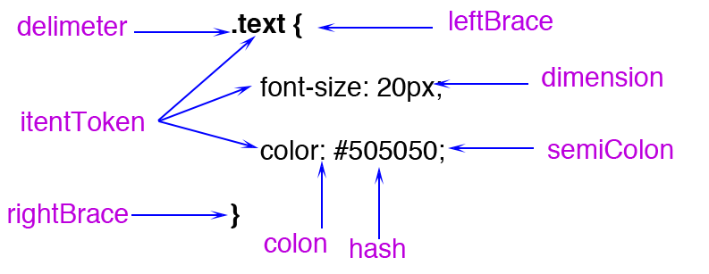
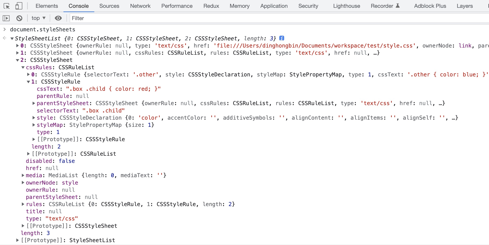
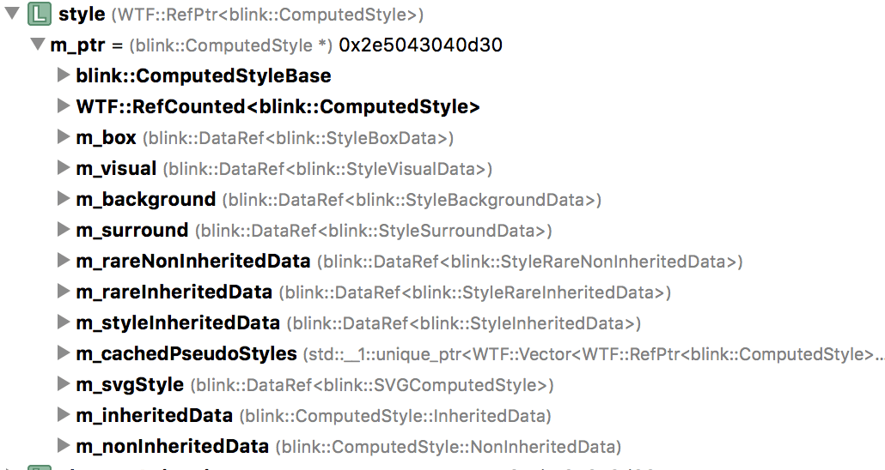
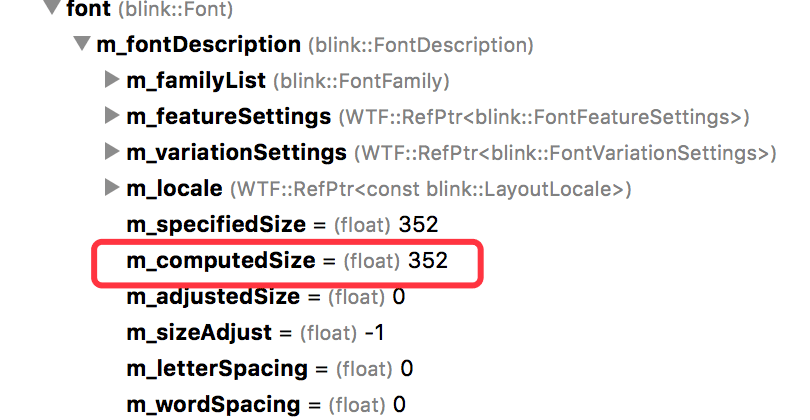

# 浏览器如何计算CSS

> 文章主要摘录于 [从Chrome源码看浏览器如何计算CSS](https://zhuanlan.zhihu.com/p/25380611)

首先我们知道页面可以通过三种方式设置自定义样式：1、通过 link 引用的外部 CSS 文件；2、<style> 标记内的 CSS；3、元素的 style 属性内嵌的 CSS。


浏览器在解析HTML构建DOM树的过程中，如果遇到style标签，那在style标签闭合的时候（onclosetag）的就能拿到style标签里面的CSS内容了，如果遇到是link标签，当把它插到DOM里面之后，就会触发CSS的加载（这个过程可能会被提前，比如浏览器有“预加载扫描（preload scanner）”程序），这个加载过程是异步的，并不会阻塞 HTML 的解析，待CSS加载完才能拿到里面的CSS内容。

# 1、生成Tokens序列

这里和解析HTML一样，拿到 CSS 内容后需要先生成 CSS 的 Tokens 序列，CSS 的 token 是有多种类型的，我们可以看一张图，这样的一个 CSS 被划分成了多个类型。



同样是设置颜色，如果我们使用的是 rgb 的格式，token 的类型将是一个函数，也就是说我们需要通过调用函数来计算得出颜色，从这里看的话，使用 16 进制格式的话要比 rgb 格式性能更好一些。


# 2、将Tokens转换为cssRule

在这里不关心把 tokens 转化成 cssRule 的规则是怎样的，但我们可以了解一下 cssRule，每个 cssRule 主要包含两部分，一个是选择器 selectors，另一个属性值 properties 集合，每一个 CSS 的选择器与属性集构成一条 cssRule。

如下是 demo.css 内容：

```css
.text .hello{
    color: rgb(200, 200, 200);
    width: calc(100% - 20px);
}
 
#world{
    margin: 20px;
}
```

上面 CSS 打印出来的 cssRule 中 selectors 部分：

```bash
selector text = “.text .hello”
value = “hello” matchType = “Class” relation = “Descendant”
tag history selector text = “.text”
value = “text” matchType = “Class” relation = “SubSelector”
selector text = “#world”
value = “world” matchType = “Id” relation = “SubSelector”
```

我们可以发现其是从右到左进行解析的，这个在匹配标签的时候比较有用。blink定义了一下几种matchType：

```cpp
enum MatchType {
    Unknown,
    Tag,               // Example: div
    Id,                // Example: #id
    Class,             // example: .class
    PseudoClass,       // Example:  :nth-child(2)
    PseudoElement,     // Example: ::first-line
    PagePseudoClass,   // ??
    AttributeExact,    // Example: E[foo="bar"]
    AttributeSet,      // Example: E[foo]
    AttributeHyphen,   // Example: E[foo|="bar"]
    AttributeList,     // Example: E[foo~="bar"]
    AttributeContain,  // css3: E[foo*="bar"]
    AttributeBegin,    // css3: E[foo^="bar"]
    AttributeEnd,      // css3: E[foo$="bar"]
    FirstAttributeSelectorMatch = AttributeExact,
  };
```

还定义了几种选择器的类型：

```cpp
enum RelationType {
    SubSelector,       // No combinator
    Descendant,        // "Space" combinator
    Child,             // > combinator
    DirectAdjacent,    // + combinator
    IndirectAdjacent,  // ~ combinator
    // Special cases for shadow DOM related selectors.
    ShadowPiercingDescendant,  // >>> combinator
    ShadowDeep,                // /deep/ combinator
    ShadowPseudo,              // ::shadow pseudo element
    ShadowSlot                 // ::slotted() pseudo element
  };
```

`.text .hello`的`.hello`选择器的类型就是 Descendant，即后代选择器，选择器的类型帮助我们快速匹配到这个元素的样式。如`.hello`的类型是后代选择器，所以它从右往左的下一个选择器就是它的父选择器，于是判断当前元素的所有父元素是否匹配`.text`这个选择器。

打印出来的 cssRule 中 properties 部分：

```bash
selector text = “.text .hello”
perperty id = 15 value = “rgb(200, 200, 200)”
perperty id = 316 value = “calc(100% – 20px)”
selector text = “#world”
perperty id = 147 value = “20px”
perperty id = 146 value = “20px”
perperty id = 144 value = “20px”
perperty id = 145 value = “20px”
```

所有的 CSS 的属性名都是用 id 标志的，上面的 id 依次对应：

```cpp
enum CSSPropertyID {
    CSSPropertyColor = 15,
    CSSPropertyWidth = 316,
    CSSPropertyMarginLeft = 145,
    CSSPropertyMarginRight = 146,
    CSSPropertyMarginTop = 147,
    CSSPropertyMarkerEnd = 148,
}
```

设置的 `margin: 20px`，会转化成四个属性。从这里可以看出 CSS 提倡属性合并，但是最后还是会被拆成各个小属性。所以属性合并最大的作用应该在于减少CSS的代码量。

# 3、由cssRule构成styleSheet

每一个 CSS 的选择器与属性集构成一条 cssRule，同一个 css 表（一个 <style> 标签或者 外链样式的 <link> ）的所有 rule 会被放到 CSSStyleSheet 对象里面，Chrome 渲染引擎 Blink 会把用户的样式存放到一个 m_authorStyleSheets 的向量里面，如下图示意：


除了 autherStyleSheet，还有浏览器默认的样式 DefaultStyleSheet，这里面有几张，最常见的是 UAStyleSheet，其它的还有 svg 和全屏的默认样式表。Blink UAStyleSheet 全部样式可见这个文件 [html.css](https://source.chromium.org/chromium/chromium/src/+/main:third_party/blink/renderer/core/html/resources/html.css)，这里面有一些常见的设置，如把 style/link/script 等标签 `display: none`，把 div/h1/p 等标签`display: block`，设置 p/h1/h2 等标签的margin值等，从这个样式表还可以看到Chrome已经支持了HTML5.1新加的标签，如dialog：

```css
dialog {
    display: block;
    position: absolute;
    left: 0;
    right: 0;
    width: fit-content;
    height: fit-content;
    margin: auto;
    border: solid;
    padding: 1em;
    background-color: Canvas;
    color: CanvasText;
}
```

另外还有怪异模式的样式表 [quirk.css](https://source.chromium.org/chromium/chromium/src/+/main:third_party/blink/renderer/core/html/resources/quirks.css)，这个文件很小，影响比较大的主要是下面：

```css
/* This will apply only to text fields, since all other inputs already use border box sizing */
input:not([type=image i]), textarea {
    box-sizing: border-box;
}
```

Blink 会先去加载 [html.css](https://source.chromium.org/chromium/chromium/src/+/main:third_party/blink/renderer/core/html/resources/html.css) 文件，怪异模式下再接着加载 [quirk.css](https://source.chromium.org/chromium/chromium/src/+/main:third_party/blink/renderer/core/html/resources/quirks.css) 文件。

最后会把生成的 cssRule 放到一个 hashMap 中。

```cpp
CompactRuleMap m_idRules;
CompactRuleMap m_classRules;
CompactRuleMap m_tagRules;
CompactRuleMap m_shadowPseudoElementRules;
```

hasMap 根据右边第一个 selector 的类型进行分类存放 cssRule，一共有 ID，类名，标签，伪类四种类型，这样做的目的是为了在比较的时候能够很快地取出匹配第一个选择器的所有 cssRule，然后每条 cssRule 再检查它的下一个 selector 是否匹配当前元素。

注意 styleSheet 里面的并不包含有内联样式，只有外链 <link> 以及 <style>里面的样式，在 MDN 上也有说明 [Document.styleSheets](https://developer.mozilla.org/en-US/docs/Web/API/Document/stylesheets) ，另外这个 styleSheet 可以通过在浏览器控制台 `document.styleSheets` 查看其结构，比如如下代码

> 关于什么是 CSSOM，和 styleSheet 又是什么关系？可以查看 [CSSOM（CSS Object Model）介绍和指南](https://github.com/FrankKai/FrankKai.github.io/issues/227)。
> 

```html
<!DOCTYPE html>
<html lang="en">
<head>
    <meta charset="UTF-8" />
    <title>Layer Explosion</title>
    <link href="style.css" rel="stylesheet">
    <style>
        .box {
            width: 400px;
            height: 30px;
            background-color: orange;
        }
    </style>
    <style>
        .other {
            color: blue;
        }
        .box .child {
            color: red;
        }
    </style>
</head>
<body>
    <div class="box" style="border-radius: 4px">
        <div class="child">child</div>
    </div>
</body>
</html>
```

在控制台查看 styleSheet 结构



从输出结果来看，确实是没有 `border-radius: 4px` 的样式内容，那内联的样式是如何加到 DOM 节点的计算样式上去的呢？别急，后文会讲到。

# 4、设置DOM节点的computedStyle

在解析好 CSS 之后，会触发 Layout Tree，而在进行 Layout 之前需要确定每个 DOM 节点的样式，比如`dispaly:none`不会出现在 Layout Tree 中，而在 Layout 之前需要计算得到每个节点的 computedStyle。为什么需要 computedStyle，因为可能会有多个选择器的样式命中了该标签，所以需要把几个选择器的样式属性综合在一起，以及继承父元素的属性以及 UA 的提供的属性。这个过程主要包括两步：根据当前节点的选择器匹配到对应的样式和设置样式。

1. 首先是根据当前节点的选择器匹配到对应的样式**，**我们一个DOM树上有那么多的节点，我们如何快速高效的找到每一个节点对应的 CSS 样式呢？首先我们需要遍历每一个 DOM 节点，将按照id、class、伪元素、标签的顺序取出所有的 selector，之前说过我们会把每一条 rule 放入到一个 hasMap 中，我们可以根据遍历到的这个节点的选择器快速的和 hasMap 的键进行配对，找到保存的 cssRule。我们还是以这个demo为例
   
    ```html
    <style>
    	.text{
    	    font-size: 22em;
    	}
    	.text p{
    	    color: #505050;
    	}
    </style>
    <div class="text">
        <p>hello, world</p>
    </div>
    ```
    
    其会生成两个 cssRule，第一个 cssRule 会放到上面提到的四个 hasMap 中的 classRules 里面，而第二个 cssRule 会放到 tagRules 里面，我们在遇到`<div class="text">`的时候会对应到hasMap 里的 classRule，首先与**`.text`**进行匹配，如果成功就判断其父选择器是否匹配，这个样式没有父选择器所以就成功返回了，如果失败就直接退出。
    
    第二个我们遇见了**.`text p`**，还是一样的我们会由 tagRuled 先匹配 p 标签，因为选择器的类型是后代选择器**，**所以我们会对当前节点的所有父节点进行遍历，查看是否可以匹配到`.text`如果命中就再查看其左边再有没有其他的选择器了，如果没有就可以成功返回了。
    
    这里需要注意的是我们在查找完右边第一个选择器后如果左边还有其他的选择器我们需要使用之前的方法递归判断当前节点的父节点或者其他情况，我们知道使用递归往往是比较消耗性能的，所以我们不应将复合选择器写的过长，最好不要超过三层。
    
2. 然后就是设置 DOM 节点的样式了，设置 style 的顺序是先继承父结点，然后使用 UA 的 style，最后再使用用户的 style。
   
    ```cpp
    style->inheritFrom(*state.parentStyle())
    matchUARules(collector);
    matchAuthorRules(*state.element(), collector);
    ```
    
    每一步如果有 cssRule 匹配成功的话会把它放到当前元素的 m_matchedRules 的向量里面，并会去计算它的优先级，记录到 m_specificity 变量。这个优先级是怎么算的呢？
    
    ```cpp
    for (const CSSSelector* selector = this; selector;
         selector = selector->tagHistory()) { 
    		 temp = total + selector->specificityForOneSelector();
    }
    return total;
    ```
    
    如上代码所示，它会从右到左取每个selector的优先级之和。不同类型的selector的优级级定义如下
    
    ```cpp
    switch (m_match) {
        case Id: 
          return 0x010000;
        case PseudoClass:
          return 0x000100;
        case Class:
        case PseudoElement:
        case AttributeExact:
        case AttributeSet:
        case AttributeList:
        case AttributeHyphen:
        case AttributeContain:
        case AttributeBegin:
        case AttributeEnd:
          return 0x000100;
        case Tag:
          return 0x000001;
        case Unknown:
          return 0;
      }
      return 0;
    }
    ```
    
    从中我们可以看到 ID 选择器的优先级最高是 16 进制的 0x010000=65536，类、属性、伪类的优先级是 0x100 = 256，标签选择器的优先级是 1，其他如通配符就是  0了，如下面计算所示：
    
    ```css
    /*优先级为257 = 265 + 1*/
    .text h1{
        font-size: 8em;
    }
     
    /*优先级为65537 = 65536 + 1*/
    #my-text h1{
        font-size: 16em;
    }
    ```
    
    内联 style 的优先级又是怎么处理的呢？当匹配完了当前元素的所有 cssRule 规则，全部放到了 collector 的 m_matchedRules 里面，再把这个向量根据优先级从小到大排序：
    
    ```cpp
    collector.sortAndTransferMatchedRules();
    ```
    
    排序的规则是这样的：
    
    ```cpp
    static inline bool compareRules(const MatchedRule& matchedRule1,const MatchedRule& matchedRule2) {
      unsigned specificity1 = matchedRule1.specificity();
      unsigned specificity2 = matchedRule2.specificity();
      if (specificity1 != specificity2)
        return specificity1 < specificity2;
      return matchedRule1.position() < matchedRule2.position();
    }
    ```
    
    先按优先级，如果两者的优先级一样，则比较它们先后位置。在把 css 样式表（CSSStyleSheet）的样式处理完了之后，Blink 再去取 style 的内联样式（这个在是在构建 DOM 的时候存放好了的），把内联样式 push_back 到上面排好序的容器里，由于它是由小到大排序的，所以放最后面的优先级肯定是最大的。
    
    ```cpp
    collector.addElementStyleProperties(state.element()->inlineStyle(),isInlineStyleCacheable);
    ```
    
    所有的样式规则都处理完毕，最后就是按照它们的优先级计算 CSS 了，将在下面这个函数执行：
    
    ```cpp
    applyMatchedPropertiesAndCustomPropertyAnimations(state, collector.matchedResult(), element);
    ```
    
    这个函数会按照下面的顺序依次设置元素的 style：
    
    ```cpp
    applyMatchedProperties<HighPropertyPriority, CheckNeedsApplyPass>(state, matchResult.allRules(), false, applyInheritedOnly, needsApplyPass);
    for (auto range : ImportantAuthorRanges(matchResult)) {
      applyMatchedProperties<HighPropertyPriority, CheckNeedsApplyPass>(state, range, true, applyInheritedOnly, needsApplyPass);
    }
    ```
    
    先设置正常的规则，最后再设置important的规则。所以越往后的设置的规则就会覆盖前面设置的规则。
    
    接下来我们可以大概看一下计算出来的 style 是什么样的，按优先级计算出来的 style 会被放在一个ComputedStyle的对象里面，这个 style 里面的规则分成了几类，通过检查style对象可以一窥：
    
    
    
    把它画成一张图表的话：
    
    
    
    主要有几类，box 是长宽，surround 是 margin/padding，还有不可继承的 nonInheritedData 和可继承的 styleIneritedData 一些属性。Blink 还把很多比较少用的属性放到 rareData 的结构里面，为避免实例化这些不常用的属性占了太多的空间。
    
    具体来说，上面示例中设置的 font-size 为：22em * 16px = 352px：
    
    
    
    而所有的色值会变成 16 进制的整数，如 Blink 定义的两种颜色的色值：
    
    ```cpp
    static const RGBA32 lightenedBlack = 0xFF545454;
    static const RGBA32 darkenedWhite = 0xFFABABAB;
    ```
    
    同时 Blink 对 rgba 色值的转化算法:
    
    ```cpp
    RGBA32 makeRGBA32FromFloats(float r, float g, float b, float a) {
      return colorFloatToRGBAByte(a) << 24 | colorFloatToRGBAByte(r) << 16 | colorFloatToRGBAByte(g) << 8 | colorFloatToRGBAByte(b);
    }
    ```
    
    从这里可以看到，有些CSS优化建议说要按照下面的顺序书写CSS规则：
    
    > 1.位置属性(position, top, right, z-index, display, float等)；
    > 
    > 
    > 2.大小(width, height, padding, margin)；
    > 
    > 3.文字系列(font, line-height, letter-spacing, color- text-align等)；
    > 
    > 4.背景(background, border等)；
    > 
    > 5.其他(animation, transition等)；
    > 
    
    这些顺序对浏览器来说其实是一样的，因为最后都会放到 computedStyle 里面，而这个 style 里面的数据是不区分先后顺序的，所以这种建议与其说是优化，倒不如说是规范，大家都按照这个规范写的话，看 CSS 就可以一目了然，可以很快地看到想要了解的关键信息。
    
    最后我们需要对我们计算出的 CSS 样式进行一些调整，如将 absoluet、fixed 定位，float 的元素转化为 block：
    
    ```cpp
    // Absolute/fixed positioned elements, floating elements and the document
    // element need block-like outside display.
    if (style.hasOutOfFlowPosition() || style.isFloating() || (element && element->document().documentElement() == element))
      style.setDisplay(equivalentBlockDisplay(style.display()));
    ```
    
    如果有`:first-letter`选择器时，也会把元素 display 和 position 做调整：
    
    ```cpp
    static void adjustStyleForFirstLetter(ComputedStyle& style) {
      // Force inline display (except for floating first-letters).
      style.setDisplay(style.isFloating() ? EDisplay::Block : EDisplay::Inline);
      // CSS2 says first-letter can't be positioned.
      style.setPosition(StaticPosition);
    }
    ```
    
    另外还会对表格元素做一些调整。
    

最后当所有的样式都计算完之后我们会将其挂载到 window.getComputedStyle 上来供之后的 JavaScript 访问。