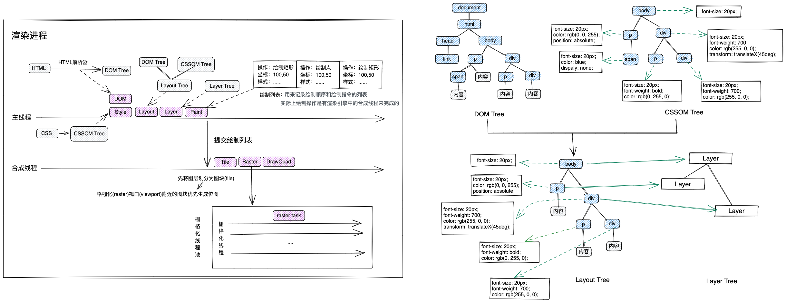
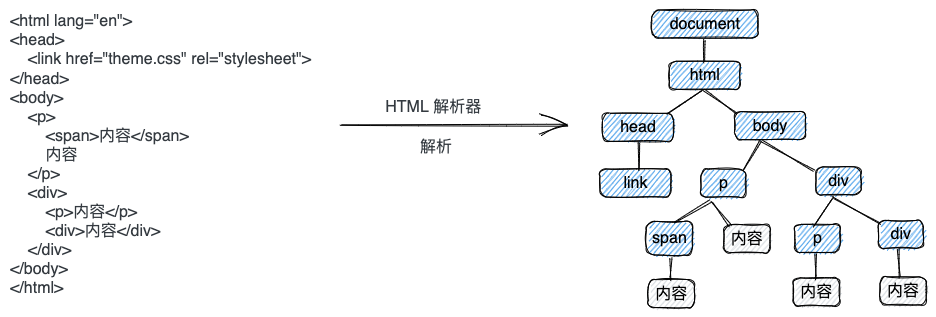
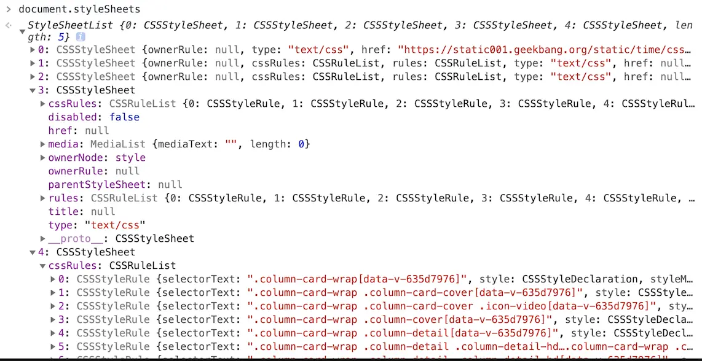
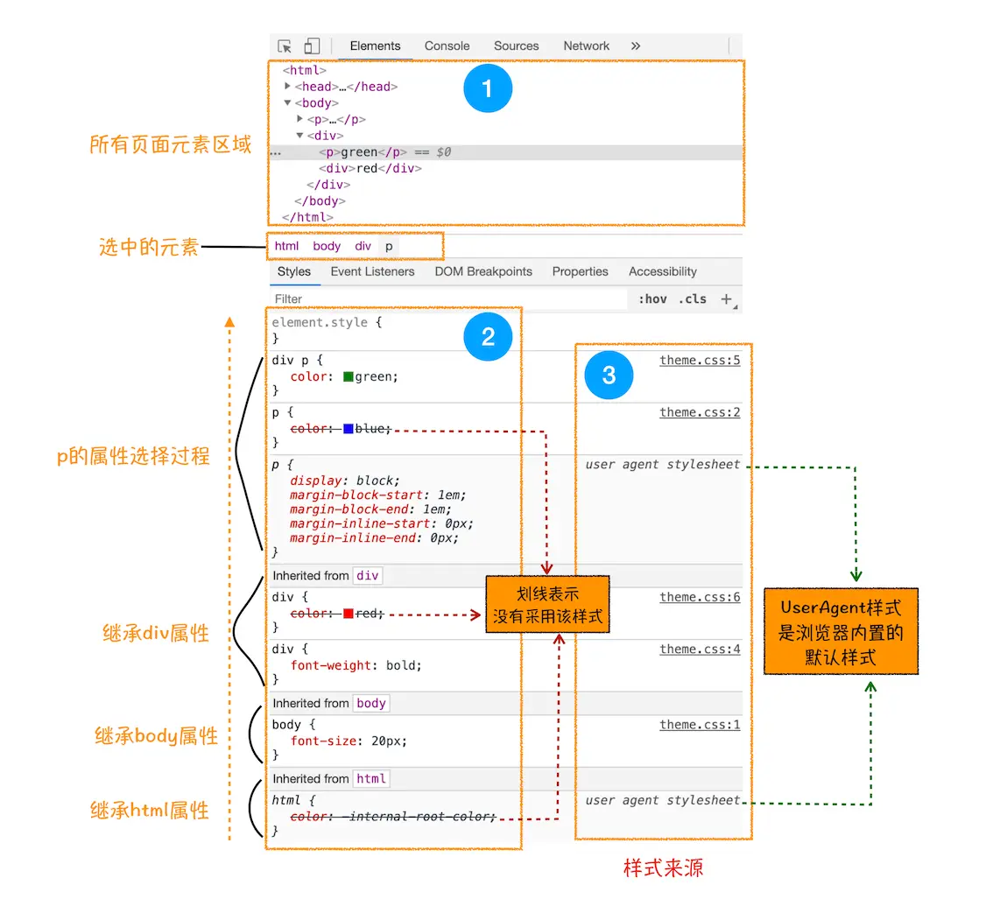
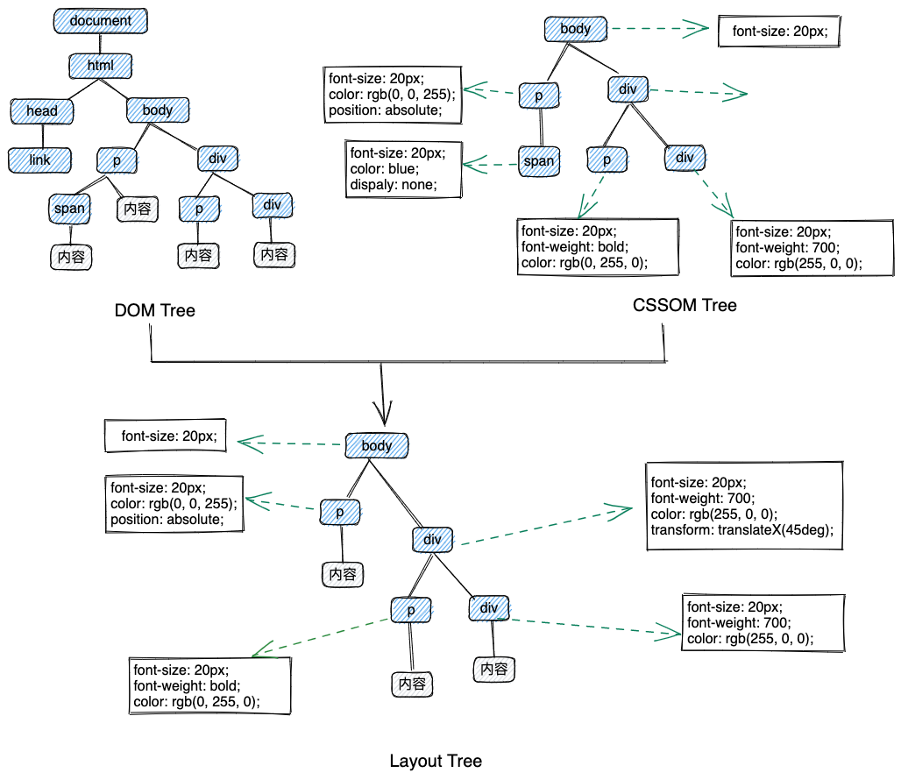
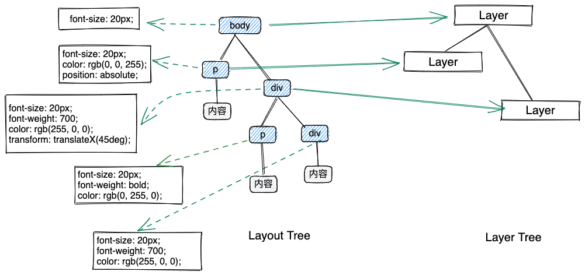
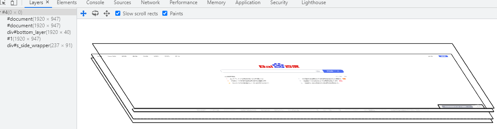
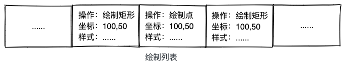
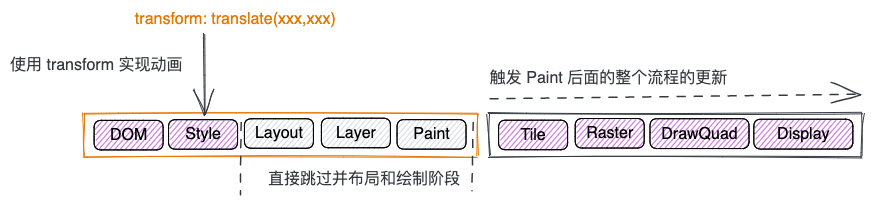

# 渲染流水线

# DOM

> 渲染进程将 HTML 内容转换为浏览器能够理解的 DOM 树结构；

DOM 树和 HTML 内容几乎是一样的，但和 HTML 不同的是，DOM 是保存在内存中的树种结构，可通过 JavaScript 来操作，比如任何时候通过 JavaScript 添加了某个节点，能在下一步（这会儿还没有渲染到界面上）通过 JavaScript 立马拿到这个添加的节点，就是因为 DOM 树是保存在内存中的。

# Style

> 渲染引擎将 CSS 样式表转化为浏览器可以理解的 styleSheets，并计算出 DOM 树所有节点的样式
> 
1. 渲染引擎接收到 CSS 文本，执行转换操作，将 CSS 文本转换为浏览器可以理解的结构，即 styleSheets
   
    
    
2. 转换样式表中的属性值为渲染引擎容易理解的、标准化的计算值
   
    
    
3. 遵循 CSS 的继承和层叠两个规则，计算出 DOM 节点中每个元素的具体样式
   
    
    

# Layout

> 计算 DOM 树中可见元素的几何位置，即布局（创建布局树 + 布局计算）
> 

其中构建布局树，浏览器大体完成的工作：

1. 遍历 DOM 书中的所有可见节点，并把这些节点添加到布局树中；

2. 不可见的节点会被布局树忽略掉，如 head 标签下面的全部内容，再比如下图中的 span 元素，因其 display:none，故此元素也没有被加入到布局树
   
    

# Layer

> 对布局树进行分层，并生成图层树
> 

因需要在页面实现一些复杂的 3D 变换、使用 z-index 做 z 轴排序等效果，渲染引擎（即排版引擎，比如 WebKit 以及在其基础上派生的 Blink，同 JavaScript 引擎 V8 都是工作在渲染进程中，准确的说是在渲染进程中的主线程上，且排版引擎和 JavaScript 引擎互斥，同一时刻只能执行一个）还需要为特定的节点生成专用的图层，并生成一棵对应的图层树（LayerTree）

而浏览器的页面本质上也就是若干图层堆叠而成的图像

通常情况下也并不是布局树中的每个节点都对应一个图层，如果一个节点没有对应的层，那么该节点从属于父节点的图层（如上图中的 span 标签没有专属图层，它们丛书它们的父节点图层，但不管咋样，最终每一个节点都会直接或者间接地从属于一个层）。通常情况下满足一下两点中的任意一点的元素就可以被提升为单独的一个图层：a、拥有[层叠上下文](https://developer.mozilla.org/zh-CN/docs/Web/CSS/CSS_Positioning/Understanding_z_index/The_stacking_context)属性的元素会被提升为单独的一层；b、需要剪裁（clip）的地方也会被创建为图层（比如 div 宽高内容 200 * 200，并设置了 overflow: auto，其内容超出了 200 * 200，这时候就会产生裁剪 ）；

# Paint

> 渲染引擎将一个图层的绘制拆分成很多小的绘制指令，然后把这些指令按照顺序组成一个待绘制列表

# Tile、Raster

> 绘制列表是用来记录绘制顺序和绘制指令的列表，实际上绘制操作是有渲染引擎中的合成线程来完成的
> 

合成线程是怎样工作的？合成线程会先将图层划分为图块（tile），然后格栅化（raster）视口附近的图块来优先生成位图

- 生成位图的操作是有栅格化来执行的。所谓栅格化，是指将图块转换为位图；
- 图块是栅格化的最小单位；
- 渲染进程维护了一个栅格话的线程池，所有图块的栅格化都是在线程池内执行的，而栅格化执行过程中通常会使用到 GPU 来加速生成（GPU 操作运行在 GPU 进程中），使用 GPU 生成位图的过程叫快速栅格化或者 GPU 栅格化，生成的位图被保存在 GPU 内存中

# DrawQuad

> 合成线程发送绘制图块命令 DrawQuad 给浏览器进程
> 

待所有图块都被栅格化后，合成线程就会生成一个绘制图块的命令 DrawQuad，然后提交该命令给浏览器进程

# Display

> 浏览器进程根据 DrawQuad 消息生成页面，并显示到显示器上
> 

浏览器进程里面有一个叫 viz 的组件，用来接收合成线程发过来的 DrawQuad 命令，然后根据 DrawQuad 命令，将其页面内容绘制到内存中，最后再将内存显示在屏幕上

# 重绘、重排以及合成

## 重排

当元素的几何位置属性（比如 width、margin 等）被更新时，会触发重排。如下图改变了元素的高度，那么浏览器就会触发重新布局，触发解析之后的一系列子阶段

## 重绘

当元素的绘制属性（比如 color、background等）更新时，会触发重绘。如下入仅修改元素的背景颜色，因为并没有引起几何位置的变换，所以会直接跳过布局阶段，而执行之后的系列子阶段

## 直接合成

如果更改一个既不影响几何位置也不影响绘制的属性，会发生什么变化？渲染引擎将跳过布局和绘制，只执行后续的合成操作，我们把这个过程叫做合成。如下图使用了 CSS 的 transform 来实现动画效果，这可以避开重绘和重排，直接在非主线程上执行合成动画操作。这样的效率也是最高的，因为在非主线程上合成，并没有占用主线程的资源，另外也避开了布局和绘制两个子阶段

# HTML、CSS、JavaScript对页面渲染的影响

1. LayoutTree（以前经常看到的 RenderTree）依赖于 DOM Tree 和 CSSOM Tree，DOM Tree 和 CSSOM Tree 中的任意一环有问题都会影响后续绘制合成等渲染流水线进而影响页面渲染；
2. JS 加载：在浏览器没有预解析机制时，JS 的加载也会暂停 HTML 解析成 DOM，因为有可能会涉及对 DOM 的操作，影响 DOM Tree 的构建 => 影响 LayoutTree 的生成 => 影响后续渲染；
3. JS 加载：在浏览器有预解析机制时，JS的加载不会影响 HTML 解析成 DOM；
4. JS 解析执行：JS 的解析执行会暂停 HTML 解析成 DOM，因为有可能会涉及对 DOM 的操作，影响 DOM Tree 的构建 => 影响 LayoutTree 的生成 => 影响后续渲染；
5. CSS 加载：一般情况下，CSS 的加载（不管有无预解析机制）不会影响 HTML 解析成 DOM，但由于 LayoutTree 有对 CSSOM Tree 的依赖，会影响 CSSOM Tree 的生成 => 影响 LayoutTree  的生成 => 影响后续渲染；
6. CSS解析：一般情况下，CSS 解析成 CSSOM 和 HTML 解析成 DOM 是并行的，换句话说，CSS 的解析并不影响 HTML 的解析，CSS 解析影响 CSSOM Tree 的生成 => 影响 LayoutTree  的生成 => 影响后续渲染；
7. 上面5、6点一般情况下，CSS 的加载和解析并不会影响 HTML 解析成 DOM，但有一种情况下，CSS 的加载和解析会间接影响 HTML 的解析，那就是在碰到有 script 标签时，碰到 script 时会暂停 HTML 的解析，而 JS 不仅有可能涉及到 DOM 的操作，还有可能会涉及到 CSSOM 的操作（比如：element.style.color = "red"），浏览器又无法判断 JS 是否有对 CSSOM 的操作（道理同浏览器无法判断 JS 是否对 DOM 有操作一样），所以碰到 script 标签时，都会等到 CSS 加载完成并生成 CSSOM Tree 之后，才能继续继续 JS 的解析执行，换句话说，JS 的解析执行对CSSOM 有依赖；CSS的加载解析 => 影响 CSSOM 的生成 => 影响JS的解析执行 => 影响 DOM Tree 的构建 => 影响  LayoutTree 的生成 => 影响后续渲染；

# 参考资料

[浏览器工作原理与实践](https://time.geekbang.org/column/intro/100033601?tab=catalog)