# 窥探浏览器基本原理

# 计算机核心 - CPU 和 GPU

要想理解浏览器的运行环境，得先搞明白一些计算机组成以及它们的作用

## CPU


四核CPU愉快地在各自工位上一个接着一个地处理交个它们的任务

CPU 即中央处理器（**C**entral **P**rocessing **U**nit）是一块超大规模的集成电路，是计算机的运算核心（Core）和控制核心（Control Unit），通俗的讲计算机的 CPU 就相当于人类的大脑。CPU 有一个或者多个核心（Core），如上图所示可以将 CPU 的一个 Core 看做是一个办公室的工作人员，他功能强大，上知天文下知地理，琴棋书画无所不能，它可以串行地一件接着一件处理交给它的任务。在过去大多数 CPU 只有一个核心，不过在现在的硬件设备上CPU 通常会有多个核心，因为多核 CPU 可以大大提高手机和电脑的运算能力。

> CPU 和芯片的关系？CPU 是超大规模的集成电路的一种，而集成电路都可以叫做芯片，但芯片不一定就是 CPU，用数学的包含关系来说，芯片包含 CPU，但不等于。
> 

## GPU


每个GPU核心手里只有一个扳手，处理的任务有一定限制，较单一，可架不住它们数量多啊

GPU 即图形处理器（**G**raphics **P**rocessing **U**nit），是计算中另外一个重要组成部分，相较于 CPU 而言，GPU 主要处理一些简单的任务，但 GPU 核心比较多，可以多个核心同时工作，也就是说它的并行计算能力是很强的。图形处理器（GPU）顾名思义一开始就是专门用来处理图形的，在近些年随着GPU加速计算的发展，越来越多的计算变得可以单独在 GPU 上进行了。

## Computer Architecture

当你在手机或者电脑上打开某个应用程序的时候，背后其实是 CPU 和  GPU 支撑着该应用程序的运行，通常来说，应用程序使用操作系统提供的机制在 CPU 和 GPU 上运行。


计算机的三层架构：下层的硬件机器、中间的操作系统、上层的应用

# 进程和线程

进程是程序运行的实例，启动程序的时候，进程即会被创建，同时操作系统会为该进程创建一块内存，用来存放代码、运行中的数据和执行任务的线程，而当应用程序关闭时，该程序对应的进程也会随之消失，操作系统也会回收该进程所占用的内存。


进程使用操作系统分配的私有内存空间存储应用程序的数据

有时为了满足功能的需要，创建的进程可以要求操作系统创建另外的进程来处理其它一些任务，不过新创建的进程会拥有全新的独立内存空间而不是和原来的进程共用内存空间。如果这些进程需要通信，得通过 **IPC**机制（Inter Process Communication）来进行。很多应用程序都会采取这种多进程的方式来工作，因为进程和进程之间是互相独立的它们互不影响，这样即使其中一个工作进程（worker process）挂掉了其他进程也不会受到影响，而且挂掉的进程还可以重启


不同的进程通过IPC通信

而至于线程，线程是不能单独存在的，其依附于进程，由进程来启动和管理，线程和进程之间的关系：

1. 进程是操作系统分配资源的最小单位，线程是程序执行的最小单位；
2. 进程中的任意一线程执行出错，都会导致整个进程的崩溃
3. 一个进程由一个或多个线程组成，线程是一个进程中代码的不同执行路线；
4. 线程上下文的切换比进程上下文的切换要快得多;
5. 进程之间的内容相互隔离，但同一进程下的各个线程之间共享程序的内存空间(包括代码段、数据集、堆等)及一些进程级的资源(如打开文件和信号)；
6. 当一个进程关闭之后，操作系统会回收进程所占用的内存（即使进程中任意线程因为操作不当导致内存泄漏，当进程退出时，这些内存也会被正确回收）

什么是内存泄露？内存泄漏（Memory Leak）是指程序中已动态分配的堆内存由于某种原因导致程序未释放或无法释放，造成系统内存的浪费，导致程序运行速度减慢甚至系统崩溃等严重后果。

进程就像一个大鱼缸，而线程就像是鱼缸里面畅游的鱼儿


至于单线程和多线程最简单的区别：单线程同一个时间只能做一件事情，而多线程同一个时间能做多件事情

单线程与多线程的进程对比图


# 浏览器架构

对于浏览器是怎么使用进程和线程来工作的呢？其实可以大致分为两种架构，一种是单进程架构，也就是启动一个进程，然后这个进程里面有多个线程工作，另一种是多进程架构，也就是浏览器会启动多个进程，每个进程里面又有多个线程，不同进程之间通过 IPC 机制来通信。

浏览器单进程和多进程架构图


## 单进程浏览器架构

早期的浏览器是单进程架构的，也就是众多线程都运行在一个进程里，而进程中的一个线程执行出错，整个进程就会崩掉，早期的单进程浏览器并不稳定，而且还有不流畅、不安全等因素。

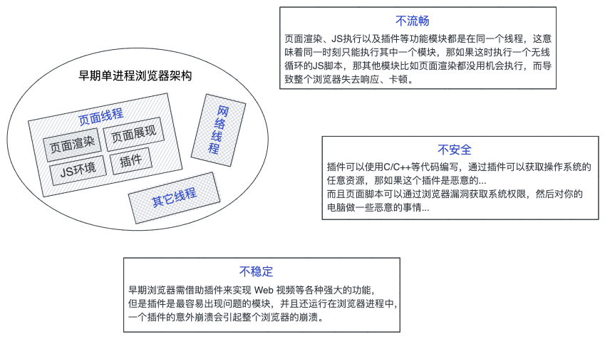

## 多进程浏览器架构

现在的浏览器都是多进程架构了，只是现在还没有一个大家都遵循的浏览器实现标准，不同浏览器的实现方式可能会完全不一样。而对于 Chrome 浏览器，最新多进程架构如下图（后续论述都是针对 Chrome 浏览器而言）


从图中可以看出，现在的（不一定最新） Chrome 浏览器有 1 个浏览器（Browser）主进程、1 个 GPU 进程、1 个网络（NetWork）进程、1个存储（Storage）进程、多个渲染（Render）进程和多个插件（Plugin）进程，另外其实还有备用渲染（Spare Render）进程、音频（Audio）处理进程等。

- **浏览器主进程（Browser Process）：**主要负责浏览器界面部分（导航栏，书签， 前进和后退按钮）、用户交互、子进程管理等功能；
  
    > 由于进程之间相互独立，当一个页面或者插件崩溃时，影响的仅仅是当前页面进程或者插件进程，并不会影响到浏览器和其他页面，这就解决了页面或者插件的崩溃会导致整个浏览器崩溃，也就是之前单进程浏览器不稳定的问题。
    > 
- **渲染进程（Render Process）**：核心任务是将 HTML、CSS 和 JavaScript 转换为用户可以与之交互的网页，排版引擎 Blink 和 JavaScript 引擎 V8 都是运行在该进程中，默认情况下，Chrome 会为每个 Tab 标签页创建一个渲染进程；
  
    > 渲染进程都是运行在沙箱模式下，沙箱可以看成是操作系统给进程上了一把锁，沙箱里面的程序可以运行，但是不能在你的硬盘上写入任何数据，也不能在敏感位置读取任何数据，例如你的文档和桌面。
    > 
    > 
    > Chrome 把插件进程和渲染进程锁在沙箱里面，这样即使在渲染进程或者插件进程里面执行了恶意程序，恶意程序也无法突破沙箱去获取系统权限，这也就解决了单进程浏览器不安全的问题。
    > 
    > 同样 JavaScript 引擎 V8 也是运行在渲染进程中的，所以即使 JavaScript 代码阻塞了渲染进程，影响到的也只是当前的渲染页面，并不会影响浏览器和其他页面，因为其他页面的脚本是运行在它们自己的渲染进程中的，这也就解决了单进程浏览器不流畅的问题。而且要是浏览器某个页面内存泄露了，关闭那个页面就可以了，因为当关闭一个页面时，整个渲染进程也会被关闭，之后该进程所占用的内存都会被系统回收（早期浏览器关闭页面的话仅仅是关闭一个线程，并不会回收所有内存）。
    > 
- **图形处理进程（GPU Process）**：Chrome 刚发布的时候是没有 GPU 进程的。而 GPU 的使用初衷是为了实现 3D CSS 效果，只是随后网页页面、Chrome UI 界面都选择采用 GPU 来绘制，这使得 GPU 成为浏览器普遍的需求，最后 Chrome 在其多进程架构上也引入了 GPU 进程；
- **网络进程（Network Process）**：主要负责页面的网络资源加载，之前是作为一个模块运行在浏览器进程里面的，后来成为一个单独的进程；
- **插件进程（Plugin Process）**：主要是负责插件的运行，因插件易崩溃，所以需要通过插件进程来隔离，以保证插件进程崩溃不会对浏览器和页面造成影响；
- **存储进程（Storage Process）**：用于处理本地存贮的,包括 Storage（LocalStorage、SessionStorage)、Cache（CacheStorage、ApplicationCache）、IndexedDB；


不同进程负责浏览器界面中的不同部分（图中列出的进程并不是所有的进程）

如果你想看下你的 Chrome 浏览器现在有哪些进程在跑着的，可以点击浏览器右上角的更多按钮，选择更多工具中的任务管理器进行查看

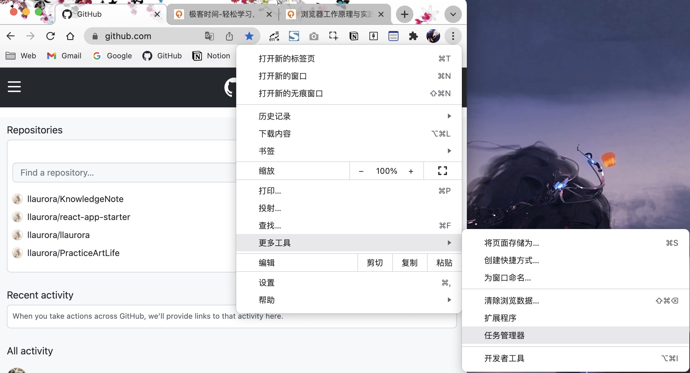


## 关于渲染进程

- 排版引擎 Blink 和 JavaScript 引擎 V8 都是运行在渲染进程中（准确的说是渲染进程中的主线程上），但是是互斥的；
- Chrome 默认会为每个 Tab 标签页创建一个渲染进程，但是如果从一个页面打开了新页面，新页面又和当前页面属于是同一站点（same-site）时，那么新页面会复用父页面的渲染进程（如果是直接从地址栏输入地址的，即便是属于同一站点，也会使用不同的渲染进程），官方把这个默认策略叫 [process-per-site-instance](https://www.chromium.org/developers/design-documents/process-models)，也就是如果几个页面符合同一站点，那么他们将被分配到一个渲染进程里面去，这种情况下一个页面崩溃了，会导致同一站点的页面同时崩溃，因为它们使用了同一个渲染进程。而为什么又要同一站点的的页面跑在一个渲染进程里面呢？因为在一个渲染进程里面，他们就会共享 JavaScript 的执行环境，也就是 a 页面可以直接在 b 页面中执行脚本，因为是同一家的站点，有时是有这个需求的。
- 如果 Tab 标签页中嵌有 iframe 的话，iframe 也会运行在单独的渲染进程中（iframe 进程的崩溃不会造成宿主进程的崩溃）；


Chrome默认给每个Tab标签页创建一个渲染进程


Tab页中的iframe拥有独立的渲染进程

## 同源策略和同一站点

如果两个 URL 的 [protocol](https://developer.mozilla.org/zh-CN/docs/Glossary/Protocol)、[port](https://developer.mozilla.org/en-US/docs/Glossary/Port) 和 [host](https://developer.mozilla.org/zh-CN/docs/Glossary/Host) 都相同的话，则这两个 URL 是同源，下表给出了与 URL http://store.company.com/dir/page.html 的源进行对比的示例

| URL | 结果 | 原因 |
| --- | --- | --- |
| http://store.company.com/dir2/other.html | 同源 | 只有路径不同 |
| http://store.company.com/dir/inner/another.html | 同源 | 只有路径不同 |
| https://store.company.com/secure.html | 失败 | 协议不同 |
| http://store.company.com:81/dir/etc.html | 失败 | 端口不同 ( http:// 默认端口是80) |
| http://news.company.com/dir/other.html | 失败 | 主机不同 |

具有相同的根域名（比如，company.com）和协议（比如 https 或者 http）的站点归属于同一站点，下表给出了与 URL [http://store.company.com](http://store.company.com) 的源进行对比的示例

| URL | 结果 | 原因 |
| --- | --- | --- |
| http://store.company.com/dir2/other.html | 同一站点 | 协议和根域名 company.com 都相同 |
| http://www.company.com | 同一站点 | 协议和根域名 company.com 都相同 |
| http://www.company.com:8080 | 同一站点 | 协议和根域名 company.com 都相同 |
| https://store.company.com | 失败 | 协议不同 |
| http://store.othercompany.com | 失败 | 根域名不相同 |

不过多进程的浏览器架构也有它不好地方，一是进程的内存消耗，由于每个进程都有各自独立的内存空间，所以它们不能像存在于同一个进程的线程那样共用内存空间，这就造成了一些基础的架构（例如V8 JavaScript 引擎）会在不同进程的内存空间同时存在的问题，这些重复的内容会消耗更多的内存；二是浏览器各模块之间耦合性高、扩展性差等问题，会导致现在的架构难以适应后续新的需求。

## 面向未来的服务化架构

2016年，Chorme 官方团队使用面向服务的架构（Services Oriented Architecture）的思想设计新的 Chorme 架构，未来的各种模块会被重构成一个个独立的服务（Service），这样做的主要原因是让 Chrome 在不同性能的硬件上有不同的表现，当 Chrome 运行在一些性能比较好的硬件上时，浏览器进程相关的服务会被放在不同的进程运行以提高系统的稳定性，相反如果硬件性能不好，这些服务就会被放在同一个进程里面执行来减少内存的占用。


# 导航跳转

在浏览器中输入一个 URL，然后浏览器从 Internet 获取数据并显示一个页面，这过程中发生了些什么？


## 第一步：处理输入

对于 Chrome 浏览器来说，地址栏的输入可以是一个直接请求的域名也可以是用户想在搜索引擎（比如 Google）里面搜索的关键词，所以当用户在地址栏输入内容的时候浏览器进程（Browser Process）会解析输入的内容以判定是将用户输入的内容发送给搜索引擎还是直接请求输入的站点资源。

> 检查解析地址栏输入的内容更准确的说是由浏览器进程中的 UI 线程负责的，就是那个负责绘制浏览器界面比如前进/后退/刷新按钮、地址栏输入部分的那个 UI 线程（UI thread）。
> 
- 如果是关键词信息，地址栏使用浏览器默认搜索引擎合成带搜索内容的 URL；
- 如果键人的内容符合 URL 规则，浏览器会根据 URL 协议，在内容（mysite.com）上加上协议（https 或者 http）合成合法的 URL（http://mysite.com）;


浏览器进程中的UI线程在检查输入的内容是搜索关键词还是一个URL

## 第二步：开始导航

当用户按下回车键的时候，浏览器 Tab 页上会展示一个提示资源正在加载中的旋转圈圈（如果当前页面有监听 beforeunload 事件，会先处理 beforeunload 事件），浏览器进程通过 IPC 将 URL 请求转发给网络进程，紧跟着会进行一系列 DNS 寻址以及为请求建立 TCP 连接等操作，然后在网络进程中发起真正的请求。


浏览器进程通过IPC告诉网络进程跳转到mysite.com

细分步骤如下：

1. 用户按下回车键，检查当前页面是否有监听 beforeunload 事件，如果没有直接跳到下面第 2 步，如果有点击同意后跳到第 2 步，若在 beforeunload 事件中取消导航，浏览器不再执行后续任何工作；
2. 浏览器进入开始加载 URL 状态（Tab 页展示一个提示资源正在加载中的旋转圈圈），此时页面还是呈现的前一个页面；
3. 浏览器进程通过进程间通信机制 IPC 将 URL 请求转发给网络进程；
4. 网络进程收到 URL 请求后检查本地缓存是否缓存了该请求资源，如果有，拦截掉请求，直接 200 返回给浏览器进程，否则，进去网络请求过程；
5. 从系统的 host 文件中寻找域名对应的 IP 地址，如果找到则直接跳转到第 7 步；
6. 将域名提交到 DNS 域名解析服务器（DNS 域名系统：负责把域名和 IP 做一对一映射），解析出该域名对应的 IP（若 DNS 有该域名的缓存，该解析步骤省略）；
7. 拿到 IP 之后获取端口号（如果没有端口号，http 默认 80 端口，https 默认 443 端口）；
8. 判断是否需要 TCP 排队，如果不需要，经与目的服务器三次握手后建立 TCP 连接（TCP 头部包括源端口号、目的服务器端口号和用于校验数据完整性的序号）；
9. 构建请求行、请求头等信息（请求头中包含和域名相关的 Cookie 等数据）；
10. 发送 Http 请求；

## 第三步：读取响应

服务器响应后，网络进程接收响应数据并解析，根据不同的 Content-Type 类型做不同的流程处理。

细分步骤如下：

1. 服务器接收到请求信息后，会根据请求信息生成响应数据（包括响应行、响应头和响应体等信息），并发送给网络进程；
   
    
    
    响应的头部有Content-Type信息，而响应的主体有真实的数据
    
2. 网络进程接收到响应头（为方便响应头 = 响应行 + 响应头）后，开始解析响应头；
3. 检查响应头状态码，如果是 301 或者 302，则需要重定向，从 Location 中读取重定向地址，重新回到 [第二步：开始导航中的第 4 步](https://www.notion.so/9c124bcc3b2840e5931cbc0cc4b8621b)，如果是 200，则继续后面的流程；
   
    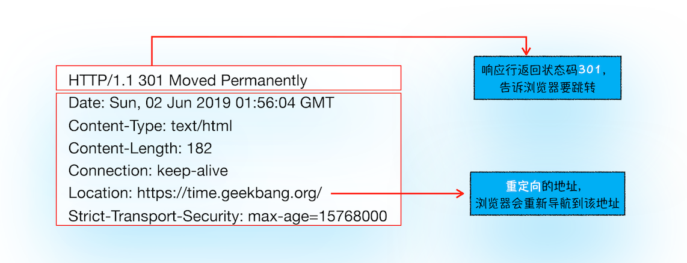
    
4. 检查响应头中的 Content-Type 以确定响应主体的媒体类型（[MIME Type](https://developer.mozilla.org/zh-CN/docs/Web/HTTP/Basics_of_HTTP/MIME_types)），不过 Content-Type 有时候会缺失或者是错误的，这时需要浏览器通过 [MIME类型嗅探](https://link.juejin.cn/?target=https%3A%2F%2Fdeveloper.mozilla.org%2Fen-US%2Fdocs%2FWeb%2FHTTP%2FBasics_of_HTTP%2FMIME_types) 来确定响应类型；
5. 如果是 Content-Type 是 HTML类型 text/html 则通知浏览器进程准备渲染进程，如果是字节流类型 application/octet-stream，则将该请求提交给下载管理器（目前下载管理器是由浏览器进程管理），该导航流程结束，不再继续后面的流程；

## 第四步：准备渲染进程

浏览器进程（准确说是浏览器进程中的 UI 线程）在收到网络进程的确认后（确定浏览器应该导航到该请求的站点）会为这个网站准备（准备 = 启动 || 新建）一个渲染进程（renderer process）来渲染界面。


网络进程通知浏览器进程中的UI线程准备渲染进程

默认情况下 Chrome 会为每个 Tab 标签页创建一个渲染进程，但在符合同一站点时、有 iframe 时，渲染进程几何？参考前面：[关于渲染进程](https://www.notion.so/9c124bcc3b2840e5931cbc0cc4b8621b)。

另外由于网络请求可能需要长达几百毫秒的时间才能获得响应，为了缩短导航需要的时间，浏览器会在之前的一些步骤里面做一些优化。例如在浏览器进程将请求转发给网络进程后，它其实已经知晓它们要被导航到哪个站点了，所以在网络进程干活的时候，浏览器进程会主动地为这个网络请求准备一个渲染进程。如果一切顺利的话（没有重定向之类的东西出现），网络进程准备好数据后该页面的渲染进程已经就准备好了，这就节省了准备渲染进程的时间。不过如果发生诸如网站被重定向到不同站点的情况，刚刚那个渲染进程就不能被使用了，它会被摒弃，一个新的渲染进程会被启动

## 第五步：提交导航

1. 渲染进程准备好以后，浏览器进程通过 IPC 向渲染进程发送提交导航（CommitNavigation）的消息（发送提交导航消息时会携带响应头等基本信息），渲染进程收到 CommitNavigation 消息后便开始接收 HTML 数据（接收数据的方式是直接和网络进程建立数据管道）;
   
    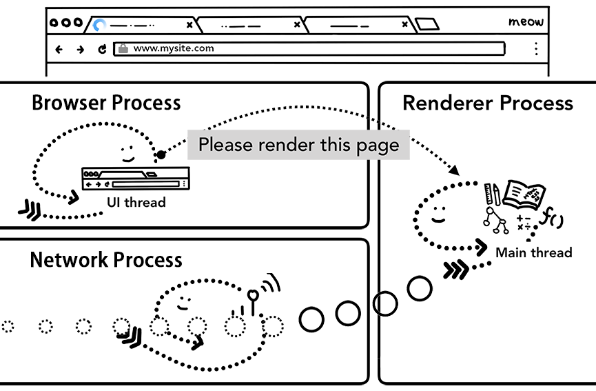
    
2. 待渲染进程接收完数据后，渲染进程会向浏览器进程发送“确认导航提交”，告诉浏览器进程说我已经准备好接受和解析页面数据了；
3. 浏览器进程接收到确认消息后开始移除之前旧的文档，然后更新浏览器进程中的界面状态：安全、地址栏 URL、前进后退的历史状态、更新 Web 页面；
   
    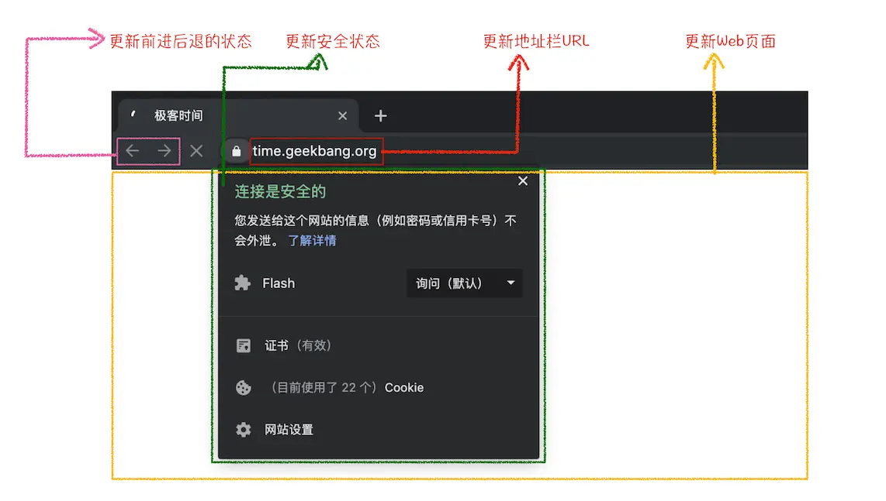
    
1. 渲染进程开始页面解析和子资源加载；
2. 渲染进程渲染完成（后面客户端的 JavaScript 还是可以继续加载资源和改变视图内容的），通过 IPC 发送消息给浏览器进程（注意这发生在页面上所有帧（frames）的 **onload**
   事件都已经被触发了而且对应的处理函数已经执行完成了的时候），浏览器进程接收到消息后停止标签图标 loading 动画；
   
    
   
    渲染进程通过IPC告诉浏览器进程页面已经加载完成了
   

## 导航到不同的站点

一个简单的导航情景已经描述完了！可是如果这时用户在导航栏上输入一个不一样的 URL会发生什么呢？如果是这样，前面那几个站点导航步骤会重新执行一遍。不过在此之前，当前渲染页面需要做一些收尾工作，比如当前页面有监听 [beforeunload](https://developer.mozilla.org/zh-CN/docs/web/api/window/beforeunload_event) 事件；

<aside>
💡 不要随便给页面添加 beforeunload 事件监听，你定义的监听函数会在页面被重新导航的时候执行，这会增加重导航的时延，另外会使 [Back-Forward Cache](https://developer.chrome.com/blog/page-lifecycle-api/#back-forward-cache) （浏览器为在触发前进或者后退时能快速恢复页面而采取的一种优化手段）优化策略失效。beforeunload 事件监听函数只有在十分必要的时候才能被添加，例如用户在页面上输入了数据，并且这些数据会随着页面消失而消失。

另外在现代浏览器中永远不要使用 [unload](https://developer.mozilla.org/zh-CN/docs/Web/API/Window/unload_event)  事件，一是和 beforeunload 事件一样会使  [Back-Forward Cache](https://developer.chrome.com/blog/page-lifecycle-api/#back-forward-cache) 优化策略失效，二是在用应用程序关闭浏览器程序等情况时不生效。在现代浏览器中推荐使用 [pagehide](https://developer.mozilla.org/zh-CN/docs/Web/API/Window/pagehide_event) 事件替代 [unload](https://developer.mozilla.org/zh-CN/docs/Web/API/Window/unload_event) 事件，更多的可以参考 [the Page Lifecycle API](https://developer.chrome.com/blog/page-lifecycle-api/)  这篇文章，该文中有对页面生命周期状态及事件的介绍。

</aside>

beforeunload 事件可以在用户重新导航或者关闭当前 Tab 页时给用户展示一个“你确定要离开当前页面吗？”的二次确认弹框。浏览器进程之所以要在重新导航的时候和当前渲染进程确认的原因是因为，当前页面发生的一切（包括页面的JavaScript执行）是不受浏览器进程控制的而是受渲染进程控制，浏览器进程也不知道页面里面的具体情况。


浏览器进程通过IPC告诉渲染进程它将要离开当前页面导航到新的页面了

另外如果重新导航是在页面内被发起的呢？例如用户点击了页面的一个链接或者客户端的 JavaScript 代码执行了诸如 window.location = **"**newsite.com**"** 的代码。这种情况下，渲染进程会自己先检查一个它有没有注册 beforeunload 事件的监听函数，如果有的话就执行，执行完后发生的事情就和之前的情况没什么区别了，唯一的不同就是这次的导航请求是由渲染进程给浏览器进程发起的。

如果新导航的站点不同于当前站点的话（different site），一个新的渲染进程会被启动以完成此次新的导航，而当前的渲染进程会继续处理现在渲染页面的一些收尾工作，例如 [beforeunload](https://developer.mozilla.org/zh-CN/docs/web/api/window/beforeunload_event) ****、[unload](https://developer.mozilla.org/zh-CN/docs/Web/API/Window/unload_event) 等事件监听函数的执行。


浏览器进程通过2个IPC分别告诉新的渲染进程去渲染新的页面告诉旧的渲染进程处理收尾工作

## Service Worker 场景

在有 [service worker](https://developer.chrome.com/docs/workbox/service-worker-overview/) 场景时下导航流程有一些变化，因为 service worker 可以用来写网站的网络代理（network proxy），所以开发者可以对网络请求有更多的控制权，例如决定哪些数据缓存在本地以及哪些数据需要从网络上面重新获取等等。如果开发者在 service worker 里设置了当前的页面内容从缓存里面获取，那当前页面的渲染就不需要重新发送网络请求了，这就大大加快了整个导航的过程。

这里要重点留意的是 service worker 其实只是一些跑在渲染进程里面的 JavaScript 代码。 那么当导航请求进来时，浏览器进程又如何知道哪个站点有 service worker？

其实 service worker 在注册的时候，它的作用范围（scope）会被记录下来（你可以通过文章 [The Service Worker Lifecycle](https://web.dev/service-worker-lifecycle/) 了解更多关于 service worker 作用范围的信息）。当导航发生时，网络进程会根据请求的域名在已经注册的 service worker 作用范围里面寻找有没有对应的 service worker，如果有命中该 URL 的 service worker，浏览器进程（浏览器进程中的 UI 线程）就会为这个 service worker 寻找一个渲染进程来执行它的代码。Service worker 既可能使用之前缓存的数据也可能发起新的网络请求。


网络进程寻找有没有对应的service worker

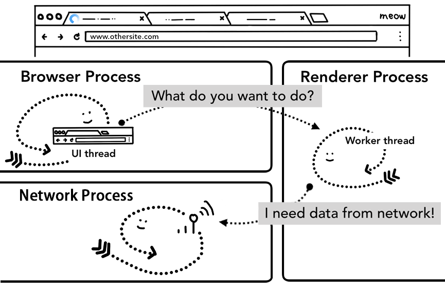

浏览器进程中的UI线程启动一个渲染进程来处理service worker；渲染进程中的工作线程然后从网络中请求数据

service worker 的启动时间通常在 50ms 左右，在移动端通常是 250ms 左右，而在性能不高的设备上这个启动时间会更长，甚至需要超过 500ms，尽管可以使用诸如 [using code-caching in V8](http://v8project.blogspot.com/2015/07/code-caching.html)、[skipping service workers that don't have a fetch event](https://bugs.chromium.org/p/chromium/issues/detail?id=605844) 等优化手段能缩短 service worker 的启动时间，但这个启动时间总归是避免不了的，如果最后判定可以使用之前缓存数据而避免了发起网络请求都还好，而如果最后还是决定需要发送网络请求的话，浏览器进程和渲染进程这一来一回的通信时间加上service worker 启动的时间，反而会增加页面导航的时延，那不是得不偿失吗？而导航预加载就是一种通过在 service worker 启动的时候并行加载对应资源的方式来加快整个导航过程效率的技术，预加载资源的请求头会有一些特殊的标志来让服务器决定是发送全新的内容给客户端还是只发送更新了的数据给客户端。关于导航预加载 service worker 更多的阐述可以查看 [Speed up service worker with navigation preloads](https://developer.chrome.com/blog/navigation-preload/) 这篇文章。


浏览器进程中的UI线程在启动一个渲染进程去处理service worker的同时会并行发送网络请求

# 渲染进程里的那些事

渲染进程负责标签（Tab）页内发生的所有事情。在渲染进程中，主线程（main thread）负责处理绝大部分的客户端代码，如果网页应用中有 web worker 或者 service worker 的话，相关代码将会由工作线程处理，另外合成（compositor）线程以及光栅（raster）线程也运行在渲染进程里面以高效流畅地渲染出页面内容。

渲染进程的核心工作就是将 HTML、CSS、以及 JavaScript 转变为用户可以与之交互的网页内容，其主要流程就是我们常说的渲染流水线（rendering pipeline）。


## DOM

前文有提到过，渲染进程在收到浏览器进程提交导航（CommitNavigation）的消息后，渲染进程便开始接收 HTML 数据（接收数据的方式是直接和网络进程建立数据管道），同时工作在主线程上的渲染引擎也会开始解析接收到的 HTML 数据（text string）并将其转化为浏览器能够理解的DOM树结构，更多细节可前往查看 [从Chrome源码看浏览器如何构建DOM树](https://zhuanlan.zhihu.com/p/24911872) （真的强！！！）。

> 渲染引擎：即排版引擎，是浏览器的内核，常见有 Firefox 用的 Gecko，Safari 的 Webkit，以及Chrome 基于 Webkit 派生的 Blink等，这就像 W3C 出了一道如何处理HTML，各个浏览器厂商给了不同的解法
> 


下面用伪代码简短描述一下构建DOM树过程（用JS模拟浏览器渲染流程可前往该项目查看 [browser-rendering](https://github.com/lqPrototype/browser-rendering)）

```jsx
render.on("commitNavigation", (response) => {
    const contentType = response.headers["content-type"];
    if (contentType.indexOf("text/html") !== -1) {
        const document = {
            type: "document",
            attributes: {},
            children: [],
        };
        // token栈
        const tokenStack = [document];
        // html解析器
        const parser = new htmlparser2.Parser({
            onopentag(name, attributes = {}) {
                // 取栈顶元素作为父元素
                const parent = tokenStack.top();
                const element = {
                    type: "element",
                    tagName: name,
                    children: [],
                    attributes,
                    parent,
                };
                // 把元素push进parent.children 构建树🌲
                parent.children.push(element);
                // 再把元素push进token栈
                tokenStack.push(element);
            },
            ontext(text) {
                // 文本节点不需要入栈
                const parent = tokenStack.top();
                const textNode = {
                    type: "text",
                    children: [],
                    parent,
                    text,
                };
                // 构建树🌲
                parent.children.push(textNode);
            },
            onclosetag(tagName) {
                tokenStack.pop();
            },
        }, {});
        // 一边从网络进程持续接收数据，一边解析数据
        response.on("data", (buffer) => {
            parser.write(buffer.toString());
        });
				// ......
    }
});
```

DOM树和HTML内容几乎是一样的，但和 HTML 不同的是，DOM树是保存在内存中的树结构，反映了页面的文档结构，并且也暴露有 API 供 JavaScript 操作，比如任何时候通过 JavaScript 添加了某个节点，能在下一步（这会儿还没有渲染到界面上）通过 JavaScript 立马拿到这个添加的节点，就是因为 DOM 树是保存在内存中的。

将 HTML 解析为 DOM 的规则是在 [HTML Standard](https://html.spec.whatwg.org/) 中定义的，而在你的 web 开发生涯中，你可能从来没有遇到过浏览器在解析 HTML 的时候有发生错误的情景，比如一个段落缺失了闭合标签 `</p>`，该段落仍然会被当做有效的 HTML 来处理 ；又比如 `Hi! <b>I'm <i>Chrome</b>!</i>` （将 b 标签写在了闭合 i 标签前面），其还是会被当做 `Hi! <b>I'm <i>Chrome</i></b><i>!</i>` 处理。这是因为得益于 [HTML Standard](https://html.spec.whatwg.org/) ，浏览器可以优雅的处理这些错误，关于浏览器是如何对这些错误进行容错处理的，可前往查看 [An introduction to error handling and strange cases in the parser](https://html.spec.whatwg.org/multipage/parsing.html#an-introduction-to-error-handling-and-strange-cases-in-the-parser)。

一个网站通常还会用到一些诸如 image 图片、CSS 样式以及 JavaScript 脚本等需要从缓存或者网络上获取的外部资源。通常主线程会按照在构建 DOM 树时遇到的各个资源的顺序串行地发起网络请求，但为了提升效率，浏览器会并行运行“预加载扫描（preload scanner）”程序（preload scanner 这只是浏览器优化资源加载的一种手段，而且并不是所有浏览器都有 preload scanner，更多信息可前往 [资源预加载](https://mp.weixin.qq.com/s/8_4XGgrXqwuUKNwgp8KhTA) 查看）。如果在 HTML 文档里面存在诸如 `` 、`<link>`或者从外部加载脚本的 `<script>`这样的标签，预加载扫描程序会查看 HTML 解析器生成的 token，并将请求发送到网络进程。


## Style

拥有了DOM树我们还不足以知道页面的外貌，因为这时的 DOM 节点并没有样式，所以还需要计算每个 DOM 节点的样式。工作在主线程中的渲染引擎会解析页面的 CSS 从而确定每个 DOM 节点的计算样式（computedStyle）,你可以打开 devtools 来查看每个 DOM 节点对应的计算样式（即使你的页面没有设置任何自定义的样式，每个 DOM 节点还是会有一个计算样式，这是因为每个浏览器都有自己的默认样式表，比如 Chrome 的默认样式 [html.css](https://source.chromium.org/chromium/chromium/src/+/main:third_party/blink/renderer/core/html/resources/html.css)）。


浏览器到底是怎么确定DOM的计算样式的？可移步 [浏览器如何计算CSS](https://www.notion.so/CSS-15bd65b086f24e90bae078959daf1587) （文章主要摘录于 [从Chrome源码看浏览器如何计算CSS](https://zhuanlan.zhihu.com/p/25380611)（真的强！！！）），只是注意一点 CSS 解析和 HTML 解析是交替进行的，不是绝对的先后。

```jsx
onclosetag(tagName) {
        console.log("onclosetag:", tagName);
        // css转stylesheet
        switch (tagName) {
            case "style":
                const styleToken = tokenStack.top();
                const cssAST = css.parse(styleToken.children[0].text);
                cssRules.push(...cssAST.stylesheet.rules);
                break;
            case "link":
                const linkToken = tokenStack[tokenStack.length - 1];
                const { href } = linkToken.attributes;
                const options = { host, port, path: href };
                // 外链的css，发起网络请求，数据回来后push进stylesheet
                const promise = network.fetchResource(options).then(({ headers, body }) => {
                    delete loadingLinks[href];
                    // Accepts a CSS string and returns an AST object
                    const cssAST = css.parse(body);
                    // console.log('cssAST', JSON.stringify(cssAST, null, 4))
                    cssRules.push(...cssAST.stylesheet.rules);
                });
                loadingLinks[href] = promise;
                break;
            case "script":
                break;
            default:
                break;
        }
        tokenStack.pop();
    }
```

## Layout

到目前为止，渲染进程已经知道页面的具体文档结构以及每个节点的样式信息了，可是这些信息还是不能最终确定页面的样子。举个例子，假如你现在想通过电话告诉你的朋友在你身边的一幅画的内容：“画布上有一个红色的大圆圈和一个蓝色的正方形”，单凭这些信息你的朋友是很难知道这幅画具体是什么样子的，因为他不知道大圆圈和正方形具体在页面的什么位置，是正方形在圆圈前面呢还是圆圈在正方形的前面。


你站在一幅画面前通过电话告诉你朋友画上的内容

Layout 是一个计算元素几何信息的过程，主线程（中的渲染引擎）会遍历之前构建的带有计算样式的DOM树并创建布局树 Layout Tree， Layout Tree 上每个节点即 LayoutObject 会有它在页面上的x、y坐标以及盒子大小（bounding box sizes）。LayoutObject 有不同的子类比如 LayoutBlockFlow、LayoutText 等，这取决于所需的布局行为。


主线程会遍历带有计算样式的DOM树生成Layout树

通常来说一个 DOM 节点 对应着一个 LayoutObject，但这只是通常来说，比如在下面两种情况时这个就不适用了：

- 有 DOM 节点却没有对应的 LayoutObject，比如 head 标签下面的全部内容又或者一个 DOM 节点的 computedStyle 的 display 属性值是 none；
- 有 LayoutObject 却又没有对应的 DOM 节点，比如一个伪元素（pseudo class）节点有诸如`p::before{content:"Hi!"}`这样的内容，它会出现在 Layout Tree 上，但不会出现在 DOM Tree 上；
- 一个 DOM 节点对应着多个 LayoutObject，比如一个容器里面有块级元素 div 和行内元素 span，这个时候为了保证一个容器里面只能拥有块级 LayoutObject 或者内联 LayoutObject 其中的一种，这时便会在 span 对应的 LayoutObject 外再包一个匿名的块级 LayoutObject，对 span 这个元素来说其对应着一个 DOM 节点，在生成对应的  LayoutObject 时却因为这个 span 是  div 的兄弟元素而生成了两个 LayoutObject，反过来对于这个匿名的 LayoutObject 来说其也没有对应的 DOM 节点；

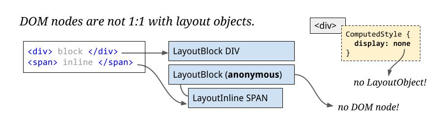

页面的布局是一个非常复杂的过程（对于 Chrome 浏览器，有一整个工程师团队负责处理 Layout，如果你想知道他们工作的具体内容，可以前往查看他们在 [BlinkOn Conference](https://www.youtube.com/watch?v=Y5Xa4H2wtVA) 上面的相关讨论），即使这个页面的布局非常简单。比如一个从上到下展示一个个段落的简单页面，但布局并不简单，因为你需要考虑段落中的字体大小以及段落在哪里需要换行之类的东西，它们都会影响到段落的大小以及形状，继而影响到接下来段落的布局。


## Layer

现在我们有了 Layout Tree，但是还不能直接渲染到页面上，因为有可能我们会在页面实现一些复杂的 3D 变换、使用 z-index 做 z 轴排序等效果，需要为特点的节点生成专用的图层，为了确定哪些元素节点放置在哪一层（最终每一个 LayoutObject 都会直接或者间接地从属于某一个 Layer），主线程（中的渲染引擎）会遍历 Layout Tree 然后生成 Layer Tree（这一步在 devtools performance panel 中被称为”Update Layer Tree“）。如果你确定页面中的某个部分需要被单独提升为一个图层，你可以通过给该部分显示的设置CSS 属性 `will-change` 来提醒浏览器。


主线程会遍历layout treee来生成layer tree

浏览器页面本质上也就是若干 Layer 堆叠而成的图像


Layer Tree 其实并不是 Tree 而是一个平级的列表 List，只是早先确实是用的 Tree，由于历史原因保留了 Layer Tree 这个名称（参考 [Life of a Pixel（Youtube）](https://www.youtube.com/watch?v=K2QHdgAKP-s)34分58秒）

> 未来 Layer 这一步会被放到 Paint 之后（参考 [Life of a Pixel（Youtube）](https://www.youtube.com/watch?v=K2QHdgAKP-s)37分50秒  composite after paint）。
> 


如前面所说，每个 LayoutObject 会直接或者间接地从属于某一个 Layer，再细致点儿讲通常一个 LayoutView 会对应一个 PaintLayer，一个 PaintLayer 对应着一个 CCLayer，但是某些样式属性（比如 3D transform、will-change 显示设置为 opacity、transform、top、left 等属性以及对 opacity、transform等 属性应用了 animation 或者 transition）会导致对应的 LayoutObject 单独成层。关于什么情况下会单独成层、什么情况下又会发生层压缩以及层爆炸等更多信息可前往查看 [淘系前端团队的无线性能优化：Composite](https://fed.taobao.org/blog/taofed/do71ct/performance-composite/)。

<aside>
💡 🤯😀😉🤣😇🤪🤩☺️🤗🤭🤨🤐🙄🤒

- CCLayer 即 Chromium Compositor Layer，注意区别于后面 compositor thread 中的 LayerImpl，简单来说在 main thread 中的 Layer 即 CCLayer，在 compositor thread  中的 Layer 即 LayerImpl， LayerImpl  是 main thread 中 CCLayer 的拷贝，更多细节可前往参考 [Compositor Thread Architecture](https://www.chromium.org/developers/design-documents/compositor-thread-architecture/)；
- CCLayerTreeHost: owns a tree of LayerChromiums, CCLayerTreeHost::m_rootLayer；
- CCLayerTreeHostImpl: owns a tree of CCLayerImpls, CCLayerTreeHostImp::m_rootLayer；
</aside>

## Prepaint

在 Layer 被绘制时，合成器 Compositor 可以将一些诸如变换矩阵、裁剪、滚动偏移以及透明度等各种属性应用于其绘制的 Layer，这些数据被储存在属性树（property trees）中，在过去这些数据是直接被存储在 Layer 里的并没有这一步，但后面为了将这些属性与层解耦，以让它们可以脱离层单独使用，而在 Paint 之前有了 Prepain 这一步。

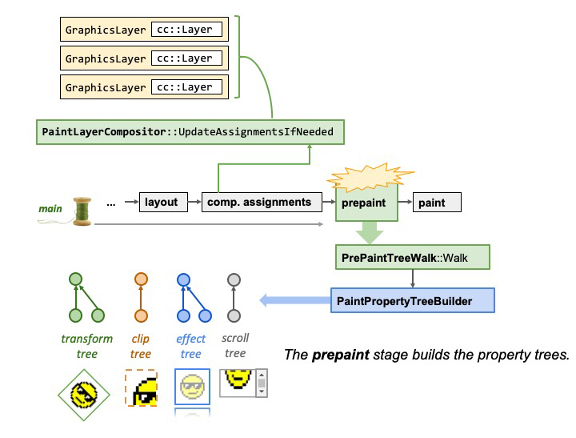

注：上图中的 ****comp.assignments 即 compositing assignments，对应着前面的 Layer 步骤。

## Paint

现在有了 Layer Tree，知道了哪些元素在哪一个图层上，并且也知道图层上的节点的样式信息和几何元素信息，但还是不足以渲染出页面来。想象一下，假如你现在站在一幅画面前想再画一幅一样的画，你现在是知道了画布上每个元素的大小、形状以及位置，但先画哪个后画哪个呢，是先画蓝色的正方形呢还是先画红色的大圆圈呢？


举个例子，某个元素设置有`z-index`，如果依照 HTML 中元素的顺序来进行绘制的话，可能会绘制出错误的页面。


在 Paint 这一步中，主线程会遍历 Layer Tree 为每个 Layer 生成对应的绘制列表（绘制列表记录着绘制顺序和绘制指令 paint op，绘制指令用来指导计算机绘制），绘制列表来决定先画蓝色的正方形呢还是先画红色的大圆圈。

> 目前浏览器架构会为每个 Layer 生成各自的绘制列表并独立绘制，但未来的浏览器架构中可能会为整个 document 生成一个绘制列表，参考 [Life of a Pixel（Youtube）](https://www.youtube.com/watch?v=K2QHdgAKP-s)47分33秒。
> 


主线程遍历layer tree生成绘制列表

我们也可以在 Chrome 浏览器的开发者工具里面看到这些绘制列表，在开发者工具里面找到 more tools，然后找到 Layers 面板，就能看到各个 Layer 所对应的绘制列表了，你可以重现绘制步骤也可以看到该层被作为单独图层的原因。

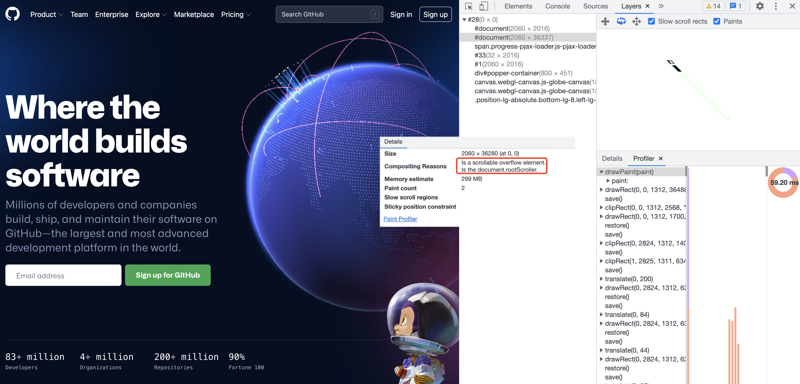

## Commit

到目前 Paint 阶段，都是在渲染进程中的主线程上完成的，在 Paint 绘制阶段生成各个 Layer 的绘制列表后，接下来主线程（main thread）commit 到合成线程（compositor thread）,在 commit 的时候，会拷贝一份 Layer Tree（准确讲应该是 Layer List） 和 Property Trees 到合成线程，commit 阶段会阻塞主线程直到 commit 完成。

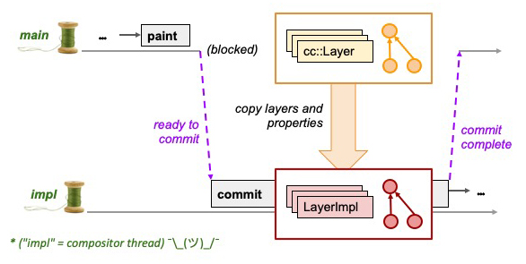

## Tile

现在合成线程（compositor thread） 拿到了 Layer Tree（Layer 里包含有对应的绘制列表，每个 Layer 独立绘制） 和 Property Trees 的副本，按理可以进行下一步光栅化（Raster）了，但是 Layers 有可能是非常大的，向下延伸理论上可以无限长，比如可以无限滚动的新闻类网站，直接光栅化整个 Layer 是很划不来的，所以在下一步光栅化之前，合成线程会先把 Layers 分隔成图块 Tile，并且视口（viewpoint）附近的图块拥有较高的优先级，可以优先被光栅化。


## Raster

在合成线程（compositor thread）将 Layers 分隔成图块 Tile 后，会优先光栅化视口（viewport）附近的图块，图块 Tile 是光栅化的最小单位。

> 之所以将图层划分为图块主要有三个：
> 
> 1. 可以优先光栅化视口附近的图块而不至于直接光栅化整个图层；
> 2. 可以充分利用光栅化线程池的并行能力，假如 1 个光栅化线程 1s 可以光栅化 1 个图块（在光栅化过程中还可能会使用 GPU 来加速，那光栅化 1 个图块的话，可能只需要 0.1s），那 10 个图块用10 个光栅化线程池 1s 就搞定了。打个比方说，就好比铺 100㎡ 的地板，不会直接买个 10*10 ㎡ 的地板砖，通常是用 100 块 1*1㎡ 的地板砖合在一起 ，这样可以分给 10 个工人，每个人铺 10 块，快速搞定 ！
> 3. GPU 对纹理（纹理可以理解为 GPU 内存中的位图）的大小有限制，比如长/宽必须是2 的幂次方，最大不能超过 2048 或者 4096等；


而所谓光栅化其实就是执行 Layer 对应绘制列表中绘制指令的过程，光栅化的输出是位图（bitmap），位图中每个像素点的 rgba 是确定的。

<aside>
💡 [位图](https://baike.baidu.com/item/%E4%BD%8D%E5%9B%BE/1017781?fr=aladdin) 就是我们熟悉的比如用Photoshop绘制的图，位图也称为点阵图或者栅格图，是由称作 [像素](https://baike.baidu.com/item/%E5%83%8F%E7%B4%A0/95084)（图片元素）的单个点组成的。这些点可以进行不同的排列和染色以构成 [图样](https://baike.baidu.com/item/%E5%9B%BE%E6%A0%B7/63558)，放大后图像会失真、模糊。不同于 [矢量图](https://baike.baidu.com/item/%E7%9F%A2%E9%87%8F%E5%9B%BE/2490766?fr=aladdin)，矢量图简单来说就像用几何图形来描述一幅图，在矢量图放大时，我们所记录的几何图形的各种角度、形状等并没有改变，所以无论是放大还是缩小，都不会影响失真、模糊。

</aside>

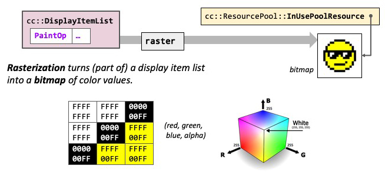

光栅化图块生成位图在 [GPU Accelerated Compositing in Chrome](https://www.chromium.org/developers/design-documents/gpu-accelerated-compositing-in-chrome/#rasterization-painting-from-ccskias-perspective)  文章中有提到有2种方式，分别是 software rasterization 和 hardware-accelerated rasterization。software rasterization 即在光栅化线程池中光栅化图块，输出的位图先是存储于主存（main memory）中，而后再上传至 GPU 内存（目前理解的应该是这样子的），而这个过程是有不可忽视的性能开销的。而现在的 GPU 也可以直接执行光栅化操作生成位图并保存在 GPU 内存中，这个过程叫快速光栅化（accelerated rasterization），或者 GPU 光栅化，即 hardware-accelerated rasterization。

<aside>
💡 🤯😀😉🤣😇🤪🤩☺️🤗🤭🤨🤐🙄🤒

- 随机存取存储器（英语：Random Access Memory，缩写：RAM）是与 [CPU](https://zh.wikipedia.org/wiki/CPU) 直接交换数据的内部存储器。它可以随时读写（刷新时除外），而且速度很快，通常作为[操作系统](https://zh.wikipedia.org/wiki/%E6%93%8D%E4%BD%9C%E7%B3%BB%E7%BB%9F)或其他正在运行中的程序的临时资料存储介质。而 RAM 存储器可以进一步分为静态随机存取存储器（[SRAM](https://zh.wikipedia.org/wiki/%E9%9D%99%E6%80%81%E9%9A%8F%E6%9C%BA%E5%AD%98%E5%8F%96%E5%AD%98%E5%82%A8%E5%99%A8)）和动态随机存取存储器（[DRAM](https://zh.wikipedia.org/wiki/%E5%8A%A8%E6%80%81%E9%9A%8F%E6%9C%BA%E5%AD%98%E5%8F%96%E5%AD%98%E5%82%A8%E5%99%A8)）两大类，由于 [DRAM](https://zh.wikipedia.org/wiki/%E5%8A%A8%E6%80%81%E9%9A%8F%E6%9C%BA%E5%AD%98%E5%8F%96%E5%AD%98%E5%82%A8%E5%99%A8) 的高性价比以及不错的扩展性而被大量的采用作为系统的 [主存（main memoey）](https://zh.wikipedia.org/wiki/%E4%B8%BB%E8%A8%98%E6%86%B6%E9%AB%94)，更多的可前往参考 [维基百科随机存取存储器](https://zh.wikipedia.org/wiki/%E9%9A%8F%E6%9C%BA%E5%AD%98%E5%8F%96%E5%AD%98%E5%82%A8%E5%99%A8)；
- GPU 光栅化并不是直接调用的 GPU，而是通过 Skia 图形库（谷歌维护的2D图形库，在Android，Flutter，Chromium都有使用）发起 OpenGL 调用（Rasterization issues OpenGL calls through a library called Skia.  Skia provides a layer of abstraction around the hardware, and understands more complex things like paths and Bezier curves. Skia is open-source and maintained by Google.  It ships in the Chrome binary but lives in a separate code repository.  It's also used by other products such as the Android OS.）
</aside>

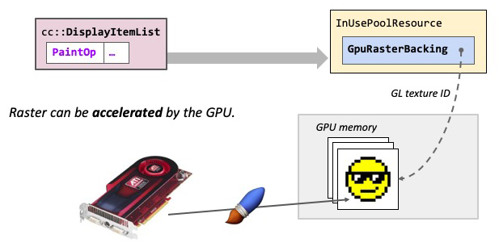

## Draw

一旦所有图块（视口附近的所有图块还是整个图层的图块还是所有图层的所有图块？）被光栅化后，合成线程（compositor thread）会生成 ”draw quads“，draw quad 类似于在屏幕上特定位置（这个位置是有考虑了 property trees 应用于该 layer 的所有转换以及影响等）绘制图块tile的指令，每个 quad 有着对图块光栅化后生成的位图的引用（记住，此时屏幕上还没有像素）。然后这些 quad 被包装在一个 CompositorFrame（compositor frame object）中，该对象作为 render process 的最终输出通过 IPC 通信机制提交给 GPU process，我们平时提到的 60fps 输出帧率指的帧其实就是 CompositorFrame。

> 一次 commit 对应一个 CompositorFrame 还是 一个 layer 对应一个 CompositorFrame？目前理解来看应该是前者。
> 

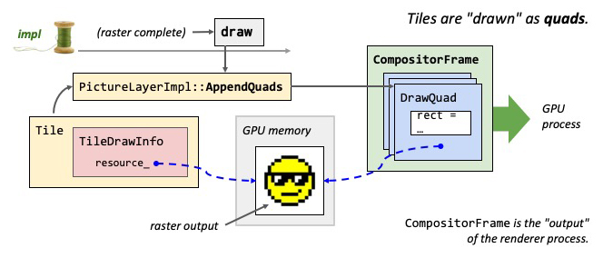

在合成线程正 draw 上一次主线程 commit 进来的数据时，并不阻碍主线程继续 commit 新的数据至合成线程，那这个时候怎么在有新的 commit 数据时，合成线程依然能继续 draw 上一次被commit 的数据呢？其实在合成线程有两份 Layer Tree（前面有说过，准确的讲应该是 Layer List）的拷贝，在合成线程中这个拷贝即 LayerImpl Tree：

- pending tree： 用于接收主线程 commit 的新数据，当 pending tree 光栅化完成后准备 draw 时会进入 activation 阶段，同步拷贝一份 pending tree 副本到 active tree 里；
- active tree：用于 draw 的源于上一次 activation 同步复制的 pending tree副本（来自上一个commit）。


## Display

在前面浏览器打开页面的时候会启动哪些进程中我们知道，打开一个页面可能会有多个 render process 比如在页面中嵌有 iframe 就会有 2 个 render process，但是不管咋样都只有一个 GPU process，这一个 GPU process 承接着多个 render process 输出的 CompositorFrame，并且 browser process 也有自己的 compositor 来生成 CompositorFrame（比如地址栏、前进后退按钮等） 并也会提交给 GPU process。

这些提交给 GPU process 的 CompositorFrame 会交由工作在 GPU process 中的 viz thread(viz 缩写自 visuals) 的 display compositor 来处理，viz thread 一方面要聚合这些  CompositorFrame 另一方面会调用 OpenGL 指令来渲染 CompositorFrame 里面的 draw quads，把像素点输出到屏幕上。

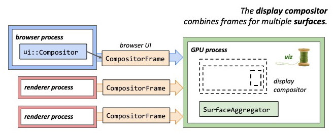

viz thread 也是双缓冲输出的，它会在后台缓冲区绘制 draw quads，然后执行交换命令最终让它们显示在屏幕上。

双缓冲机制：

在渲染的过程中，如果只对一块缓冲区进行读写，这样会导致一方面屏幕要等待去读，而 GPU 要等待去写，这样要造成性能低下。一个很自然的想法是把读写分开，分为：

- 前台缓冲区（Front Buffer）：屏幕负责从前台缓冲区读取帧数据进行输出显示；
- 后台缓冲区（Back Buffer）：GPU负责向后台缓冲区写入帧数据；

这两个缓冲区并不会直接进行数据拷贝（性能问题），而是在后台缓冲区写入完成，前台缓冲区读取完成，直接进行指针交换，前台变后台，后台变前台，那么什么时候进行交换呢，如果后台缓存区已经准备好，屏幕还没有从前台缓冲区读取完，这样就会有问题，显然这个时候需要等屏幕处理完成。屏幕处理完成以后（扫描完屏幕），设备需要重新回到第一行开始新的刷新，这期间有个间隔（Vertical Blank Interval），这个时机就是进行交互的时机，这个操作也被称为垂直同步（VSync）。

# 重绘、重排以及合成

不同的 css 属性会触发的不同的流程，从该网站 [https://csstriggers.com](https://csstriggers.com/) 中可以看出修改各个属性的值究竟会触发哪些流程

## 重排

当元素的几何位置属性（比如 width、margin 等）被更新时，会触发重排。如下图改变了元素的高度，那么浏览器就会触发重新布局，触发解析之后的一系列子阶段


## 重绘

当元素的绘制属性（比如 color、background等）更新时，会触发重绘。如下入仅修改元素的背景颜色，因为并没有引起几何位置的变换，所以会直接跳过布局阶段，而执行之后的系列子阶段


## 直接合成

如果更改一个既不影响几何位置也不影响绘制的属性，会发生什么变化？渲染引擎将跳过布局和绘制，只执行后续的合成操作，我们把这个过程叫做合成。如下图使用了 CSS 的 transform 来实现动画效果，这可以避开重绘和重排，直接在非主线程上执行合成动画操作。这样的效率也是最高的，因为在非主线程上合成，并没有占用主线程的资源，另外也避开了布局和绘制两个子阶段


# HTML、CSS、JavaScript对页面渲染的影响

1. HTML 解析成 DOM 并不是等整个 HTML 文档加载完成之后才开始解析，而是边加载边解析，网络进程中加载了多少数据，HTML 解析器便解析多少数据。具体来讲网络进程接收到响应头之后，会根据响应头中的 content-type 字段来判断文件的类型，比如 content-type 的值是“text/html”，那么浏览器就会判断这是一个 HTML 类型的文件，然后通知浏览器主进程选择或者准备一个渲染进程。渲染进程准备好之后，网络进程和渲染进程之间会建立一个共享数据的管道，网络进程接收到数据后就往这个管道里面放，而渲染进程则从管道的另外一端不断地读取数据，并同时将读取的数据“喂”给 渲染进程，碰到一般 HTML 标签便器解析成 DOM，遇到 style 标签便解析成 CSSOM，碰到 link 标签，会加载外部 CSS，待加载完成再解析成 CSSOM，碰到 script 标签...。你可以把这个管道想象成一个“水管”，网络进程接收到的字节流像水一样倒进这个“水管”，而“水管”的另外一端是渲染进程的相应的解析器，它会动态接收字节流，并将其解析为 DOM 或者 cssRules（可以把这儿的 cssRules 看成以前说的 CSSOM， CSS ⇒ cssRule ⇒ computedStyle）；
2. LayoutTree（以前经常看到的 RenderTree）依赖于 DOM Tree 和 cssRules，DOM Tree 和 cssRules 中的任意一环有问题都会影响后续绘制合成等渲染流水线进而影响页面渲染；
3. JS 加载：在浏览器没有 preload scanner 时，JS 的加载也会暂停 HTML 解析成 DOM，因为有可能会涉及对 DOM 的操作，影响 DOM Tree 的构建 => 影响 LayoutTree 的生成 => 影响后续渲染；
4. JS 加载：在浏览器有 preload scanner 时，JS的加载不会影响 HTML 解析成 DOM；
5. JS 解析执行：JS 的解析执行会暂停 HTML 解析成 DOM，因为有可能会涉及对 DOM 的操作，影响 DOM Tree 的构建 => 影响 LayoutTree 的生成 => 影响后续渲染；
6. CSS 加载：一般情况下，CSS 的加载（不管有无预解析机制）不会影响 HTML 解析成 DOM，但由于 LayoutTree 有对 cssRules 的依赖，会影响 cssRules 的生成 => 影响 LayoutTree  的生成 => 影响后续渲染；
7. CSS解析：一般情况下，CSS 解析成 cssRules 和 HTML 解析成 DOM 是并行的，换句话说，CSS 的解析并不影响 HTML 的解析，CSS 解析影响 cssRules 的生成 => 影响 LayoutTree  的生成 => 影响后续渲染；
8. 上面6、7点一般情况下，CSS 的加载和解析并不会影响 HTML 解析成 DOM，但有一种情况下，CSS 的加载和解析会间接影响 HTML 的解析，那就是在碰到有 script 标签时，碰到 script 时会暂停 HTML 的解析，而 JS 不仅有可能涉及到 DOM 的操作，还有可能会涉及到 CSSOM 的操作（比如：element.style.color = "red"），浏览器又无法判断 JS 是否有对 CSSOM 的操作（道理同浏览器无法判断 JS 是否对 DOM 有操作一样），所以碰到 script 标签时，都会等到 CSS 加载完成并生成 cssRules 之后，才能继续继续 JS 的解析执行，换句话说，JS 的解析执行对 cssRules 有依赖（CSS 的加载和 JS 的加载是并行的，但是无论谁先加载完成，都要等 CSS 文件加载完成并生成 cssRules，然后再解析执行 JS）；CSS的加载解析 => 影响 cssRules 的生成 => 影响JS的解析执行 => 影响 DOM Tree 的构建 => 影响  LayoutTree 的生成 => 影响后续渲染；

# 参考资料

[inside look at modern web browser](https://developers.google.com/web/updates/2018/09/inside-browser-part1) 

[Speed up service worker with navigation preloads](https://developer.chrome.com/blog/navigation-preload/)

[Life of a Pixel(PPT)](https://docs.google.com/presentation/d/1boPxbgNrTU0ddsc144rcXayGA_WF53k96imRH8Mp34Y/edit#slide=id.ga884fe665f_64_726)

[浏览器工作原理与实践](https://time.geekbang.org/column/intro/100033601?tab=catalog)

[一文看懂Chrome浏览器工作原理](https://juejin.cn/post/6844904046411644941#comment)

[带你看看从输入URL到页面显示背后的故事](https://mp.weixin.qq.com/s/_gTTYIcIShy4lCXYj5zuHg)

[浏览器渲染机制（二）](https://juejin.cn/post/6920773802624286733)